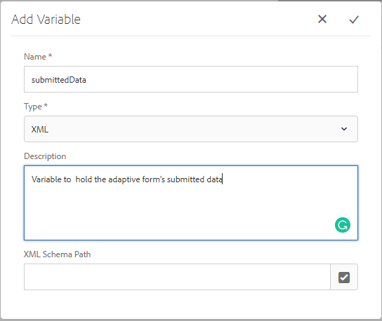

# Skapa arbetsflöde för granskning av skickade data

Arbetsflöden används vanligtvis för att skicka inskickade data för granskning och godkännande. Arbetsflöden skapas med arbetsflödesredigeraren i AEM. Arbetsflödena kan aktiveras när anpassade formulär skickas. Med följande steg får du hjälp med att skapa ditt första arbetsflöde.

## Förutsättning

Kontrollera att du har en fungerande instans av AEM Forms. Följ [installationsguiden](https://docs.adobe.com/content/help/en/experience-manager-65/forms/install-aem-forms/osgi-installation/installing-configuring-aem-forms-osgi.html) för att installera och konfigurera AEM Forms

## Skapa arbetsflödesmodell

* [Öppna arbetsflödesmodeller](http://localhost:4502/libs/cq/workflow/admin/console/content/models.html)
* Klicka på Skapa -> Skapa modell
* Ange en meningsfull titel och ett namn, till exempel _Granska skickade data_.
* Tryck försiktigt på det nya arbetsflödet och klicka på ikonen _Redigera_ .
* Arbetsflödet öppnas i redigeringsläge. Arbetsflödet har som standard en komponent som heter _Steg1_. Markera den här komponenten och klicka på ikonen Ta bort för att ta bort komponenten.
* Till vänster finns de olika arbetsflödeskomponenter som du kan använda för att skapa ditt arbetsflöde. Du kan filtrera komponenterna efter _Forms Workflow_ .

## Skapa variabel

* Klicka på variabelns ikon för att skapa nya variabler. Variabler används för att lagra värden. AEM Forms innehåller ett antal variabeltyper som kan skapas. Idag ska vi skapa en variabel av typen XML som innehåller de data som skickas in i det adaptiva formuläret. Skapa en ny variabel med namnet _skickadData_ av typen XML som visas i bilden nedan.

   >[!NOTE]
Om formuläret baseras på formulärdatamodellen är de data som skickas i JSON-format och i så fall skapar du en variabel av typen JSON för de data som skickas.

* Klicka på _stegikonen_ till vänster för att visa en lista över de olika arbetsflödeskomponenterna. Dra och släpp _komponenten Ange variabel_ i arbetsflödet till höger. Se till att du placerar _komponenten Ange variabel_ under Flödesstart.
   * Klicka på _Ange variabel_ och sedan på _skiftnyckelsikonen_ för att öppna komponentens egenskapssida.
   * Klicka på mappningsfliken ->Lägg till mappning->Kartvariabel. Ange de värden som visas på skärmbilden nedan.
      

## Lägga till arbetsflödeskomponenter

* Dra och släpp _Tilldela uppgift_ -komponenten till höger - till vänster under _komponenten Ange variabel_ .
   * Klicka på komponenten _Tilldela uppgift_ och klicka sedan på ikonen _Förnya_ för att öppna egenskapsbladet.
   * Ange en meningsfull titel för komponenten Tilldela uppgift.
   * Klicka på fliken Forms och Dokument och ange följande egenskaper så som visas på skärmbilden
      

   * _1 Om du väljer det här alternativet kopplas arbetsflödet inte till en viss anpassad form._
   * _2 Arbetsflödesmotorn söker efter filen Data.xml i förhållande till nyttolasten i databasen_

   * Klicka på fliken Tilldelning. Här kan du tilldela en användare i din organisation uppgiften. I det här fallet ska vi tilldela uppgiften till admin-användaren enligt skärmbilden nedan.
      
   * Spara ändringarna genom att klicka på ikonen _Klar_ för komponenten
* Klicka på _Synkronisera_ för att generera arbetsflödets körningsmodell.
Arbetsflödesmodellen är nu klar och kan kopplas till den adaptiva formulärens sändningsåtgärd.

