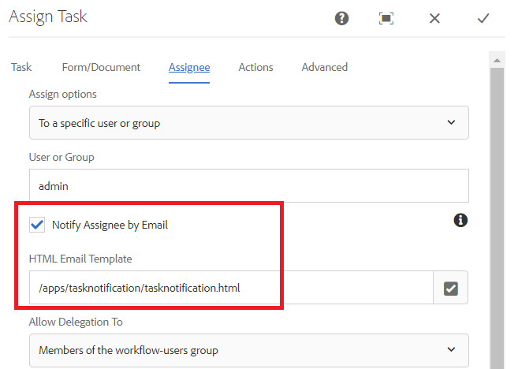

# Anpassa meddelande om tilldelning av uppgift

Tilldela Task-komponent används för att tilldela uppgifter till arbetsflödesdeltagare. När en uppgift tilldelas en användare eller grupp skickas ett e-postmeddelande till den angivna användaren eller gruppmedlemmarna.
Det här e-postmeddelandet innehåller vanligtvis dynamiska data som är relaterade till uppgiften. Dynamiska data hämtas med hjälp av systemgenererade [metadataegenskaper](https://docs.adobe.com/content/help/en/experience-manager-65/forms/publish-process-aem-forms/use-metadata-in-email-notifications.html#using-system-generated-metadata-in-an-email-notification).
Om du vill inkludera värden från skickade formulärdata i e-postmeddelandet måste vi skapa en anpassad metadataegenskap och sedan använda dessa anpassade metadataegenskaper i e-postmallen


## Skapa anpassad metadataegenskap

Rekommenderad metod är att skapa en OSGI-komponent som implementerar metoden getUserMetadata för [WorkitemUserMetadataService](https://helpx.adobe.com/experience-manager/6-5/forms/javadocs/com/adobe/fd/workspace/service/external/WorkitemUserMetadataService.html#getUserMetadataMap--)

I följande kod skapas fyra metadataegenskaper (_firstName_,_lastName_,_reason_ och _amountRequested_) och dess värde ställs in från skickade data. Metadataegenskapen _firstName_&#x200B;är till exempel inställd på värdet för elementet firstName från skickade data. I följande kod antas att det adaptiva formulärets skickade data är i xml-format. Adaptiv Forms baserad på JSON-schema eller formulärdatamodell genererar data i JSON-format.


```java
package com.aemforms.workitemuserservice.core;

import java.io.InputStream;
import java.util.HashMap;
import java.util.Map;

import javax.jcr.Session;
import javax.xml.parsers.DocumentBuilder;
import javax.xml.parsers.DocumentBuilderFactory;
import javax.xml.xpath.XPath;

import org.osgi.framework.Constants;
import org.osgi.service.component.annotations.Component;
import org.slf4j.Logger;
import org.slf4j.LoggerFactory;
import org.w3c.dom.*;


import com.adobe.fd.workspace.service.external.WorkitemUserMetadataService;
import com.adobe.granite.workflow.WorkflowSession;
import com.adobe.granite.workflow.exec.WorkItem;
import com.adobe.granite.workflow.metadata.MetaDataMap;
@Component(property={Constants.SERVICE_DESCRIPTION+"=A sample implementation of a user metadata service.",
Constants.SERVICE_VENDOR+"=Adobe Systems",
"process.label"+"=Sample Custom Metadata Service"})


public class WorkItemUserServiceImpl implements WorkitemUserMetadataService {
private static final Logger log = LoggerFactory.getLogger(WorkItemUserServiceImpl.class);

@Override
public Map<String, String> getUserMetadata(WorkItem workItem, WorkflowSession workflowSession,MetaDataMap metadataMap)
{
HashMap<String, String> customMetadataMap = new HashMap<String, String>();
String payloadPath = workItem.getWorkflowData().getPayload().toString();
String dataFilePath = payloadPath + "/Data.xml/jcr:content";
Session session = workflowSession.adaptTo(Session.class);
DocumentBuilderFactory factory = null;
DocumentBuilder builder = null;
Document xmlDocument = null;
javax.jcr.Node xmlDataNode = null;
try
{
    xmlDataNode = session.getNode(dataFilePath);
    InputStream xmlDataStream = xmlDataNode.getProperty("jcr:data").getBinary().getStream();
    XPath xPath = javax.xml.xpath.XPathFactory.newInstance().newXPath();
    factory = DocumentBuilderFactory.newInstance();
    builder = factory.newDocumentBuilder();
    xmlDocument = builder.parse(xmlDataStream);
    Node firstNameNode = (org.w3c.dom.Node) xPath.compile("afData/afUnboundData/data/firstName")
            .evaluate(xmlDocument, javax.xml.xpath.XPathConstants.NODE);
    log.debug("The value of first name element  is " + firstNameNode.getTextContent());
    Node lastNameNode = (org.w3c.dom.Node) xPath.compile("afData/afUnboundData/data/lastName")
            .evaluate(xmlDocument, javax.xml.xpath.XPathConstants.NODE);
    Node amountRequested = (org.w3c.dom.Node) xPath
            .compile("afData/afUnboundData/data/amountRequested")
            .evaluate(xmlDocument, javax.xml.xpath.XPathConstants.NODE);
    Node reason = (org.w3c.dom.Node) xPath.compile("afData/afUnboundData/data/reason")
            .evaluate(xmlDocument, javax.xml.xpath.XPathConstants.NODE);
    customMetadataMap.put("firstName", firstNameNode.getTextContent());
    customMetadataMap.put("lastName", lastNameNode.getTextContent());
    customMetadataMap.put("amountRequested", amountRequested.getTextContent());
    customMetadataMap.put("reason", reason.getTextContent());
    log.debug("Created  " + customMetadataMap.size() + " metadata  properties");

}
catch (Exception e)
{
    log.debug(e.getMessage());
}
return customMetadataMap;
}

}
```

## Använd anpassade metadataegenskaper i e-postmallen för aktivitetsmeddelanden

I e-postmallen kan du inkludera metadataegenskapen genom att använda följande syntax där amountRequested är metadataegenskapen `${amountRequested}`

## Konfigurera Tilldela uppgift för att använda anpassad metadataegenskap

När OSGi-komponenten har byggts och distribuerats till AEM server konfigurerar du den tilldelade uppgiftskomponenten enligt nedan så att den använder anpassade metadataegenskaper.




## Aktivera användning av anpassade metadataegenskaper


## Gör så här på servern

* [Konfigurera daglig CQ Mail-tjänst](https://docs.adobe.com/content/help/en/experience-manager-65/administering/operations/notification.html#configuring-the-mail-service)
* Associera ett giltigt e-post-ID med [administratörsanvändare](http://localhost:4502/security/users.html)
* Hämta och installera mallen [](assets/workflow-and-task-notification-template.zip) Arbetsflöde och meddelanden med hjälp av [pakethanteraren](http://localhost:4502/crx/packmgr/index.jsp)
* Ladda ned [anpassat formulär](assets/request-travel-authorization.zip) och importera till AEM från användargränssnittet för [formulär och dokument](http://localhost:4502/aem/forms.html/content/dam/formsanddocuments).
* Distribuera och starta det [anpassade paketet](assets/work-items-user-service-bundle.jar) med [webbkonsolen](http://localhost:4502/system/console/bundles)
* [Förhandsgranska och skicka formuläret](http://localhost:4502/content/dam/formsanddocuments/requestfortravelauhtorization/jcr:content?wcmmode=disabled)

Ett meddelande om uppgiftstilldelning skickas till det e-post-ID som är kopplat till administratörsanvändaren när formuläret skickas. På följande skärmbild visas ett exempel på meddelanden om uppgiftstilldelning


>[!NOTE]
>E-postmallen för tilldelningsmeddelanden måste ha följande format.
>
> subject=Uppgift tilldelad - `${workitem_title}`
>
> message=String som representerar din e-postmall utan nya radtecken.
