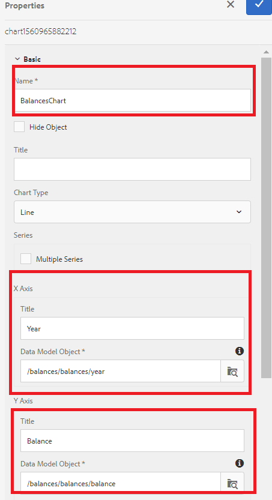

# Konfigurera linjediagram för ditt första interaktiva kommunikationsdokument

I den här delen ska vi lägga till ett linjediagram på panelen för kontots förlopp.

Logga in på AEM Forms och gå till Adobe Experience Manager > Forms > Forms &amp; Documents.

Öppna mappen 401KStatement.

Öppna 401KStatement i redigeringsläge.

AEM Forms 6.4 har gjort det enkelt att visa data med olika typer av diagram. Vi kommer att använda ett linjediagram för att visa saldon per år.

Tryck på målområdet **Kontoförlopp** till höger och klicka på plustecknet (+) för att öppna dialogrutan för att infoga komponent.

Välj Diagram om du vill infoga diagramkomponenten.

Konfigurera diagramkomponenten enligt inställningarna i skärmbilden nedan och spara inställningarna genom att klicka på den blå bockmarkeringsikonen.

Se till att du väljer rätt element i formulärdatamodellen på x- och y-axeln.

**Linjediagraminställningar i AEM Forms 6.4**

**Linjediagraminställningar i AEM Forms 6.5**

## Nästa steg

[Konfigurera tabell](./partnine.md)
