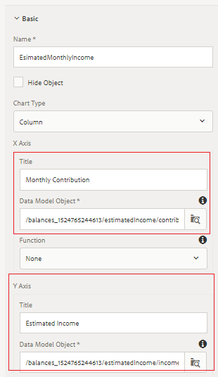
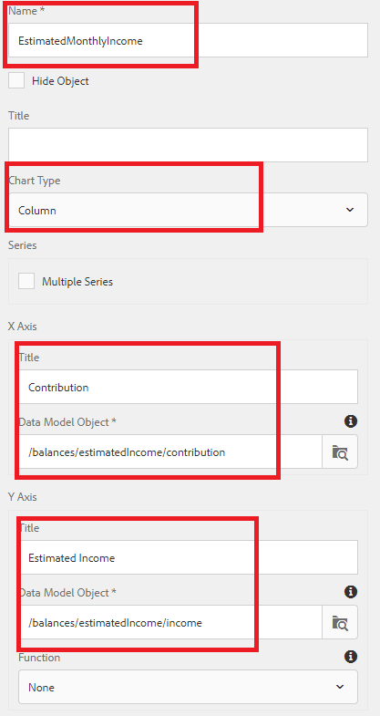

# Konfigurerar Outlook-panel för pensionering{#configuring-retirement-outlook-panel}

* Detta är en del av 10 av en självstudiekurs i flera steg för att skapa ditt första interaktiva kommunikationsdokument. I den här delen konfigureras Outlook-panelen för borttagning genom att text och diagramkomponenter läggs till.

* Logga in på AEM Forms och gå till Adobe Experience Manager > Forms > Forms &amp; Documents.

* Öppna mappen 401KStatement.

* Öppna 401KStatement-dokumentet i redigeringsläge.

**Konfigurera målområdet för vänsterpanelen**

* Tryck på målområdet för vänsterpanelen till höger och klicka på plusikonen (+) för att öppna dialogrutan för att infoga komponenten.

* Infoga textkomponent.

* Tryck försiktigt på den nya textkomponenten för att visa komponentverktygsfältet

* Markera pennikonen om du vill redigera standardtexten.

* Ersätt standardtexten med **Din pensionsintäkt i Outlook**

**Konfigurera målområde för högerpanel**

* Tryck på målområdet för högerpanelen till höger och klicka på plustecknet (+) för att öppna dialogrutan för att infoga komponenten.

* Infoga textkomponent.

* Tryck försiktigt på den nya textkomponenten för att visa komponentverktygsfältet.

* Markera pennikonen om du vill redigera standardtexten.

* Ersätt standardtexten med **Uppskattad månadsvis pensionsinkomst**

## Lägg till dokumentfragment för återbetalningsintäkt i Outlook {#add-retirement-income-outlook-document-fragment}

* Klicka på ikonen Assets och använd filtret för att visa resurser av typen &quot;Dokumentfragment&quot;. Dra och släpp dokumentfragmentet RetirementIncomeOutlook på målområdet för den vänstra panelen.

* Du kan referera [till den här sidan](https://experienceleague.adobe.com/docs/experience-manager-learn/forms/ic-web-channel-tutorial/partseven.html) när du lägger till dokumentfragment i innehållsområden.

## Ökning av uppskattad månadsinkomst {#adding-estimated-monthly-income-chart}

* Klicka på målområdet för högerpanelen på den högra sidan. Klicka på plustecknet (+) för att infoga diagramkomponenten. Vi ska använda ett kolumndiagram för att visa den beräknade månadsinkomsten. Tryck försiktigt på den nyligen infogade diagramkomponenten. Klicka på ikonen &quot;Wrench&quot; för att öppna konfigurationsbladet.Konfigurera diagrammet med följande egenskaper så som visas på skärmbilden nedan.

**AEM Forms 6.4 - Konfigurerar kolumndiagram för uppskattad månadsinkomst**

**AEM Forms 6.5 - Konfigurerar kolumndiagram för uppskattad månadsinkomst**

## Nästa steg

[Konfigurera cirkeldiagram](./parteleven.md)
