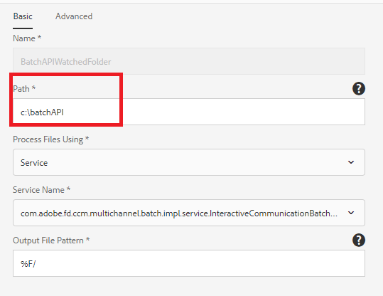

# Batch-API

Du kan använda batch-API:t för att skapa flera interaktiva dokument från en mall. Mallen är en interaktiv kommunikation utan data. Batch-API:t kombinerar data med en mall för att skapa en interaktiv kommunikation. API:t är användbart vid massproduktion av interaktiv kommunikation. Till exempel telefonräkningar, kreditkortsutdrag för flera kunder.

[Läs mer om API för gruppgenerering](https://docs.adobe.com/content/help/en/experience-manager-65/forms/interactive-communications/generate-multiple-interactive-communication-using-batch-api.html)

I den här artikeln finns exempelresurser för att generera interaktiva kommunikationsdokument med hjälp av batch-API:t.

## Gruppgenerering med bevakad mapp

* Importera mallen [för](assets/Beneficiaries-confirmation.zip) interaktiv kommunikation till din AEM Forms-server.
* Importera konfigurationen för den [bevakade mappen](assets/batch-generation-api.zip). Detta skapar en mapp som kallas `batchAPI` i C-enheten.

**Om du kör AEM Forms på ett operativsystem som inte är ett Windows-operativsystem, följ de tre stegen nedan:**

1. [Öppna bevakad mapp](http://localhost:4502/libs/fd/core/WatchfolderUI/content/UI.html)
2. Välj BatchAPIWatchedFolder och klicka på Redigera.
3. Ändra sökvägen så att den matchar ditt operativsystem.

* Hämta och extrahera innehållet i [zip-filen](assets/jsonfile.zip). ZIP-filen innehåller en mapp med namnet `jsonfile` som innehåller `beneficiaries.json` filen. Den här filen innehåller data för att generera 3 dokument.

* Släpp `jsonfile` mappen i indatamappen i den bevakade mappen.
* När mappen har tagits upp för bearbetning kontrollerar du resultatmappen för den bevakade mappen. Tre PDF-filer bör genereras

## Batchgenerering med REST-begäranden

Du kan anropa [batch-API](https://helpx.adobe.com/experience-manager/6-5/forms/javadocs/index.html) via REST-begäranden. Du kan visa REST-slutpunkter för andra program för att anropa API:t för att generera dokument.
De exempelresurser som tillhandahålls visar REST-slutpunkten för generering av interaktiva kommunikationsdokument. Servern accepterar följande parametrar:

* fileName - Sökväg till datafilen i filsystemet.
* templatePath - IC-mallsökväg
* saveLocation - Plats där de genererade dokumenten ska sparas i filsystemet
* channelType - Print, Web eller båda
* recordId - JSON-sökväg till element för att ange namnet på en interaktiv kommunikation

I följande skärmbild visas parametrarna och värdena

## Distribuera exempelresurser på servern

* Importera [IKT-mall](assets/ICTemplate.zip) med [pakethanteraren](http://localhost:4502/crx/packmgr/index.jsp)
* Importera [anpassad överföringshanterare](assets/BatchAPICustomSubmit.zip) med hjälp av [pakethanteraren](http://localhost:4502/crx/packmgr/index.jsp)
* Importera [anpassningsbara formulär](assets/BatchGenerationAPIAF.zip) med [Forms och dokumentgränssnittet](http://localhost:4502/aem/forms.html/content/dam/formsanddocuments)
* Distribuera och starta [anpassat OSGI-paket](assets/batchgenerationapi.batchgenerationapi.core-1.0-SNAPSHOT.jar) med [Felix webbkonsol](http://localhost:4502/system/console/bundles)
* [Utlös batchgenerering genom att skicka formuläret](http://localhost:4502/content/dam/formsanddocuments/batchgenerationapi/jcr:content?wcmmode=disabled)
