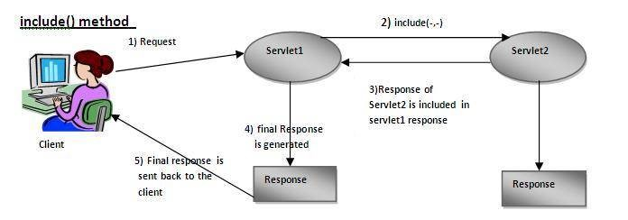
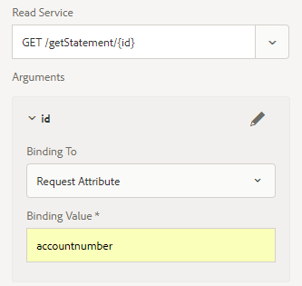

# E-postleverans av webbkanalsdokument

När du har definierat och testat ett interaktivt webbkanalsdokument behöver du en leveransfunktion för att kunna leverera webbkanalsdokumentet till mottagaren.

I den här artikeln tittar vi på e-post som en leveransmekanism för dokument i webbkanaler. Mottagaren får en länk till webbkanalsdokumentet via e-post.När användaren klickar på länken ombeds han/hon att autentisera och webbkanalsdokumentet fylls i med data som är specifika för den inloggade användaren.

Låt oss titta på följande kodfragment. Den här koden är en del av GET.jsp som aktiveras när användaren klickar på länken i e-postmeddelandet för att visa webbkanalsdokumentet. Vi får den inloggade användaren med den schackanin UserManager. När vi får den inloggade användaren får vi värdet för egenskapen accountNumber som är associerad med användarens profil.

Sedan associerar vi värdet accountNumber med en nyckel som kallas kontonummer på kartan. Nyckeln **kontonummer** är definierad i formulärdata modal som ett Request Attribute. Värdet för det här attributet skickas som en indataparameter till lästjänstmetoden Form Data Modal.

Rad 7: Vi skickar den mottagna begäran till en annan server, baserat på den resurstyp som identifieras av URL:en för interaktivt kommunikationsdokument. Svaret som returneras av den här andra servern inkluderas i den första serverns svar.

```java
org.apache.jackrabbit.api.security.user.UserManager um = ((org.apache.jackrabbit.api.JackrabbitSession) session).getUserManager();
org.apache.jackrabbit.api.security.user.Authorizable loggedinUser = um.getAuthorizable(session.getUserID());
String accountNumber = loggedinUser.getProperty("profile/accountNumber")[0].getString();
map.put("accountnumber",accountNumber);
slingRequest.setAttribute("paramMap",map);
CustomParameterRequest wrapperRequest = new CustomParameterRequest(slingRequest,"GET");
wrapperRequest.getRequestDispatcher("/content/forms/af/401kstatement/irastatement/channels/web.html").include(wrapperRequest, response);
```



Visuell representation av rad 7-kod



Begärandeattribut definierat för lästjänsten för modala formulärdata

[AEM](assets/webchanneldelivery.zip).
