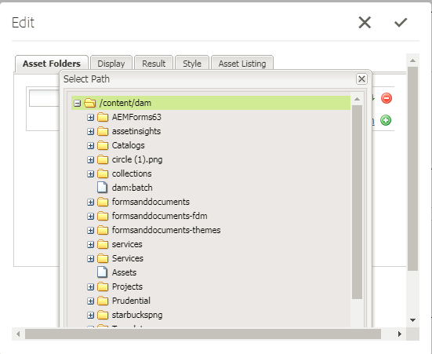

# Registrerar anpassade resurstyper {#registering-custom-asset-types}

Aktivera anpassade resurstyper för listning i AEMForms-portalen

>[!NOTE]
>
>Kontrollera att du har AEM 6.3 med SP1 och motsvarande AEM Forms Add On Installed. Den här funktionen fungerar bara med AEM Forms 6.3 SP1 och senare

## Ange grundsökväg {#specify-base-path}

Bassökvägen är databassökvägen på den översta nivån som innehåller alla resurser som en användare kan vilja visa i söknings- och listkomponenten. Om så önskas kan användaren även konfigurera specifika platser i bassökvägen från dialogrutan för komponentredigering, så att sökningen utlöses på specifika platser i stället för att söka igenom alla noder i bassökvägen. Som standard används grundsökvägen som sökvägskriterier för att hämta resurserna, såvida inte användaren konfigurerar en uppsättning specifika sökvägar från den här platsen. Det är viktigt att du har ett optimalt värde för den här sökvägen för att kunna göra en prestandasökning. Standardvärdet för bassökvägen förblir **_/content/dam/formSanddocuments_** eftersom alla AEM Forms-resurser finns i **_/content/dam/formSanddocuments._**

Steg för att konfigurera bassökvägen

1. Logga in på crx
1. Navigera till **/libs/fd/fp/extensions/querybuilder/basepath**

1. Klicka på &quot;Overlay Node&quot; i verktygsfältet
1. Kontrollera att överläggsplatsen är /apps/
1. Klicka på OK
1. Klicka på Spara
1. Navigera till den nya strukturen som skapades på **/apps/fd/fp/extensions/querybuilder/basepath**

1. Ändra värdet för egenskapen path till **/content/dam**
1. Klicka på Spara

Genom att ange egenskapen path till **/content/dam** anger du i princip Base Path till /content/dam. Du kan verifiera detta genom att öppna komponenten Sök och Lister.

## Registrera anpassade resurstyper {#register-custom-asset-types}

Vi har lagt till en ny flik (Resurslista) i sök- och listkomponenten. På den här fliken visas en lista över de resurstyper och andra resurstyper som du konfigurerar. Som standard visas följande resurstyper

1. Adaptiv Forms
1. Formulärmallar
1. PDF forms
1. Dokument (statiska PDF-filer)

**Steg för att registrera en anpassad resurstyp**

1. Skapa övertäckningsnod för **/libs/fd/fp/extensions/querybuilder/assettypes**

1. Ställ in övertäckningsplatsen till &quot;/apps&quot;
1. Navigera till den nya strukturen som skapades `/apps/fd/fp/extensions/querybuilder/assettypes`

1. Under den här platsen skapar du en nod av typen &quot;nt:unstructed&quot; för den typ som ska registreras och ger noden namnet **mp4files. Lägg till följande två egenskaper i den här mp4files-noden**

   1. Lägg till jcr:title-egenskap för att ange resurstypens visningsnamn. Ställ in värdet för jcr:title på &quot;Mp4 Files&quot;.
   1. Lägg till egenskapen type och ange värdet till videos. Det här är värdet som vi använder i vår mall för att lista resurser av typen videor. Spara ändringarna.

1. Skapa en nod av typen &quot;nt:unsigned&quot; under mp4files. Namnge den här noden &quot;sökvillkor&quot;
1. Lägg till ett eller flera filter under sökvillkor. Anta att om användaren vill ha ett sökfilter för att lista mp4Files vars mime-typ är &quot;video/mp4&quot; kan du göra det här
1. Skapa en nod av typen &quot;nt:undefined&quot; under nodens sökvillkor. Namnge den här noden &quot;filetypes&quot;
1. Lägg till följande två egenskaper i den här noden &quot;filetypes&quot;

   1. namn: ./jcr:content/metadata/dc:format
   1. värde: video/mp4

1. Det innebär att resurser med egenskapen dc:format som är lika med video/mp4 betraktas som en resurstyp,&quot;Mp4-videor&quot;. Du kan använda valfri egenskap i noden&quot;jcr:content/metadata&quot; för sökvillkoren

1. **Spara ditt arbete**

När du har utfört stegen ovan börjar den nya resurstypen (Mp4-filer) visas i listrutan över resurstyper i komponenten Sök och Lister enligt nedan

[Om du har problem med att få det här att fungera kan du importera följande paket.](assets/assettypeskt1.zip) Paketet har två anpassade resurstyper definierade. MP4-filer och Word-dokument. Föreslå att du tittar på **/apps/fd/fp/extensions/querybuilder/assettypes**

[Installera det anpassade portalpaketet](assets/customportalpage.zip). Paketet innehåller exempel på portalsida. Den här sidan används i del 2 av den här självstudien
