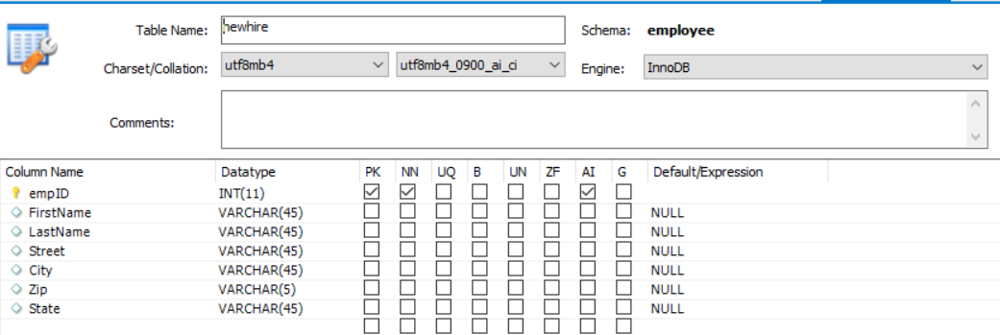

# Skapa databastabeller

Formulärdatamodellen kan baseras på RDBMS-, RESTfull-, SOAP- eller OData-källor. Kursen fokuserar på att förfylla adaptiva formulär med hjälp av formulärdatamodell som stöds av RDBMS-datakällan. I den här självstudiekursen användes MYSQL-databasen. Vi skapade följande två tabeller för att visa användningsfallet

* tabellen **ne** - den här tabellen lagrar information om nyheter

  

* Tabellen **mottagare** - Här lagras alla mottagare

  

Du kan importera [sql-filen](assets/db-schema.sql) med MySQL workbench för att skapa till tabeller med exempeldata.

## Nästa steg

[Konfigurera formulärdatamodell](./configuring-form-data-model.md)
