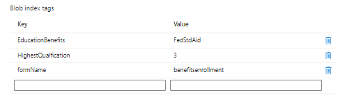

# Skapa anpassad sändning

En anpassad överföringshanterare skrevs för att hantera formuläröverföringen. På en hög nivå gör den anpassade överföringshanteraren följande

* Extraherar namnet på det skickade formuläret.
* Extraherar skickade data.Skickade data i ett kärnkomponentbaserat formulär är alltid i JSON-format.
* Extraherar och lagrar formulärbilagor i Azure-portalen. Uppdaterar skickade JSON-data med den bifogade filens URL.
* Skapar blobbindextaggar - Hittar listan med sökbara fält för formuläret och dess motsvarande värde från skickade data.
* Associerar blobindextaggarna med skickade data och lagrar dem i Azure-portalen.

I följande skärmbild visas blobindextaggarna i Azure Portal

Den anpassade skicka-koden finns i **_StoreFormDataWithBlobIndexTagsInAzure_** och koden för att lagra och hämta data från Azure finns i komponenten **_SaveAndFetchFromAzure_**

## Nästa steg

[Skapa frågegränssnitt](./part3.md)
