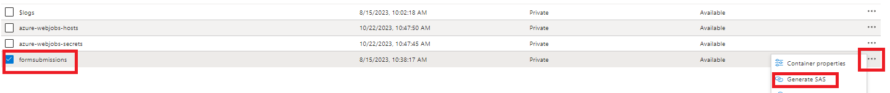

# Lagra formuläröverföringar i Azure Storage

I den här artikeln visas hur du gör REST-anrop för att lagra skickade AEM Forms-data i Azure Storage.
För att kunna lagra skickade formulärdata i Azure Storage måste följande steg följas.

>[!NOTE]
>Koden i den här artikeln fungerar inte med grundläggande komponentbaserade adaptiva formulär. [Motsvarande artikel för grundläggande komponentbaserad adaptiv form finns här](https://experienceleague.adobe.com/docs/experience-manager-learn/forms/prefill-form-with-data-attachments/introduction.html?lang=sv-SE)


## Skapa Azure Storage-konto

[Logga in på ditt Azure Portal-konto och skapa ett lagringskonto](https://learn.microsoft.com/en-us/azure/storage/common/storage-account-create?tabs=azure-portal#create-a-storage-account-1). Ange ett beskrivande namn för ditt lagringskonto, klicka på Granska och sedan på Skapa. Då skapas ditt lagringskonto med alla standardvärden. För den här artikeln har vi namngett vårt lagringskonto `aemformstutorial`.


## Skapa behållare

Nästa vi måste göra är att skapa en behållare för att lagra data från inskickade formulär.
Klicka på menyalternativet Behållare till vänster på sidan Lagringskonto och skapa en behållare med namnet `formssubmissions`. Kontrollera att åtkomstnivån public är inställd på private


## Skapa SAS i behållaren

Vi kommer att göra oss av med auktoriseringsmetoden för delad åtkomst eller SAS för att interagera med Azure Storage-behållaren.
Navigera till behållaren i lagringskontot, klicka på ellipsen och välj alternativet Generera SAS så som visas på skärmbilden

Se till att du anger rätt behörigheter och lämpligt slutdatum enligt skärmbilden nedan och klicka på Generera SAS-token och URL. Kopiera Blob SAS-token och Blob SAS url. Vi kommer att använda dessa två värden för våra HTTP-anrop


## Ange Blob SAS-token och lagrings-URI

För att göra koden mer generisk kan de två egenskaperna konfigureras med OSGi-konfigurationen enligt nedan. _&#x200B;**aemformstutorial**&#x200B;_ är namnet på lagringskontot, _&#x200B;**formsending**&#x200B;_ är den behållare i vilken data ska lagras.
Kontrollera att du har / i slutet av lagringsURI:n och att SAS-token börjar med?


## Skapa PUT-förfrågan

Nästa steg är att skapa en PUT-begäran om att lagra skickade formulärdata i Azure Storage. Varje formulärinlämning måste identifieras med ett unikt BLOB-ID. Det unika BLOB-ID:t skapas vanligtvis i koden och infogas i URL:en för PUT-begäran.
Följande är den partiella URL:en för PUT-begäran. `aemformstutorial` är namnet på lagringskontot, formuläröverföringar är behållaren där data lagras med ett unikt BLOB ID. Resten av URL:en förblir densamma.
https://aemformstutorial.blob.core.windows.net/formsubmissions/blobid/sastoken
Följande funktion har skrivits för att lagra skickade formulärdata i Azure Storage med hjälp av en PUT-begäran. Observera användningen av behållarnamnet och uuid i url:en. Du kan skapa en OSGi-tjänst eller en sling-server med exempelkoden nedan och lagra formulärskicken i Azure Storage.

```java
 public String saveFormDatainAzure(String formData) {
    log.debug("in SaveFormData!!!!!" + formData);
    String sasToken = azurePortalConfigurationService.getSASToken();
    String storageURI = azurePortalConfigurationService.getStorageURI();
    log.debug("The SAS Token is " + sasToken);
    log.debug("The Storage URL is " + storageURI);
    org.apache.http.impl.client.CloseableHttpClient httpClient = HttpClientBuilder.create().build();
    UUID uuid = UUID.randomUUID();
    String putRequestURL = storageURI + uuid.toString();
    putRequestURL = putRequestURL + sasToken;
    HttpPut httpPut = new HttpPut(putRequestURL);
    httpPut.addHeader("x-ms-blob-type", "BlockBlob");
    httpPut.addHeader("Content-Type", "text/plain");

    try {
        httpPut.setEntity(new StringEntity(formData));

        CloseableHttpResponse response = httpClient.execute(httpPut);
        log.debug("Response code " + response.getStatusLine().getStatusCode());
        if (response.getStatusLine().getStatusCode() == 201) {
            return uuid.toString();
        }
    } catch (IOException e) {
        log.error("Error: " + e.getMessage());
        throw new RuntimeException(e);
    }
    return null;

}
```

## Verifiera lagrade data i behållaren


## Testa lösningen

* [Distribuera det anpassade OSGi-paketet](./assets/SaveAndFetchFromAzure.core-1.0.0-SNAPSHOT.jar)

* [Importera den anpassade formulärmallen och sidkomponenten som är kopplad till mallen](./assets/store-and-fetch-from-azure.zip)

* [Importera det adaptiva exempelformuläret](./assets/bank-account-sample-form.zip)

* [Ange lämpliga värden i Azure Portal Configuration med OSGi-konfigurationskonsolen](https://experienceleague.adobe.com/docs/experience-manager-learn/forms/some-useful-integrations/store-form-data-in-azure-storage.html?lang=sv-SE#provide-the-blob-sas-token-and-storage-uri)

* [Förhandsgranska och skicka formuläret BankAccount](http://localhost:4502/content/dam/formsanddocuments/azureportalstorage/bankaccount/jcr:content?wcmmode=disabled)

* Verifiera att data lagras i den Azure-lagringsbehållare du väljer. Kopiera blob-ID:t.
* [Förhandsgranska formuläret BankAccount](http://localhost:4502/content/dam/formsanddocuments/azureportalstorage/bankaccount/jcr:content?wcmmode=disabled&amp;guid=dba8ac0b-8be6-41f2-9929-54f627a649f6) och ange blob-ID som en GUID-parameter i URL:en för formuläret som ska fyllas i i förväg med data från Azure-lagringen

