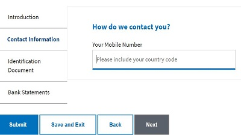

# Skapa det adaptiva huvudformuläret

Formuläret **StoreAFWithAttachments** är den huvudsakliga adaptiva formen. Detta adaptiva formulär är utgångspunkten för användningsfallet. I det här formuläret hämtas användarinformation, inklusive mobilnummer. Det här formuläret kan även lägga till några bilagor. När användaren klickar på knappen Spara och avsluta körs serversideskoden för att lagra formulärdata i databasen och ett unikt program-ID genereras och visas för användaren för att skydda dem. Detta program-ID används för att hämta det mobilnummer som är kopplat till programmet.

Det här formuläret är associerat med **bootboxjs540,storeAFWithAttachments** klientbibliotek som skapats tidigare under kursen och ett AEM-arbetsflöde som aktiveras när formulär skickas.

* Exempelformulären är baserade på [en anpassad adaptiv formulärmall](assets/custom-template-with-page-component.zip) som måste importeras till AEM för att exempelformulären ska återges korrekt.

* Det färdiga [StoreAfWithAttachments-formuläret](assets/store-af-with-attachments-form.zip) kan hämtas och importeras till din AEM-instans.

* [AEM-arbetsflödet som är associerat med det här formuläret](assets/workflow-model-store-af-with-attachments.zip) måste importeras till din AEM-instans för att formuläret ska fungera.

## Nästa steg

[Skapa formuläret som hämtar det sparade formuläret](./retrieve-saved-form.md)