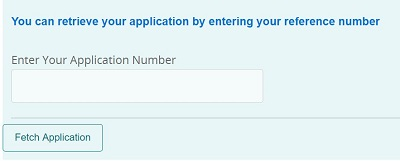

# Skapa MyAccountForm

Formuläret **MyAccountForm** används för att hämta det delvis ifyllda adaptiva formuläret efter att användaren har verifierat program-ID:t och det mobilnummer som är associerat med program-ID:t.



När användaren anger program-ID:t och klickar på knappen **FetchApplication** hämtas det mobilnummer som är associerat med program-ID:t från databasen med åtgärden Hämta i formulärdatamodellen.

I det här formuläret används POSTENS anrop av formulärdatamodellen för att verifiera mobilnumret med hjälp av engångslösenord. Formulärets sändningsåtgärd aktiveras när mobilnumret har verifierats med följande kod. Vi utlöser klickhändelsen för skicka-knappen **submitForm**.

>[!NOTE]
> Du måste ange API-nyckeln och API-hemlighetsvärdena som är specifika för ditt [Nexmo](https://dashboard.nexmo.com/)-konto i fälten för MyAccountForm


Det här formuläret är associerat med en anpassad skickaåtgärd som vidarebefordrar formuläröverföringen till serverleten som är monterad på **/bin/renderaf**

```java
com.adobe.aemds.guide.utils.GuideSubmitUtils.setForwardPath(slingRequest,"/bin/renderaf",null,null);
```

Koden i serverutrymmet som är monterat på **/bin/renderaf** vidarebefordrar begäran om att återge butiken med bilagor i adaptiv form ifyllda med sparade data.


* MyAccountForm kan [hämtas härifrån](assets/my-account-form.zip)

* Exempelformulär baseras på [en anpassad adaptiv formulärmall](assets/custom-template-with-page-component.zip) som måste importeras till AEM för att exempelformulären ska återges korrekt.

* [En anpassad överföringshanterare](assets/custom-submit-my-account-form.zip) som är associerad med MyAccountForm-överföringen måste importeras till AEM.

## Nästa steg

[Testa lösningen genom att distribuera exempelresurserna](./deploy-this-sample.md)
