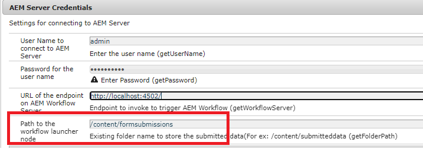
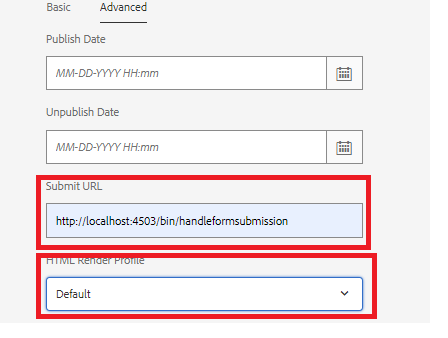

# Få det här användningsexemplet att fungera på datorn

>[!NOTE]
>
>För att exempelmaterialet ska fungera i ditt system förutsätts det att du har tillgång till en AEM Forms-författare och AEM Forms publiceringsinstans.

Följ de här stegen för att få det här användningsexemplet att fungera på din lokala dator:

## Distribuera följande på din AEM Forms-författarinstans

* [Installera paketet MobileFormToWorkflow](assets/MobileFormToWorkflow.core-1.0.0-SNAPSHOT.jar)

* [Distribuera Developing with Service User bundle](https://experienceleague.adobe.com/docs/experience-manager-learn/assets/developingwithserviceuser.zip?lang=sv-SE)
Lägg till följande post i användarmappningstjänsten för Apache Sling med configMgr

```
DevelopingWithServiceUser.core:getformsresourceresolver=fd-service
```

* Du kan lagra formulärinskickade formulär i en annan mapp genom att ange mappnamnet i AEM Server Credentials-konfigurationen med [configMgr](http://localhost:4502/system/console/configMg). Om du ändrar mappen måste du skapa ett startprogram för mappen som utlöser arbetsflödet **ReviewSubestedPDF**


* [Importera xdp-exempelfilen och arbetsflödespaketet med pakethanteraren](assets/xdp-form-and-workflow.zip).


## Distribuera följande resurser på publiceringsinstansen

* [Installera paketet MobileFormToWorkflow](assets/MobileFormToWorkflow.core-1.0.0-SNAPSHOT.jar)

* Ange användarnamn/lösenord för författarinstansen och en **befintlig plats i din AEM-databas** för att lagra skickade data i AEM Server-autentiseringsuppgifterna med [configMgr](http://localhost:4503/system/console/configMgr). Du kan lämna URL:en för slutpunkten på AEM Workflow Server som den är. Detta är slutpunkten som extraherar och lagrar data från överföringen i den angivna noden.
  

* [Distribuera Developing with Service User bundle](https://experienceleague.adobe.com/docs/experience-manager-learn/assets/developingwithserviceuser.zip?lang=sv-SE)
* [Öppna SGB-konfigurationen](http://localhost:4503/system/console/configMgr).
* Sök efter **Referensfilter för Apache Sling**. Kontrollera att kryssrutan Tillåt tomt är markerad.


## Testa lösningen

* Logga in på din författarinstans
* [Redigera de avancerade egenskaperna för w9.xdp](http://localhost:4502/libs/fd/fm/gui/content/forms/formmetadataeditor.html/content/dam/formsanddocuments/w9.xdp). Kontrollera att skicka-URL:en och återgivningsprofilen är korrekt inställda enligt nedan.
  

* Publicera w9.xdp
* Logga in för att publicera instansen
* [Förhandsgranska W9-formuläret](http://localhost:4503/content/dam/formsanddocuments/w9.xdp/jcr:content)
* Fyll i vissa formulärfält och skicka formuläret
* Logga in på AEM Author instance som admin
* [Markera AEM Inbox](http://localhost:4502/aem/inbox)
* Du bör ha en arbetsuppgift för att granska den inskickade PDF

>[!NOTE]
>
>I stället för att skicka PDF till en server som körs på en publiceringsinstans, har vissa kunder distribuerat servleten i en serverbehållare som Tomcat. Det beror helt på vilken topologi kunden är bekväm med.I den här självstudiekursen ska vi använda servern som är distribuerad på publiceringsinstansen för att hantera formulärinskickade data.
