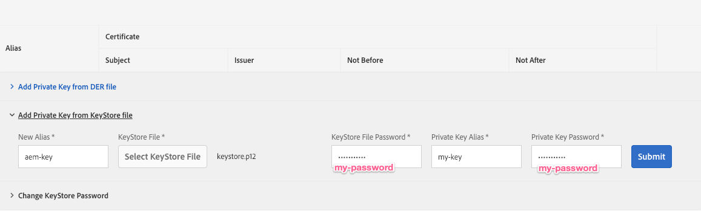
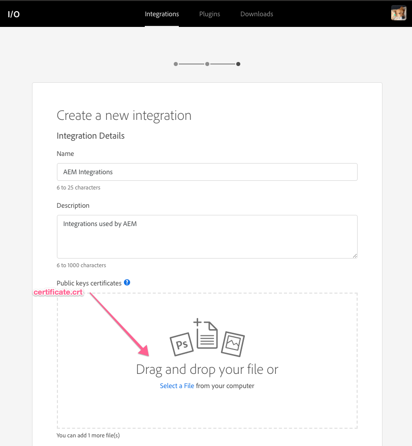

# Konfigurera offentliga och privata nycklar för användning med Adobe I/O

AEM använder publika/privata nyckelpar för att kommunicera säkert med Adobe I/O och andra webbtjänster. Den här korta självstudiekursen visar hur kompatibla tangenter och nyckelbehållare kan genereras med kommandoradsverktyget som fungerar med både AEM och Adobe I/O. [!DNL openssl]

>[!CAUTION]
>
>Den här guiden skapar självsignerade nycklar som är användbara för utveckling och användning i lägre miljöer. I produktionsscenarier genereras och hanteras nycklar vanligtvis av en organisations IT-säkerhetsteam.

## Generera nyckelparet offentlig/privat {#generate-the-public-private-key-pair}

Kommandoradsverktygets [[!DNL openssl]](https://www.openssl.org/docs/man1.0.2/man1/openssl.html) - [[!DNL req] kommando](https://www.openssl.org/docs/man1.0.2/man1/req.html) kan användas för att generera ett nyckelpar som är kompatibelt med Adobe I/O och Adobe Experience Manager.

```shell
$ openssl req -x509 -sha256 -nodes -days 365 -newkey rsa:2048 -keyout private.key -out certificate.crt
```

Om du vill slutföra [!DNL openssl generate] kommandot anger du certifikatinformationen när du begär det. Adobe I/O och AEM bryr sig inte om vilka dessa värden är, men de bör anpassas efter och beskriva din nyckel.

```
Generating a 2048 bit RSA private key
...........................................................+++
...+++
writing new private key to 'private.key'
-----
You are about to be asked to enter information that will be incorporated
into your certificate request.
What you are about to enter is what is called a Distinguished Name or a DN.
There are quite a few fields but you can leave some blank
For some fields there will be a default value,
If you enter '.', the field will be left blank.
-----
Country Name (2 letter code) []:US
State or Province Name (full name) []:CA
Locality Name (eg, city) []:San Jose
Organization Name (eg, company) []:Example Co
Organizational Unit Name (eg, section) []:Digital Marketing
Common Name (eg, fully qualified host name) []:com.example
Email Address []:me@example.com
```

## Lägg till nyckelpar i en ny nyckelbehållare {#add-key-pair-to-a-new-keystore}

Nyckelpar kan läggas till i en ny [!DNL PKCS12] nyckelbehållare. Som en del av [[!DNL openssl]'s [!DNL pcks12] kommandot](https://www.openssl.org/docs/man1.0.2/man1/pkcs12.html) definieras namnet på nyckelbehållaren (via `-  caname`), namnet på nyckeln (via `-name`) och nyckelbehållarens lösenord (via `-  passout`).

Dessa värden krävs för att läsa in nyckelbehållaren och nycklarna i AEM.

```shell
$ openssl pkcs12 -export -caname my-keystore -in certificate.crt -name my-key -inkey private.key -out keystore.p12 -passout pass:my-password
```

Kommandots utdata är en `keystore.p12` fil.

>[!NOTE]
>
>Parametervärdena för **[!DNL my-keystore]**, **[!DNL my-key]** och **[!DNL my-password]** ska ersättas med dina egna värden.

## Verifiera innehållet i nyckelbehållaren {#verify-the-keystore-contents}

Java- [[!DNL keytool] kommandoradsverktyget](https://docs.oracle.com/middleware/1213/wls/SECMG/keytool-summary-appx.htm#SECMG818) ger synlighet i en nyckelbehållare för att säkerställa att nycklarna läses in korrekt i nyckelbehållarfilen ([!DNL keystore.p12]).

```shell
$ keytool -keystore keystore.p12 -list

Enter keystore password: my-password

Keystore type: jks
Keystore provider: SUN

Your keystore contains 1 entry

my-key, Feb 5, 2019, PrivateKeyEntry,
Certificate fingerprint (SHA1): 7C:6C:25:BD:52:D3:3B:29:83:FD:A2:93:A8:53:91:6A:25:1F:2D:52
```


## Lägga till nyckelbehållaren i AEM {#adding-the-keystore-to-aem}

AEM använder den genererade **privata nyckeln** för säker kommunikation med Adobe I/O och andra webbtjänster. För att den privata nyckeln ska vara tillgänglig för AEM måste den installeras i en AEM nyckelbehållare.

Navigera till **AEM >[!UICONTROL Tools]>[!UICONTROL Security]>[!UICONTROL Users]** och **redigera användaren** som den privata nyckeln ska kopplas till.

### Skapa en AEM nyckelbehållare {#create-an-aem-keystore}

*AEM >[!UICONTROL Tools]>[!UICONTROL Security]>[!UICONTROL Users]> Redigera användare*

Om du uppmanas att skapa en nyckelbehållare gör du det. Den här nyckelbehållaren finns bara i AEM och är INTE den nyckelbehållare som skapas via openssl. Lösenordet kan vara vad som helst och behöver inte vara samma som lösenordet som används i [!DNL openssl] kommandot.

### Installera den privata nyckeln via nyckelbehållaren {#install-the-private-key-via-the-keystore}

*[!UICONTROL User]>[!UICONTROL Keystore]>[!UICONTROL Add private key from keystore]*

Klicka på **[!UICONTROL Add Private Key form KeyStore file]** och lägg till följande information i användarens nyckelbehållare:

* **[!UICONTROL New Alias]**: nyckelns alias i AEM. Detta kan vara vad som helst och behöver inte motsvara namnet på nyckelbehållaren som skapades med kommandot openssl.
* **[!UICONTROL Keystore File]**: utdata för kommandot openssl pkcs12 (keystore.p12)
* **[!UICONTROL Private Key Alias]**: Lösenordet som anges i openssl pkcs12-kommandot via `-  passout` argument.

* **[!UICONTROL Private Key Password]**: Lösenordet som anges i openssl pkcs12-kommandot via `-  passout` argument.

### Kontrollera att den privata nyckeln har lästs in i AEM nyckelbehållare {#verify-the-private-key-is-loaded-into-the-aem-keystore}

*[!UICONTROL User]>[!UICONTROL Keystore]*

När den privata nyckeln har lästs in från den angivna nyckelbehållaren till AEM nyckelbehållare visas den privata nyckelns metadata i användarens nyckelbehållarkonsol.

## Lägga till den offentliga nyckeln i Adobe I/O {#adding-the-public-key-to-adobe-i-o}

Den matchande offentliga nyckeln måste överföras till Adobe I/O för att den AEM tjänstanvändaren, som har den offentliga nyckelns motsvarande privata nyckel, ska kunna kommunicera säkert.

### Skapa en ny integrering av Adobe I/O {#create-a-adobe-i-o-new-integration}



*[[!UICONTROL Create Adobe I/O Integration]](https://console.adobe.io/)>[!UICONTROL New Integration]*

Om du vill skapa en ny integrering i Adobe I/O måste du överföra ett offentligt certifikat. Överför **certificate.crt** som genereras av `openssl req` kommandot.

### Verifiera att de publika nycklarna har lästs in i Adobe I/O {#verify-the-public-keys-are-loaded-in-adobe-i-o}


De installerade offentliga nycklarna och deras förfallodatum visas i [!UICONTROL Integrations] konsolen på Adobe I/O. Du kan lägga till flera publika nycklar via **[!UICONTROL Add a public key]** knappen.

Nu AEM den privata nyckeln och Adobe I/O-integreringen innehåller motsvarande offentliga nyckel, vilket gör att AEM kan kommunicera säkert med Adobe I/O.
