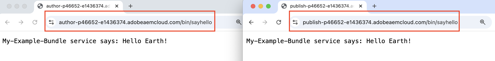
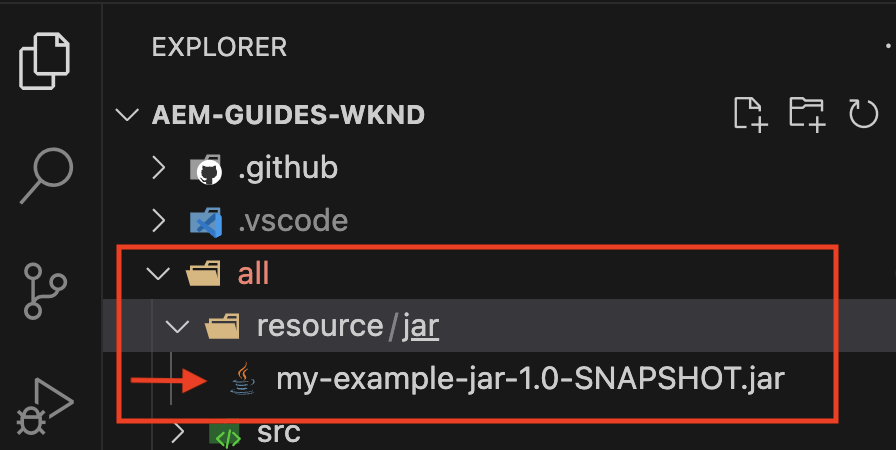
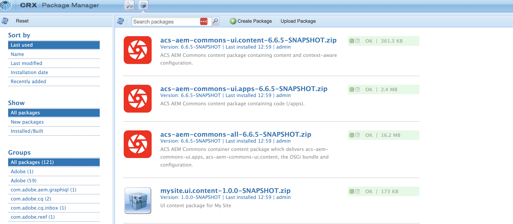
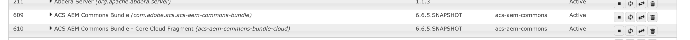

# Installera artefakter från tredje part - inte tillgängligt i den offentliga Maven-databasen

Lär dig hur du installerar artefakter från tredje part som *inte är tillgängliga i den offentliga Maven-databasen* när du skapar och distribuerar ett AEM.

**Tredjepartsartefakter** kan vara:

- [OSGi-paketet](https://www.osgi.org/resources/architecture/): Ett OSGi-paket är en Java™-arkivfil som innehåller Java-klasser, resurser och ett manifest som beskriver paketet och dess beroenden.
- [Java jar](https://docs.oracle.com/javase/tutorial/deployment/jar/basicsindex.html): En Java™-arkivfil som innehåller Java-klasser och -resurser.
- [Paket](https://experienceleague.adobe.com/en/docs/experience-manager-65/content/sites/administering/contentmanagement/package-manager#what-are-packages): Ett paket är en ZIP-fil som innehåller databasinnehåll i filsystemets serialiseringsformat.

## Standardscenario

Vanligtvis installerar du paketet från tredje part, som *är tillgängligt* i den offentliga Maven-databasen, som ett beroende i ditt AEM `pom.xml` -fil.

Till exempel:

- [AEM WCM Core Components](https://github.com/adobe/aem-core-wcm-components) **bundle** har lagts till som ett beroende i [WKND-projektets](https://github.com/adobe/aem-guides-wknd/blob/main/pom.xml#L747-L753) `pom.xml`-fil. Här används scopet `provided` som AEM WCM Core Components-paket från AEM. Om paketet inte tillhandahålls av AEM-miljön använder du omfånget `compile` och det är standardomfånget.

- [WKND Shared](https://github.com/adobe/aem-guides-wknd-shared) **package** har lagts till som ett beroende i [WKND-projektets](https://github.com/adobe/aem-guides-wknd/blob/main/pom.xml#L767-L773) `pom.xml`-fil.


## Sällsynt scenario

När du skapar och distribuerar ett AEM kan du ibland behöva installera ett tredjepartspaket eller -burk eller paket **som inte är tillgängligt** i [Maven Central Repository](https://mvnrepository.com/) eller [Adobe Public Repository](https://repo.adobe.com/index.html) .

Orsaken kan vara:

- Paketet eller paketet tillhandahålls av ett internt team eller en tredjepartsleverantör och _är inte tillgängligt i den offentliga Maven-databasen_.

- Java™ jar-filen _är inte ett OSGi-paket_ och är eventuellt inte tillgänglig i den offentliga Maven-databasen.

- Du behöver en funktion som ännu inte har släppts i den senaste versionen av det tredjepartspaket som finns i den offentliga Maven-databasen. Du bestämde dig för att installera den lokalt skapade versionen RELEASE eller SNAPSHOT.

## Förutsättningar

Om du vill följa den här självstudiekursen behöver du:

- Installationen av [den lokala AEM ](https://experienceleague.adobe.com/en/docs/experience-manager-learn/cloud-service/local-development-environment-set-up/overview) eller [Rapid Development Environment(RDE)](https://experienceleague.adobe.com/en/docs/experience-manager-learn/cloud-service/developing/rde/overview).

- [AEM WKND-projektet](https://github.com/adobe/aem-guides-wknd) _som lägger till paketet eller behållaren eller paketet från tredje part_ och verifierar ändringarna.

## Konfigurera

- Konfigurera den lokala utvecklingsmiljön AEM 6.X eller AEM as a Cloud Service (AEMCS) eller RDE-miljön.

- Klona och distribuera AEM WKND-projektet.

  ```
  $ git clone git@github.com:adobe/aem-guides-wknd.git
  $ cd aem-guides-wknd
  $ mvn clean install -PautoInstallPackage 
  ```

  Kontrollera att WKND-webbplatssidorna återges korrekt.

## Installera ett tredjepartspaket i ett AEM projekt{#install-third-party-bundle}

Låt oss installera och använda en demo OSGi [my-example-bundle](./assets/install-third-party-articafcts/my-example-bundle.zip) som _inte är tillgänglig i den offentliga Maven-databasen_ till AEM WKND-projektet.

**my-example-bundle** exporterar `HelloWorldService` OSGi-tjänsten, dess `sayHello()`-metod returnerar `Hello Earth!`-meddelande.

Mer information finns i filen README.md i filen [my-example-bundle.zip](./assets/install-third-party-articafcts/my-example-bundle.zip) .

### Lägg till paketet i modulen `all`

Det första steget är att lägga till `my-example-bundle` i AEM WKND-projektets `all`-modul.

- Hämta och extrahera filen [my-example-bundle.zip](./assets/install-third-party-articafcts/my-example-bundle.zip).

- Skapa katalogstrukturen `all/src/main/content/jcr_root/apps/wknd-vendor-packages/container/install` i AEM WKND-projektets `all`-modul. Katalogen `/all/src/main/content` finns. Du behöver bara skapa katalogerna `jcr_root/apps/wknd-vendor-packages/container/install`.

- Kopiera filen `my-example-bundle-1.0-SNAPSHOT.jar` från den extraherade katalogen `target` till katalogen ovan `all/src/main/content/jcr_root/apps/wknd-vendor-packages/container/install`.

  

### Använd tjänsten från paketet

Vi använder OSGi-tjänsten `HelloWorldService` från `my-example-bundle` i AEM WKND-projektet.

- Skapa `SayHello.java` Sling-servleten @ `core/src/main/java/com/adobe/aem/guides/wknd/core/servlet` i AEM WKND-projektets `core`-modul.

  ```java
  package com.adobe.aem.guides.wknd.core.servlet;
  
  import java.io.IOException;
  
  import javax.servlet.Servlet;
  import javax.servlet.ServletException;
  
  import org.apache.sling.api.SlingHttpServletRequest;
  import org.apache.sling.api.SlingHttpServletResponse;
  import org.apache.sling.api.servlets.HttpConstants;
  import org.apache.sling.api.servlets.ServletResolverConstants;
  import org.apache.sling.api.servlets.SlingSafeMethodsServlet;
  import org.osgi.service.component.annotations.Component;
  import org.osgi.service.component.annotations.Reference;
  import com.example.services.HelloWorldService;
  
  @Component(service = Servlet.class, property = {
      ServletResolverConstants.SLING_SERVLET_PATHS + "=/bin/sayhello",
      ServletResolverConstants.SLING_SERVLET_METHODS + "=" + HttpConstants.METHOD_GET
  })
  public class SayHello extends SlingSafeMethodsServlet {
  
          private static final long serialVersionUID = 1L;
  
          // Injecting the HelloWorldService from the `my-example-bundle` bundle
          @Reference
          private HelloWorldService helloWorldService;
  
          @Override
          protected void doGet(SlingHttpServletRequest request, SlingHttpServletResponse response) throws ServletException, IOException {
              // Invoking the HelloWorldService's `sayHello` method
              response.getWriter().write("My-Example-Bundle service says: " + helloWorldService.sayHello());
          }
  }
  ```

- Lägg till `my-example-bundle` som ett beroende i rotfilen för AEM WKND-projektet `pom.xml`.

  ```xml
  ...
  <!-- My Example Bundle -->
  <dependency>
      <groupId>com.example</groupId>
      <artifactId>my-example-bundle</artifactId>
      <version>1.0-SNAPSHOT</version>
      <scope>system</scope>
      <systemPath>${maven.multiModuleProjectDirectory}/all/src/main/content/jcr_root/apps/wknd-vendor-packages/container/install/my-example-bundle-1.0-SNAPSHOT.jar</systemPath>
  </dependency>
  ...
  ```

  Här:
   - Omfånget `system` anger att beroendet inte ska slås upp i den offentliga Maven-databasen.
   - `systemPath` är sökvägen till filen `my-example-bundle` i AEM WKND-projektets `all`-modul.
   - `${maven.multiModuleProjectDirectory}` är en Maven-egenskap som pekar på rotkatalogen för flermodulsprojektet.

- Lägg till `my-example-bundle` som ett beroende i `core`-modulens `core/pom.xml`-fil i AEM WKND-projektets -modul.

  ```xml
  ...
  <!-- My Example Bundle -->
  <dependency>
      <groupId>com.example</groupId>
      <artifactId>my-example-bundle</artifactId>
  </dependency>
  ...
  ```

- Skapa och distribuera AEM WKND-projekt med följande kommando:

  ```
  $ mvn clean install -PautoInstallPackage
  ```

- Verifiera att `SayHello`-servern fungerar som förväntat genom att gå till URL:en `http://localhost:4502/bin/sayhello` i webbläsaren.

- Genomför ändringarna ovan i AEM WKND-projektdatabas. Kontrollera sedan ändringarna i RDE- eller AEM-miljön genom att köra Cloud Manager pipeline.

  

The [tutorial/install-3third-party-bundle](https://github.com/adobe/aem-guides-wknd/compare/main...tutorial/install-3rd-party-bundle) branch of the AEM WKND project has the above changes for your reference.

### Viktiga lärdomar{#key-learnings-bundle}

OSGi-paketen som inte är tillgängliga i den offentliga Maven-databasen kan installeras i ett AEM projekt genom att följa dessa steg:

- Kopiera OSGi-paketet till `jcr_root/apps/<PROJECT-NAME>-vendor-packages/container/install` för modulen `all`. Det här steget är nödvändigt för att paketera och distribuera paketet till AEM.

- Uppdatera rotmodulens och kärnmodulens `pom.xml`-filer för att lägga till OSGi-paketet som ett beroende med `system` scope och `systemPath` som pekar på paketfilen. Detta steg är nödvändigt för att kompilera projektet.

## Installera en tredjepartsbehållare i ett AEM

I det här exemplet är `my-example-jar` inte ett OSGi-paket, utan en Java jar-fil.

Låt oss installera och använda en demo [my-example-jar](./assets/install-third-party-articafcts/my-example-jar.zip) som _inte är tillgänglig i den offentliga Maven-databasen_ i AEM WKND-projektet.

**my-example-jar** är en Java jar-fil som innehåller en `MyHelloWorldService`-klass med en `sayHello()` -metod som returnerar `Hello World!`-meddelande.

Mer information finns i filen README.md i filen [my-example-jar.zip](./assets/install-third-party-articafcts/my-example-jar.zip) .

### Lägg till burken i modulen `all`

Det första steget är att lägga till `my-example-jar` i AEM WKND-projektets `all`-modul.

- Hämta och extrahera filen [my-example-jar.zip](./assets/install-third-party-articafcts/my-example-jar.zip).

- Skapa katalogstrukturen `all/resource/jar` i AEM WKND-projektets `all`-modul.

- Kopiera filen `my-example-jar-1.0-SNAPSHOT.jar` från den extraherade katalogen `target` till katalogen ovan `all/resource/jar`.

  

### Använd tjänsten från burken

Vi använder `MyHelloWorldService` från `my-example-jar` i AEM WKND-projektet.

- Skapa `SayHello.java` Sling-servleten @ `core/src/main/java/com/adobe/aem/guides/wknd/core/servlet` i AEM WKND-projektets `core`-modul.

  ```java
  package com.adobe.aem.guides.wknd.core.servlet;
  
  import java.io.IOException;
  
  import javax.servlet.Servlet;
  import javax.servlet.ServletException;
  
  import org.apache.sling.api.SlingHttpServletRequest;
  import org.apache.sling.api.SlingHttpServletResponse;
  import org.apache.sling.api.servlets.HttpConstants;
  import org.apache.sling.api.servlets.ServletResolverConstants;
  import org.apache.sling.api.servlets.SlingSafeMethodsServlet;
  import org.osgi.service.component.annotations.Component;
  
  import com.my.example.MyHelloWorldService;
  
  @Component(service = Servlet.class, property = {
          ServletResolverConstants.SLING_SERVLET_PATHS + "=/bin/sayhello",
          ServletResolverConstants.SLING_SERVLET_METHODS + "=" + HttpConstants.METHOD_GET
  })
  public class SayHello extends SlingSafeMethodsServlet {
  
      private static final long serialVersionUID = 1L;
  
      @Override
      protected void doGet(SlingHttpServletRequest request, SlingHttpServletResponse response)
              throws ServletException, IOException {
  
          // Creating an instance of MyHelloWorldService
          MyHelloWorldService myHelloWorldService = new MyHelloWorldService();
  
          // Invoking the MyHelloWorldService's `sayHello` method
          response.getWriter().write("My-Example-JAR service says: " + myHelloWorldService.sayHello());
      }
  }    
  ```

- Lägg till `my-example-jar` som ett beroende i rotfilen för AEM WKND-projektet `pom.xml`.

  ```xml
  ...
  <!-- My Example JAR -->
  <dependency>
      <groupId>com.my.example</groupId>
      <artifactId>my-example-jar</artifactId>
      <version>1.0-SNAPSHOT</version>
      <scope>system</scope>
      <systemPath>${maven.multiModuleProjectDirectory}/all/resource/jar/my-example-jar-1.0-SNAPSHOT.jar</systemPath>
  </dependency>            
  ...
  ```

  Här:
   - Omfånget `system` anger att beroendet inte ska slås upp i den offentliga Maven-databasen.
   - `systemPath` är sökvägen till filen `my-example-jar` i AEM WKND-projektets `all`-modul.
   - `${maven.multiModuleProjectDirectory}` är en Maven-egenskap som pekar på rotkatalogen för flermodulsprojektet.

- Gör två ändringar i `core/pom.xml`-filen för WKND-projektets `core`-modul i AEM:

   - Lägg till `my-example-jar` som ett beroende.

     ```xml
     ...
     <!-- My Example JAR -->
     <dependency>
         <groupId>com.my.example</groupId>
         <artifactId>my-example-jar</artifactId>
     </dependency>
     ...
     ```

   - Uppdatera `bnd-maven-plugin`-konfigurationen så att den innehåller `my-example-jar` i OSGi-paketet (aem-guides-wknd.core) som byggs.

     ```xml
     ...
     <plugin>
         <groupId>biz.aQute.bnd</groupId>
         <artifactId>bnd-maven-plugin</artifactId>
         <executions>
             <execution>
                 <id>bnd-process</id>
                 <goals>
                     <goal>bnd-process</goal>
                 </goals>
                 <configuration>
                     <bnd><![CDATA[
                 Import-Package: javax.annotation;version=0.0.0,*
                 <!-- Include the 3rd party jar as inline resource-->
                 -includeresource: \
                 lib/my-example-jar.jar=my-example-jar-1.0-SNAPSHOT.jar;lib:=true
                         ]]></bnd>
                 </configuration>
             </execution>
         </executions>
     </plugin>        
     ...
     ```

- Skapa och distribuera AEM WKND-projekt med följande kommando:

  ```
  $ mvn clean install -PautoInstallPackage
  ```

- Verifiera att `SayHello`-servern fungerar som förväntat genom att gå till URL:en `http://localhost:4502/bin/sayhello` i webbläsaren.

- Genomför ändringarna ovan i AEM WKND-projektdatabas. Kontrollera sedan ändringarna i RDE- eller AEM-miljön genom att köra Cloud Manager pipeline.

  

The [tutorial/install-3third-party-jar](https://github.com/adobe/aem-guides-wknd/compare/main...tutorial/install-3rd-party-jar) branch of the AEM WKND project has the above changes for your reference.

I scenarier där Java jar-filen _är tillgänglig i den offentliga Maven-databasen men inte är ett OSGi-paket_, kan du följa ovanstående steg förutom att elementen `system` scope och `systemPath` för `<dependency>` inte krävs.

### Viktiga lärdomar{#key-learnings-jar}

Java-burkarna som inte är OSGi-paket och som är tillgängliga eller inte är tillgängliga i den offentliga Maven-databasen kan installeras i ett AEM projekt enligt följande:

- Uppdatera konfigurationen `bnd-maven-plugin` i kärnmodulens `pom.xml`-fil så att den inkluderar Java jar som en intern resurs i OSGi-paketet som byggs.

Följande steg krävs bara om Java jar inte är tillgängligt i den offentliga Maven-databasen:

- Kopiera Java jar till `resource/jar`-katalogen för modulen `all`.

- Uppdatera rot- och kärnmodulens `pom.xml`-filer för att lägga till Java-behållaren som ett beroende med `system` scope och `systemPath` som pekar på jar-filen.

## Installera ett tredjepartspaket i ett AEM

Låt oss installera versionen [ACS AEM Commons](https://adobe-consulting-services.github.io/acs-aem-commons/) _SNAPSHOT_ som skapats lokalt från huvudgrenen.

Detta görs enbart för att visa hur man installerar ett AEM som inte finns i den offentliga Maven-databasen.

Paketet ACS AEM Commons finns i den offentliga Maven-databasen. Se [Lägg till ACS AEM Commons i ditt AEM Maven-projekt](https://adobe-consulting-services.github.io/acs-aem-commons/pages/maven.html) för att lägga till det i ditt AEM.

### Lägg till paketet i modulen `all`

Det första steget är att lägga till paketet i AEM WKND-projektets `all`-modul.

- Kommentera eller ta bort beroendet för ACS AEM Commons från POM-filen. Identifiera beroendet genom att referera till [Lägg till ACS AEM Commons i AEM Maven-projekt](https://adobe-consulting-services.github.io/acs-aem-commons/pages/maven.html) .

- Klona `master`-grenen i [ACS AEM Commons-databasen](https://github.com/Adobe-Consulting-Services/acs-aem-commons) till din lokala dator.

- Bygg ACS AEM Commons SNAPSHOT-versionen med följande kommando:

  ```
  $mvn clean install
  ```

- Det lokalt skapade paketet finns @ `all/target`, det finns två ZIP-filer, det ena som slutar med `-cloud` är avsett för AEM as a Cloud Service och det andra är för AEM 6.X.

- Skapa katalogstrukturen `all/src/main/content/jcr_root/apps/wknd-vendor-packages/container/install` i AEM WKND-projektets `all`-modul. Katalogen `/all/src/main/content` finns. Du behöver bara skapa katalogerna `jcr_root/apps/wknd-vendor-packages/container/install`.

- Kopiera den lokalt skapade paketfilen (.zip) till katalogen `/all/src/main/content/jcr_root/apps/mysite-vendor-packages/container/install`.

- Skapa och distribuera AEM WKND-projekt med följande kommando:

  ```
  $ mvn clean install -PautoInstallPackage
  ```

- Kontrollera det installerade ACS AEM Commons-paketet:

   - CRX Package Manager @ `http://localhost:4502/crx/packmgr/index.jsp`

     

   - OSGi-konsolen @ `http://localhost:4502/system/console/bundles`

     

- Genomför ändringarna ovan i AEM WKND-projektdatabas. Kontrollera sedan ändringarna i RDE- eller AEM-miljön genom att köra Cloud Manager pipeline.

### Viktiga lärdomar{#key-learnings-package}

De AEM paketen som inte är tillgängliga i den offentliga Maven-databasen kan installeras i ett AEM projekt enligt följande:

- Kopiera paketet till `jcr_root/apps/<PROJECT-NAME>-vendor-packages/container/install`-katalogen för modulen `all`. Det här steget är nödvändigt för att paketera och distribuera paketet till AEM.


## Sammanfattning

I den här självstudiekursen lärde du dig att installera tredjepartsartefakter (bundle, Java jar och package) som inte är tillgängliga i den offentliga Maven-databasen när du skapar och distribuerar ett AEM.
