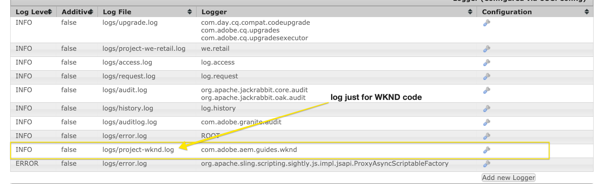
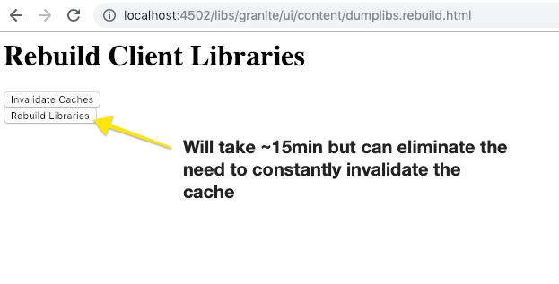

# Konfigurera en lokal AEM-utvecklingsmiljö

Guide to setting up a local development for Adobe Experience Manager, AEM. Omfattar viktiga ämnen som rör lokal installation, Apache Maven, integrerade utvecklingsmiljöer samt felsökning/felsökning. Utveckling med **Eclipse IDE, CRXDE Lite, Visual Studio Code och IntelliJ** diskuteras.

## Ökning

Att konfigurera en lokal utvecklingsmiljö är första steget i utvecklingen för Adobe Experience Manager eller AEM. Ta dig tid att konfigurera en kvalitetsutvecklingsmiljö för att öka produktiviteten och skriva bättre kod snabbare. Vi kan bryta ned en lokal utvecklingsmiljö i AEM i fyra områden:

* Lokala AEM-instanser
* [!DNL Apache Maven] projekt
* Integrerade utvecklingsmiljöer
* Felsökning

## Installera lokala AEM-instanser

När vi syftar på en lokal AEM-instans talar vi om en kopia av Adobe Experience Manager som körs på en utvecklares personliga maskin. ***All*** AEM-utveckling ska börja med att skriva och köra kod mot en lokal AEM-instans.

Om du inte har använt AEM tidigare kan du installera två grundläggande körningslägen: ***Författare*** och ***Publicera***. ***Författaren*** [runmode](https://experienceleague.adobe.com/docs/experience-manager-65/deploying/configuring/configure-runmodes.html?lang=sv-SE) är den miljö som digitala marknadsförare använder för att skapa och hantera innehåll. När du oftast utvecklar kod distribuerar du kod till en Author-instans. På så sätt kan du skapa sidor och lägga till och konfigurera komponenter. AEM Sites är en CMS för WYSIWYG-redigering och därför kan de flesta CSS- och JavaScript-filer testas mot en redigeringsförekomst.

Det är också *kritisk* testkod mot en lokal ***Publish***-instans. Instansen ***Publish*** är den AEM-miljö som besökare på webbplatsen interagerar med. Även om ***Publish***-instansen är samma teknologihög som ***Author*** -instansen finns det viktiga skillnader med konfigurationer och behörigheter. Koden måste testas mot en lokal ***Publish***-instans innan den befordras till miljöer på högre nivå.

### Steg

1. Kontrollera att Java™ är installerat.
   * Föredra [Java™ JDK 11](https://experience.adobe.com/#/downloads/content/software-distribution/en/general.html?1_group.propertyvalues.property=.%2Fjcr%3Acontent%2Fmetadata%2FDc%3AsoftwareType&amp;1_group.propertyvalues.operation=equals&amp;1_group.propertyvalues.0_values=software-type%3Atooling&amp;orderby=%40jcr%3Acontent%2Fjcr%3AlastModified&amp;order.sort=desc&amp;layout=list&amp;list p.offset=0&amp;p.limit=14) för AEM 6.5+
   * [Java™ JDK 8](https://www.oracle.com/java/technologies/downloads/) för AEM-versioner före AEM 6.5
1. Hämta en kopia av [AEM QuickStart Jar och en [!DNL license.properties]](https://experienceleague.adobe.com/docs/experience-manager-65/deploying/deploying/deploy.html?lang=sv-SE).
1. Skapa en mappstruktur på datorn enligt följande:

```plain
~/aem-sdk
    /author
    /publish
```

1. Byt namn på [!DNL QuickStart] JAR till ***aem-author-p4502.jar*** och placera den under katalogen `/author`. Lägg till filen ***[!DNL license.properties]*** under katalogen `/author`.

1. Skapa en kopia av [!DNL QuickStart] JAR, byt namn på den till ***aem-publish-p4503.jar*** och placera den under katalogen `/publish`. Lägg till en kopia av filen ***[!DNL license.properties]*** under katalogen `/publish`.

```plain
~/aem-sdk
    /author
        + aem-author-p4502.jar
        + license.properties
    /publish
        + aem-publish-p4503.jar
        + license.properties
```

1. Dubbelklicka på filen ***aem-author-p4502.jar*** för att installera instansen **Author**. Detta startar författarinstansen, som körs på port **4502** på den lokala datorn.

Dubbelklicka på filen ***aem-publish-p4503.jar*** för att installera instansen **Publish**. Detta startar Publish-instansen, som körs på port **4503** på den lokala datorn.

>[!NOTE]
>
>Beroende på utvecklingsdatorns maskinvara kan det vara svårt att ha både en **författare- och en**-instans igång samtidigt. I sällsynta fall behöver du köra båda samtidigt på en lokal installation.

### Använda kommandorad

Ett alternativ till att dubbelklicka på JAR-filen är att starta AEM från kommandoraden eller skapa ett skript (`.bat` eller `.sh`) beroende på den lokala operativsystemsvarianten. Nedan visas ett exempel på exempelkommandot:

```shell
$ java -Xmx2048M -Xdebug -Xnoagent -Djava.compiler=NONE -Xrunjdwp:transport=dt_socket,server=y,suspend=n,address=30303 -jar aem-author-p4502.jar -gui -r"author,localdev"
```

Här är `-X` JVM-alternativ och `-D` är ytterligare ramverksegenskaper. Mer information finns i [Distribuera och underhålla en AEM-instans](https://experienceleague.adobe.com/docs/experience-manager-65/deploying/deploying/deploy.html?lang=sv-SE) och [Fler alternativ finns i QuickStart-filen](https://experienceleague.adobe.com/docs/experience-manager-65/deploying/deploying/custom-standalone-install.html?lang=sv-SE#further-options-available-from-the-quickstart-file).

## Installera Apache Maven

***[!DNL Apache Maven]*** är ett verktyg för att hantera bygg- och distributionsproceduren för Java-baserade projekt. AEM är en Java-baserad plattform och [!DNL Maven] är standardsättet att hantera kod för ett AEM-projekt. När vi säger ***AEM Maven Project*** eller bara ditt ***AEM-projekt*** syftar vi på ett Maven-projekt som innehåller all *anpassad* kod för din webbplats.

Alla AEM-projekt ska bygga på den senaste versionen av **[!DNL AEM Project Archetype]**: [https://github.com/adobe/aem-project-archetype](https://github.com/adobe/aem-project-archetype). [!DNL AEM Project Archetype] innehåller en startdel för ett AEM-projekt med exempelkod och innehåll. [!DNL AEM Project Archetype] innehåller även **[!DNL AEM WCM Core Components]** som konfigurerats för användning i ditt projekt.

>[!CAUTION]
>
>När du startar ett nytt projekt är det bäst att använda den senaste versionen av typen. Kom ihåg att det finns flera versioner av typen och att alla versioner inte är kompatibla med tidigare versioner av AEM.

### Steg

1. Hämta [Apache Maven](https://maven.apache.org/download.cgi)
2. Installera [Apache Maven](https://maven.apache.org/install.html) och kontrollera att installationen har lagts till på kommandoraden `PATH`.
   * [!DNL macOS] användare kan installera Maven med [Homebrew](https://brew.sh/)
3. Kontrollera att **[!DNL Maven]** har installerats genom att öppna en ny kommandoradsterminal och köra följande:

```shell
$ mvn --version
Apache Maven 3.3.9
Maven home: /Library/apache-maven-3.3.9
Java version: 1.8.0_111, vendor: Oracle Corporation
Java home: /Library/Java/JavaVirtualMachines/jdk1.8.0_111.jdk/Contents/Home/jre
Default locale: en_US, platform encoding: UTF-8
```

>[!NOTE]
>
> I det tidigare tillägget av `adobe-public` Maven-profil behövdes punkt `nexus.adobe.com` för att hämta AEM-artefakter. Alla AEM-artefakter är nu tillgängliga via Maven Central och profilen `adobe-public` behövs inte.

## Konfigurera en integrerad utvecklingsmiljö

En integrerad utvecklingsmiljö eller IDE är ett program som kombinerar en textredigerare, syntaxstöd och byggverktyg. Beroende på vilken typ av utveckling du håller på med kan en utvecklingsmiljö vara att föredra framför en annan. Oavsett vilken utvecklingsmiljö det gäller är det viktigt att du regelbundet kan ***push***-kod till en lokal AEM-instans för att kunna testa den. Det är viktigt att ibland ***pull***-konfigurationer från en lokal AEM-instans till ditt AEM-projekt finns kvar i ett källkontrollshanteringssystem som Git.

Nedan visas några av de populäraste IDE:erna som används med AEM-utveckling med motsvarande videofilmer som visar integrationen med en lokal AEM-instans.

>[!NOTE]
>
> WKND-projektet har uppdaterats så att det fungerar som standard på AEM as a Cloud Service. Den har uppdaterats så att den är [bakåtkompatibel med 6.5/6.4](https://github.com/adobe/aem-guides-wknd#building-for-aem-6xx). Om du använder AEM 6.5 eller 6.4 lägger du till profilen `classic` till eventuella Maven-kommandon.

```shell
$ mvn clean install -PautoInstallSinglePackage -Pclassic
```

Kontrollera `classic` på fliken Maven-profil när du använder en IDE.


*IntelliJ Maven-profil*

### [!DNL Eclipse] IDE

**[[!DNL Eclipse] IDE](https://www.eclipse.org/ide/)** är en av de populäraste IDE:erna för Java™-utveckling, till stor del eftersom den har öppen källkod och ***gratis***! Adobe tillhandahåller ett plugin-program, **[[!DNL AEM Developer Tools]](https://experienceleague.adobe.com/docs/experience-manager-65/developing/devtools/aem-eclipse.html?lang=sv-SE)**, för [!DNL Eclipse] så att det blir enklare att utveckla med ett bra användargränssnitt att synkronisera kod med en lokal AEM-instans. Den integrerade utvecklingsmiljön [!DNL Eclipse] rekommenderas för utvecklare som är nybörjare i AEM till stor del på grund av det grafiska användargränssnittet i [!DNL AEM Developer Tools].

#### Installation och installation

1. Hämta och installera [!DNL Eclipse] IDE för [!DNL Java™ EE Developers]: [https://www.eclipse.org](https://www.eclipse.org/)
1. Följ instruktionerna för att installera plugin-programmet [!DNL AEM Developer Tools]: [https://experienceleague.adobe.com/docs/experience-manager-65/developing/devtools/aem-eclipse.html?lang=sv-SE](https://experienceleague.adobe.com/docs/experience-manager-65/developing/devtools/aem-eclipse.html?lang=sv-SE)

>[!VIDEO](https://video.tv.adobe.com/v/25906?quality=12&learn=on)

* 00:30 - Importera Maven Project
* 01:24 - Skapa och distribuera källkod med Maven
* 04:33 - Skjut upp kodändringar med AEM Developer Tool
* 10:55 - Dra in kodändringar med AEM Developer Tool
* 13:12 - Använda de integrerade felsökningsverktygen i Eclipse

### IntelliJ IDEA

**[IntelliJ IDEA](https://www.jetbrains.com/idea/)** är en kraftfull IDE för professionell Java™-utveckling. [!DNL IntelliJ IDEA] finns i två versioner, en ***kostnadsfri*** [!DNL Community]-utgåva och en kommersiell (betald) [!DNL Ultimate]-version. Den kostnadsfria [!DNL Community]-versionen av [!DNL IntellIJ IDEA] räcker för mer AEM-utveckling, men [!DNL Ultimate] [ utökar sin funktionsuppsättning ](https://www.jetbrains.com/idea/download).

#### [!DNL Installation and Setup]

1. Hämta och installera [!DNL IntelliJ IDEA]: [https://www.jetbrains.com/idea/download](https://www.jetbrains.com/idea/download)
1. Installera [!DNL Repo] (kommandoradsverktyg): [https://github.com/Adobe-Marketing-Cloud/tools/tree/master/repo](https://github.com/Adobe-Marketing-Cloud/tools/tree/master/repo#installation)

>[!VIDEO](https://video.tv.adobe.com/v/26089?quality=12&learn=on)

* 00:00 - Importera Maven Project
* 05:47 - Skapa och distribuera källkod med Maven
* 08:17 - Gör ändringar med Repo
* 14:39 - Dra in ändringar med Repo
* 17:25 - Använda de integrerade felsökningsverktygen i IntelliJ IDEA

### [!DNL Visual Studio Code]

**[Visual Studio-kod](https://code.visualstudio.com/)** har snabbt blivit ett favoritverktyg för ***gränssnittsutvecklare*** med utökat stöd för JavaScript, [!DNL Intellisense] och webbläsarfelsökning. **[!DNL Visual Studio Code]** är kostnadsfri med öppen källkod och många kraftfulla tillägg. [!DNL Visual Studio Code] kan konfigureras för integrering med AEM med hjälp av ett Adobe-verktyg, **[repo](https://github.com/Adobe-Marketing-Cloud/tools/tree/master/repo#integration-into-visual-studio-code).** Det finns också flera tillägg som stöds av communityn som kan installeras för integrering med AEM.

[!DNL Visual Studio Code] är ett bra val för gränssnittsutvecklare som primärt skriver CSS/LESS och JavaScript-kod för att skapa AEM klientbibliotek. Det här verktyget kanske inte är det bästa alternativet för nya AEM-utvecklare eftersom noddefinitioner (dialogrutor, komponenter) måste redigeras i rå XML. Det finns flera Java™-tillägg tillgängliga för [!DNL Visual Studio Code], men om du primärt gör Java™-utveckling [!DNL Eclipse IDE] eller [!DNL IntelliJ] kan det vara att föredra.

#### Viktiga länkar

* [**Hämta**](https://code.visualstudio.com/Download) **Visual Studio-kod**
* **[repo](https://github.com/Adobe-Marketing-Cloud/tools/tree/master/repo#integration-into-visual-studio-code)** - FTP-liknande verktyg för JCR-innehåll
* **[AEM Sync](https://marketplace.visualstudio.com/items?itemName=Yinkai15.aemsync)** - Tillägg som stöds av communityn&#42; för Visual Studio-kod
* **[WKND-projekt](https://github.com/adobe/aem-guides-wknd)** - Exempel på AEM-projekt som visas i den här videon.

>[!VIDEO](https://video.tv.adobe.com/v/25907?quality=12&learn=on)

* 00:30 - Importera Maven Project
* 00:53 - Skapa och distribuera källkod med Maven
* 04:03 - Skjut upp kodändringar med kommandoradsverktyget Repo
* 08:29 - Dra in kodändringar med kommandoradsverktyget Repo
* 10:32 - Felsökning, Återskapa klientbibliotek

### [!DNL CRXDE Lite]

[CRXDE Lite](https://experienceleague.adobe.com/docs/experience-manager-65/developing/devtools/developing-with-crxde-lite.html?lang=sv-SE) är en webbläsarbaserad vy av AEM-databasen. [!DNL CRXDE Lite] är inbäddad i AEM och gör att en utvecklare kan utföra standardutvecklingsuppgifter som att redigera filer, definiera komponenter, dialogrutor och mallar. [!DNL CRXDE Lite] är ***inte*** avsedd som en fullständig utvecklingsmiljö, men är effektivt som felsökningsverktyg. [!DNL CRXDE Lite] är användbart när du vill utöka eller helt enkelt förstå produktkod utanför kodbasen. [!DNL CRXDE Lite] ger en kraftfull vy över databasen och ett sätt att effektivt testa och hantera behörigheter.

[!DNL CRXDE Lite] ska användas med andra IDE:er för att testa och felsöka kod, men aldrig som det primära utvecklingsverktyget. Den har begränsat syntaxstöd, inga funktioner för automatisk komplettering och begränsad integrering med system för källkodshantering.

>[!VIDEO](https://video.tv.adobe.com/v/25917?quality=12&learn=on)

## Felsökning

***Hjälp!*** Min kod fungerar inte! Precis som med all utveckling finns det tillfällen (förmodligen många) där koden inte fungerar som förväntat. AEM är en kraftfull plattform, men med stor kraft ... är mycket komplext. Nedan visas några viktiga startpunkter när du felsöker och spårar problem (men långt ifrån en fullständig lista över saker som kan gå fel):

### Verifiera koddistribution

Ett bra första steg när du stöter på ett problem är att kontrollera att koden har distribuerats och installerats korrekt till AEM.

1. **Kontrollera[!UICONTROL Package Manager]** för att kontrollera att kodpaketet har överförts och installerats: [http://localhost:4502/crx/packmgr/index.jsp](http://localhost:4502/crx/packmgr/index.jsp). Kontrollera tidsstämpeln för att bekräfta att paketet har installerats nyligen.
1. Om du utför inkrementella filuppdateringar med ett verktyg som [!DNL Repo] eller [!DNL AEM Developer Tools], **[!DNL CRXDE Lite]** kontrollerar du att filen har skickats till den lokala AEM-instansen och att filinnehållet har uppdaterats: [http://localhost:4502/crx/de/index.jsp](http://localhost:4502/crx/de/index.jsp)
1. **Kontrollera att paketet har överförts** om det uppstår problem med Java™-kod i ett OSGi-paket. Öppna [!UICONTROL Adobe Experience Manager Web Console]: [http://localhost:4502/system/console/bundles](http://localhost:4502/system/console/bundles) och sök efter ditt paket. Kontrollera att paketet har statusen **[!UICONTROL Active]**. Nedan finns mer information om felsökning av ett paket i läget **[!UICONTROL Installed]**.

#### Kontrollera loggarna

AEM är en chattingplattform och loggar användbar information i **error.log**. **error.log** finns där AEM har installerats: &lt; `aem-installation-folder>/crx-quickstart/logs/error.log`.

En användbar teknik för att spåra problem är att lägga till loggsatser i Java™-koden:

```java
import org.slf4j.Logger;
import org.slf4j.LoggerFactory;
...

public class MyClass {
    private final Logger log = LoggerFactory.getLogger(getClass());

    ...

    String myVariable = "My Variable";

    log.debug("Debug statement of myVariable {}", myVariable);

    log.info("Info statement of myVariable {}", myVariable);
}
```

Som standard är **error.log** konfigurerad att logga *[!DNL INFO]*-satser. Om du vill ändra loggnivån kan du göra det genom att gå till [!UICONTROL Log Support]: [http://localhost:4502/system/console/slinglog](http://localhost:4502/system/console/slinglog). Du kan också upptäcka att **error.log** är för kattlig. Du kan använda [!UICONTROL Log Support] för att konfigurera loggsatser för endast ett angivet Java™-paket. Detta är en god vana för projekt för att enkelt kunna skilja skräddarsydda kodproblem från OTB AEM-plattformsproblem.



#### Paketet är i ett installerat läge {#bundle-active}

Alla paket (exklusive fragment) ska vara i läget **[!UICONTROL Active]**. Om du ser ditt kodpaket i läget [!UICONTROL Installed] finns det ett problem som måste lösas. Det här är oftast ett beroendeproblem:


På skärmbilden ovan är [!DNL WKND Core bundle] ett [!UICONTROL Installed]-läge. Detta beror på att paketet förväntar sig en annan version av `com.adobe.cq.wcm.core.components.models` än den som är tillgänglig på AEM-instansen.

Ett användbart verktyg som kan användas är [!UICONTROL Dependency Finder]: [http://localhost:4502/system/console/depfinder](http://localhost:4502/system/console/depfinder). Lägg till Java™-paketnamnet för att kontrollera vilken version som är tillgänglig på AEM-instansen:


Som fortsättning på ovanstående exempel ser vi att den version som är installerad på AEM-instansen är **12.2** vs **12.6** som paketet förväntades. Därifrån kan du arbeta baklänges och se om beroendena för [!DNL Maven] på AEM matchar beroendena för [!DNL Maven] i AEM-projektet. I det ovanstående exemplet [!DNL Core Components] **v2.2.0** är installerat på AEM-instansen, men kodpaketet skapades med ett beroende av **v2.2.2**, vilket är orsaken till beroendeproblemet.

#### Verifiera registrering av försäljningsmodeller {#osgi-component-sling-models}

AEM-komponenter måste backas upp av en [!DNL Sling Model] för att inkapsla eventuell affärslogik och säkerställa att HTML-återgivningsskriptet förblir rent. Om du får problem där Sling Model inte kan hittas kan det vara bra att kontrollera [!DNL Sling Models] från konsolen: [http://localhost:4502/system/console/status-slingmodels](http://localhost:4502/system/console/status-slingmodels). Detta anger om din Sling-modell har registrerats och vilken resurstyp (komponentsökvägen) den är kopplad till.


Visar registreringen av en [!DNL Sling Model], `BylineImpl` som är kopplad till en komponentresurstyp av `wknd/components/content/byline`.

#### CSS- eller JavaScript-problem

För de flesta CSS- och JavaScript-problem är det mest effektiva sättet att felsöka webbläsarens utvecklingsverktyg. Om du vill begränsa problemet när du utvecklar mot en instans av en AEM-författare kan det vara bra att visa sidan&quot;som publicerad&quot;.


Öppna menyn [!UICONTROL Page Properties] och klicka på [!UICONTROL View as Published]. Sidan öppnas utan AEM Editor och en frågeparameter ställs in på **wcmmode=disabled**. Detta inaktiverar effektivt AEM gränssnitt och gör det enklare att felsöka/felsöka frontend-problem.

Ett annat vanligt fel uppstod när front end-kod utvecklades. CSS/JS läses in. Som ett första steg måste du kontrollera att webbläsarhistoriken har rensats och vid behov starta en webbläsare som inte känner av eller en ny session.

#### Felsöka klientbibliotek

Med de olika metoderna för kategorier och inbäddning för att inkludera flera klientbibliotek kan det vara besvärligt att felsöka. AEM visar flera verktyg som kan hjälpa dig med detta. Ett av de viktigaste verktygen är [!UICONTROL Rebuild Client Libraries] som tvingar AEM att kompilera om alla LESS-filer och generera CSS.

* [Dumpa bibliotek](http://localhost:4502/libs/granite/ui/content/dumplibs.html) - Visar alla klientbibliotek som är registrerade i AEM-instansen. &lt;host>/libs/granite/ui/content/dumplibs.html
* [Testa utdata](http://localhost:4502/libs/granite/ui/content/dumplibs.test.html) - gör att en användare kan se förväntade HTML-utdata för clientlib includes baserat på kategori. &lt;host>/libs/granite/ui/content/dumplibs.test.html
* [Verifiering av biblioteksberoenden](http://localhost:4502/libs/granite/ui/content/dumplibs.validate.html) - markerar beroenden eller inbäddade kategorier som inte kan hittas. &lt;host>/libs/granite/ui/content/dumplibs.validate.html
* [Återskapa klientbibliotek](http://localhost:4502/libs/granite/ui/content/dumplibs.rebuild.html) - gör att en användare kan tvinga AEM att återskapa alla klientbibliotek eller göra cachen för klientbibliotek ogiltig. Det här verktyget är effektivt när du utvecklar med LESS eftersom det kan tvinga AEM att kompilera om den genererade CSS-koden. I allmänhet är det effektivare att validera cacheminnen och sedan utföra en siduppdatering jämfört med att återskapa alla bibliotek. &lt;host>/libs/granite/ui/content/dumplibs.rebuild.html



>[!NOTE]
>
>Om du hela tiden måste göra cacheminnet ogiltigt med verktyget [!UICONTROL Rebuild Client Libraries] kan det vara värt att göra om alla klientbibliotek en gång. Detta kan ta ca 15 minuter, men eliminerar vanligtvis eventuella problem med cachelagring i framtiden.
