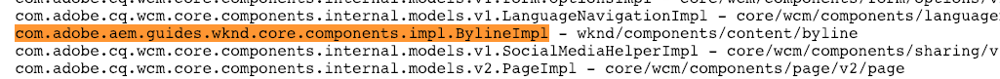

# Konfigurera en lokal AEM utvecklingsmiljö

Guide to setting up a local development for Adobe Experience Manager, AEM. Omfattar viktiga ämnen som rör lokal installation, Apache Maven, integrerade utvecklingsmiljöer samt felsökning/felsökning. Utveckling med **[!DNL Eclipse IDE], [!DNL CRXDE Lite], [!DNL Visual Studio Code] och[!DNL IntelliJ]** diskuteras.

## Översikt

Att konfigurera en lokal utvecklingsmiljö är första steget i utvecklingen för Adobe Experience Manager eller AEM. Ta dig tid att konfigurera en kvalitetsutvecklingsmiljö för att öka produktiviteten och skriva bättre kod snabbare. Vi kan bryta en AEM lokal utvecklingsmiljö i fyra områden:

* Lokala AEM
* [!DNL Apache Maven] projekt
* Integrerade utvecklingsmiljöer
* Felsökning

## Installera lokala AEM instanser

När vi syftar på en lokal AEM talar vi om en kopia av Adobe Experience Manager som körs på en utvecklares personliga maskin. ***AllAEM-*** utveckling ska börja med att skriva och köra kod mot en lokal AEM.

Om du inte har använt AEM tidigare kan du installera två grundläggande körningslägen: ***Författare*** och ***Publicera***. ***Författaren*** [runmode](https://helpx.adobe.com/experience-manager/6-5/sites/deploying/using/configure-runmodes.html) är den miljö som digitala marknadsförare använder för att skapa och hantera innehåll. När du utvecklar **det mesta** av tiden distribuerar du kod till en Author-instans. På så sätt kan du skapa nya sidor samt lägga till och konfigurera komponenter. AEM Sites är ett CMS för WYSIWYG-redigering och därför kan merparten av CSS och JavaScript testas mot en -redigeringsinstans.

Den är också *kritisk* testkod mot en lokal ***Publish***-instans. Instansen ***Publish*** är den AEM miljö som besökare på webbplatsen kan interagera med. Även om ***Publish***-instansen är samma teknologi som ***Author***-instansen, finns det vissa viktiga skillnader när det gäller konfigurationer och behörigheter. Koden ska *alltid* testas mot en lokal ***Publish***-instans innan den befordras till miljöer på högre nivå.

### Steg

1. Kontrollera att [Java](https://downloads.experiencecloud.adobe.com/content/software-distribution/en/general.html) är installerat.
   * Använd [Java JDK 11](https://experience.adobe.com/#/downloads/content/software-distribution/en/general.html?1_group.propertyvalues.property=.%2Fjcr%3Acontent%2Fmetadata%2FDc%3AsoftwareType&amp;1_group.propertyvalues.operation=equals&amp;1_group.propertyvalues.0_values=software-type%3Atooling&amp;orderby=%40jcr%3Acontent%2Fjcr%3AlastModified&amp;order.sort=desc&amp;layout=list&amp;list p.offset=0&amp;p.limit=14) för AEM 6.5+
   * [Java JDK 8](https://www.oracle.com/technetwork/java/javase/downloads/index.html#JDK8) för AEM versioner före AEM 6.5
2. Hämta en kopia av [AEM QuickStart Jar och a [!DNL license.properties]](https://helpx.adobe.com/experience-manager/6-5/sites/deploying/using/deploy.html#GettingtheSoftware).
3. Skapa en mappstruktur på datorn enligt följande:

   ```plain
   ~/aem-sdk
       /author
       /publish
   ```

4. Byt namn på [!DNL QuickStart] JAR till ***aem-author-p4502.jar*** och placera den under katalogen `/author`. Lägg till filen ***[!DNL license.properties]*** under katalogen `/author`.
5. Skapa en kopia av JAR-filen [!DNL QuickStart], byt namn på den till ***aem-publish-p4503.jar*** och placera den under katalogen `/publish`. Lägg till en kopia av filen ***[!DNL license.properties]*** under katalogen `/publish`.

   ```plain
   ~/aem-sdk
       /author
           + aem-author-p4502.jar
           + license.properties
       /publish
           + aem-publish-p4503.jar
           + license.properties
   ```

6. Dubbelklicka på filen ***aem-author-p4502.jar*** för att installera **Author**-instansen. Detta startar författarinstansen, som körs på port **4502** på den lokala datorn.

   Dubbelklicka på filen ***aem-publish-p4503.jar*** för att installera **Publish**-instansen. Detta startar Publish-instansen, som körs på port **4503** på den lokala datorn.

   >[!NOTE]
   >
   >Beroende på utvecklingsdatorns maskinvara kan det vara svårt att ha både en **författare och en Publish**-instans igång samtidigt. I sällsynta fall behöver du köra båda samtidigt på en lokal installation.

   Mer information finns i [Distribuera och underhålla en AEM](https://helpx.adobe.com/experience-manager/6-5/sites/deploying/using/deploy.html).

## Installera Apache Maven

***[!DNL Apache Maven]*** är ett verktyg för att hantera bygg- och distributionsproceduren för Java-baserade projekt. AEM är en Java-baserad plattform och [!DNL Maven] är standardsättet att hantera kod för ett AEM projekt. När vi säger ***AEM Maven Project*** eller bara ditt ***AEM Project*** syftar vi på ett Maven-projekt som innehåller all *anpassad*-kod för din webbplats.

Alla AEM ska bygga på den senaste versionen av **[!DNL AEM Project Archetype]**: [https://github.com/Adobe-Marketing-Cloud/aem-project-archetype](https://github.com/Adobe-Marketing-Cloud/aem-project-archetype). [!DNL AEM Project Archetype] skapar en bootstrap av ett AEM med exempelkod och innehåll. [!DNL AEM Project Archetype] innehåller även **[!DNL AEM WCM Core Components]** som är konfigurerad att användas i ditt projekt.

>[!CAUTION]
>
>När du startar ett nytt projekt är det bäst att använda den senaste versionen av typen. Kom ihåg att det finns flera versioner av typen och att inte alla versioner är kompatibla med tidigare versioner av AEM.

### Steg

1. Ladda ned [Apache Maven](https://maven.apache.org/download.cgi)
2. Installera [Apache Maven](https://maven.apache.org/install.html) och kontrollera att installationen har lagts till på kommandoraden `PATH`.
   * [!DNL macOS] användare kan installera Maven med  [Homebrew](https://brew.sh/)
3. Kontrollera att **[!DNL Maven]** är installerat genom att öppna en ny kommandoradsterminal och köra följande:

   ```shell
   $ mvn --version
   Apache Maven 3.3.9
   Maven home: /Library/apache-maven-3.3.9
   Java version: 1.8.0_111, vendor: Oracle Corporation
   Java home: /Library/Java/JavaVirtualMachines/jdk1.8.0_111.jdk/Contents/Home/jre
   Default locale: en_US, platform encoding: UTF-8
   ```

4. Lägg till **[!DNL adobe-public]**-profilen i [!DNL Maven] [settings.xml](https://maven.apache.org/settings.html)-filen för att automatiskt lägga till **[!DNL repo.adobe.com]** i maven build-processen.

5. Skapa en fil med namnet `settings.xml` på `~/.m2/settings.xml` om den inte redan finns.

6. Lägg till **[!DNL adobe-public]**-profilen i `settings.xml`-filen baserat på [instruktionerna här](https://repo.adobe.com/).

   Ett exempel `settings.xml` visas nedan. *Observera att namnkonventionen för  `settings.xml` och placeringen under användarens  `.m2` katalog är viktig.*

   ```xml
   <settings xmlns="https://maven.apache.org/SETTINGS/1.0.0"
     xmlns:xsi="https://www.w3.org/2001/XMLSchema-instance"
     xsi:schemaLocation="https://maven.apache.org/SETTINGS/1.0.0
                         https://maven.apache.org/xsd/settings-1.0.0.xsd">
   <profiles>
    <!-- ====================================================== -->
    <!-- A D O B E   P U B L I C   P R O F I L E                -->
    <!-- ====================================================== -->
        <profile>
            <id>adobe-public</id>
            <activation>
                <activeByDefault>true</activeByDefault>
            </activation>
            <properties>
                <releaseRepository-Id>adobe-public-releases</releaseRepository-Id>
                <releaseRepository-Name>Adobe Public Releases</releaseRepository-Name>
                <releaseRepository-URL>https://repo.adobe.com/nexus/content/groups/public</releaseRepository-URL>
            </properties>
            <repositories>
                <repository>
                    <id>adobe-public-releases</id>
                    <name>Adobe Public Repository</name>
                    <url>https://repo.adobe.com/nexus/content/groups/public</url>
                    <releases>
                        <enabled>true</enabled>
                        <updatePolicy>never</updatePolicy>
                    </releases>
                    <snapshots>
                        <enabled>false</enabled>
                    </snapshots>
                </repository>
            </repositories>
            <pluginRepositories>
                <pluginRepository>
                    <id>adobe-public-releases</id>
                    <name>Adobe Public Repository</name>
                    <url>https://repo.adobe.com/nexus/content/groups/public</url>
                    <releases>
                        <enabled>true</enabled>
                        <updatePolicy>never</updatePolicy>
                    </releases>
                    <snapshots>
                        <enabled>false</enabled>
                    </snapshots>
                </pluginRepository>
            </pluginRepositories>
        </profile>
   </profiles>
    <activeProfiles>
        <activeProfile>adobe-public</activeProfile>
    </activeProfiles>
   </settings>
   ```

7. Kontrollera att profilen **adobe-public** är aktiv genom att köra följande kommando:

   ```shell
   $ mvn help:effective-settings
   ...
   <activeProfiles>
       <activeProfile>adobe-public</activeProfile>
   </activeProfiles>
   <pluginGroups>
       <pluginGroup>org.apache.maven.plugins</pluginGroup>
       <pluginGroup>org.codehaus.mojo</pluginGroup>
   </pluginGroups>
   </settings>
   [INFO] ------------------------------------------------------------------------
   [INFO] BUILD SUCCESS
   [INFO] ------------------------------------------------------------------------
   [INFO] Total time:  0.856 s
   ```

   Om du inte ser **[!DNL adobe-public]** är det en indikation på att Adobe repo inte refereras korrekt i din `~/.m2/settings.xml`-fil. Gå igenom de tidigare stegen och kontrollera att filen settings.xml refererar till Adobe repo.

## Konfigurera en integrerad utvecklingsmiljö

En integrerad utvecklingsmiljö eller IDE är ett program som kombinerar en textredigerare, syntaxstöd och byggverktyg. Beroende på vilken typ av utveckling du håller på med kan en utvecklingsmiljö vara att föredra framför en annan. Oavsett vilken utvecklingsmiljö det gäller är det viktigt att du regelbundet kan ***push***-kod till en lokal AEM för att testa den. Det är också viktigt att ibland ***pull***-konfigurationer från en lokal AEM till ditt AEM projekt för att kunna fortsätta till ett källstyrningssystem som Git.

Nedan visas några av de populäraste IDE:erna som används för AEM med motsvarande videofilmer som visar integrationen med en lokal AEM.

>[!NOTE]
>
> WKND-projektet har uppdaterats till standardinställningen att fungera på AEM som en Cloud Service. Den har uppdaterats så att den är [bakåtkompatibel med 6.5/6.4](https://github.com/adobe/aem-guides-wknd#building-for-aem-6xx). Om du använder AEM 6.5 eller 6.4 lägger du till profilen `classic` till valfritt Maven-kommando.

```shell
$ mvn clean install -PautoInstallSinglePackage -Pclassic
```

Kontrollera `classic` på fliken Maven-profil när du använder en IDE.


*IntelliJ Maven-profil*

### [!DNL Eclipse] IDE

**[[!DNL Eclipse] IDE](https://www.eclipse.org/ide/)** är en av de mer populära IDE:erna för Java-utveckling, till stor del eftersom den har öppen källkod och ***fri***! Adobe tillhandahåller ett plugin-program, **[[!DNL AEM Developer Tools]](https://eclipse.adobe.com/aem/dev-tools/)**, för [!DNL Eclipse], som gör det enklare att utveckla med ett trevligt GUI för att synkronisera kod med en lokal AEM. Den integrerade utvecklingsmiljön [!DNL Eclipse] rekommenderas för utvecklare som inte AEM till stor del på grund av stödet för användargränssnittet i [!DNL AEM Developer Tools].

#### Installation och installation

1. Hämta och installera [!DNL Eclipse]-utvecklingsmiljön för [!DNL Java EE Developers]: [https://www.eclipse.org](https://www.eclipse.org/)
1. Följ instruktionerna för att installera plugin-programmet [!DNL AEM Developer Tools]: [https://eclipse.adobe.com/aem/dev-tools/](https://eclipse.adobe.com/aem/dev-tools/)

>[!VIDEO](https://video.tv.adobe.com/v/25906?quality=12&learn=on)

* 00:30 - Importera Maven Project
* 01:24 - Skapa och distribuera källkod med Maven
* 04:33 - Skjut upp kodändringar med AEM Developer Tool
* 10:55 - Dra in kodändringar med AEM Developer Tool
* 13:12 - Använda de integrerade felsökningsverktygen i Eclipse

### IntelliJ IDEA

**[IntelliJ IDEA](https://www.jetbrains.com/idea/)** är en kraftfull IDE för professionell Java-utveckling. [!DNL IntelliJ IDEA] finns i två versioner, en  ****** [!DNL Community] kostnadsfri utgåva och en kommersiell (betald)  [!DNL Ultimate] version. Den kostnadsfria [!DNL Community]-versionen av [!DNL IntellIJ IDEA] är tillräcklig för mer AEM utveckling, men [!DNL Ultimate] [ utökar sin funktionsuppsättning](https://www.jetbrains.com/idea/download).

#### [!DNL Installation and Setup]

1. Hämta och installera [!DNL IntelliJ IDEA]: [https://www.jetbrains.com/idea/download](https://www.jetbrains.com/idea/download)
1. Installera [!DNL Repo] (kommandoradsverktyg): [https://github.com/Adobe-Marketing-Cloud/tools/tree/master/repo](https://github.com/Adobe-Marketing-Cloud/tools/tree/master/repo#installation)

>[!VIDEO](https://video.tv.adobe.com/v/26089/?quality=12&learn=on)

* 00:00 - Importera Maven Project
* 05:47 - Skapa och distribuera källkod med Maven
* 08:17 - Gör ändringar med Repo
* 14:39 - Dra in ändringar med Repo
* 17:25 - Använda de integrerade felsökningsverktygen i IntelliJ IDEA

### [!DNL Visual Studio Code]

**[Visual Studio ](https://code.visualstudio.com/)** Codehas har snabbt blivit ett favoritverktyg för  ***gränssnittsutvecklare*** med förbättrat JavaScript-stöd  [!DNL Intellisense]och stöd för webbläsarfelsökning. **[!DNL Visual Studio Code]** har kostnadsfri öppen källkod med många kraftfulla tillägg. [!DNL Visual Studio Code] kan konfigureras för att integreras med AEM med hjälp av ett Adobe-verktyg,  **[repo](https://github.com/Adobe-Marketing-Cloud/tools/tree/master/repo#integration-into-visual-studio-code).** Det finns också flera tillägg som stöds av communityn som kan installeras för att integreras med AEM.

[!DNL Visual Studio Code] är ett bra val för gränssnittsutvecklare som primärt skriver CSS/LESS- och JavaScript-kod för att skapa AEM klientbibliotek. Det här verktyget kanske inte är det bästa alternativet för nya AEM eftersom noddefinitioner (dialogrutor, komponenter) måste redigeras i rå XML. Det finns flera Java-tillägg tillgängliga för [!DNL Visual Studio Code], men om Java-utveckling i första hand är [!DNL Eclipse IDE] eller [!DNL IntelliJ] är att föredra.

#### Viktiga länkar

* [****](https://code.visualstudio.com/Download) **Ladda nedVisual Studio Code**
* **[repo](https://github.com/Adobe-Marketing-Cloud/tools/tree/master/repo#integration-into-visual-studio-code)** - FTP-liknande verktyg för JCR-innehåll
* **[aemfed](https://aemfed.io/)**  - Snabba upp AEM arbetsflöde
* **[AEM Sync](https://marketplace.visualstudio.com/items?itemName=Yinkai15.aemsync)**  - Community-stöd* för Visual Studio Code

>[!VIDEO](https://video.tv.adobe.com/v/25907?quality=12&learn=on)

* 00:30 - Importera Maven Project
* 00:53 - Skapa och distribuera källkod med Maven
* 04:03 - Skjut upp kodändringar med kommandoradsverktyget Repo
* 08:29 - Dra in kodändringar med Repo-kommandoradsverktyget
* 10:40 - Skjut upp kodändringar med det inmatade verktyget
* 14:24 - Felsökning, Återskapa klientbibliotek

### [!DNL CRXDE Lite]

[CRXDE ](https://helpx.adobe.com/experience-manager/6-4/sites/developing/using/developing-with-crxde-lite.html) Lites är en webbläsarbaserad vy av AEM. [!DNL CRXDE Lite] är inbäddat i AEM och gör det möjligt för utvecklare att utföra standardutvecklingsåtgärder som att redigera filer, definiera komponenter, dialogrutor och mallar. [!DNL CRXDE Lite] är  ****** inte avsedd att vara en fullständig utvecklingsmiljö, men är mycket effektivt som felsökningsverktyg. [!DNL CRXDE Lite] är användbart när du vill utöka eller helt enkelt förstå produktkod utanför kodbasen. [!DNL CRXDE Lite] ger en kraftfull vy över databasen och ett sätt att effektivt testa och hantera behörigheter.

[!DNL CRXDE Lite] ska alltid användas tillsammans med andra utvecklingsmiljöer för att testa och felsöka kod, men aldrig som det primära utvecklingsverktyget. Den har begränsat syntaxstöd, inga funktioner för automatisk komplettering och begränsad integrering med system för källkodshantering.

>[!VIDEO](https://video.tv.adobe.com/v/25917?quality=12&learn=on)

## Felsökning

***Hjälp!*** Min kod fungerar inte! Precis som med all utveckling kommer det att finnas tillfällen (förmodligen många) där koden helt enkelt inte fungerar som förväntat. AEM är en kraftfull plattform, men med stor kraft ... är mycket komplext. Nedan följer några viktiga startpunkter när det gäller felsökning och spårning av problem (men långt ifrån en fullständig lista över saker som kan gå fel):

### Verifiera koddistribution

Ett bra första steg när du stöter på ett problem är att kontrollera att koden har distribuerats och installerats korrekt till AEM.

1. **Kontrollera[!UICONTROL Package Manager]** att kodpaketet har överförts och installerats:  [http://localhost:4502/crx/packmgr/index.jsp](http://localhost:4502/crx/packmgr/index.jsp). Kontrollera tidsstämpeln för att bekräfta att paketet har installerats nyligen.
1. Om du utför inkrementella filuppdateringar med ett verktyg som [!DNL Repo] eller [!DNL AEM Developer Tools], **kontrollerar du[!DNL CRXDE Lite]** att filen har skickats till den lokala AEM och att filinnehållet har uppdaterats: [http://localhost:4502/crx/de/index.jsp](http://localhost:4502/crx/de/index.jsp)
1. **Kontrollera att paketet är** uppladdningsbart så att du ser problem med Java-kod i ett OSGi-paket. Öppna [!UICONTROL Adobe Experience Manager Web Console]: [http://localhost:4502/system/console/bundles](http://localhost:4502/system/console/bundles) och sök efter ditt paket. Kontrollera att paketet har statusen **[!UICONTROL Active]**. Nedan finns mer information om hur du felsöker ett paket i ett **[!UICONTROL Installed]**-läge.

#### Kontrollera loggarna

AEM är en chattingplattform och loggar mycket användbar information i **error.log**. **error.log** finns där AEM har installerats: &lt; `aem-installation-folder>/crx-quickstart/logs/error.log`.

En användbar teknik för att spåra problem är att lägga till loggsatser i Java-koden:

```java
import org.slf4j.Logger;
import org.slf4j.LoggerFactory;
...

public class MyClass {
    private final Logger log = LoggerFactory.getLogger(getClass());

    ...

    String myVariable = "My Variable";

    log.debug("Debug statement of myVariable {}", myVariable);

    log.info("Info statement of myVariable {}", myVariable);
}
```

Som standard är **error.log** konfigurerad att logga *[!DNL INFO]*-satser. Om du vill ändra loggnivån kan du göra det genom att gå till [!UICONTROL Log Support]: [http://localhost:4502/system/console/slinglog](http://localhost:4502/system/console/slinglog). Du kan också upptäcka att **error.log** är för kattlig. Du kan använda [!UICONTROL Log Support] för att konfigurera loggsatser för endast ett angivet Java-paket. Detta är en god vana för projekt för att enkelt kunna skilja skräddarsydda kodproblem från OTB-AEM.


#### Paketet är i installerat läge {#bundle-active}

Alla paket (utom fragment) ska vara i läget **[!UICONTROL Active]**. Om du ser kodpaketet i ett [!UICONTROL Installed]-läge finns det ett problem som behöver lösas. Det här är oftast ett beroendeproblem:


På skärmbilden ovan är [!DNL WKND Core bundle] ett [!UICONTROL Installed]-tillstånd. Detta beror på att paketet förväntar sig en annan version av `com.adobe.cq.wcm.core.components.models` än den som är tillgänglig på AEM.

Ett användbart verktyg som kan användas är [!UICONTROL Dependency Finder]: [http://localhost:4502/system/console/depfinder](http://localhost:4502/system/console/depfinder). Lägg till Java-paketnamnet för att kontrollera vilken version som är tillgänglig på AEM:


I exemplet ovan ser vi att den version som är installerad på AEM är **12.2** jämfört med **12.6** som paketet förväntades. Därifrån kan du arbeta baklänges och se om [!DNL Maven]-beroendena för AEM matchar [!DNL Maven]-beroendena i det AEM projektet. I ovanstående exempel är [!DNL Core Components] **v2.2.0** installerat på AEM men kodpaketet skapades med ett beroende av **v2.2.2**, vilket är orsaken till beroendeproblemet.

#### Verifiera registrering av delningsmodeller {#osgi-component-sling-models}

AEM ska alltid backas upp av en [!DNL Sling Model] för att kapsla in affärslogik och säkerställa att HTML-återgivningsskriptet förblir rent. Om du får problem där Sling Model inte kan hittas kan det vara praktiskt att kontrollera [!DNL Sling Models] från konsolen: [http://localhost:4502/system/console/status-slingmodels](http://localhost:4502/system/console/status-slingmodels). Detta anger om din Sling-modell har registrerats och vilken resurstyp (komponentsökvägen) den är kopplad till.



Visar registreringen av [!DNL Sling Model], `BylineImpl` som är kopplad till en komponentresurstyp `wknd/components/content/byline`.

#### CSS- eller JavaScript-problem

För de flesta CSS- och JavaScript-problem är det mest effektiva sättet att felsöka webbläsarens utvecklingsverktyg. Om du vill begränsa problemet när du utvecklar mot en AEM författarinstans kan det vara bra att visa sidan&quot;som publicerad&quot;.


Öppna menyn [!UICONTROL Page Properties] och klicka på [!UICONTROL View as Published]. Sidan öppnas utan AEM och en frågeparameter ställs in på **wcmmode=disabled**. Detta inaktiverar effektivt gränssnittet för AEM och gör det enklare att felsöka/felsöka frontend-problem.

Ett annat vanligt fel uppstod när front end-kod utvecklades. CSS/JS läses in. Som ett första steg måste du kontrollera att webbläsarhistoriken har rensats och vid behov starta en webbläsare som inte känner av eller en ny session.

#### Felsöka klientbibliotek

Med olika metoder för kategorier och inbäddning för att inkludera flera klientbibliotek kan det vara besvärligt att felsöka. AEM visar flera verktyg som kan hjälpa dig med detta. Ett av de viktigaste verktygen är [!UICONTROL Rebuild Client Libraries] som tvingar AEM att kompilera om alla LESS-filer och generera CSS.

* [Dumpbibliotek](http://localhost:4502/libs/granite/ui/content/dumplibs.html)  - Visar en lista över alla klientbibliotek som registrerats i AEM. &lt;host>/libs/granite/ui/content/dumplibs.html
* [Testa utdata](http://localhost:4502/libs/granite/ui/content/dumplibs.test.html)  - gör att en användare kan se förväntade HTML-utdata från clientlib includes baserat på kategori. &lt;host>/libs/granite/ui/content/dumplibs.test.html
* [Validering](http://localhost:4502/libs/granite/ui/content/dumplibs.validate.html)  av biblioteksberoenden - markerar beroenden eller inbäddade kategorier som inte kan hittas. &lt;host>/libs/granite/ui/content/dumplibs.validate.html
* [Återskapa klientbibliotek](http://localhost:4502/libs/granite/ui/content/dumplibs.rebuild.html)  - gör att en användare kan tvinga AEM att återskapa alla klientbibliotek eller göra cachen i klientbiblioteken ogiltig. Det här verktyget är särskilt effektivt när du utvecklar med LESS eftersom det kan tvinga AEM att kompilera om den genererade CSS-koden. I allmänhet är det effektivare att validera cacheminnen och sedan utföra en siduppdatering jämfört med att återskapa alla bibliotek. &lt;host>/libs/granite/ui/content/dumplibs.rebuild.html


>[!NOTE]
>
>Om du hela tiden måste göra cacheminnet ogiltigt med [!UICONTROL Rebuild Client Libraries]-verktyget kan det vara värt att göra om alla klientbibliotek en gång. Detta kan ta ca 15 minuter, men eliminerar vanligtvis eventuella problem med cachelagring i framtiden.
