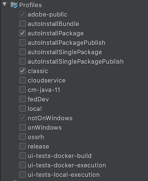

# Konfigurera en lokal AEM utvecklingsmiljö

Guide to setting up a local development for Adobe Experience Manager, AEM. Omfattar viktiga ämnen som rör lokal installation, Apache Maven, integrerade utvecklingsmiljöer samt felsökning/felsökning. Utveckling med **Eclipse IDE, CRXDE Lite, Visual Studio Code och IntelliJ** diskuteras.

## Ökning

Att konfigurera en lokal utvecklingsmiljö är första steget i utvecklingen för Adobe Experience Manager eller AEM. Ta dig tid att konfigurera en kvalitetsutvecklingsmiljö för att öka produktiviteten och skriva bättre kod snabbare. Vi kan bryta ned en AEM lokal utvecklingsmiljö i fyra områden:

* Lokala AEM
* [!DNL Apache Maven] projekt
* Integrerade utvecklingsmiljöer
* Felsökning

## Installera lokala AEM

När vi syftar på en lokal AEM talar vi om en kopia av Adobe Experience Manager som körs på en utvecklares personliga maskin. ***Alla*** AEM ska börja med att skriva och köra kod mot en lokal AEM.

Om du inte har använt AEM tidigare kan du installera två grundläggande körningslägen: ***Upphovsman*** och ***Publicera***. The ***Upphovsman*** [runmode](https://experienceleague.adobe.com/docs/experience-manager-65/deploying/configuring/configure-runmodes.html?lang=en)  är den miljö som digitala marknadsförare använder för att skapa och hantera innehåll. När du oftast utvecklar kod distribuerar du kod till en Author-instans. På så sätt kan du skapa sidor och lägga till och konfigurera komponenter. AEM Sites är ett CMS för WYSIWYG-redigering och därför kan merparten av CSS och JavaScript testas mot en -redigeringsinstans.

Det är också *kritisk* testa kod mot en lokal ***Publicera*** -instans. The ***Publicera*** -instans är den AEM miljö som besökare på webbplatsen interagerar med. Med ***Publicera*** -instansen är samma teknologi som ***Upphovsman*** Det finns till exempel några viktiga skillnader när det gäller konfigurationer och behörigheter. Koden måste testas mot en lokal ***Publicera*** innan den befordras till miljöer på högre nivå.

### Steg

1. Kontrollera att Java™ är installerat.
   * Föredra [Java™ JDK 11](https://experience.adobe.com/#/downloads/content/software-distribution/en/general.html?1_group.propertyvalues.property=.%2Fjcr%3Acontent%2Fmetadata%2FDc%3AsoftwareType&amp;1_group.propertyvalues.operation=equals&amp;1_group.propertyvalues.0_values=software-type%3Atooling&amp;orderby=%40jcr%3Acontent%2Fjcr%3AlastModified&amp;order.sort=desc&amp;layout=list&amp;list p.offset=0&amp;p.limit=14) för AEM 6.5+
   * [Java™ JDK 8](https://www.oracle.com/java/technologies/downloads/) för AEM versioner före AEM 6.5
1. Få en kopia av [AEM QuickStart Jar och en [!DNL license.properties]](https://experienceleague.adobe.com/docs/experience-manager-65/deploying/deploying/deploy.html).
1. Skapa en mappstruktur på datorn enligt följande:

```plain
~/aem-sdk
    /author
    /publish
```

1. Byt namn på [!DNL QuickStart] JAR till ***aem-author-p4502.jar*** och placera den under `/author` katalog. Lägg till ***[!DNL license.properties]*** filen under `/author` katalog.

1. Skapa en kopia av [!DNL QuickStart] JAR, byt namn på den till ***aem-publish-p4503.jar*** och placera den under `/publish` katalog. Lägg till en kopia av ***[!DNL license.properties]*** filen under `/publish` katalog.

```plain
~/aem-sdk
    /author
        + aem-author-p4502.jar
        + license.properties
    /publish
        + aem-publish-p4503.jar
        + license.properties
```

1. Dubbelklicka på ***aem-author-p4502.jar*** filen som ska installeras **Upphovsman** -instans. Detta startar författarinstansen, som körs på port **4502** på den lokala datorn.

Dubbelklicka på ***aem-publish-p4503.jar*** filen som ska installeras **Publicera** -instans. Detta startar Publish-instansen, som körs på port **4503** på den lokala datorn.

>[!NOTE]
>
>Beroende på vilken maskinvara som används i utvecklingsdatorn kan det vara svårt att ha både en **Skapa och publicera** -instans som körs samtidigt. I sällsynta fall behöver du köra båda samtidigt på en lokal installation.

### Använda kommandorad

Ett alternativ till att dubbelklicka på JAR-filen är att starta AEM från kommandoraden eller skapa ett skript (`.bat` eller `.sh`) beroende på vilket operativsystem du har. Nedan visas ett exempel på exempelkommandot:

```shell
$ java -Xmx2048M -Xdebug -Xnoagent -Djava.compiler=NONE -Xrunjdwp:transport=dt_socket,server=y,suspend=n,address=30303 -jar aem-author-p4502.jar -gui -r"author,localdev"
```

Här är `-X` är JVM-alternativ och `-D` finns ytterligare ramverksegenskaper, mer information finns i [Distribuera och underhålla en AEM](https://experienceleague.adobe.com/docs/experience-manager-65/deploying/deploying/deploy.html) och [Fler alternativ är tillgängliga från QuickStart-filen](https://experienceleague.adobe.com/docs/experience-manager-65/deploying/deploying/custom-standalone-install.html#further-options-available-from-the-quickstart-file).

## Installera Apache Maven

***[!DNL Apache Maven]*** är ett verktyg för att hantera bygg- och distributionsproceduren för Java-baserade projekt. AEM är en Java-baserad plattform och [!DNL Maven] är standardsättet att hantera kod för ett AEM projekt. När vi säger ***AEM Maven Project*** eller bara ***AEM***, menar vi ett Maven-projekt som innehåller alla *anpassad* -kod för din webbplats.

Alla AEM ska byggas av den senaste versionen av **[!DNL AEM Project Archetype]**: [https://github.com/adobe/aem-project-archetype](https://github.com/adobe/aem-project-archetype). The [!DNL AEM Project Archetype] innehåller en startfas för ett AEM med exempelkod och innehåll. The [!DNL AEM Project Archetype] innehåller **[!DNL AEM WCM Core Components]** konfigurerad att användas i ditt projekt.

>[!CAUTION]
>
>När du startar ett nytt projekt är det bäst att använda den senaste versionen av typen. Kom ihåg att det finns flera versioner av typen och att inte alla versioner är kompatibla med tidigare versioner av AEM.

### Steg

1. Ladda ned [Apache Maven](https://maven.apache.org/download.cgi)
2. Installera [Apache Maven](https://maven.apache.org/install.html) och se till att installationen har lagts till i kommandoraden `PATH`.
   * [!DNL macOS] användare kan installera Maven med [Homebreiska](https://brew.sh/)
3. Verifiera att **[!DNL Maven]** installeras genom att en ny kommandoradsterminal öppnas och följande körs:

```shell
$ mvn --version
Apache Maven 3.3.9
Maven home: /Library/apache-maven-3.3.9
Java version: 1.8.0_111, vendor: Oracle Corporation
Java home: /Library/Java/JavaVirtualMachines/jdk1.8.0_111.jdk/Contents/Home/jre
Default locale: en_US, platform encoding: UTF-8
```

>[!NOTE]
>
> Tidigare tillägg av `adobe-public` Maven-profilen behövdes för att peka `nexus.adobe.com` för att hämta AEM. Alla AEM artefakter är nu tillgängliga via Maven Central och `adobe-public` ingen profil behövs.

## Konfigurera en integrerad utvecklingsmiljö

En integrerad utvecklingsmiljö eller IDE är ett program som kombinerar en textredigerare, syntaxstöd och byggverktyg. Beroende på vilken typ av utveckling du håller på med kan en utvecklingsmiljö vara att föredra framför en annan. Oavsett utvecklingsmiljö är det viktigt att du regelbundet kan ***push*** koda till en lokal AEM för att testa den. Det är viktigt att emellanåt ***pull*** konfigurationer från en lokal AEM till ditt AEM projekt för att fortsätta till ett källstyrningssystem som Git.

Nedan visas några av de populäraste IDE:erna som används för AEM med motsvarande videofilmer som visar integrationen med en lokal AEM.

>[!NOTE]
>
> WKND-projektet har uppdaterats till standardformat för att fungera på AEM as a Cloud Service. Den har uppdaterats till att vara [bakåt kompatibel med 6.5/6.4](https://github.com/adobe/aem-guides-wknd#building-for-aem-6xx). Om du använder AEM 6.5 eller 6.4 ska du lägga till `classic` för alla Maven-kommandon.

```shell
$ mvn clean install -PautoInstallSinglePackage -Pclassic
```

När ska du använda en IDE-indikator ska du kontrollera `classic` på fliken Maven Profile.



*IntelliJ Maven-profil*

### [!DNL Eclipse] IDE

The **[[!DNL Eclipse] IDE](https://www.eclipse.org/ide/)** är en av de vanligaste utvecklingsmiljöerna för Java™-utveckling, till stor del eftersom den har öppen källkod och ***kostnadsfritt***! Adobe har en plugin, **[[!DNL AEM Developer Tools]](https://experienceleague.adobe.com/docs/experience-manager-65/developing/devtools/aem-eclipse.html)**, för [!DNL Eclipse] så att det blir enklare att utveckla med ett bra användargränssnitt att synkronisera kod med en lokal AEM. The [!DNL Eclipse] IDE rekommenderas för utvecklare som inte AEM alls på grund av det grafiska användargränssnittet hos [!DNL AEM Developer Tools].

#### Installation och installation

1. Hämta och installera [!DNL Eclipse] IDE for [!DNL Java™ EE Developers]: [https://www.eclipse.org](https://www.eclipse.org/)
1. Följ instruktionerna för att installera [!DNL AEM Developer Tools] plugin-program: [https://experienceleague.adobe.com/docs/experience-manager-65/developing/devtools/aem-eclipse.html](https://experienceleague.adobe.com/docs/experience-manager-65/developing/devtools/aem-eclipse.html)

>[!VIDEO](https://video.tv.adobe.com/v/25906?quality=12&learn=on)

* 00:30 - Importera Maven Project
* 01:24 - Skapa och distribuera källkod med Maven
* 04:33 - Skjut upp kodändringar med AEM Developer Tool
* 10:55 - Dra in kodändringar med AEM Developer Tool
* 13:12 - Använda de integrerade felsökningsverktygen i Eclipse

### IntelliJ IDEA

The **[IntelliJ IDEA](https://www.jetbrains.com/idea/)** är en kraftfull IDE för professionell Java™-utveckling. [!DNL IntelliJ IDEA] finns i två smaker, ***kostnadsfritt*** [!DNL Community] och en kommersiell (betald) utgåva [!DNL Ultimate] version. Kostnadsfria [!DNL Community] version av [!DNL IntellIJ IDEA] är tillräckligt för en mer AEM utveckling, men [!DNL Ultimate] [utökar sin funktionsuppsättning](https://www.jetbrains.com/idea/download).

#### [!DNL Installation and Setup]

1. Hämta och installera [!DNL IntelliJ IDEA]: [https://www.jetbrains.com/idea/download](https://www.jetbrains.com/idea/download)
1. Installera [!DNL Repo] (kommandoradsverktyg): [https://github.com/Adobe-Marketing-Cloud/tools/tree/master/repo](https://github.com/Adobe-Marketing-Cloud/tools/tree/master/repo#installation)

>[!VIDEO](https://video.tv.adobe.com/v/26089?quality=12&learn=on)

* 00:00 - Importera Maven Project
* 05:47 - Skapa och distribuera källkod med Maven
* 08:17 - Gör ändringar med Repo
* 14:39 - Dra in ändringar med Repo
* 17:25 - Använda de integrerade felsökningsverktygen i IntelliJ IDEA

### [!DNL Visual Studio Code]

**[Visual Studio Code](https://code.visualstudio.com/)** har snabbt blivit ett favoritverktyg för ***gränssnittsutvecklare*** med förbättrat JavaScript-stöd, [!DNL Intellisense]och stöd för webbläsarfelsökning. **[!DNL Visual Studio Code]** har kostnadsfri öppen källkod med många kraftfulla tillägg. [!DNL Visual Studio Code] kan konfigureras för att integreras med AEM med hjälp av ett Adobe-verktyg, **[repo](https://github.com/Adobe-Marketing-Cloud/tools/tree/master/repo#integration-into-visual-studio-code).** Det finns också flera tillägg som stöds av communityn som kan installeras för att integreras med AEM.

[!DNL Visual Studio Code] är ett bra val för gränssnittsutvecklare som primärt skriver CSS/LESS och JavaScript-kod för att skapa AEM klientbibliotek. Det här verktyget kanske inte är det bästa alternativet för nya AEM eftersom noddefinitioner (dialogrutor, komponenter) måste redigeras i rå XML. Det finns flera Java™-tillägg för [!DNL Visual Studio Code]men om det främst handlar om Java™-utveckling [!DNL Eclipse IDE] eller [!DNL IntelliJ] är att föredra.

#### Viktiga länkar

* [**Ladda ned**](https://code.visualstudio.com/Download) **Visual Studio Code**
* **[repo](https://github.com/Adobe-Marketing-Cloud/tools/tree/master/repo#integration-into-visual-studio-code)** - FTP-liknande verktyg för JCR-innehåll
* **[aemfed](https://aemfed.io/)** - Snabba upp AEM arbetsflöde
* **[AEM synkronisering](https://marketplace.visualstudio.com/items?itemName=Yinkai15.aemsync)** - Community-stöd&#42; tillägg för Visual Studio Code

>[!VIDEO](https://video.tv.adobe.com/v/25907?quality=12&learn=on)

* 00:30 - Importera Maven Project
* 00:53 - Skapa och distribuera källkod med Maven
* 04:03 - Skjut upp kodändringar med kommandoradsverktyget Repo
* 08:29 - Dra in kodändringar med kommandoradsverktyget Repo
* 10:40 - Skjut upp kodändringar med det inmatade verktyget
* 14:24 - Felsökning, Återskapa klientbibliotek

### [!DNL CRXDE Lite]

[CRXDE Lite](https://experienceleague.adobe.com/docs/experience-manager-65/developing/devtools/developing-with-crxde-lite.html) är en webbläsarbaserad vy av AEM. [!DNL CRXDE Lite] är inbäddat i AEM och gör det möjligt för utvecklare att utföra standardutvecklingsåtgärder som att redigera filer, definiera komponenter, dialogrutor och mallar. [!DNL CRXDE Lite] är ***not*** som är avsedd att vara en fullständig utvecklingsmiljö men som är effektiv som ett felsökningsverktyg. [!DNL CRXDE Lite] är användbart när du vill utöka eller helt enkelt förstå produktkod utanför kodbasen. [!DNL CRXDE Lite] ger en kraftfull vy över databasen och ett sätt att effektivt testa och hantera behörigheter.

[!DNL CRXDE Lite] ska användas tillsammans med andra utvecklingsmiljöer för att testa och felsöka kod, men aldrig som det primära utvecklingsverktyget. Den har begränsat syntaxstöd, inga funktioner för automatisk komplettering och begränsad integrering med system för källkodshantering.

>[!VIDEO](https://video.tv.adobe.com/v/25917?quality=12&learn=on)

## Felsökning

***Hjälp mig!*** Min kod fungerar inte! Precis som med all utveckling finns det tillfällen (förmodligen många) där koden inte fungerar som förväntat. AEM är en kraftfull plattform, men med stor kraft ... är mycket komplicerad. Nedan visas några viktiga startpunkter när du felsöker och spårar problem (men långt ifrån en fullständig lista över saker som kan gå fel):

### Verifiera koddistribution

Ett bra första steg när du stöter på ett problem är att kontrollera att koden har distribuerats och installerats korrekt till AEM.

1. **Kontrollera[!UICONTROL Package Manager]** för att se till att kodpaketet har överförts och installerats: [http://localhost:4502/crx/packmgr/index.jsp](http://localhost:4502/crx/packmgr/index.jsp). Kontrollera tidsstämpeln för att bekräfta att paketet har installerats nyligen.
1. Om du utför inkrementella filuppdateringar med ett verktyg som [!DNL Repo] eller [!DNL AEM Developer Tools], **check[!DNL CRXDE Lite]** att filen har skickats till den lokala AEM och att filinnehållet har uppdaterats: [http://localhost:4502/crx/de/index.jsp](http://localhost:4502/crx/de/index.jsp)
1. **Kontrollera att paketet har överförts** om du ser problem med Java™-kod i ett OSGi-paket. Öppna [!UICONTROL Adobe Experience Manager Web Console]: [http://localhost:4502/system/console/bundles](http://localhost:4502/system/console/bundles) och söka efter ditt paket. Se till att paketet har en **[!UICONTROL Active]** status. Se nedan för mer information om felsökning av ett paket i en **[!UICONTROL Installed]** tillstånd.

#### Kontrollera loggarna

AEM är en chattplattform och loggar användbar information i **error.log**. The **error.log** kan hittas där AEM har installerats: &lt; `aem-installation-folder>/crx-quickstart/logs/error.log`.

En användbar teknik för att spåra problem är att lägga till loggsatser i Java™-koden:

```java
import org.slf4j.Logger;
import org.slf4j.LoggerFactory;
...

public class MyClass {
    private final Logger log = LoggerFactory.getLogger(getClass());

    ...

    String myVariable = "My Variable";

    log.debug("Debug statement of myVariable {}", myVariable);

    log.info("Info statement of myVariable {}", myVariable);
}
```

Som standard är **error.log** är konfigurerad för loggning *[!DNL INFO]* -programsatser. Om du vill ändra loggnivån kan du göra det genom att gå till [!UICONTROL Log Support]: [http://localhost:4502/system/console/slinglog](http://localhost:4502/system/console/slinglog). Du kan också se att **error.log** är för kattlig. Du kan använda [!UICONTROL Log Support] för att konfigurera loggsatser för endast ett specifikt Java™-paket. Detta är en god vana för projekt för att enkelt kunna skilja skräddarsydda kodproblem från OTB-AEM.


#### Paketet är i ett installerat läge {#bundle-active}

Alla paket (utom fragment) ska finnas i en **[!UICONTROL Active]** tillstånd. Om du ser kodpaketet i en [!UICONTROL Installed] finns det ett problem som måste lösas. Det här är oftast ett beroendeproblem:


På skärmbilden ovan visas [!DNL WKND Core bundle] är en [!UICONTROL Installed] tillstånd. Detta beror på att paketet förväntas ha en annan version av `com.adobe.cq.wcm.core.components.models` än är tillgängligt på AEM.

Ett användbart verktyg som du kan använda är [!UICONTROL Dependency Finder]: [http://localhost:4502/system/console/depfinder](http://localhost:4502/system/console/depfinder). Lägg till Java™-paketnamnet för att kontrollera vilken version som är tillgänglig på AEM:


Vi kan fortsätta med exemplet ovan och se att den version som är installerad på AEM är **12.2** vs **12.6** att paketet förväntades. Därifrån kan du arbeta baklänges och se om [!DNL Maven] beroenden av AEM matchar [!DNL Maven] beroenden i AEM. I exemplet ovan [!DNL Core Components] **v2.2.0** har installerats på AEM men kodpaketet skapades med ett beroende **v2.2.2** och därmed orsaken till beroendeproblemet.

#### Verifiera registrering av försäljningsmodeller {#osgi-component-sling-models}

AEM måste backas upp av en [!DNL Sling Model] för att kapsla in affärslogik och se till att HTML-återgivningsskriptet förblir rent. Om du får problem där Sling Model inte kan hittas kan det vara praktiskt att kontrollera [!DNL Sling Models] från konsolen: [http://localhost:4502/system/console/status-slingmodels](http://localhost:4502/system/console/status-slingmodels). Detta anger om din Sling-modell har registrerats och vilken resurstyp (komponentsökvägen) den är kopplad till.


Visar registrering av en [!DNL Sling Model], `BylineImpl` som är knuten till en komponentresurstyp av `wknd/components/content/byline`.

#### CSS- eller JavaScript-problem

För de flesta CSS- och JavaScript-problem är det mest effektiva sättet att felsöka webbläsarens utvecklingsverktyg. Om du vill begränsa problemet när du utvecklar mot en AEM författarinstans kan det vara bra att visa sidan&quot;som publicerad&quot;.


Öppna [!UICONTROL Page Properties] meny och klicka [!UICONTROL View as Published]. Då öppnas sidan utan AEM Editor och med en frågeparameter inställd på **wcmmode=disabled**. Detta inaktiverar effektivt gränssnittet för AEM och gör det mycket enklare att felsöka/felsöka frontend-problem.

Ett annat vanligt fel uppstod när front end-kod utvecklades. CSS/JS läses in. Som ett första steg måste du kontrollera att webbläsarhistoriken har rensats och vid behov starta en webbläsare som inte känner av eller en ny session.

#### Felsöka klientbibliotek

Med de olika metoderna för kategorier och inbäddning för att inkludera flera klientbibliotek kan det vara besvärligt att felsöka. AEM visar flera verktyg som kan hjälpa dig med detta. Ett av de viktigaste verktygen [!UICONTROL Rebuild Client Libraries] som tvingar AEM att kompilera om LESS-filer och generera CSS.

* [Dumpa läppar](http://localhost:4502/libs/granite/ui/content/dumplibs.html) - Visar alla klientbibliotek som är registrerade i AEM. &lt;host>/libs/granite/ui/content/dumplibs.html
* [Testutdata](http://localhost:4502/libs/granite/ui/content/dumplibs.test.html) - gör att en användare kan se förväntade utdata från HTML för clientlib includes baserat på kategori. &lt;host>/libs/granite/ui/content/dumplibs.test.html
* [Validering av biblioteksberoenden](http://localhost:4502/libs/granite/ui/content/dumplibs.validate.html) - markerar eventuella beroenden eller inbäddade kategorier som inte kan hittas. &lt;host>/libs/granite/ui/content/dumplibs.validate.html
* [Återskapa klientbibliotek](http://localhost:4502/libs/granite/ui/content/dumplibs.rebuild.html) - gör att en användare kan tvinga AEM att återskapa alla klientbibliotek eller göra cachen i klientbiblioteken ogiltig. Det här verktyget är effektivt när du utvecklar med LESS eftersom det kan tvinga AEM att kompilera om den genererade CSS-koden. I allmänhet är det effektivare att validera cacheminnen och sedan utföra en siduppdatering jämfört med att återskapa alla bibliotek. &lt;host>/libs/granite/ui/content/dumplibs.rebuild.html


>[!NOTE]
>
>Om du hela tiden måste göra cachen ogiltig med [!UICONTROL Rebuild Client Libraries] kan det vara värt att göra om alla klientbibliotek en gång. Detta kan ta ca 15 minuter, men eliminerar vanligtvis eventuella problem med cachelagring i framtiden.
