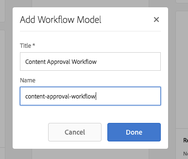
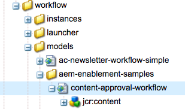
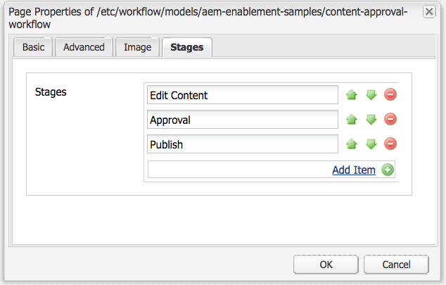

# Utveckla projekt i AEM

Det här är en självstudiekurs om utveckling som illustrerar hur du utvecklar för [!DNL AEM Projects]. I den här självstudien skapar vi en anpassad projektmall som kan användas för att skapa projekt i AEM för att hantera arbetsflöden och uppgifter för innehållsredigering.

>[!VIDEO](https://video.tv.adobe.com/v/16904?quality=12&learn=on)

*Den här videon ger en kort demonstration av det färdiga arbetsflödet som skapas i självstudien nedan.*

## Introduktion {#introduction}

[[!DNL AEM Projects]](https://experienceleague.adobe.com/en/docs/experience-manager-65/content/sites/authoring/projects/projects) är en funktion i AEM som gör det enklare att hantera och gruppera alla arbetsflöden och uppgifter som är kopplade till innehållsskapande som en del av en AEM Sites- eller Assets-implementering.

AEM innehåller flera [OTB-projektmallar](https://experienceleague.adobe.com/en/docs/experience-manager-65/content/sites/authoring/projects/projects). När du skapar ett projekt kan författarna välja bland dessa tillgängliga mallar. Stora AEM implementeringar med unika affärskrav vill skapa anpassade projektmallar som är anpassade efter deras behov. Genom att skapa en anpassad projektmall kan utvecklare konfigurera projektkontrollpanelen, ansluta till anpassade arbetsflöden och skapa ytterligare affärsroller för ett projekt. Vi tittar på strukturen för en projektmall och skapar ett exempel.


## Inställningar

Den här självstudiekursen stegar igenom koden som behövs för att skapa en anpassad projektmall. Du kan hämta och installera [bifogat paket](./assets/develop-aem-projects/projects-tasks-guide.ui.apps-0.0.1-SNAPSHOT.zip) till en lokal miljö att följa med i självstudiekursen. Du kan även komma åt hela Maven-projektet som finns på [GitHub](https://github.com/Adobe-Marketing-Cloud/aem-guides/tree/feature/projects-tasks-guide).

* [Självstudiepaketet har slutförts](./assets/develop-aem-projects/projects-tasks-guide.ui.apps-0.0.1-SNAPSHOT.zip)
* [Full Code Repository on GitHub](https://github.com/Adobe-Marketing-Cloud/aem-guides/tree/feature/projects-tasks-guide)

Den här självstudiekursen förutsätter vissa grundläggande kunskaper i [AEM](https://experienceleague.adobe.com/en/docs/experience-manager-65/content/implementing/developing/introduction/the-basics) och viss vana vid [AEM Maven-projektinställningar](https://experienceleague.adobe.com/docs/experience-manager-65/developing/devtools/ht-projects-maven.html?lang=en). All kod som nämns är avsedd att användas som referens och ska endast distribueras till en [lokal AEM](https://experienceleague.adobe.com/en/docs/experience-manager-65/content/implementing/deploying/deploying/deploy).

## Struktur för en projektmall

Projektmallar ska placeras under källkontroll och finnas under programmappen under /apps. De bör helst placeras i en undermapp med namnkonventionen för **&#42;/projects/templates/**&lt;my-template>. Genom att använda den här namnkonventionen blir alla nya anpassade mallar automatiskt tillgängliga för författare när de skapar ett projekt. Konfigurationen av tillgängliga projektmallar är: **/content/projects/jcr:content** noden efter **cq:allowedTemplates** -egenskap. Som standard är detta ett reguljärt uttryck: **/(apps|libs)/.&#42;/projects/templates/.&#42;**

Rotnoden för en projektmall har en **jcr:primärType** av **cq:Template**. Under rotnoden finns tre noder: **gadgets**, **roller** och **arbetsflöden**. Alla dessa noder **nt:ostrukturerad**. Under rotnoden kan även en miniatyrbild.png-fil visas när du väljer mallen i guiden Skapa projekt.

Den fullständiga nodstrukturen:

```shell
/apps/<my-app>
    + projects (nt:folder)
         + templates (nt:folder)
              + <project-template-root> (cq:Template)
                   + gadgets (nt:unstructured)
                   + roles (nt:unstructured)
                   + workflows (nt:unstructured)
```

### Projektmallsrot

Projektmallens rotnod är av typen **cq:Template**. På den här noden kan du konfigurera egenskaper **jcr:title** och **jcr:description** som visas i guiden Skapa projekt. Det finns också en egenskap som heter **guide** som pekar på ett formulär som fyller i projektets egenskaper. Standardvärdet för: **/libs/cq/core/content/projects/wizard/steps/defaultproject.html** fungerar bra i de flesta fall eftersom användaren kan fylla i de grundläggande projektegenskaperna och lägga till gruppmedlemmar.

*&#42;Observera att serververktyget Skapa projekt inte använder POSTEN Sling. Värden bokförs i stället på en anpassad servlet:**com.adobe.cq.projects.impl.servlet.ProjectServlet**. Detta bör beaktas när du lägger till anpassade fält.*

Ett exempel på en anpassad guide finns för översättningsprojektmallen: **/libs/cq/core/content/projects/wizard/translationproject/defaultproject**.

### Gadgets {#gadgets}

Det finns inga ytterligare egenskaper på den här noden, men de underordnade objekten för gadgetnoden kontrollerar vilka projektpaneler som fyller i projektkontrollpanelen när ett nytt projekt skapas. [Projektpaneler](https://experienceleague.adobe.com/en/docs/experience-manager-65/content/sites/authoring/projects/projects) (kallas även gadgets eller poder) är enkla kort som fyller i en arbetsplats i ett projekt. En fullständig lista över objektrutor finns under: **/libs/cq/gui/components/projects/admin/pod. **Projektägare kan alltid lägga till/ta bort paneler när ett projekt har skapats.

### Roller {#roles}

Det finns tre [standardroller](https://experienceleague.adobe.com/en/docs/experience-manager-65/content/sites/authoring/projects/projects) för varje projekt: **Observatörer**, **Redigerare** och **Ägare**. Genom att lägga till underordnade noder under noden Roller kan du lägga till ytterligare affärsspecifika projektroller för mallen. Du kan sedan koppla de här rollerna till specifika arbetsflöden som är kopplade till projektet.

### Arbetsflöden {#workflows}

Ett av de mest lockande skälen till att du skapar en anpassad projektmall är att du kan konfigurera tillgängliga arbetsflöden för projektet. Dessa kan vara OTB-arbetsflöden eller anpassade arbetsflöden. Under **arbetsflöden** nod där måste vara en **modeller** nod (även `nt:unstructured`) och underordnade noder under anger tillgängliga arbetsflödesmodeller. Egenskapen **modelId **pekar på arbetsflödesmodellen under /etc/workflow och egenskapen **guide** pekar på den dialogruta som används när arbetsflödet startas. En stor fördel med Projects är möjligheten att lägga till en anpassad dialogruta (guide) för att hämta företagsspecifika metadata i början av arbetsflödet som kan leda till ytterligare åtgärder i arbetsflödet.

```shell
<projects-template-root> (cq:Template)
    + workflows (nt:unstructured)
         + models (nt:unstructured)
              + <workflow-model> (nt:unstructured)
                   - modelId = points to the workflow model
                   - wizard = dialog used to start the workflow
```

## Skapa en projektmall {#creating-project-template}

Eftersom vi i första hand kopierar/konfigurerar noder kommer CRXDE Lite att användas. Öppna i den lokala AEM instansen [CRXDE Lite](http://localhost:4502/crx/de/index.jsp).

1. Börja med att skapa en mapp under `/apps/&lt;your-app-folder&gt;` namngiven `projects`. Skapa en annan mapp under namnet `templates`.

   ```shell
   /apps/aem-guides/projects-tasks/
                       + projects (nt:folder)
                                + templates (nt:folder)
   ```

1. Vi kommer att starta vår anpassade mall från den befintliga mallen Enkelt projekt för att göra det enklare.

   1. Kopiera och klistra in noden **/libs/cq/core/content/projects/templates/default** under *mallar* som skapades i steg 1.

   ```shell
   /apps/aem-guides/projects-tasks/
                + templates (nt:folder)
                     + default (cq:Template)
   ```

1. Nu bör du ha en bana som **/apps/aem-guides/projects-tasks/projects/templates/authoring-project**.

   1. Redigera **jcr:title** och **jcr:description** egenskaper för utvecklarprojektnoden till anpassade titel- och beskrivningsvärden.

      1. Lämna **guide** egenskap som pekar på standardprojektegenskaperna.

   ```shell
   /apps/aem-guides/projects-tasks/projects/
            + templates (nt:folder)
                 + authoring-project (cq:Template)
                      - jcr:title = "Authoring Project"
                      - jcr:description = "A project to manage approval and publish process for AEM Sites or Assets"
                      - wizard = "/libs/cq/core/content/projects/wizard/steps/defaultproject.html"
   ```

1. För den här projektmallen vill vi använda uppgifter.
   1. Lägg till en ny **nt:ostrukturerad** nod under authoring-project/gadgets anropade **uppgifter**.
   1. Lägg till String-egenskaper i aktivitetsnoden för **cardWeight** = &quot;100&quot;, **jcr:title**=&quot;Uppgifter&quot;, och **sling:resourceType**=&quot;cq/gui/components/projects/admin/pod/taskpod&quot;.

   Nu [Aktivitetspanelen](https://experienceleague.adobe.com/en/docs) visas som standard när ett nytt projekt skapas.

   ```shell
   ../projects/templates/authoring-project
       + gadgets (nt:unstructured)
            + team (nt:unstructured)
            + asset (nt:unstructured)
            + work (nt:unstructured)
            + experiences (nt:unstructured)
            + projectinfo (nt:unstructured)
            ..
            + tasks (nt:unstructured)
                 - cardWeight = "100"
                 - jcr:title = "Tasks"
                 - sling:resourceType = "cq/gui/components/projects/admin/pod/taskpod"
   ```

1. Vi ska lägga till en anpassad godkännarroll i vår projektmall.

   1. Under projektmallsnoden (authoring-project) lägger du till en ny **nt:ostrukturerad** nodmärkt **roller**.
   1. Lägg till ytterligare **nt:ostrukturerad** noden som kallas godkännare som underordnad till rollnoden.
   1. Lägg till String-egenskaper **jcr:title** = &quot;**Godkännare**&quot;, **rolclass** =&quot;**ägare**&quot;, **roleid**=&quot;**godkännare**&quot;.
      1. Namnet på godkännarnoden, samt jcr:title och roleid, kan vara vilket strängvärde som helst (så länge som roleid är unikt).
      1. **rolclass** styr behörigheter för den rollen baserat på [tre OOTB-roller](https://experienceleague.adobe.com/en/docs/experience-manager-65/content/sites/authoring/projects/projects): **ägare**, **redigerare** och **observatör**.
      1. Om den anpassade rollen är mer av en ledningsroll kan rollklassen i allmänhet **Ägare.** om det är en mer specifik redigeringsroll som fotografen eller Designer **redigerare** bör det räcka med en rollklass. Den stora skillnaden mellan **ägare** och **redigerare** är att projektägare kan uppdatera projektegenskaperna och lägga till nya användare i projektet.

   ```shell
   ../projects/templates/authoring-project
       + gadgets (nt:unstructured)
       + roles (nt:unstructured)
           + approvers (nt:unstructured)
                - jcr:title = "Approvers"
                - roleclass = "owner"
                - roleid = "approver"
   ```

1. Genom att kopiera mallen Enkelt projekt får du fyra OOTB-arbetsflöden konfigurerade. Varje nod under arbetsflöden/modeller pekar på ett specifikt arbetsflöde och en startdialogruteguide för det arbetsflödet. Senare i den här självstudiekursen skapar vi ett anpassat arbetsflöde för det här projektet. Ta nu bort noderna under arbetsflöde/modeller:

   ```shell
   ../projects/templates/authoring-project
       + gadgets (nt:unstructured)
       + roles (nt:unstructured)
       + workflows (nt:unstructured)
            + models (nt:unstructured)
               - (remove ootb models)
   ```

1. Om du vill göra det enkelt för innehållsförfattare att identifiera projektmallen kan du lägga till en anpassad miniatyrbild. Den rekommenderade storleken är 319 x 319 pixlar.
   1. Skapa en fil på samma nivå som gadgets, roller och arbetsflödesnoder med namnet i CRXDE Lite **thumbnail.png**.
   1. Spara och navigera sedan till `jcr:content` och dubbelklicka på `jcr:data` -egenskap (undvik att klicka på &quot;visa&quot;).
      1. Detta bör uppmana dig att redigera `jcr:data` och du kan överföra en egen miniatyrbild.

   ```shell
   ../projects/templates/authoring-project
       + gadgets (nt:unstructured)
       + roles (nt:unstructured)
       + workflows (nt:unstructured)
       + thumbnail.png (nt:file)
   ```

Slutförd XML-representation av projektmallen:

```xml
<?xml version="1.0" encoding="UTF-8"?>
<jcr:root xmlns:sling="http://sling.apache.org/jcr/sling/1.0" xmlns:cq="http://www.day.com/jcr/cq/1.0" xmlns:jcr="http://www.jcp.org/jcr/1.0" xmlns:nt="http://www.jcp.org/jcr/nt/1.0"
    jcr:description="A project to manage approval and publish process for AEM Sites or Assets"
    jcr:primaryType="cq:Template"
    jcr:title="Authoring Project"
    ranking="{Long}1"
    wizard="/libs/cq/core/content/projects/wizard/steps/defaultproject.html">
    <jcr:content
        jcr:primaryType="nt:unstructured"
        detailsHref="/projects/details.html"/>
    <gadgets jcr:primaryType="nt:unstructured">
        <team
            jcr:primaryType="nt:unstructured"
            jcr:title="Team"
            sling:resourceType="cq/gui/components/projects/admin/pod/teampod"
            cardWeight="60"/>
        <tasks
            jcr:primaryType="nt:unstructured"
            jcr:title="Tasks"
            sling:resourceType="cq/gui/components/projects/admin/pod/taskpod"
            cardWeight="100"/>
        <work
            jcr:primaryType="nt:unstructured"
            jcr:title="Workflows"
            sling:resourceType="cq/gui/components/projects/admin/pod/workpod"
            cardWeight="80"/>
        <experiences
            jcr:primaryType="nt:unstructured"
            jcr:title="Experiences"
            sling:resourceType="cq/gui/components/projects/admin/pod/channelpod"
            cardWeight="90"/>
        <projectinfo
            jcr:primaryType="nt:unstructured"
            jcr:title="Project Info"
            sling:resourceType="cq/gui/components/projects/admin/pod/projectinfopod"
            cardWeight="100"/>
    </gadgets>
    <roles jcr:primaryType="nt:unstructured">
        <approvers
            jcr:primaryType="nt:unstructured"
            jcr:title="Approvers"
            roleclass="owner"
            roleid="approvers"/>
    </roles>
    <workflows
        jcr:primaryType="nt:unstructured"
        tags="[]">
        <models jcr:primaryType="nt:unstructured">
        </models>
    </workflows>
</jcr:root>
```

## Testa den anpassade projektmallen

Nu kan vi testa vår projektmall genom att skapa ett projekt.

1. Du bör se den anpassade mallen som ett av alternativen när du skapar projekt.

   

1. När du har valt den anpassade mallen klickar du på Nästa och noterar att du kan lägga till dem som en godkännarroll när du fyller i projektmedlemmar.

   

1. Klicka på Skapa för att slutföra projektet baserat på den anpassade mallen. På projektkontrollpanelen ser du att aktivitetspanelen och andra paneler som konfigurerats under gadgets visas automatiskt.

   


## Varför arbetsflöde?

Traditionellt AEM arbetsflöden som bygger på en godkännandeprocess har använt arbetsflödessteg för deltagare. AEM Inkorg innehåller information om uppgifter och arbetsflöden samt förbättrad integrering med AEM projekt. De här funktionerna gör det enklare att använda stegen i Skapa uppgift i projekt.

### Varför aktiviteter?

Att använda ett steg för att skapa en uppgift framför vanliga deltagarsteg ger några fördelar:

* **Start- och förfallodatum** - gör det enkelt för skribenterna att hantera sin tid, så använder den nya kalenderfunktionen dessa datum.
* **Prioritet** - med inbyggda prioriteringar Låg, Normal och Hög kan författare prioritera arbetet
* **Kopplade kommentarer** - när författarna arbetar med en uppgift kan de lämna kommentarer som ökar samarbetet
* **Synlighet** - Uppgiftsrutor och vyer med projekt gör att chefer kan se hur mycket tid som läggs på
* **Projektintegrering** - Uppgifter är redan integrerade med projektroller och kontrollpaneler

Precis som deltagarsteg kan uppgifter tilldelas och slussas dynamiskt. Metadata för uppgifter som Title, Priority (Prioritet), kan också anges dynamiskt baserat på tidigare åtgärder som vi kommer att se i följande självstudiekurs.

Uppgifter har vissa fördelar jämfört med deltagarsteg, men de har ytterligare omkostnader och är inte lika användbara utanför ett projekt. Dessutom måste alla aktiviteters dynamiska beteende kodas med ecma-skript som har egna begränsningar.

## Exempel på krav för användningsfall {#goals-tutorial}


Diagrammet ovan visar kraven på hög nivå för vårt arbetsflöde för godkännande av provexemplar.

Det första steget är att skapa en uppgift för att slutföra redigeringen av ett visst innehåll. Vi låter arbetsflödesinitieraren välja den som ska tilldelas den första uppgiften.

När den första uppgiften är klar har den som tilldelats tre alternativ för att dirigera arbetsflödet:

**Normal **- normal routning skapar en uppgift som tilldelats projektets godkännargrupp för granskning och godkännande. Aktivitetens prioritet är Normal och förfallodatumet är fem dagar från den dag den skapades.

**Rush** - Push-routning skapar också en uppgift som är tilldelad projektets godkännargrupp. Aktivitetens prioritet är Hög och förfallodatumet är bara en dag.

**Kringgå** - i det här exempelarbetsflödet kan den initiala deltagaren åsidosätta godkännandegruppen. (ja, detta kan motverka syftet med ett godkännandearbetsflöde, men det gör det möjligt för oss att illustrera ytterligare routningsfunktioner)

Godkännargruppen kan godkänna innehållet eller skicka tillbaka det till den ursprungliga personen för omarbetning. Om du vill skicka tillbaka en ny uppgift skapas en ny uppgift och får den korrekta etiketten&quot;Skickat för omarbetning&quot;.

I det sista steget i arbetsflödet används steget Aktivera sida/resurs och nyttolasten replikeras.

## Skapa arbetsflödesmodellen

1. Navigera AEM Start-menyn till Verktyg -> Arbetsflöde -> Modeller. Klicka på Skapa i det övre högra hörnet för att skapa en arbetsflödesmodell.

   Ge den nya modellen en rubrik:&quot;Arbetsflöde för godkännande av innehåll&quot; och ett URL-namn:&quot;arbetsflöde för godkännande av innehåll&quot;.

   

   [Mer information om hur du skapar arbetsflöden finns här](https://experienceleague.adobe.com/en/docs/experience-manager-65/content/implementing/developing/extending-aem/extending-workflows/workflows-models).

1. Som en god vana bör anpassade arbetsflöden grupperas i sin egen mapp under /etc/workflow/models. I CRXDE Lite skapar du en **&#39;nt:folder&#39;** under /etc/workflow/models named **&quot;aem-guides&quot;**. Genom att lägga till en undermapp säkerställer du att anpassade arbetsflöden inte skrivs över av misstag vid uppgraderingar eller Service Pack-installationer.

   &#42;Observera att det är viktigt att aldrig placera mappen eller anpassade arbetsflöden under undermappar som /etc/workflow/models/dam eller /etc/workflow/models/projects, eftersom hela undermappen också kan skrivas över av uppgraderingar eller servicepaket.

   

   Placering av arbetsflödesmodell i 6.3

   >[!NOTE]
   >
   >Om du använder AEM 6.4+ har arbetsflödets plats ändrats. Se [här för mer information.](https://experienceleague.adobe.com/en/docs/experience-manager-65/content/implementing/developing/extending-aem/extending-workflows/workflows-best-practices)

   Om AEM 6.4+ används skapas arbetsflödesmodellen under `/conf/global/settings/workflow/models`. Upprepa stegen ovan med katalogen /conf och lägg till en undermapp med namnet `aem-guides` och flytta `content-approval-workflow` under den.

   
Placering av arbetsflödesmodell i 6.4+

1. I AEM 6.3 introducerades möjligheten att lägga till arbetsflödessteg i ett visst arbetsflöde. Stegen visas för användaren från Inkorgen på fliken Arbetsflödesinformation. Den visar användaren det aktuella steget i arbetsflödet samt de steg som föregår och följer det.

   Om du vill konfigurera faserna öppnar du dialogrutan Sidegenskaper från Sidekick. Den fjärde fliken heter &quot;Steg&quot;. Lägg till följande värden för att konfigurera de tre stegen i det här arbetsflödet:

   1. Redigera innehåll
   1. Godkännande
   1. Publicera

   

   Konfigurera arbetsflödesstegen i dialogrutan Sidegenskaper.

   

   Förloppsindikatorn för arbetsflödet som visas i AEM Inkorg.

   Du kan också ladda upp en **Bild** till Sidegenskaper som används som arbetsflödesminiatyrbild när användare markerar den. Bilddimensionerna ska vara 319 x 319 pixlar. Lägga till en **Beskrivning** i Sidegenskaper visas också när en användare väljer arbetsflödet.

1. Arbetsflödet Skapa projektuppgift är utformat för att skapa en uppgift som ett steg i arbetsflödet. Arbetsflödet går framåt först när uppgiften har slutförts. En kraftfull aspekt av steget Skapa projektuppgift är att det går att läsa metadatavärden för arbetsflödet och använda dem för att dynamiskt skapa uppgiften.

   Ta först bort det deltagarsteg som skapas som standard. Expandera från Sidekick på komponentmenyn **&quot;Projekt&quot;** undermeny och dra och släpp **&quot;Skapa projektuppgift&quot;** på modellen.

   Dubbelklicka på steget&quot;Skapa projektuppgift&quot; för att öppna arbetsflödesdialogrutan. Konfigurera följande egenskaper:

   Den här fliken är vanlig för alla steg i arbetsflödet och vi ställer in titeln och beskrivningen (de visas inte för slutanvändaren). Den viktiga egenskap som vi ställer in är arbetsflödessteget **&quot;Redigera innehåll&quot;** i listrutan.

   ```shell
   Common Tab
   -----------------
       Title = "Start Task Creation"
       Description = "This the first task in the Workflow"
       Workflow Stage = "Edit Content"
   ```

   Arbetsflödet Skapa projektuppgift är utformat för att skapa en uppgift som ett steg i arbetsflödet. På fliken Uppgift kan vi ange alla värden för uppgiften. I vårt fall vill vi att den som ska tilldelas ska vara dynamisk så att den lämnas tom. Resten av egenskapsvärdena:

   ```shell
   Task Tab
   -----------------
       Name* = "Edit Content"
       Task Priority = "Medium"
       Description = "Edit the content and finalize for approval. Once finished submit for approval."
       Due In - Days = "2"
   ```

   Fliken för routning är en valfri dialogruta som kan ange tillgängliga åtgärder för användaren som utför uppgiften. Dessa åtgärder är bara strängvärden och sparas i arbetsflödets metadata. Dessa värden kan läsas av skript och/eller processteg senare i arbetsflödet för att dynamiskt dirigera arbetsflödet. Baserat på de arbetsflödesmål vi ska lägga till lägger du till tre åtgärder på den här fliken:

   ```shell
   Routing Tab
   -----------------
       Actions =
           "Normal Approval"
           "Rush Approval"
           "Bypass Approval"
   ```

   På den här fliken kan vi konfigurera ett fördefinierat uppgiftsskript, där vi programmässigt kan bestämma olika värden för uppgiften innan den skapas. Vi kan välja att peka skriptet mot en extern fil eller bädda in ett kort skript direkt i dialogrutan. I det här fallet pekar vi på Skriptet för förskapande av uppgift mot en extern fil. I steg 5 ska vi skapa det skriptet.

   ```shell
   Advanced Settings Tab
   -----------------
      Pre-Create Task Script = "/apps/aem-guides/projects/scripts/start-task-config.ecma"
   ```

1. I föregående steg refererade vi till ett Pre-Create Task Script. Vi ska skapa skriptet där vi nu ställer in Tilldelning av uppgiften baserat på värdet för arbetsflödets metadatavärde **tilldelad**&quot;. The **’tilldelad’** värdet anges när arbetsflödet startas. Vi läser också arbetsflödets metadata för att dynamiskt välja uppgiftens prioritet genom att läsa &quot;**taskPriority&quot;** värdet på arbetsflödets metadata samt **&quot;taskdueDate&quot; **som dynamiskt anges när den första uppgiften förfaller.

   För organisatoriska ändamål har vi skapat en mapp under vår appmapp för alla våra projektrelaterade skript: **/apps/aem-guides/projects-tasks/projects/scripts**. Skapa en fil med namnet under den här mappen **&quot;start-task-config.ecma&quot;**. &#42;Observera att sökvägen till filen start-task-config.ecma matchar sökvägen som angetts på fliken Avancerade inställningar i steg 4.

   Lägg till följande som innehåll i filen:

   ```
   // start-task-config.ecma
   // Populate the task using values stored as workflow metadata originally posted by the start workflow wizard
   
   // set the assignee based on start workflow wizard
   var assignee = workflowData.getMetaDataMap().get("assignee", Packages.java.lang.String);
   task.setCurrentAssignee(assignee);
   
   //Set the due date for the initial task based on start workflow wizard
   var dueDate = workflowData.getMetaDataMap().get("taskDueDate", Packages.java.util.Date);
   if (dueDate != null) {
       task.setProperty("taskDueDate", dueDate);
   }
   
   //Set the priority based on start workflow wizard
   var taskPriority = workflowData.getMetaDataMap().get("taskPriority", "Medium");
   task.setProperty("taskPriority", taskPriority);
   ```

1. Gå tillbaka till arbetsflödet för godkännande av innehåll. Dra och släpp **ELLER Dela** -komponenten (finns i Sidekick under kategorin &#39;Arbetsflöde&#39;) under **Starta aktivitet** Steg. I dialogrutan Allmänt väljer du alternativknappen för 3 grenar. OR-delningen läser arbetsflödets metadatavärde **&quot;lastTaskAction&quot;** för att fastställa arbetsflödets väg. The **&quot;lastTaskAction&quot;** egenskapen är inställd på ett av värdena från fliken Routning som konfigurerats i steg 4. För var och en av grenflikarna fyller du i **Skript** textområde med följande värden:

   ```
   function check() {
   var lastAction = workflowData.getMetaDataMap().get("lastTaskAction","");
   
   if(lastAction == "Normal Approval") {
       return true;
   }
   
   return false;
   }
   ```

   ```
   function check() {
   var lastAction = workflowData.getMetaDataMap().get("lastTaskAction","");
   
   if(lastAction == "Rush Approval") {
       return true;
   }
   
   return false;
   }
   ```

   ```
   function check() {
   var lastAction = workflowData.getMetaDataMap().get("lastTaskAction","");
   
   if(lastAction == "Bypass Approval") {
       return true;
   }
   
   return false;
   }
   ```

   &#42;Observera att vi gör en direkt strängmatchning för att fastställa vägen, så det är viktigt att värdena som anges i grenskripten matchar de flödesvärden som anges i steg 4.

1. Dra och släpp en annan &quot;**Skapa projektuppgift**&quot; steg vidare till modellen längst till vänster (grenen 1) under ELLER-delningen. Fyll i dialogrutan med följande egenskaper:

   ```
   Common Tab
   -----------------
       Title = "Approval Task Creation"
       Description = "Create a an approval task for Project Approvers. Priority is Medium."
       Workflow Stage = "Approval"
   
   Task Tab
   ------------
       Name* = "Approve Content for Publish"
       Task Priority = "Medium"
       Description = "Approve this content for publication."
       Days = "5"
   
   Routing Tab - Actions
   ----------------------------
       "Approve and Publish"
       "Send Back for Revision"
   ```

   Eftersom det här är den normala vägen för godkännande är aktivitetens prioritet inställd på Medel. Dessutom ger vi gruppen Godkännare 5 dagar på oss att slutföra uppgiften. Den som ska tilldelas är tom på fliken Aktivitet eftersom den tilldelas dynamiskt på fliken Avancerade inställningar. Vi ger gruppen Godkännare två möjliga vägar när vi slutför den här uppgiften: **&quot;Godkänn och publicera&quot;** om de godkänner innehållet och det kan publiceras och **&quot;Tillbaka för revision&quot;** om det finns problem som den ursprungliga redigeraren behöver korrigera. Godkännaren kan lämna kommentarer som den ursprungliga redigeraren ser om arbetsflödet returneras till honom/henne.

Tidigare i den här självstudiekursen skapade vi en projektmall som innehöll en godkännarroll. Varje gång ett nytt projekt skapas från den här mallen skapas en projektspecifik grupp för rollen Godkännare. På samma sätt som ett deltagarsteg kan en uppgift bara tilldelas till en användare eller grupp. Vi vill tilldela den här uppgiften till den projektgrupp som motsvarar gruppen Godkännare. Alla arbetsflöden som startas från ett projekt har metadata som mappar projektrollerna till den projektspecifika gruppen.

Kopiera+Klistra in följande kod i **Skript** textområdet på fliken **Avancerade inställningar **. Den här koden läser arbetsflödets metadata och tilldelar uppgiften till gruppen Godkännare för projektet. Om det inte går att hitta värdet för gruppen godkännare återgår det till att tilldela uppgiften till gruppen Administratörer.

```
var projectApproverGrp = workflowData.getMetaDataMap().get("project.group.approvers","administrators");

task.setCurrentAssignee(projectApproverGrp);
```

1. Dra och släpp en annan &quot;**Skapa projektuppgift**&quot; steg vidare till modellen till den mittersta grenen (grenen 2) under ELLER-delningen. Fyll i dialogrutan med följande egenskaper:

   ```
   Common Tab
   -----------------
       Title = "Rush Approval Task Creation"
       Description = "Create a an approval task for Project Approvers. Priority is High."
       Workflow Stage = "Approval"
   
   Task Tab
   ------------
       Name* = "Rush Approve Content for Publish"
       Task Priority = "High"
       Description = "Rush approve this content for publication."
       Days = "1"
   
   Routing Tab - Actions
   ----------------------------
       "Approve and Publish"
       "Send Back for Revision"
   ```

   Eftersom det här är vägen för Rush-godkännande är aktivitetens prioritet inställd på Hög. Dessutom ger vi gruppen Godkännare endast en dag för att slutföra uppgiften. Den som ska tilldelas är tom på fliken Aktivitet eftersom den tilldelas dynamiskt på fliken Avancerade inställningar.

   Vi kan återanvända samma skriptfragment som i steg 7 för att fylla i **Skript** textområdet på fliken** Avancerade inställningar **tfliken. Kopiera+Klistra in nedanstående kod:

   ```
   var projectApproverGrp = workflowData.getMetaDataMap().get("project.group.approvers","administrators");
   
   task.setCurrentAssignee(projectApproverGrp);
   ```

1. Dra och släpp en** Ingen åtgärd**-komponent längst till höger (grenen 3). Komponenten Ingen åtgärd utför ingen åtgärd och kommer att fortsätta omedelbart, vilket motsvarar den ursprungliga redigerarens önskan att kringgå godkännandesteget. Tekniskt sett kan vi lämna den här grenen utan några arbetsflödessteg, men som en bra rutin lägger vi till steget Ingen åtgärd. Detta gör det klart för andra utvecklare vad syftet med gren 3 är.

   Dubbelklicka på arbetsflödessteget och konfigurera rubriken och beskrivningen:

   ```
   Common Tab
   -----------------
       Title = "Bypass Approval"
       Description = "Placeholder step to indicate that the original editor decided to bypass the approver group."
   ```

   

   Arbetsflödesmodellen ska se ut så här när alla tre grenarna i ELLER-delningen har konfigurerats.

1. Eftersom gruppen Godkännare har möjlighet att skicka tillbaka arbetsflödet till den ursprungliga redigeraren för ytterligare ändringar, använder vi **Gå** om du vill läsa den senaste åtgärden och dirigera arbetsflödet till början eller låta det fortsätta.

   Dra och släpp Gå till steg-komponenten (finns i Sidekick under Arbetsflöde) under ELLER-delningen där den ska sammanfogas igen. Dubbelklicka på och konfigurera följande egenskaper i dialogrutan:

   ```
   Common Tab
   ----------------
       Title = "Goto Step"
       Description = "Based on the Approver groups action route the workflow to the beginning or continue and publish the payload."
   
   Process Tab
   ---------------
       The step to go to. = "Start Task Creation"
   ```

   Den sista delen som vi ska konfigurera är skriptet som en del av Gå till-processsteget. Skriptvärdet kan bäddas in via dialogrutan eller konfigureras så att det pekar på en extern fil. Goto-skriptet måste innehålla en **function check()** och returnerar true om arbetsflödet ska gå till det angivna steget. Om du returnerar false flyttas arbetsflödet framåt.

   Om godkännargruppen väljer **&quot;Tillbaka för revision&quot;** (konfigurerad i steg 7 och 8) vill vi returnera arbetsflödet till **&quot;Starta skapande av aktivitet&quot;** steg.

   På fliken Process lägger du till följande utdrag i skripttextområdet:

   ```
   function check() {
   var lastAction = workflowData.getMetaDataMap().get("lastTaskAction","");
   
   if(lastAction == "Send Back for Revision") {
       return true;
   }
   
   return false;
   }
   ```

1. För att publicera nyttolasten kommer vi att använda verktygsfältet **Aktivera sida/resurs** Bearbeta steg. Det här steget kräver liten konfiguration och lägger till arbetsflödets nyttolast i replikeringskön för aktivering. Vi lägger till steget under steget Gå till och på det här sättet kan det bara nås om gruppen Godkännare har godkänt innehållet för publicering eller om den ursprungliga redigeraren har valt vägen Åsidosätt godkännande.

   Dra och släpp **Aktivera sida/resurs** Processsteg (finns i Sidekick under WCM-arbetsflöde) under Gå till steg i modellen.

   

   Hur arbetsflödesmodellen ska se ut när du har lagt till steget Gå till och Aktivera sidan/resursen.

1. Om gruppen Godkännare skickar tillbaka innehållet för revision vill vi meddela den ursprungliga redigeraren. Vi kan uppnå detta genom att dynamiskt ändra egenskaperna för att skapa uppgifter. Egenskapsvärdet lastActionTaken för **&quot;Tillbaka för revision&quot;**. Om det värdet finns ändrar vi titeln och beskrivningen för att ange att den här uppgiften är resultatet av att innehållet skickas tillbaka för revision. Vi kommer även att uppdatera prioriteten till **&quot;Hög&quot;** så att det blir det första objektet som redigeraren arbetar med. Slutligen ställer vi in aktivitetens förfallodatum till en dag från när arbetsflödet skickades tillbaka för revision.

   Ersätt start `start-task-config.ecma` skript (skapat i steg 5) med följande:

   ```
   // start-task-config.ecma
   // Populate the task using values stored as workflow metadata originally posted by the start workflow wizard
   
   // set the assignee based on start workflow wizard
   var assignee = workflowData.getMetaDataMap().get("assignee", Packages.java.lang.String);
   task.setCurrentAssignee(assignee);
   
   //Set the due date for the initial task based on start workflow wizard
   var dueDate = workflowData.getMetaDataMap().get("taskDueDate", Packages.java.util.Date);
   if (dueDate != null) {
       task.setProperty("taskDueDate", dueDate);
   }
   
   //Set the priority based on start workflow wizard
   var taskPriority = workflowData.getMetaDataMap().get("taskPriority", "Medium");
   task.setProperty("taskPriority", taskPriority);
   
   var lastAction = workflowData.getMetaDataMap().get("lastTaskAction","");
   
   //change the title and priority if the approver group sent back the content
   if(lastAction == "Send Back for Revision") {
     var taskName = "Review and Revise Content";
   
     //since the content was rejected we will set the priority to High for the revison task
     task.setProperty("taskPriority", "High"); 
   
     //set the Task name (displayed as the task title in the Inbox) 
     task.setProperty("name", taskName);
     task.setProperty("nameHierarchy", taskName);
   
     //set the due date of this task 1 day from current date
     var calDueDate = Packages.java.util.Calendar.getInstance();
     calDueDate.add(Packages.java.util.Calendar.DATE, 1);
     task.setProperty("taskDueDate", calDueDate.getTime());
   
   }
   ```

## Skapa guiden Starta arbetsflöde {#start-workflow-wizard}

När du stänger av ett arbetsflöde inifrån ett projekt måste du ange en guide för att starta arbetsflödet. Standardguiden: `/libs/cq/core/content/projects/workflowwizards/default_workflow` gör att användaren kan ange en arbetsflödesrubrik, en startkommentar och en nyttolastsökväg som arbetsflödet ska köras i. Det finns också flera andra exempel i: `/libs/cq/core/content/projects/workflowwizards`.

Att skapa en anpassad guide kan vara mycket kraftfullt eftersom du kan samla in viktig information innan arbetsflödet startar. Data lagras som en del av arbetsflödets metadata och arbetsflödesprocesser kan läsa detta och dynamiskt ändra beteendet baserat på de värden som anges. Vi skapar en anpassad guide som dynamiskt tilldelar den första uppgiften i arbetsflödet baserat på ett startguidevärde.

1. I CRXDE-Lite skapar vi en undermapp under `/apps/aem-guides/projects-tasks/projects` mappen &quot;wizards&quot;. Kopiera standardguiden från: `/libs/cq/core/content/projects/workflowwizards/default_workflow` under den nya guidemappen och ge den ett nytt namn **content-approval-start**. Den fullständiga sökvägen bör nu vara: `/apps/aem-guides/projects-tasks/projects/wizards/content-approval-start`.

   Standardguiden är en guide med två kolumner där den första kolumnen med rubrik, beskrivning och miniatyrbild för arbetsflödesmodellen är vald. Den andra kolumnen innehåller fält för arbetsflödets titel, Start Comment och Payload Path. Guiden är ett standardformulär för Touch-gränssnitt och använder standardformatet [Gränssnittskomponenter för Granite](https://experienceleague.adobe.com/en/docs) för att fylla i fälten.

   

1. Vi ska lägga till ytterligare ett fält i guiden som används för att ange den som ska tilldelas den första uppgiften i arbetsflödet (se [Skapa arbetsflödesmodellen](#create-workflow-model): Steg 5).

   Under `../content-approval-start/jcr:content/items/column2/items` skapa en ny nod av typen `nt:unstructured` namngiven **&quot;assign&quot;**. Vi kommer att använda komponenten Projects User Picker (som är baserad på [Bevilja användarväljarkomponent](https://experienceleague.adobe.com/en/docs)). Det här formulärfältet gör det enkelt att begränsa användar- och gruppmarkeringen till endast de som tillhör det aktuella projektet.

   Nedan visas XML-representationen av **tilldela** nod:

   ```xml
   <assign
       granite:class="js-cq-project-user-picker"
       jcr:primaryType="nt:unstructured"
       sling:resourceType="cq/gui/components/projects/admin/userpicker"
       fieldLabel="Assign To"
       hideServiceUsers="{Boolean}true"
       impersonatesOnly="{Boolean}true"
       showOnlyProjectMembers="{Boolean}true"
       name="assignee"
       projectPath="${param.project}"
       required="{Boolean}true"/>
   ```

1. Vi ska också lägga till ett prioritetsurvalsfält som avgör prioriteten för den första uppgiften i arbetsflödet (se [Skapa arbetsflödesmodellen](#create-workflow-model): Steg 5).

   Under `/content-approval-start/jcr:content/items/column2/items` skapa en ny nod av typen `nt:unstructured` namngiven **prioritet**. Vi använder [Komponenten för val av användargränssnitt](https://experienceleague.adobe.com/en/docs/experience-manager-release-information/aem-release-updates/previous-updates/aem-previous-versions) för att fylla i formulärfältet.

   Under **prioritet** nod som vi ska lägga till **objekt** nod på **nt:ostrukturerad**. Under **objekt** noden lägger till ytterligare 3 noder för att fylla i markeringsalternativen Hög, Medel och Låg. Varje nod är av typen **nt:ostrukturerad** och bör ha en **text** och **value** -egenskap. Både texten och värdet ska ha samma värde:

   1. Hög
   1. Medel
   1. Låg

   För noden Medium lägger du till ytterligare en boolesk egenskap med namnet &quot;**selected&quot;** med ett värde inställt på **true**. Detta garanterar att Medium är standardvärdet i markeringsfältet.

   Nedan visas en XML-representation av nodstrukturen och -egenskaperna:

   ```xml
   <priority
       jcr:primaryType="nt:unstructured"
       sling:resourceType="granite/ui/components/coral/foundation/form/select"
       fieldLabel="Task Priority"
       name="taskPriority">
           <items jcr:primaryType="nt:unstructured">
               <high
                   jcr:primaryType="nt:unstructured"
                   text="High"
                   value="High"/>
               <medium
                   jcr:primaryType="nt:unstructured"
                   selected="{Boolean}true"
                   text="Medium"
                   value="Medium"/>
               <low
                   jcr:primaryType="nt:unstructured"
                   text="Low"
                   value="Low"/>
               </items>
   </priority>
   ```

1. Vi tillåter att arbetsflödesinitieraren anger förfallodatumet för den första uppgiften. Vi använder [Granite UI DatePicker](https://experienceleague.adobe.com/en/docs) formulärfält för att hämta indata. Vi ska också lägga till ett dolt fält med en [TypeHint](https://sling.apache.org/documentation/bundles/manipulating-content-the-slingpostservlet-servlets-post.html#typehint) för att se till att indata lagras som en Date-typegenskap i JCR.

   Lägg till två **nt:ostrukturerad** noder med följande egenskaper representerade nedan i XML:

   ```xml
   <duedate
       granite:rel="project-duedate"
       jcr:primaryType="nt:unstructured"
       sling:resourceType="granite/ui/components/coral/foundation/form/datepicker"
       displayedFormat="YYYY-MM-DD HH:mm"
       fieldLabel="Due Date"
       minDate="today"
       name="taskDueDate"
       type="datetime"/>
   <duedatetypehint
       jcr:primaryType="nt:unstructured"
       sling:resourceType="granite/ui/components/coral/foundation/form/hidden"
       name="taskDueDate@TypeHint"
       type="datetime"
       value="Calendar"/>
   ```

1. Du kan visa den fullständiga koden för startguidedialogrutan [här](https://github.com/Adobe-Marketing-Cloud/aem-guides/blob/master/projects-tasks-guide/ui.apps/src/main/content/jcr_root/apps/aem-guides/projects-tasks/projects/wizards/content-approval-start/.content.xml).

## Ansluta arbetsflödet och projektmallen {#connecting-workflow-project}

Det sista vi behöver göra är att se till att arbetsflödesmodellen är tillgänglig att startas från i något av projekten. För att göra detta måste vi besöka projektmallen som vi skapade i del 1 i den här serien igen.

Arbetsflödeskonfigurationen är ett område i en projektmall som anger vilka arbetsflöden som är tillgängliga för projektet. Konfigurationen ansvarar också för att ange guiden Starta arbetsflöde när arbetsflödet startas (som vi skapade i [föregående steg)](#start-workflow-wizard). Arbetsflödeskonfigurationen för en projektmall är&quot;live&quot;, vilket innebär att om du uppdaterar arbetsflödeskonfigurationen kommer både nya projekt som skapats och befintliga projekt som använder mallen att påverkas.

1. I CRXDE-Lite navigerar du till den projektmall som skapades tidigare på `/apps/aem-guides/projects-tasks/projects/templates/authoring-project/workflows/models`.

   Under modellnoden lägger du till en ny nod med namnet **innehållgodkännande** med en nodtyp av **nt:ostrukturerad**. Lägg till följande egenskaper i noden:

   ```xml
   <contentapproval
       jcr:primaryType="nt:unstructured"
       modelId="/etc/workflow/models/aem-guides/content-approval-workflow/jcr:content/model"
       wizard="/apps/aem-guides/projects-tasks/projects/wizards/content-approval-start.html"
   />
   ```

   >[!NOTE]
   >
   >Om AEM 6.4 används har arbetsflödets plats ändrats. Peka på `modelId` egenskapen till platsen för körningsarbetsflödesmodellen under `/var/workflow/models/aem-guides/content-approval-workflow`
   >
   >
   >Se [här finns mer information om förändringen i arbetsflödets plats.](https://experienceleague.adobe.com/en/docs/experience-manager-65/content/implementing/developing/extending-aem/extending-workflows/workflows-best-practices)

   ```xml
   <contentapproval
       jcr:primaryType="nt:unstructured"
       modelId="/var/workflow/models/aem-guides/content-approval-workflow"
       wizard="/apps/aem-guides/projects-tasks/projects/wizards/content-approval-start.html"
   />
   ```

1. När arbetsflödet för godkännande av innehåll har lagts till i projektmallen bör det vara tillgängligt att starta från projektets arbetsflödespanel. Starta och lek med de olika routningar vi har skapat.

## Stödmaterial

* [Ladda ned det färdiga självstudiekurspaketet](./assets/develop-aem-projects/projects-tasks-guide.ui.apps-0.0.1-SNAPSHOT.zip)
* [Full Code Repository on GitHub](https://github.com/Adobe-Marketing-Cloud/aem-guides/tree/feature/projects-tasks-guide)
* [AEM projektdokumentation](https://experienceleague.adobe.com/en/docs/experience-manager-65/content/sites/authoring/projects/projects)
