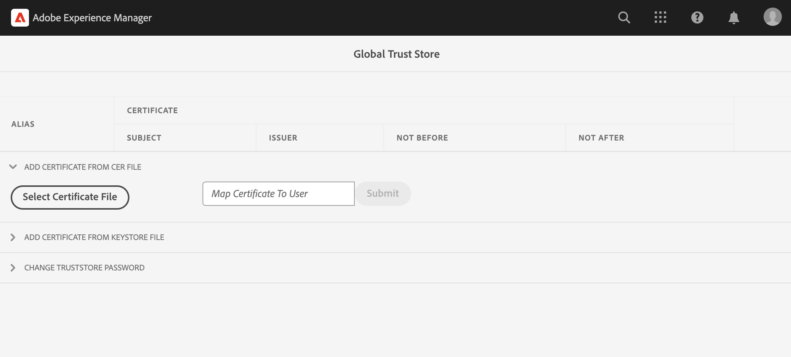

# Anropa interna API:er med privata certifikat

Lär dig hur du gör HTTPS-anrop från AEM till webb-API:er med privata eller självsignerade certifikat.

>[!VIDEO](https://video.tv.adobe.com/v/3424853?quality=12&learn=on)

Som standard misslyckas anslutningen när du försöker skapa en HTTPS-anslutning till ett webb-API som använder ett självsignerat certifikat. Fel:

```
PKIX path building failed: sun.security.provider.certpath.SunCertPathBuilderException: unable to find valid certification path to requested target
```

Det här problemet inträffar oftast när **API:ts SSL-certifikat har inte utfärdats av en erkänd certifikatutfärdare** och Java™-program kan inte validera SSL-/TLS-certifikat.

Lär dig hur du kan anropa API:er som har privata eller självsignerade certifikat med [Apache HttpClient](https://hc.apache.org/httpcomponents-client-4.5.x/index.html) och **AEM global TrustStore**.


## Prototypisk API-anropskod med HttpClient

Följande kod skapar en HTTPS-anslutning till ett webb-API:

```java
...
String API_ENDPOINT = "https://example.com";

// Create HttpClientBuilder
HttpClientBuilder httpClientBuilder = HttpClientBuilder.create();

// Create HttpClient
CloseableHttpClient httpClient = httpClientBuilder.build();

// Invoke API
CloseableHttpResponse closeableHttpResponse = httpClient.execute(new HttpGet(API_ENDPOINT));

// Code that reads response code and body from the 'closeableHttpResponse' object
...
```

Koden använder [Apache HttpComponent](https://hc.apache.org/)&#39;s [HttpClient](https://hc.apache.org/httpcomponents-client-4.5.x/index.html) biblioteksklasser och deras metoder.


## HttpClient och läsa in AEM TrustStore-material

Anropa en API-slutpunkt som har _privat eller självsignerat certifikat_, [HttpClient](https://hc.apache.org/httpcomponents-client-4.5.x/index.html)&#39;s `SSLContextBuilder` måste läsas in med AEM TrustStore och användas för att underlätta anslutningen.

Följ stegen nedan:

1. Logga in på **AEM** som **administratör**.
1. Navigera till **AEM Author > Tools > Security > Trust Store** och öppna **Global Trust Store**. Om du försöker komma åt den första gången anger du ett lösenord för Global Trust Store.

   

1. Importera ett privat certifikat genom att klicka på **Välj certifikatfil** och väljer önskad certifikatfil med `.cer` tillägg. Importera den genom att klicka **Skicka** -knappen.

1. Uppdatera Java™-kod enligt nedan. Observera att `@Reference` för att AEM `KeyStoreService` Den anropande koden måste vara en OSGi-komponent/tjänst eller en Sling-modell (och `@OsgiService` används där).

   ```java
   ...
   
   // Get AEM's KeyStoreService reference
   @Reference
   private com.adobe.granite.keystore.KeyStoreService keyStoreService;
   
   ...
   
   // Get AEM TrustStore using KeyStoreService
   KeyStore aemTrustStore = getAEMTrustStore(keyStoreService, resourceResolver);
   
   if (aemTrustStore != null) {
   
       // Create SSL Context
       SSLContextBuilder sslbuilder = new SSLContextBuilder();
   
       // Load AEM TrustStore material into above SSL Context
       sslbuilder.loadTrustMaterial(aemTrustStore, null);
   
       // Create SSL Connection Socket using above SSL Context
       SSLConnectionSocketFactory sslsf = new SSLConnectionSocketFactory(
               sslbuilder.build(), NoopHostnameVerifier.INSTANCE);
   
       // Create HttpClientBuilder
       HttpClientBuilder httpClientBuilder = HttpClientBuilder.create();
       httpClientBuilder.setSSLSocketFactory(sslsf);
   
       // Create HttpClient
       CloseableHttpClient httpClient = httpClientBuilder.build();
   
       // Invoke API
       closeableHttpResponse = httpClient.execute(new HttpGet(API_ENDPOINT));
   
       // Code that reads response code and body from the 'closeableHttpResponse' object
       ...
   } 
   
   /**
    * 
    * Returns the global AEM TrustStore
    * 
    * @param keyStoreService OOTB OSGi service that makes AEM based KeyStore
    *                         operations easy.
    * @param resourceResolver
    * @return
    */
   private KeyStore getAEMTrustStore(KeyStoreService keyStoreService, ResourceResolver resourceResolver) {
   
       // get AEM TrustStore from the KeyStoreService and ResourceResolver
       KeyStore aemTrustStore = keyStoreService.getTrustStore(resourceResolver);
   
       return aemTrustStore;
   }
   
   ...
   ```

   * Injicera OTB `com.adobe.granite.keystore.KeyStoreService` OSGi-tjänst i OSGi-komponenten.
   * Hämta den globala AEM TrustStore med `KeyStoreService` och `ResourceResolver`, `getAEMTrustStore(...)` metoden gör det.
   * Skapa ett objekt av `SSLContextBuilder`, se Java™ [API-information](https://javadoc.io/static/org.apache.httpcomponents/httpcore/4.4.8/index.html?org/apache/http/ssl/SSLContextBuilder.html).
   * Läs in det globala AEM TrustStore i `SSLContextBuilder` använda `loadTrustMaterial(KeyStore truststore,TrustStrategy trustStrategy)` -metod.
   * Godkänd `null` for `TrustStrategy` i ovanstående metod säkerställer att endast AEM betrodda certifikat lyckas under API-körning.


>[!CAUTION]
>
>API-anrop med giltiga CA-utfärdade certifikat misslyckas när de körs med den angivna metoden. Endast API-anrop med AEM betrodda certifikat kan lyckas när den här metoden används.
>
>Använd [standardmetod](#prototypical-api-invocation-code-using-httpclient) för att köra API-anrop av giltiga CA-utfärdade certifikat, vilket innebär att endast API:er som är kopplade till privata certifikat ska köras med den tidigare nämnda metoden.

## Undvik JVM-nyckelbehållarändringar

Ett vanligt tillvägagångssätt för att effektivt anropa interna API:er med privata certifikat är att ändra JVM-nyckelbehållaren. Detta uppnås genom att de privata certifikaten importeras med Java™ [nyckelverktyg](https://docs.oracle.com/en/java/javase/11/tools/keytool.html#GUID-5990A2E4-78E3-47B7-AE75-6D1826259549) -kommando.

Den här metoden är dock inte anpassad efter bästa säkerhetspraxis och AEM erbjuder ett överlägset alternativ genom att använda **Global Trust Store** och [KeyStoreService](https://javadoc.io/doc/com.adobe.aem/aem-sdk-api/latest/com/adobe/granite/keystore/KeyStoreService.html).


## Lösningspaket

Exempelprojektet Node.js som demonstreras i videon kan hämtas från [här](assets/internal-api-call/REST-APIs.zip).

Den AEM serletkoden finns i WKND Sites Project `tutorial/web-api-invocation` gren, [se](https://github.com/adobe/aem-guides-wknd/tree/tutorial/web-api-invocation/core/src/main/java/com/adobe/aem/guides/wknd/core/servlets).
