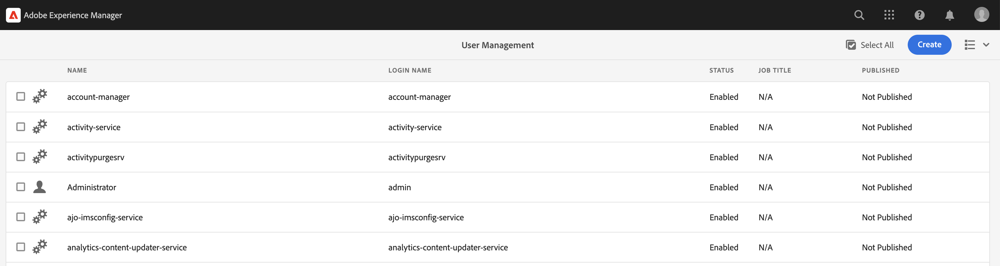
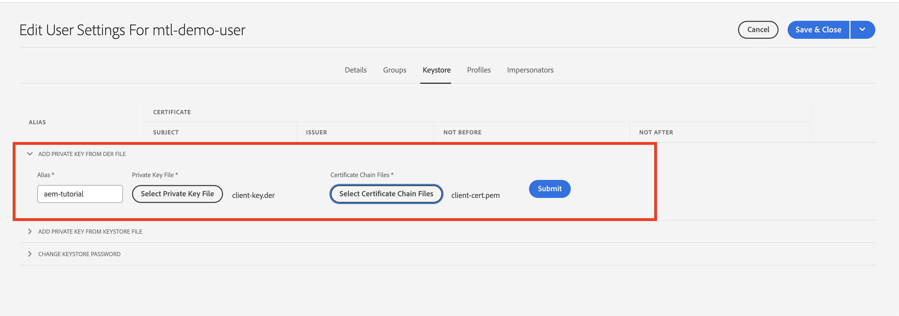
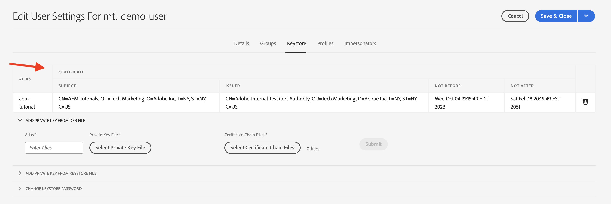

# mTLS-autentisering (Mutual Transport Layer Security) från AEM

Lär dig hur du gör HTTPS-anrop från AEM till webb-API:er som kräver mTLS-autentisering.

>[!VIDEO](https://video.tv.adobe.com/v/3424855?quality=12&learn=on)

mTLS eller tvåvägs TLS-autentisering förbättrar säkerheten för TLS-protokollet genom att kräva **både klienten och servern autentiserar varandra**. Autentiseringen görs med digitala certifikat. Det används ofta i scenarier där stark säkerhet och identitetsverifiering är avgörande.

Som standard misslyckas anslutningen när du försöker göra en HTTPS-anslutning till ett webb-API som kräver mTLS-autentisering. Följande fel uppstår:

```
javax.net.ssl.SSLHandshakeException: Received fatal alert: certificate_required
```

Det här problemet inträffar när klienten inte har något certifikat som kan autentiseras.

Lär dig hur du kan anropa API:er som kräver mTLS-autentisering med [Apache HttpClient](https://hc.apache.org/httpcomponents-client-4.5.x/index.html) och **AEM KeyStore och TrustStore**.


## HttpClient och läsa in AEM KeyStore-material

På en hög nivå krävs följande steg för att anropa ett mTLS-skyddat API från AEM.

### Generering av AEM

Begär AEM certifikat genom att samarbeta med din organisations säkerhetsteam. Säkerhetsteamet tillhandahåller eller frågar om certifikatrelaterade detaljer som nyckel, CSR (Certificate Signing Request) och använder CSR för att utfärda certifikatet.

Generera certifikatrelaterade detaljer som nyckel, CSR (Certificate Signing Request) för demonstrationssyften. I exemplet nedan används en självsignerad certifikatutfärdare för att utfärda certifikatet.

- Generera först det interna certifikatutfärdarcertifikatet (CA).

  ```shell
  # Create an internal Certification Authority (CA) certificate
  openssl req -new -x509 -days 9999 -keyout internal-ca-key.pem -out internal-ca-cert.pem
  ```

- Generera AEM.

  ```shell
  # Generate Key
  openssl genrsa -out client-key.pem
  
  # Generate CSR
  openssl req -new -key client-key.pem -out client-csr.pem
  
  # Generate certificate and sign with internal Certification Authority (CA)
  openssl x509 -req -days 9999 -in client-csr.pem -CA internal-ca-cert.pem -CAkey internal-ca-key.pem -CAcreateserial -out client-cert.pem
  
  # Verify certificate
  openssl verify -CAfile internal-ca-cert.pem client-cert.pem
  ```

- Konvertera den AEM privata nyckeln till DER-format, AEM KeyStore kräver den privata nyckeln i DER-format.

  ```shell
  openssl pkcs8 -topk8 -inform PEM -outform DER -in client-key.pem -out client-key.der -nocrypt
  ```

>[!TIP]
>
>De självsignerade CA-certifikaten används endast i utvecklingssyfte. För produktion använder du en betrodd certifikatutfärdare (CA) för att utfärda certifikatet.


### Certifikatutbyte

Om du använder en självsignerad certifikatutfärdare för AEM, som ovan, skickar du certifikatet eller det interna certifikatutfärdarcertifikatet till API-providern.

Om API-providern använder ett självsignerat certifikatutfärdarcertifikat tar du dessutom emot certifikatet eller det interna certifikatutfärdarcertifikatet från API-providern.

### Certifikatimport

Så här importerar du AEM certifikat:

1. Logga in på **AEM** som **administratör**.

1. Navigera till **AEM Författare > Verktyg > Dokumentskydd > Användare > Skapa eller välj en befintlig användare**.

   

   För demonstrationssyften: en ny användare med namnet `mtl-demo-user` skapas.

1. Öppna **Användaregenskaper** klickar du på användarnamnet.

1. Klicka **Nyckelbehållare** och sedan klicka på **Skapa nyckelbehållare** -knappen. Sedan i **Ange lösenord för KeyStore-åtkomst** anger du ett lösenord för användarens nyckelbehållare och klickar på Spara.

   

1. På den nya skärmen, under **LÄGG TILL PRIVAT NYCKEL FRÅN DER-FIL** följer du stegen nedan:

   1. Ange alias

   1. Importera den AEM privata nyckeln i DER-format som genereras ovan.

   1. Importera filerna för certifikatkedjan som genererats ovan.

   1. Klicka på Skicka

      

1. Kontrollera att certifikatet har importerats.

   

Om API-providern använder ett självsignerat CA-certifikat importerar du det mottagna certifikatet till AEM TrustStore, följer du stegen från [här](https://experienceleague.adobe.com/docs/experience-manager-learn/foundation/security/call-internal-apis-having-private-certificate.html#httpclient-and-load-aem-truststore-material).

Om AEM använder ett självsignerat CA-certifikat ber du API-providern att importera det.

### Prototypisk mTLS API-anropskod med HttpClient

Uppdatera Java™-kod enligt nedan. Används `@Reference` anteckning för att hämta AEM `KeyStoreService` den anropande koden måste vara en OSGi-komponent/tjänst eller en Sling-modell (och `@OsgiService` används där).


```java
...

// Get AEM's KeyStoreService reference
@Reference
private com.adobe.granite.keystore.KeyStoreService keyStoreService;

...

// Get AEM KeyStore using KeyStoreService
KeyStore aemKeyStore = getAEMKeyStore(keyStoreService, resourceResolver);

if (aemKeyStore != null) {

    // Create SSL Context
    SSLContextBuilder sslbuilder = new SSLContextBuilder();

    // Load AEM KeyStore material into above SSL Context with keystore password
    // Ideally password should be encrypted and stored in OSGi config
    sslbuilder.loadKeyMaterial(aemKeyStore, "admin".toCharArray());

    // If API provider cert is self-signed, load AEM TrustStore material into above SSL Context
    // Get AEM TrustStore
    KeyStore aemTrustStore = getAEMTrustStore(keyStoreService, resourceResolver);
    sslbuilder.loadTrustMaterial(aemTrustStore, null);

    // Create SSL Connection Socket using above SSL Context
    SSLConnectionSocketFactory sslsf = new SSLConnectionSocketFactory(
            sslbuilder.build(), NoopHostnameVerifier.INSTANCE);

    // Create HttpClientBuilder
    HttpClientBuilder httpClientBuilder = HttpClientBuilder.create();
    httpClientBuilder.setSSLSocketFactory(sslsf);

    // Create HttpClient
    CloseableHttpClient httpClient = httpClientBuilder.build();

    // Invoke API
    closeableHttpResponse = httpClient.execute(new HttpGet(MTLS_API_ENDPOINT));

    // Code that reads response code and body from the 'closeableHttpResponse' object
    ...
} 

/**
 * Returns the AEM KeyStore of a user. In this example we are using the
 * 'mtl-demo-user' user.
 * 
 * @param keyStoreService
 * @param resourceResolver
 * @return AEM KeyStore
 */
private KeyStore getAEMKeyStore(KeyStoreService keyStoreService, ResourceResolver resourceResolver) {

    // get AEM KeyStore of 'mtl-demo-user' user, you can create a user or use an existing one. 
    // Then create keystore and upload key, certificate files.
    KeyStore aemKeyStore = keyStoreService.getKeyStore(resourceResolver, "mtl-demo-user");

    return aemKeyStore;
}

/**
 * 
 * Returns the global AEM TrustStore
 * 
 * @param keyStoreService OOTB OSGi service that makes AEM based KeyStore
 *                         operations easy.
 * @param resourceResolver
 * @return
 */
private KeyStore getAEMTrustStore(KeyStoreService keyStoreService, ResourceResolver resourceResolver) {

    // get AEM TrustStore from the KeyStoreService and ResourceResolver
    KeyStore aemTrustStore = keyStoreService.getTrustStore(resourceResolver);

    return aemTrustStore;
}

...
```

- Injicera OTB `com.adobe.granite.keystore.KeyStoreService` OSGi-tjänst i OSGi-komponenten.
- Hämta användarens AEM KeyStore med `KeyStoreService` och `ResourceResolver`, `getAEMKeyStore(...)` metoden gör det.
- Om API-providern använder ett självsignerat CA-certifikat hämtar du det globala AEM TrustStore, `getAEMTrustStore(...)` metoden gör det.
- Skapa ett objekt av `SSLContextBuilder`, se Java™ [API-information](https://javadoc.io/static/org.apache.httpcomponents/httpcore/4.4.8/index.html?org/apache/http/ssl/SSLContextBuilder.html).
- Läs in användarens AEM KeyStore i `SSLContextBuilder` använda `loadKeyMaterial(final KeyStore keystore,final char[] keyPassword)` -metod.
- Lösenordet för nyckelbehållaren är det lösenord som angavs när nyckelbehållaren skapades. Det bör lagras i OSGi-konfigurationen, se [Värden för hemlig konfiguration](https://experienceleague.adobe.com/docs/experience-manager-cloud-service/content/implementing/deploying/configuring-osgi.html#secret-configuration-values).

## Undvik JVM-nyckelbehållarändringar

Ett vanligt tillvägagångssätt för att effektivt anropa mTLS API:er med privata certifikat är att ändra JVM Keystore. Detta uppnås genom att de privata certifikaten importeras med Java™ [nyckelverktyg](https://docs.oracle.com/en/java/javase/11/tools/keytool.html#GUID-5990A2E4-78E3-47B7-AE75-6D1826259549) -kommando.

Den här metoden är dock inte anpassad efter bästa säkerhetspraxis och AEM erbjuder ett överlägset alternativ genom att använda **Användarspecifik KeyStores och Global TrustStore** och [KeyStoreService](https://javadoc.io/doc/com.adobe.aem/aem-sdk-api/latest/com/adobe/granite/keystore/KeyStoreService.html).

## Lösningspaket

Exempelprojektet Node.js som demonstreras i videon kan hämtas från [här](assets/internal-api-call/REST-APIs.zip).

Den AEM serletkoden finns i WKND Sites Project `tutorial/web-api-invocation` gren, [se](https://github.com/adobe/aem-guides-wknd/tree/tutorial/web-api-invocation/core/src/main/java/com/adobe/aem/guides/wknd/core/servlets).
