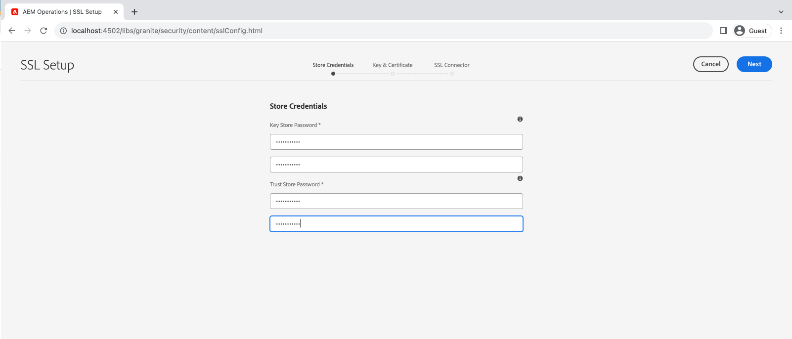
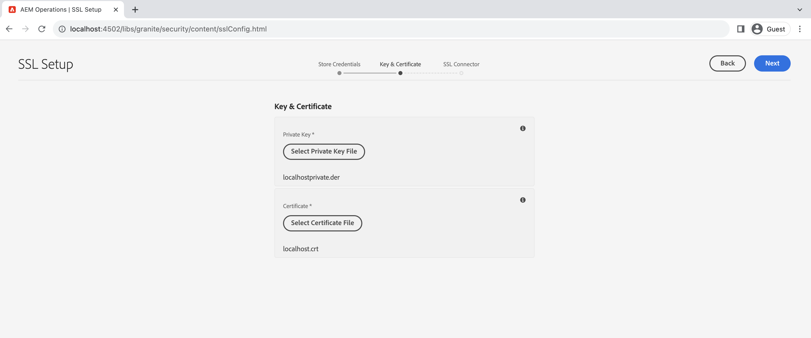
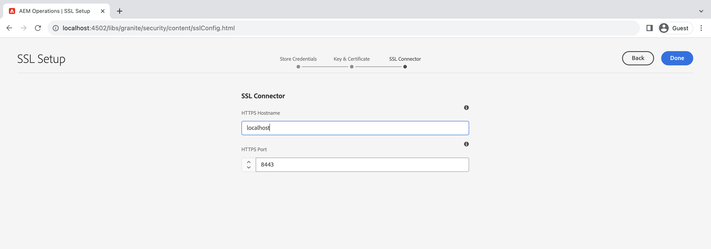
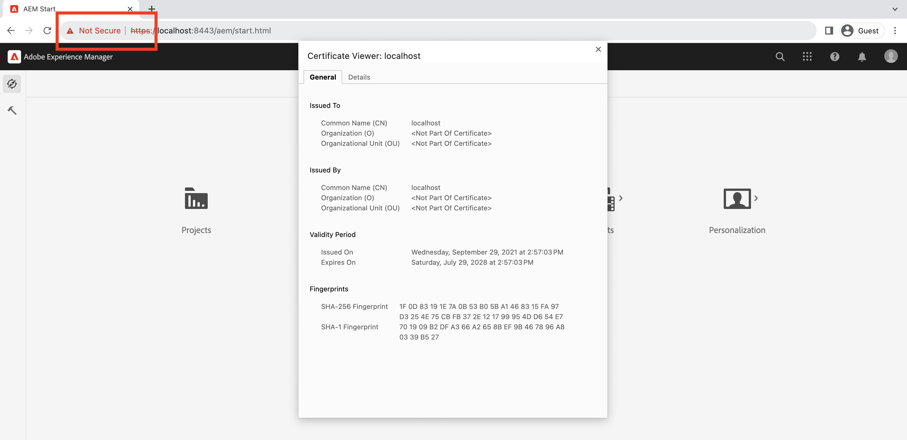

# Använda SSL-guiden i AEM

Lär dig hur du konfigurerar SSL i Adobe Experience Manager så att det körs över HTTPS med den inbyggda SSL-guiden.

>[!VIDEO](https://video.tv.adobe.com/v/17993?quality=12&learn=on)


>[!NOTE]
>
>I hanterade miljöer är det bäst för IT-avdelningen att tillhandahålla CA-tillförlitliga certifikat och nycklar.
>
>Självsignerade certifikat får endast användas i utvecklingssyfte.

## Använda SSL-konfigurationsguiden

Navigera till __AEM Author > Tools > Security > SSL Configuration__ och öppna __SSL-konfigurationsguide__.


### Skapa autentiseringsuppgifter för butik

Skapa en _Nyckelarkiv_ som är kopplade till `ssl-service` systemanvändare och en global _Trust Store_, använder du __Lagra autentiseringsuppgifter__ guidesteg.

1. Ange lösenordet och bekräfta lösenordet för __Nyckelarkiv__ som är kopplade till `ssl-service` systemanvändare.
1. Ange lösenordet och bekräfta lösenordet för den globala __Trust Store__. Observera att det är ett systemomfattande förtroendearkiv och om det redan har skapats ignoreras det angivna lösenordet.

   

### Överför privat nyckel och certifikat

Ladda upp _privat nyckel_ och _SSL-certifikat_, använder du __Nyckel och certifikat__ guidesteg.

Vanligtvis tillhandahåller din IT-avdelning det certifikatutfärdarbetrodda certifikatet och nyckeln, men självsignerade certifikat kan användas för __utveckling__ och __testning__ syften.

Information om hur du skapar eller hämtar det självsignerade certifikatet finns i [Självsignerad privat nyckel och certifikat](#self-signed-private-key-and-certificate).

1. Ladda upp __Privat nyckel__ i formatet DER (Distinguished Encoding Rules). Till skillnad från PEM innehåller DER-kodade filer inte vanliga textsatser som `-----BEGIN CERTIFICATE-----`
1. Överför associerade __SSL-certifikat__ i `.crt` format.

   

### Uppdatera SSL-anslutningsinformation

Uppdatera _värdnamn_ och _port_ använder __SSL-anslutning__ guidesteg.

1. Uppdatera eller verifiera __HTTPS-värdnamn__ värde, det ska matcha `Common Name (CN)` från certifikatet.
1. Uppdatera eller verifiera __HTTPS-port__ värde.

   

### Verifiera SSL-konfigurationen

1. Verifiera SSL genom att klicka på __Gå till HTTPS-URL__ -knappen.
1. Om du använder självsignerat certifikat visas `Your connection is not private` fel.

   

## Självsignerad privat nyckel och certifikat

Följande ZIP innehåller [!DNL DER] och [!DNL CRT] filer som krävs för att konfigurera AEM SSL lokalt och som endast är avsedda för lokal utveckling.

The [!DNL DER] och [!DNL CERT] filerna tillhandahålls av praktiska skäl och genereras enligt de steg som beskrivs i avsnittet Generera privat nyckel och Självsignerat certifikat nedan.

Om det behövs är certifikatets lösenfras **admin**.

Den här lokala värden - privat nyckel och självsignerat certifikat.zip (upphör att gälla i juli 2028)

[Hämta certifikatfilen](assets/use-the-ssl-wizard/certificate.zip)

### Skapa privata nycklar och självsignerade certifikat

I videon ovan visas konfigurationen och konfigurationen av SSL på en AEM författarinstans med självsignerade certifikat. Nedanstående kommandon använder [[!DNL OpenSSL]](https://www.openssl.org/) kan generera en privat nyckel och ett certifikat som ska användas i steg 2 i guiden.

```shell
### Create Private Key
$ openssl genrsa -aes256 -out localhostprivate.key 4096

### Generate Certificate Signing Request using private key
$ openssl req -sha256 -new -key localhostprivate.key -out localhost.csr -subj '/CN=localhost'

### Generate the SSL certificate and sign with the private key, will expire one year from now
$ openssl x509 -req -extfile <(printf "subjectAltName=DNS:localhost") -days 365 -in localhost.csr -signkey localhostprivate.key -out localhost.crt

### Convert Private Key to DER format - SSL wizard requires key to be in DER format
$ openssl pkcs8 -topk8 -inform PEM -outform DER -in localhostprivate.key -out localhostprivate.der -nocrypt
```
