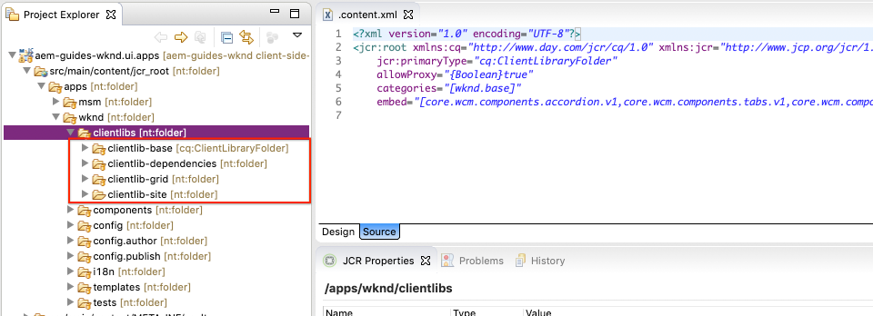
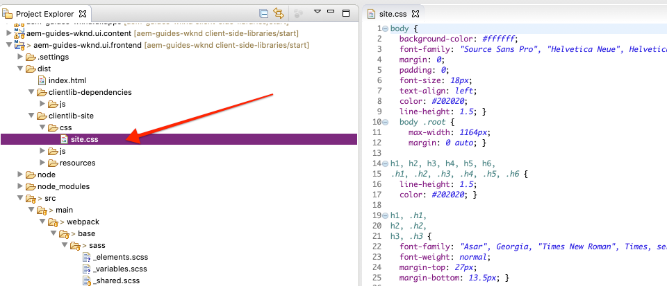

# Bibliotek på klientsidan och arbetsflöde på klientsidan {#client-side-libraries}

Lär dig hur bibliotek och klientbibliotek används för att distribuera och hantera CSS och JavaScript för en implementering av en Adobe Experience Manager (AEM) Sites. Den här självstudiekursen handlar också om hur modulen [ui.front](https://docs.adobe.com/content/help/en/experience-manager-core-components/using/developing/archetype/uifrontend.html) , ett frikopplat [webbpack](https://webpack.js.org/) -projekt, kan integreras i hela byggprocessen.

## Förutsättningar {#prerequisites}

Granska de verktyg och instruktioner som krävs för att konfigurera en [lokal utvecklingsmiljö](overview.md#local-dev-environment).

Vi rekommenderar också att du går igenom självstudiekursen [Komponentgrunder](component-basics.md#client-side-libraries) för att förstå grunderna i klientbibliotek och AEM.

### Startprojekt

Ta en titt på den baslinjekod som självstudiekursen bygger på:

1. Klona [github.com/adobe/aem-guides-wknd](https://github.com/adobe/aem-guides-wknd) .
1. Kolla in `client-side-libraries/start` grenen

   ```shell
   $ git clone git@github.com:adobe/aem-guides-wknd.git ~/code/aem-guides-wknd
   $ cd ~/code/aem-guides-wknd
   $ git checkout client-side-libraries/start
   ```

1. Distribuera kodbasen till en lokal AEM med dina Maven-kunskaper:

   ```shell
   $ cd ~/code/aem-guides-wknd
   $ mvn clean install -PautoInstallSinglePackage
   ```

Du kan alltid visa den färdiga koden på [GitHub](https://github.com/adobe/aem-guides-wknd/tree/client-side-libraries/solution) eller checka ut koden lokalt genom att växla till grenen `client-side-libraries/solution`.

## Syfte

1. Förstå hur klientbibliotek inkluderas på en sida via en redigerbar mall.
1. Lär dig hur du använder UI.FrontEnd-modulen och en webbpaketsutvecklingsserver för dedikerad front-end-utveckling.
1. Förstå hela arbetsflödet med att leverera kompilerad CSS och JavaScript till en implementering av webbplatser.

## Vad du ska bygga {#what-you-will-build}

I det här kapitlet ska du lägga till några baslinjeformat för WKND-webbplatsen och artikelsidmallen för att få implementeringen närmare [gränssnittets designmodeller](assets/pages-templates/wknd-article-design.xd). Du kommer att använda ett avancerat frontendarbetsflöde för att integrera ett webbpaketprojekt i ett AEM klientbibliotek.

>[!VIDEO](https://video.tv.adobe.com/v/30359/?quality=12&learn=on)

## Bakgrund {#background}

Med bibliotek på klientsidan kan du ordna och hantera CSS- och JavaScript-filer som behövs för en AEM Sites-implementering. De grundläggande målen för klientbibliotek och klientbibliotek är:

1. Lagra CSS/JS i små diskreta filer för enklare utveckling och underhåll
1. Hantera beroenden av ramverk från tredje part på ett organiserat sätt
1. Minimera antalet klientförfrågningar genom att sammanfoga CSS/JS till en eller två förfrågningar.

Mer information om hur du använder [klientbibliotek finns här.](https://docs.adobe.com/content/help/en/experience-manager-65/developing/introduction/clientlibs.html)

Klientbibliotek har vissa begränsningar. Det viktigaste är ett begränsat stöd för populära språk som Sass, LESS och TypeScript. I självstudiekursen ska vi titta på hur modulen **ui.front** kan bidra till att lösa detta.

Distribuera startkodsbasen till en lokal AEM och navigera till [http://localhost:4502/editor.html/content/wknd/us/en/magazine/guide-la-skateparks.html](http://localhost:4502/editor.html/content/wknd/us/en/magazine/guide-la-skateparks.html). Den här sidan är för närvarande inte formaterad. Vi kommer sedan att implementera bibliotek på klientsidan för WKND-varumärket för att lägga till CSS och Javascript på sidan.

## Biblioteksorganisation på klientsidan {#organization}

Därefter ska vi titta närmare på hur de klienter som genereras av [AEM Project Archetype är organiserade](https://docs.adobe.com/content/help/en/experience-manager-core-components/using/developing/archetype/overview.html).


*High level chart Biblioteksorganisation på klientsidan och sidinkludering*

>[!NOTE]
>
> Följande biblioteksorganisation på klientsidan genereras av AEM Project Archetype men representerar bara en startpunkt. Hur ett projekt slutligen hanterar och levererar CSS och Javascript till en webbplatsimplementering kan variera dramatiskt baserat på resurser, kompetens och krav.

1. Med Eclipse eller någon annan utvecklingsmiljö öppnas modulen **ui.apps** .
1. Expandera banan `/apps/wknd/clientlibs` för att visa de klienter som genereras av arkitypen.

   

   Vi kommer att undersöka dessa klienter mer ingående nedan.

1. Inspect egenskaperna för `clientlibs/clientlib-base`.

   **clientlib-base** representerar basnivån för CSS och JavaScript som behövs för att WKND-webbplatsen ska fungera. Observera egenskapen `categories` som är inställd på `wknd.base`. `categories` är en taggningsmekanism för clientlibs och det är så de kan refereras.

   Lägg märke till `embed` egenskapen och `String[]` värdena. Egenskapen bäddar `embed` in andra klientlibs baserat på deras kategori. **clientlib-base** kommer att innehålla alla AEM Core Component-klientbibliotek som behövs. Detta inkluderar artefakter som javascript för Carousel, komponenter för snabbsökning som ska fungera. **clientlib-base** kommer inte att innehålla egen CSS och Javascript, utan bara bädda in andra klientbibliotek. **clientlib-base** bäddar in clientlib- **grid** clientlib med kategorin `wknd.grid`.

   Observera att egenskapen `allowProxy` är inställd på `true`. Det är bäst att alltid använda `allowProxy=true` klientlibs. Egenskapen gör att vi kan lagra klientlibs med vår programkod under `allowProxy``/apps` men **sedan levererar klientlibs över en sökväg som prefix med** `/etc.clientlibs` för att undvika att visa programkod för slutanvändarna. Mer information om egenskapen [allowProxy finns här.](https://docs.adobe.com/content/help/en/experience-manager-65/developing/introduction/clientlibs.html#locating-a-client-library-folder-and-using-the-proxy-client-libraries-servlet).

1. Inspect egenskaperna för `clientlibs/clientlib-grid`.

   **clientlib-grid** ansvarar för att inkludera/generera den CSS som behövs för att [layoutläget](https://docs.adobe.com/content/help/en/experience-manager-65/authoring/siteandpage/responsive-layout.html) ska fungera med AEM Sites-redigeraren. **clientlib-grid** hade en kategori inställd på `wknd.grid` och är inbäddad via **clientlib-base**.

   Rutnätet kan anpassas så att olika mängder kolumner och brytpunkter används. Därefter uppdaterar vi standardbrytpunkterna som genereras.

1. Uppdatera filen `/apps/wknd/clientlibs/clientlib-grid/less/grid.less`:

   ```css
   @import (once) "/libs/wcm/foundation/clientlibs/grid/grid_base.less";
   
   /* maximum amount of grid cells to be provided */
   @max_col: 12;
   @screen-small: 767px;
   @screen-medium: 1024px;
   @screen-large: 1200px;
   @gutter-padding: 14px;
   
   /* default breakpoint */
   .aem-Grid {
       .generate-grid(default, @max_col);
   }
   
   /* phone breakpoint */
   @media (max-width: @screen-small) {
       .aem-Grid {
           .generate-grid(phone, @max_col);
       }
   }
   /* tablet breakpoint */
   @media (min-width: (@screen-small + 1)) and (max-width: @screen-medium) {
       .aem-Grid {
           .generate-grid(tablet, @max_col);
       }
   }
   
   .aem-GridColumn {
       padding: 0 @gutter-padding;
   }
   
   .responsivegrid.aem-GridColumn {
       padding-left: 0;
       padding-right: 0;
   }
   ```

   Detta ändrar brytpunkterna så att de motsvarar mallbrytpunkterna som angetts i `/ui.content/src/main/content/jcr_root/conf/wknd/settings/wcm/templates/article-page-template/structure/.content.xml`.

   Observera att den här filen faktiskt refererar till en `grid_base.less` fil `/libs` som innehåller en anpassad blandning för att generera stödrastret.

1. Inspect egenskaperna för `clientlibs/clientlib-site`.

   **clientlib-site** kommer att innehålla alla webbplatsspecifika format för WKND-varumärket. Notera kategorin för `wknd.site`. CSS och Javascript som genererar klientlib kommer i själva verket att behållas i `ui.frontend` modulen. Vi kommer att utforska den här integreringen härnäst.

1. Inspect egenskaperna för `clientlibs/clientlib-dependencies`.

   **clientlib-beroenden** är avsedda att bädda in tredjepartsberoenden. Det är ett separat klientlib så att det kan läsas in högst upp på HTML-sidan om det behövs. Notera kategorin för `wknd.dependencies`. CSS och Javascript som genererar klientlib kommer i själva verket att behållas i `ui.frontend` modulen. Vi kommer att utforska integreringen senare i självstudiekursen.

## Använda modulen ui.front {#ui-frontend}

Nu ska vi utforska användningen av modulen **[ui.front](https://docs.adobe.com/content/help/en/experience-manager-core-components/using/developing/archetype/uifrontend.html)** .

### Motivering

Bibliotek på klientsidan har vissa begränsningar när det gäller stöd för språk som [Sass](https://sass-lang.com/) eller [TypeScript](https://www.typescriptlang.org/). Det har också skett en explosion av verktyg med öppen källkod som [NPM](https://www.npmjs.com/) och [webbpack](https://webpack.js.org/) som snabbar upp och optimerar frontendutvecklingen.

Grundtanken bakom modulen **ui.front** är att kunna använda fantastiska verktyg som NPM och Webpack för att hantera större delen av frontendutvecklingen. En viktig integrationsbit som är inbyggd i modulen **ui.front** , [aem-clientlib-generator](https://github.com/wcm-io-frontend/aem-clientlib-generator) , tar kompilerade CSS- och JS-artefakter från ett webpack/npm-projekt och omvandlar dem till AEM klientbibliotek. Detta ger en utvecklare större frihet att välja olika verktyg och tekniker.


### Användning

Nu ska vi lägga till några grundformat för WKND-varumärket genom att lägga till några Sass-filer (tillägg`.scss` ) via **modulen ui.front** .

1. Öppna modulen **ui.front** och navigera till `src/main/webpack/base/sass`.

   

1. Skapa en ny fil med namnet `_variables.scss` under mappen `src/main/webpack/base/sass`.
1. Fyll `_variables.scss` med följande:

   ```scss
   //== Colors
   //
   //## Gray and brand colors for use across theme.
   
   $black:                  #202020;
   $gray:                   #696969;
   $gray-light:             #EBEBEB;
   $gray-lighter:           #F7F7F7;
   $white:                  #ffffff;
   $yellow:                 #FFE900;
   $blue:                   #0045FF;
   $pink:                   #FF0058;
   
   $brand-primary:           $yellow;
   
   //== Layout
   $gutter-padding: 14px;
   $max-width: 1164px;
   $max-body-width: 1680px;
   $screen-xsmall: 475px;
   $screen-small: 767px;
   $screen-medium: 1024px;
   $screen-large: 1200px;
   
   //== Scaffolding
   //
   //## Settings for some of the most global styles.
   $body-bg:                   $white;
   $text-color:                $black;
   $text-color-inverse:        $gray-light;
   
   $brand-secondary:           $black;
   
   $brand-third:               $gray-light;
   $link-color:                $blue;
   $link-hover-color:          $link-color;
   $link-hover-decoration:     underline;
   $nav-link:                  $black;
   $nav-link-inverse:          $gray-light;
   
   //== Typography
   //
   //## Font, line-height, and color for body text, headings, and more.
   
   $font-family-sans-serif:  "Source Sans Pro", "Helvetica Neue", Helvetica, Arial, sans-serif;
   $font-family-serif:       "Asar",Georgia, "Times New Roman", Times, serif;
   $font-family-base:        $font-family-sans-serif;
   
   $font-size-base:          18px;
   $font-size-large:         24px;
   $font-size-xlarge:        48px;
   $font-size-medium:        18px;
   $font-size-small:         14px;
   $font-size-xsmall:        12px;
   
   $font-size-h1:            40px;
   $font-size-h2:            36px;
   $font-size-h3:            24px;
   $font-size-h4:            16px;
   $font-size-h5:            14px;
   $font-size-h6:            10px;
   
   $line-height-base:        1.5;
   $line-height-computed:    floor(($font-size-base * $line-height-base)); // ~20px
   
   $font-weight-light:      300;
   $font-weight-normal:     normal;
   $font-weight-semi-bold:  400;
   $font-weight-bold:       600;
   ```

   Med Sass kan vi skapa variabler som sedan kan användas i olika filer för att säkerställa konsekvens. Lägg märke till teckensnittsfamiljer. Senare i självstudiekursen kommer vi att se hur vi kan ringa Googles webbteckensnitt för att använda dessa teckensnitt.

1. Skapa en annan fil med namnet `_elements.scss` under `src/main/webpack/base/sass` och fyll i den med följande:

   ```scss
   body {
       background-color: $body-bg;
       font-family: $font-family-base;
       margin: 0;
       padding: 0;
       font-size: $font-size-base;
       text-align: left;
       color: $text-color;
       line-height: $line-height-base;
   
       .root {
           max-width: $max-width;
           margin: 0 auto;
       }
   }
   
   // Headings
   // -------------------------
   
   h1, h2, h3, h4, h5, h6,
   .h1, .h2, .h3, .h4, .h5, .h6 {
       line-height: $line-height-base;
       color: $text-color;
   }
   
   h1, .h1,
   h2, .h2,
   h3, .h3 {
       font-family: $font-family-serif;
       font-weight: $font-weight-normal;
       margin-top: $line-height-computed;
       margin-bottom: ($line-height-computed / 2);
   }
   
   h4, .h4,
   h5, .h5,
   h6, .h6 {
       font-family: $font-family-sans-serif;
       text-transform: uppercase;
       font-weight: $font-weight-bold;
   }
   
   h1, .h1 { font-size: $font-size-h1; }
   h2, .h2 { font-size: $font-size-h2; }
   h3, .h3 { font-size: $font-size-h3; }
   h4, .h4 { font-size: $font-size-h4; }
   h5, .h5 { font-size: $font-size-h5; }
   h6, .h6 { font-size: $font-size-h6; }
   
   a {
       color: $link-color;
       text-decoration: none;
   }
   
   h1 a, h2 a, h3 a {
       color: $pink; /* for wednesdays :-) */
   }
   
   // Body text
   // -------------------------
   
   p {
       margin: 0 0 ($line-height-computed / 2);
       font-size: $font-size-base;
       line-height: $line-height-base + 1;
       text-align: justify;
   }
   ```

   Observera att variabelerna i filen används i `_elements.scss` filen `_variables.scss`.

1. Uppdatera `_shared.scss` under `src/main/webpack/base/sass` för att inkludera `_elements.scss` och `_variables.scss` filer.

   ```css
   @import './variables';
   @import './elements';
   ```

1. Öppna en kommandoradsterminal och installera modulen **ui.front** med hjälp av `npm install` kommandot:

   ```shell
   $ cd ~/code/aem-guides-wknd/ui.frontend
   $ npm install
   ```

   >[!NOTE]
   >
   >`npm install` behöver bara köras en gång efter en ny klon eller generering av projektet.

1. Skapa och distribuera modulen **ui.front** i samma terminal med `npm run dev` kommandot:

   ```shell
   $ npm run dev
   ...
   Entrypoint site = clientlib-site/css/site.css clientlib-site/js/site.js
   Entrypoint dependencies = clientlib-dependencies/js/dependencies.js
   start aem-clientlib-generator
   ...
   copy: dist/clientlib-site/css/site.css ../ui.apps/src/main/content/jcr_root/apps/wknd/clientlibs/clientlib-site/css/site.css
   ```

   Kommandot `npm run dev` bör skapa och kompilera källkoden för Webpack-projektet och slutligen fylla i **clientlib-site** och **clientlib-beroenden** i modulen **ui.apps** .

   >[!NOTE]
   >
   >Det finns också en `npm run prod` profil som miniatyrbilderna JS och CSS. Detta är standardkompileringen när webbpaketsbygget utlöses via Maven. Mer information om modulen [ui.front finns här](https://docs.adobe.com/content/help/en/experience-manager-core-components/using/developing/archetype/uifrontend.html).

1. Inspect filen `site.css` under `ui.frontend/dist/clientlib-site/css/site.css`. Observera att CSS oftast består av innehåll i den `_elements.scss` fil som skapades tidigare, men att variablerna har ersatts med faktiska värden.

   

1. Inspect filen `ui.frontend/clientlib.config.js`. Detta är konfigurationsfilen för ett npm-plugin, [aem-clientlib-generator](https://github.com/wcm-io-frontend/aem-clientlib-generator). **aem-clientlib-generator** är det verktyg som omformar den kompilerade CSS/JavaScript och kopierar den till **modulen ui.apps** .

1. Inspect filen `site.css` i modulen **ui.apps** på `ui.apps/src/main/content/jcr_root/apps/wknd/clientlibs/clientlib-site/css/site.css`. Detta bör vara en identisk kopia av `site.css` filen från modulen **ui.front** . Nu när den finns i modulen **ui.apps** kan den distribueras till AEM.

   

   >[!NOTE]
   >
   > Eftersom **clientlib-site** kompileras under byggtiden, med antingen **npm** eller **maven**, kan den i själva verket ignoreras från källkontrollen i modulen **ui.apps** . Inspect filen `.gitignore` under **ui.apps**.

>[!CAUTION]
>
> Användning av modulen **ui.front** kanske inte är nödvändig för alla projekt. Modulen **ui.front** lägger till ytterligare komplexitet och om det inte finns något behov/behov av att använda några av dessa avancerade verktyg (Sass, webpack, npm...) kan det vara överdrivet. Därför betraktas den som en valfri del av AEM Project Archetype och användningen av standardbibliotek på klientsidan samt vanilj-CSS och JavaScript fortsätter att ha fullt stöd.

## Inkludering av sidor och mallar {#page-inclusion}

Därefter ska vi granska hur projektet är konfigurerat för att inkludera klientlibs i AEM mallar/sidor. Ett vanligt tillvägagångssätt vid webbutveckling är att inkludera CSS i HTML-huvudet `<head>` och JavaScript precis innan du stänger `</body>` -taggen.

1. Navigera till modulen **ui.apps** `ui.apps/src/main/content/jcr_root/apps/wknd/components/structure/page`.

   

   Detta är den `page` komponent som används för att återge alla sidor i WKND-implementeringen.

1. Open the file `customheaderlibs.html`. Lägg märke till raderna `${clientlib.css @ categories='wknd.base'}`. Detta anger att CSS för klienten med en kategori av `wknd.base` inkluderas via den här filen, vilket effektivt inkluderar **klientlib-base** i sidhuvudet på alla våra sidor.

1. Uppdatera så `customheaderlibs.html` att du inkluderar en referens till Google-teckensnittsformat som vi angav tidigare i modulen **ui.front** . Vi kommer också att kommentera ut ContextHub för tillfället..

   ```html
   <link href="//fonts.googleapis.com/css?family=Source+Sans+Pro:400,600|Asar&display=swap" rel="stylesheet">
   <sly data-sly-use.clientLib="/libs/granite/sightly/templates/clientlib.html"
    data-sly-call="${clientlib.css @ categories='wknd.base'}"/>
   
   <!--/* Include Context Hub
   <sly data-sly-resource="${'contexthub' @ resourceType='granite/contexthub/components/contexthub'}"/>
   */-->
   ```

1. Inspect filen `customfooterlibs.html`. Den här filen ska skrivas över av implementeringsprojekt, precis som `customheaderlibs.html` i. Här `${clientlib.js @ categories='wknd.base'}` innebär raden att JavaScript från **clientlib-base** kommer att inkluderas längst ned på alla våra sidor.

1. Bygg och distribuera projektet till en lokal AEM med Maven:

   ```shell
   $ cd ~/code/aem-guides-wknd
   $ mvn clean install -PautoInstallSinglePackage
   ```

1. Bläddra till WKND-mallar på [http://localhost:4502/libs/wcm/core/content/sites/templates.html/conf/wknd](http://localhost:4502/libs/wcm/core/content/sites/templates.html/conf/wknd).

1. Markera och öppna **artikelsidmallen** i mallredigeraren.

   

1. Klicka på ikonen **Sidinformation** och välj **Sidprofil** på menyn för att öppna dialogrutan **Sidprofil** .

   

   *Sidinformation > Sidprofil*

1. Observera att kategorierna för `wknd.dependencies` och `wknd.site` listas här. Som standard delas klienten som konfigurerats via sidprincipen upp så att CSS inkluderas i sidhuvudet och JavaScript i brödtexten. Om du vill kan du explicit ange att clientlib JavaScript ska läsas in i sidhuvudet. Detta är fallet för `wknd.dependencies`.

   

   >[!NOTE]
   >
   > Det går också att referera till `wknd.site` eller `wknd.dependencies` från sidkomponenten direkt, med hjälp av `customheaderlibs.html` - eller `customfooterlibs.html` -skriptet, som vi såg tidigare för `wknd.base` clientlib. Mallen ger viss flexibilitet så att du kan välja vilka klipp som ska användas per mall. Om du t.ex. har ett mycket stort JavaScript-bibliotek som bara ska användas på en vald mall.

1. Navigera till sidan **LA-skateparker** som skapats med **artikelsidmallen**: [http://localhost:4502/editor.html/content/wknd/us/en/magazine/guide-la-skateparks.html](http://localhost:4502/editor.html/content/wknd/us/en/magazine/guide-la-skateparks.html). Du bör se en skillnad i teckensnitt och vissa grundläggande format som används för att ange att CSS som skapats i modulen **ui.front** fungerar.

1. Klicka på ikonen **Sidinformation** och välj sedan **Visa som publicerad** på menyn för att öppna artikelsidan utanför AEM redigerare.

   

1. Visa sidkällan för [http://localhost:4502/content/wknd/us/en/magazine/guide-la-skateparks.html?wcmmode=disabled](http://localhost:4502/content/wknd/us/en/magazine/guide-la-skateparks.html?wcmmode=disabled) och du bör kunna se följande klientlib-referenser i `<head>`:

   ```html
   <head>
   ...
   <link rel="stylesheet" href="/etc.clientlibs/wknd/clientlibs/clientlib-base.css" type="text/css">
   <script type="text/javascript" src="/etc.clientlibs/wknd/clientlibs/clientlib-dependencies.js"></script>
   <link rel="stylesheet" href="/etc.clientlibs/wknd/clientlibs/clientlib-dependencies.css" type="text/css">
   <link rel="stylesheet" href="/etc.clientlibs/wknd/clientlibs/clientlib-site.css" type="text/css">
   ...
   </head>
   ```

   Observera att klientlibs använder `/etc.clientlibs` proxyslutpunkten. Du bör även se följande klickbara objekt längst ned på sidan:

   ```html
   ...
   <script type="text/javascript" src="/etc.clientlibs/wknd/clientlibs/clientlib-site.js"></script>
   <script type="text/javascript" src="/etc.clientlibs/wknd/clientlibs/clientlib-base.js"></script>
   ...
   </body>
   ```

   >[!WARNING]
   >
   >På publiceringssidan är det viktigt att klientbiblioteken **inte** hanteras från **/appar** eftersom sökvägen bör begränsas av säkerhetsskäl med hjälp av filteravsnittet [](https://docs.adobe.com/content/help/en/experience-manager-dispatcher/using/configuring/dispatcher-configuration.html#example-filter-section)Dispatcher. Egenskapen [](https://docs.adobe.com/content/help/en/experience-manager-65/developing/introduction/clientlibs.html#locating-a-client-library-folder-and-using-the-proxy-client-libraries-servlet) allowProxy i klientbiblioteket ser till att CSS och JS hanteras från **/etc.clientlibs**.

## Webpack DevServer {#webpack-dev-server}

Under de föregående övningarna kunde vi uppdatera flera Sass-filer i modulen **ui.front** och genom en byggprocess slutligen se dessa ändringar återspeglas i AEM. Därefter ska vi använda en [webpack-dev-server](https://webpack.js.org/configuration/dev-server/) för att snabbt utveckla våra front end-format.

>[!VIDEO](https://video.tv.adobe.com/v/30352/?quality=12&learn=on)

Nedan visas de högnivåsteg som visas i videon:

1. Starta webbpaketets dev-server genom att köra följande kommando i modulen **ui.front** :

   ```shell
   $ cd ~/code/aem-guides-wknd/ui.frontend/
   $ npm start
   
   > aem-maven-archetype@1.0.0 start code/aem-guides-wknd/ui.frontend
   > webpack-dev-server --open --config ./webpack.dev.js
   ```

1. Då öppnas ett nytt webbläsarfönster på [http://localhost:8080/](http://localhost:8080/) med statisk kod.
1. Kopiera sidkällan för LA-skateparartikelsidan på [http://localhost:4502/content/wknd/us/en/magazine/guide-la-skateparks.html?wcmmode=disabled](http://localhost:4502/content/wknd/us/en/magazine/guide-la-skateparks.html?wcmmode=disabled).
1. Klistra in den kopierade markeringen från AEM i `index.html` modulen **ui.front** under `src/main/webpack/static`.
1. Redigera den kopierade koden och ta bort alla referenser till **clientlib-site** och **clientlib-beroenden**:

   ```html
   <!-- remove -->
   <script type="text/javascript" src="/etc.clientlibs/wknd/clientlibs/clientlib-dependencies.js"></script>
   <link rel="stylesheet" href="/etc.clientlibs/wknd/clientlibs/clientlib-dependencies.css" type="text/css">
   <link rel="stylesheet" href="/etc.clientlibs/wknd/clientlibs/clientlib-site.css" type="text/css">
   ...
   <script type="text/javascript" src="/etc.clientlibs/wknd/clientlibs/clientlib-site.js"></script>
   ```

   Vi kan ta bort dessa referenser eftersom webbpaketets dev-server genererar dessa artefakter automatiskt.

1. Redigera `.scss` filerna och se ändringarna automatiskt i webbläsaren.
1. Granska `/aem-guides-wknd.ui.frontend/webpack.dev.js` filen. Detta innehåller webbpaketskonfigurationen som används för att starta webbpack-dev-servern. Observera att sökvägarna `/content` och `/etc.clientlibs` en instans av AEM som körs lokalt visas som utkast. Så här blir bilderna och andra klientlibs (som inte hanteras av **ui.front** -koden) tillgängliga.

   >[!CAUTION]
   >
   > Den statiska markeringens bildresurs pekar på en aktiv bildkomponent i en lokal AEM. Bilderna kommer att visas som brutna om sökvägen till bilden ändras, om AEM inte startas eller om webbläsaren inte har loggat in i den lokala AEM.
1. Du kan **stoppa** webbpaketservern från kommandoraden genom att skriva `CTRL+C`.

## Sammanfoga {#putting-it-together}

Fokus på den här självstudiekursen ligger på bibliotek på klientsidan och potentiella arbetsflöden som kan integreras med AEM. Med detta i åtanke kommer vi att påskynda implementeringen genom att installera [client-side-libraries-final-styles.zip](assets/client-side-libraries/client-side-libraries-final-styles.zip), som innehåller vissa standardformat för Core-komponenter som används i artikelsidmallen:

* [Breadcrumb](https://docs.adobe.com/content/help/en/experience-manager-core-components/using/components/breadcrumb.html)
* [Hämta](https://docs.adobe.com/content/help/en/experience-manager-core-components/using/components/download.html)
* [Bild](https://docs.adobe.com/content/help/en/experience-manager-core-components/using/components/image.html)
* [Lista](https://docs.adobe.com/content/help/en/experience-manager-core-components/using/components/list.html)
* [Navigering](https://docs.adobe.com/content/help/en/experience-manager-core-components/using/components/navigation.html)
* [Snabbsökning](https://docs.adobe.com/content/help/en/experience-manager-core-components/using/components/quick-search.html)
* [Avgränsare](https://docs.adobe.com/content/help/en/experience-manager-core-components/using/components/separator.html)

>[!VIDEO](https://video.tv.adobe.com/v/30351/?quality=12&learn=on)

Nedan visas de högnivåsteg som visas i videon:

1. Ladda ned [client-side-libraries-final-styles.zip](assets/client-side-libraries/client-side-libraries-final-styles.zip) och zippa upp innehållet under `ui.frontend/src/main/webpack`. Innehållet i zip-filen ska skriva över följande mappar:

   ```plain
   /src/main/webpack
            /base
            /components
            /resources
   ```

1. Förhandsgranska de nya formaten med hjälp av webbpaketets dev-server:

   ```shell
    $ cd ~/code/aem-guides-wknd/ui.frontend/
    $ npm start
   
    > aem-maven-archetype@1.0.0 start code/aem-guides-wknd/ui.frontend
    > webpack-dev-server --open --config ./webpack.dev.js
   ```

1. Distribuera kodbasen till en lokal AEM för att se de nya formaten som används i LA-skateparartikeln:

   ```shell
    $ cd ~/code/aem-guides-wknd
    $ mvn -PautoInstallSinglePackage clean install
   ```

## Grattis! {#congratulations}

Grattis! Artikelsidan har nu några konsekventa format som matchar WKND-varumärket och du har blivit bekant med **ui.front** -modulen!

### Nästa steg {#next-steps}

Lär dig hur du implementerar enskilda format och återanvänder kärnkomponenter med Experience Manager Style System. [Utveckla med Style System](style-system.md) omfattar användning av Style System för att utöka grundkomponenterna med varumärkesspecifik CSS och avancerade principkonfigurationer i Template Editor.

Visa den färdiga koden på [GitHub](https://github.com/adobe/aem-guides-wknd) eller granska och distribuera koden lokalt på Git-grenen `client-side-libraries/solution`.

1. Klona [github.com/adobe/aem-wknd-guides](https://github.com/adobe/aem-guides-wknd) .
1. Kolla in `client-side-libraries/solution` grenen.

## Ytterligare verktyg och resurser {#additional-resources}

### aemfed {#develop-aemfed}

[**aemfed**](https://aemfed.io/) är ett kommandoradsverktyg med öppen källkod som kan användas för att snabba upp frontendutvecklingen. Den drivs av [aemsync](https://www.npmjs.com/package/aemsync), [Browsersync](https://www.npmjs.com/package/browser-sync) och [Sling Log Tracer](https://sling.apache.org/documentation/bundles/log-tracers.html).

På en hög nivå är den **inmatade** funktionen utformad för att lyssna på filändringar i modulen **ui.apps** och synkroniserar dem automatiskt direkt till en AEM som körs. Baserat på ändringarna uppdateras en lokal webbläsare automatiskt, vilket snabbar upp framtagningen. Den är även utformad för att fungera med Sling Log Tracer för att automatiskt visa eventuella serverfel direkt i terminalen.

Om du gör mycket arbete i modulen **ui.apps** , ändrar HTML-skript och skapar anpassade komponenter **kan emfed** vara ett mycket kraftfullt verktyg att använda. [Fullständig dokumentation finns här.](https://github.com/abmaonline/aemfed).

### Felsöka bibliotek på klientsidan {#debugging-clientlibs}

Med olika metoder för **kategorier** och **inbäddning** för att inkludera flera klientbibliotek kan det vara besvärligt att felsöka. AEM visar flera verktyg som kan hjälpa dig med detta. Ett av de viktigaste verktygen är **Återskapa klientbibliotek** som tvingar AEM att kompilera om LESS-filer och generera CSS.

* [**Dumpa libs**](http://localhost:4502/libs/granite/ui/content/dumplibs.html) - Visar en lista över alla klientbibliotek som registrerats i AEM. `<host>/libs/granite/ui/content/dumplibs.html`

* [**Testa utdata**](http://localhost:4502/libs/granite/ui/content/dumplibs.test.html) - gör att en användare kan se förväntade HTML-utdata från clientlib includes baserat på kategori. `<host>/libs/granite/ui/content/dumplibs.test.html`

* [**Validering**](http://localhost:4502/libs/granite/ui/content/dumplibs.validate.html) av biblioteksberoenden - markerar beroenden eller inbäddade kategorier som inte kan hittas. `<host>/libs/granite/ui/content/dumplibs.validate.html`

* [**Återskapa klientbibliotek**](http://localhost:4502/libs/granite/ui/content/dumplibs.rebuild.html) - gör att en användare kan tvinga AEM att återskapa alla klientbibliotek eller göra cachen i klientbiblioteken ogiltig. Det här verktyget är särskilt effektivt när du utvecklar med LESS eftersom det kan tvinga AEM att kompilera om den genererade CSS-koden. I allmänhet är det effektivare att validera cacheminnen och sedan utföra en siduppdatering jämfört med att återskapa alla bibliotek. `<host>/libs/granite/ui/content/dumplibs.rebuild.html`


