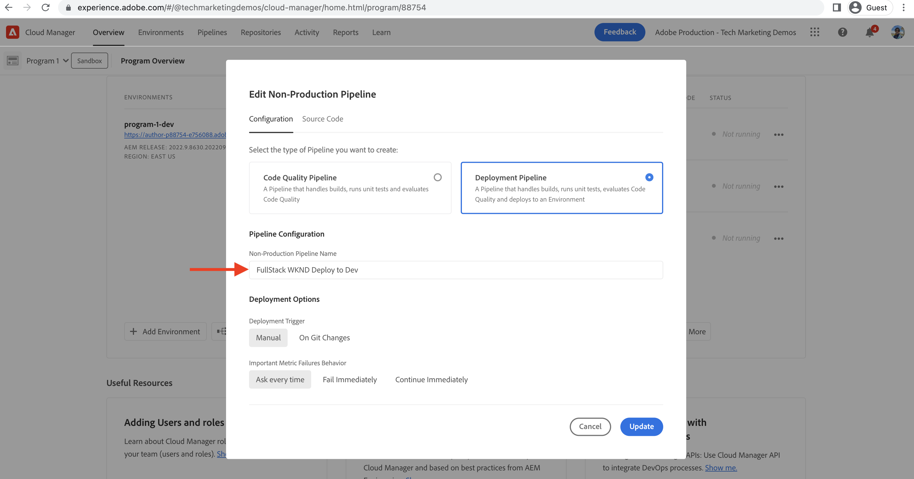

# Distribuera via pipeline i frontend-läget

I det här kapitlet skapar och kör vi en frontpipeline i Adobe Cloud Manager. Den skapar bara filer från modulen `ui.frontend` och distribuerar dem till det inbyggda CDN-numret i AEM as a Cloud Service. På så sätt flyttas bort från den `/etc.clientlibs`-baserade leveransen av frontendresurser.

## Mål {#objectives}

* Skapa och kör en frontendpipeline.
* Verifiera att serverresurser INTE levereras från `/etc.clientlibs` utan från ett nytt värdnamn som börjar med `https://static-`

## Använda den främre rörledningen

>[!VIDEO](https://video.tv.adobe.com/v/3409420?quality=12&learn=on)

## Förutsättningar {#prerequisites}

Det här är en självstudiekurs i flera delar och det antas att de steg som beskrivs i [Uppdatera AEM-standardprojekt](./update-project.md) har slutförts.

Kontrollera att du har [behörighet att skapa och distribuera pipelines i Cloud Manager](https://experienceleague.adobe.com/docs/experience-manager-cloud-manager/content/requirements/users-and-roles.html?lang=sv-SE#role-definitions) och [åtkomst till en AEM as a Cloud Service-miljö](https://experienceleague.adobe.com/docs/experience-manager-cloud-service/content/implementing/using-cloud-manager/manage-environments.html?lang=sv-SE).

## Byt namn på befintlig pipeline

Byt namn på den befintliga pipelinen från __Distribuera till Dev__ till __FullStack WKND-distribuera till Dev__ genom att gå till fältet __Konfiguration__ på fliken __Icke-produktionsförlopp__. Detta för att tydligt ange om en pipeline är en hel hög eller en front-end genom att bara titta på dess namn.

Se även till att fälten Databas och Git Branch är korrekta på fliken __Source-kod__ och att grenen har sina front end-pipeline-kontrakt ändrade.

## Skapa en pipeline för säljprojektet

Utför följande steg för att __ENDAST__ skapa och distribuera frontendresurserna från modulen `ui.frontend`:

1. I Cloud Manager-användargränssnittet klickar du på __Lägg till__ i avsnittet __Pipeliner__ och väljer sedan __Lägg till icke-Production Pipeline__ (eller __Lägg till produktionspipeline__) baserat på den AEM as a Cloud Service-miljö som du vill distribuera till.

1. I dialogrutan __Lägg till icke-produktionsförlopp__, som en del av __konfigurationen__ , väljer du alternativet __Distributionsförlopp__, ger den namnet __FrontEnd WKND-distribution till Dev__ och klickar på __Fortsätt__

1. Som en del av __Source Code__ -stegen väljer du alternativet __Front End Code__ och väljer miljö från __Berättigade distributionsmiljöer__. I avsnittet __Source-kod__ kontrollerar du att fälten Databas och Git Branch har korrekta värden och att grenen har ditt avtal för pipeline för frontend-leverans har ändrats.
Och __viktigast__ för fältet __Kodplats__ är värdet `/ui.frontend` och slutligen klickar du på __Spara__.

## Distributionssekvens

* Kör först den nyligen namnändrade __FullStack WKND-distributionen till AVD__-pipelinen för att ta bort WKND-klientfilerna från AEM-databasen. Och viktigast av allt är att förbereda AEM för det rörliga slutavtalet genom att lägga till __Sling config__-filer (`SiteConfig`, `HtmlPageItemsConfig`).

>[!WARNING]
>
>Efter slutförandet av pipeline-funktionen __FullStack WKND Deploy to Dev__ får du en __WKND-plats som inte har formaterats__ som kan se bruten ut. Planera ett driftstopp eller en driftsättning under udda timmar. Detta är en engångsstörning som du måste planera för under den initiala övergången från att använda en enda pipeline i full hög till den främre pipelinen.

* Kör slutligen __FrontEnd WKND Deploy to Dev__ för att endast bygga `ui.frontend`-modulen och distribuera frontendresurserna direkt till CDN.

>[!IMPORTANT]
>
>Du märker att WKND-webbplatsen __unstyled__ återgår till det normala och att körningen av __FrontEnd__-pipelinen var mycket snabbare än i helstackspipelinen.

## Verifiera formatändringar och nya leveranssätt

* Öppna WKND-platsens alla sidor så ser du textfärgen som __Adobe Red__ och frontend-resursfilerna (CSS, JS) levereras från CDN. Värdnamnet för resursbegäran börjar med `https://static-pXX-eYY.p123-e456.adobeaemcloud.com/$HASH_VALUE$/theme/site.css` och jämför site.js eller andra statiska resurser som du refererade till i filen `HtmlPageItemsConfig`.

>[!TIP]
>
>`$HASH_VALUE$` här är samma som det du ser i __FrontEnd WKND-distributionen till Developer__-pipelinets __CONTENT HASH__-fält. AEM meddelas om klientresursens CDN-URL. Värdet lagras på `/conf/wknd/sling:configs/com.adobe.cq.wcm.core.components.config.HtmlPageItemsConfig/jcr:content` under egenskapen __prefixPath__.

## Grattis! {#congratulations}

Gratulerar, du skapade, körde och verifierade frontpipeline som bara bygger och distribuerar ui.front-modulen i WKND Sites-projektet. Nu kan teamet snabbt iterera på webbplatsens design och gränssnitt, utanför AEM hela livscykel.

## Nästa steg {#next-steps}

I nästa kapitel, [Saker att tänka på](considerations.md), ska du granska effekten på utvecklingsprocessen fram och tillbaka.
