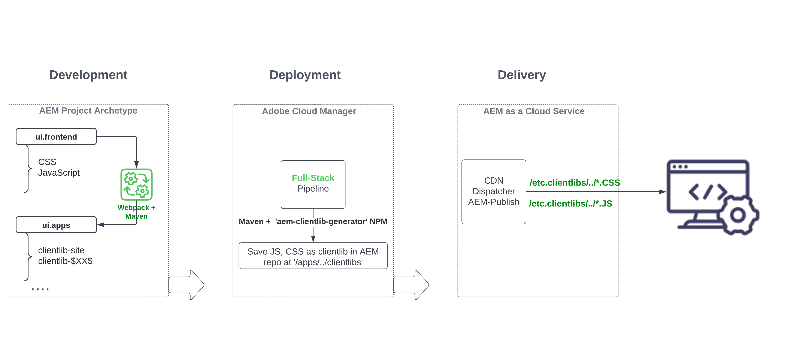

# Granska modulen ui.front för AEM i fullstacksprojektet {#aem-full-stack-ui-frontent}

I det här kapitlet går vi igenom utveckling, distribution och leverans av frontendartefakter i ett AEM i full hög genom att fokusera på modulen &quot;ui.front&quot; i __WKND Sites-projektet__.


## Mål {#objective}

* Förstå hur frontendartefakter byggs och driftsätts i ett AEM projekt i full hög
* Granska [webpack](https://webpack.js.org/)-konfigurationer för AEM fullstacksprojekt i modulen `ui.frontend`
* Genereringsprocess för AEM klientbibliotek (kallas även klientbibliotek)

## Driftsättningsflöde i gränssnittet för projekt med AEM i fullhög och snabb utveckling av webbplatser

>[!IMPORTANT]
>
>I den här videon förklaras och demonstreras frontendflödet för både **projekt med fullständig hög och snabb webbplatsgenerering** för att visa den subtila skillnaden i frontendresurserna när det gäller att skapa, distribuera och leverera.

>[!VIDEO](https://video.tv.adobe.com/v/3409344?quality=12&learn=on)

## Förutsättningar {#prerequisites}


* Klona [AEM WKND Sites-projektet](https://github.com/adobe/aem-guides-wknd)
* Bygg och driftsatte det klonade projektet AEM WKND Sites till AEM as a Cloud Service.

Mer information finns i AEM WKND-webbplatsprojektet [README.md](https://github.com/adobe/aem-guides-wknd/blob/main/README.md).

## AEM slutartefaktflöde för projekt i full hög {#flow-of-frontend-artifacts}

Nedan visas en högnivårepresentation av __utveckling, distribution och leverans__-flödet för frontendartefakter i ett AEM i en fullständig stack.




Under utvecklingsfasen utförs ändringar i gränssnittet, som formatering och omprofilering, genom att CSS-, JS-filer från mappen `ui.frontend/src/main/webpack` uppdateras. Under byggtiden förvandlar sedan pluginmodulen [webpack](https://webpack.js.org/) och maven dessa filer till optimerade AEM-klienter under modulen `ui.apps`.

Front-end-ändringar distribueras till AEM as a Cloud Service-miljön när du kör pipelinen [__Full-stack__ i Cloud Manager](https://experienceleague.adobe.com/docs/experience-manager-cloud-service/content/implementing/using-cloud-manager/cicd-pipelines/introduction-ci-cd-pipelines.html).

Framsidesresurserna levereras till webbläsarna via URI-sökvägar som börjar med `/etc.clientlibs/`, och cachas vanligtvis AEM Dispatcher och CDN.


>[!NOTE]
>
> På samma sätt distribueras [front-end-ändringarna](https://experienceleague.adobe.com/docs/experience-manager-cloud-service/content/sites/administering/site-creation/quick-site/customize-theme.html) i __AEM-snabbwebbplatsresan__ till AEM as a Cloud Service-miljön genom att du kör pipeline __Front-End__ (se [Konfigurera pipeline](https://experienceleague.adobe.com/docs/experience-manager-cloud-service/content/sites/administering/site-creation/quick-site/pipeline-setup.html)).

### Granska webbpaketskonfigurationer i WKND Sites-projektet {#development-frontend-webpack-clientlib}

* Det finns tre __webbpack__-konfigurationsfiler som används för att paketera WKND-webbplatsernas frontendresurser.

   1. `webpack.common` - Detta innehåller konfigurationen __common__ för att instruera WKND-resurspaket och optimering. Egenskapen __output__ anger var de konsoliderade filerna ska genereras (kallas även JavaScript-paket, men ska inte blandas ihop med AEM OSGi-paket) som skapas. Standardnamnet är `clientlib-site/js/[name].bundle.js`.

  ```javascript
      ...
      output: {
              filename: 'clientlib-site/js/[name].bundle.js',
              path: path.resolve(__dirname, 'dist')
          }
      ...    
  ```

   1. `webpack.dev.js` innehåller konfigurationen __development__ för webbpack-dev-server och pekar på HTML-mallen som ska användas. Den innehåller också en proxykonfiguration till en AEM som körs på `localhost:4502`.

  ```javascript
      ...
      devServer: {
          proxy: [{
              context: ['/content', '/etc.clientlibs', '/libs'],
              target: 'http://localhost:4502',
          }],
      ...    
  ```

   1. `webpack.prod.js` innehåller konfigurationen __production__ och använder plugin-programmen för att omvandla utvecklingsfilerna till optimerade paket.

  ```javascript
      ...
      module.exports = merge(common, {
          mode: 'production',
          optimization: {
              minimize: true,
              minimizer: [
                  new TerserPlugin(),
                  new CssMinimizerPlugin({ ...})
          }
      ...    
  ```


* De paketerade resurserna flyttas till modulen `ui.apps` med plugin-programmet [ aem-clientlib-generator](https://www.npmjs.com/package/aem-clientlib-generator), med hjälp av konfigurationen som hanteras i filen `clientlib.config.js`.

```javascript
    ...
    const BUILD_DIR = path.join(__dirname, 'dist');
    const CLIENTLIB_DIR = path.join(
    __dirname,
    '..',
    'ui.apps',
    'src',
    'main',
    'content',
    'jcr_root',
    'apps',
    'wknd',
    'clientlibs'
    );
    ...
```

* __front-maven-plugin__ från `ui.frontend/pom.xml` orkestrerar webbpaketering och klientlib-generering när AEM byggs.

`$ mvn clean install -PautoInstallSinglePackage`

### Distribution till AEM as a Cloud Service {#deployment-frontend-aemaacs}

[__Fullhög__ pipeline](https://experienceleague.adobe.com/docs/experience-manager-cloud-service/content/implementing/using-cloud-manager/cicd-pipelines/introduction-ci-cd-pipelines.html?#full-stack-pipeline) distribuerar dessa ändringar till en AEM as a Cloud Service-miljö.


### Leverans från AEM as a Cloud Service {#delivery-frontend-aemaacs}

De frontendresurser som distribueras via hela stacken levereras från AEM till webbläsare som `/etc.clientlibs` filer. Du kan verifiera detta genom att gå till den [offentliga WKND-webbplatsen](https://wknd.site/content/wknd/us/en.html) och visa webbsidans källa.

```html
    ....
    <link rel="stylesheet" href="/etc.clientlibs/wknd/clientlibs/clientlib-site.lc-181cd4102f7f49aa30eea548a7715c31-lc.min.css" type="text/css">

    ...

    <script async src="/etc.clientlibs/wknd/clientlibs/clientlib-site.lc-d4e7c03fe5c6a405a23b3ca1cc3dcd3d-lc.min.js"></script>
    ....
```

## Grattis! {#congratulations}

Grattis, du har granskat ui.front-modulen för ett projekt i en hel hög

## Nästa steg {#next-steps}

I nästa kapitel, [Uppdatera projekt till att använda frontdelspipeline](update-project.md), uppdaterar du AEM WKND Sites Project så att det aktiveras för frontdelsslutsslutsslutsslutsslutsslutsslutsslutsslutsslutskontraktet.
