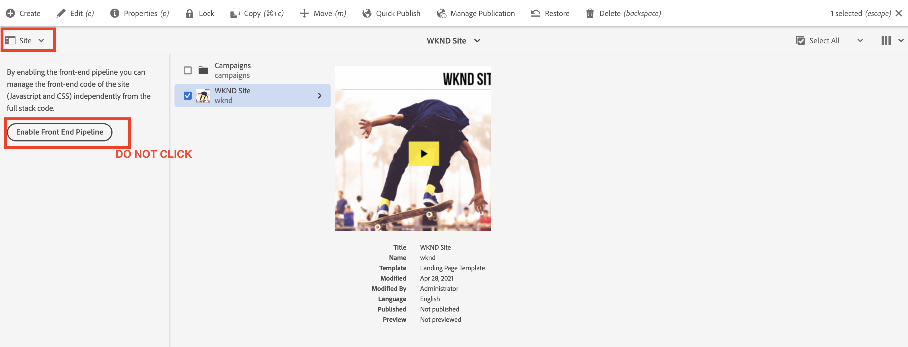

# Uppdatera AEM i full hög för att använda frontendpipeline {#update-project-enable-frontend-pipeline}

I det här kapitlet gör vi konfigurationsändringar i __WKND Sites-projekt__ för att använda frontpipeline för att distribuera JavaScript och CSS, i stället för att kräva en fullständig pipeline-körning i hela stacken. Detta försvårar utvecklingsfasen och driftsättningslivscykeln för front-end- och back-end-artefakter, vilket ger en snabbare, iterativ utvecklingsprocess som helhet.

## Mål {#objectives}

* Uppdatera ett projekt i full hög för att använda frontendpipeline

## Översikt över konfigurationsändringar i AEM

>[!VIDEO](https://video.tv.adobe.com/v/3409419?quality=12&learn=on)

## Förutsättningar {#prerequisites}

Det här är en självstudiekurs i flera delar och du förutsätts ha granskat [Modulen &#39;ui.front&#39;](./review-uifrontend-module.md).


## Ändringar i AEM

Det finns tre projektrelaterade konfigurationsändringar och en formatändring som ska distribueras för en testkörning, vilket innebär totalt fyra specifika ändringar i WKND-projektet för att aktivera det för det främre pipelinekontraktet.

1. Ta bort `ui.frontend` modul från byggcykel i full stack

   * In, the WKND Sites Project&#39;s root `pom.xml` kommentera `<module>ui.frontend</module>` delmodulspost.

   ```xml
       ...
       <modules>
       <module>all</module>
       <module>core</module>
       <!--
       <module>ui.frontend</module>
       -->                
       <module>ui.apps</module>
       ...
   ```

   * Och kommentarrelaterade beroenden från `ui.apps/pom.xml`

   ```xml
       ...
       <!-- ====================================================================== -->
       <!-- D E P E N D E N C I E S                                                -->
       <!-- ====================================================================== -->
           ...
       <!--
           <dependency>
               <groupId>com.adobe.aem.guides</groupId>
               <artifactId>aem-guides-wknd.ui.frontend</artifactId>
               <version>${project.version}</version>
               <type>zip</type>
           </dependency>
       -->    
       ...
   ```

1. Förbered `ui.frontend` för det rörliga säljprojektskontraktet genom att lägga till två nya webbpaketkonfigurationsfiler.

   * Kopiera befintlig `webpack.common.js` as `webpack.theme.common.js`, och ändra `output` egenskap och `MiniCssExtractPlugin`, `CopyWebpackPlugin` plug-in-konfigurationsparametrar enligt nedan:

   ```javascript
   ...
   output: {
           filename: 'theme/js/[name].js', 
           path: path.resolve(__dirname, 'dist')
       }
   ...
   
   ...
       new MiniCssExtractPlugin({
               filename: 'theme/[name].css'
           }),
       new CopyWebpackPlugin({
           patterns: [
               { from: path.resolve(__dirname, SOURCE_ROOT + '/resources'), to: './clientlib-site' }
           ]
       })
   ...
   ```

   * Kopiera befintlig `webpack.prod.js` as `webpack.theme.prod.js`och ändra `common` variabelns plats till ovanstående fil som

   ```javascript
   ...
       const common = require('./webpack.theme.common.js');
   ...
   ```

   >[!NOTE]
   >
   >De två konfigurationsändringarna ovan för &#39;webpack&#39; är att ha olika namn på utdatafiler och mappar, så det är enkelt att skilja mellan klientlib (fullständig hög) och tema som genereras (frontendspipeline).
   >
   >Som du gissade kan ändringarna ovan hoppas över för att använda befintliga webbpaketskonfigurationer, men nedanstående ändringar krävs.
   >
   >Det är upp till dig hur du vill namnge eller ordna dem.


   * I `package.json` filen, se till att  `name` egenskapsvärdet är samma som platsnamnet från `/conf` nod. Och under `scripts` egenskap, en `build` skript som instruerar om hur front end-filerna från den här modulen ska skapas.

   ```javascript
       {
       "name": "wknd",
       "version": "1.0.0",
       ...
   
       "scripts": {
           "build": "webpack --config ./webpack.theme.prod.js"
       }
   
       ...
       }
   ```

1. Förbered `ui.content` för frontendpipeline genom att lägga till två Sling-konfigurationer.

   * Skapa en fil på `com.adobe.cq.wcm.core.components.config.HtmlPageItemsConfig` - detta inkluderar alla filer i gränssnittet som `ui.frontend` modulen genereras under `dist` mapp med webbpaketets byggprocess.

   ```xml
   ...
       <css
       jcr:primaryType="nt:unstructured"
       element="link"
       location="header">
       <attributes
           jcr:primaryType="nt:unstructured">
           <as
               jcr:primaryType="nt:unstructured"
               name="as"
               value="style"/>
           <href
               jcr:primaryType="nt:unstructured"
               name="href"
               value="/theme/site.css"/>
   ...
   ```

   >[!TIP]
   >
   >    Se hela [HtmlPageItemsConfig](https://github.com/adobe/aem-guides-wknd/blob/feature/frontend-pipeline/ui.content/src/main/content/jcr_root/conf/wknd/_sling_configs/com.adobe.cq.wcm.core.components.config.HtmlPageItemsConfig/.content.xml) i __AEM WKND Sites-projekt__.


   * Andra `com.adobe.aem.wcm.site.manager.config.SiteConfig` med `themePackageName` värdet är detsamma som `package.json` och `name` egenskapsvärde och `siteTemplatePath` peka på en `/libs/wcm/core/site-templates/aem-site-template-stub-2.0.0` stub-sökvägsvärde.

   ```xml
   ...
       <?xml version="1.0" encoding="UTF-8"?>
       <jcr:root xmlns:sling="http://sling.apache.org/jcr/sling/1.0" xmlns:jcr="http://www.jcp.org/jcr/1.0" xmlns:nt="http://www.jcp.org/jcr/nt/1.0"
               jcr:primaryType="nt:unstructured"
               siteTemplatePath="/libs/wcm/core/site-templates/aem-site-template-stub-2.0.0"
               themePackageName="wknd">
       </jcr:root>
   ...
   ```

   >[!TIP]
   >
   >    Se [SiteConfig](https://github.com/adobe/aem-guides-wknd/blob/feature/frontend-pipeline/ui.content/src/main/content/jcr_root/conf/wknd/_sling_configs/com.adobe.aem.wcm.site.manager.config.SiteConfig/.content.xml) i __AEM WKND Sites-projekt__.

1. Ett eller flera teman ändras så att de kan distribueras via frontendpipeline för en testkörning, vi håller på att ändra `text-color` till Adobe red (eller så kan du välja en egen) genom att uppdatera `ui.frontend/src/main/webpack/base/sass/_variables.scss`.

   ```css
       $black:     #a40606;
       ...
   ```

Slutligen kan du överföra dessa ändringar till Adobe i programmets Git-databas.


>[!AVAILABILITY]
>
> Dessa ändringar är tillgängliga på GitHub i [__rörledning för frontend__](https://github.com/adobe/aem-guides-wknd/tree/feature/frontend-pipeline) gren av __AEM WKND Sites-projekt__.


## Varning - _Aktivera frontdelspipeline_ knapp

The [Järnvägsväljare](https://experienceleague.adobe.com/docs/experience-manager-cloud-service/content/sites/authoring/getting-started/basic-handling.html) &#39;s [Plats](https://experienceleague.adobe.com/docs/experience-manager-cloud-service/content/sites/authoring/getting-started/basic-handling.html) alternativet visar **Aktivera frontdelspipeline** när du väljer platsroten eller webbplatssidan. Klicka **Aktivera frontdelspipeline** kommer att åsidosätta ovanstående **Sling-konfigurationer**, kontrollera **du inte klickar** den här knappen efter distributionen av ovanstående ändringar via molnhanterarens pipeline-körning.



Om du klickar på den av misstag måste du köra pipelines igen för att se till att slutavtalet för pipeline och ändringarna återställs.

## Grattis! {#congratulations}

Du har uppdaterat WKND Sites-projektet för att aktivera det för det främre pipelinekontraktet.

## Nästa steg {#next-steps}

I nästa kapitel [Driftsätt med frontpipeline](create-frontend-pipeline.md)kommer du att skapa och driva en frontendpipeline och verifiera hur vi __flyttad__ från den /etc.clientlibs-baserade leveransen av frontendresurser.
