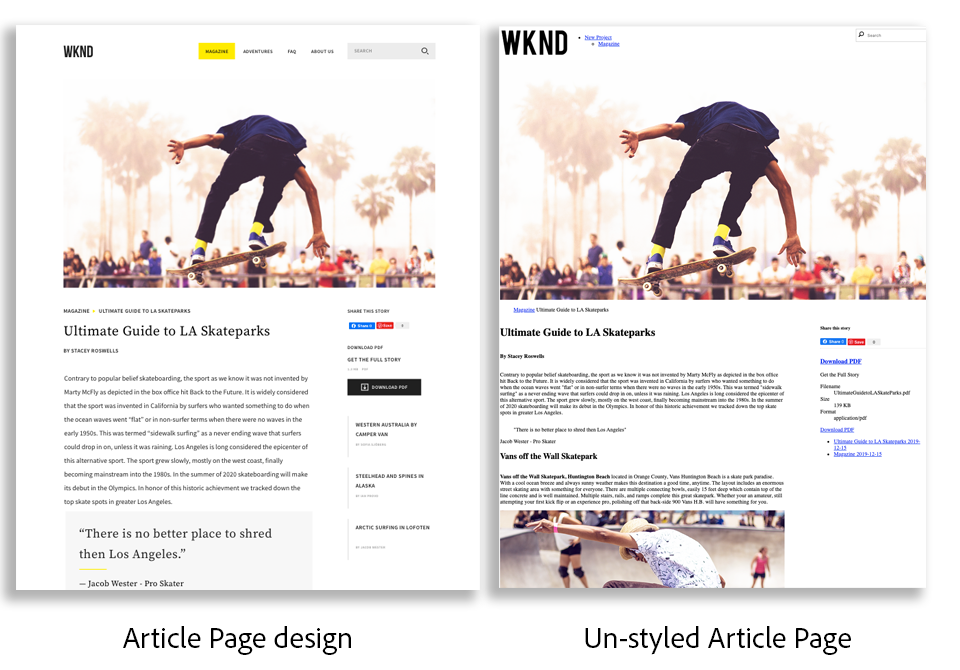
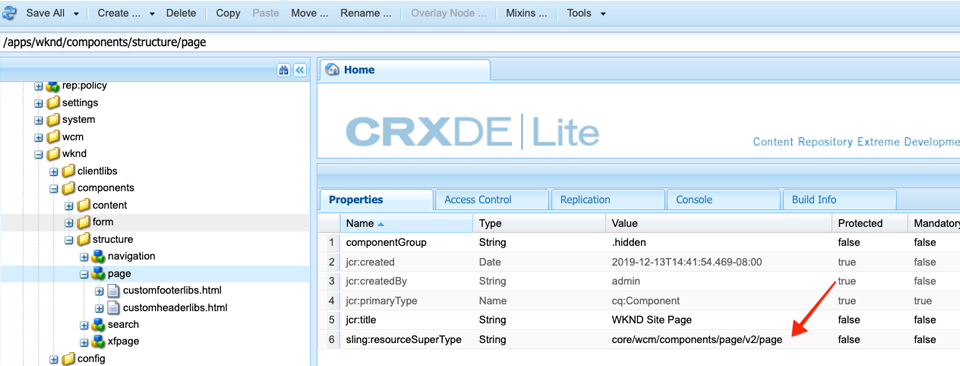
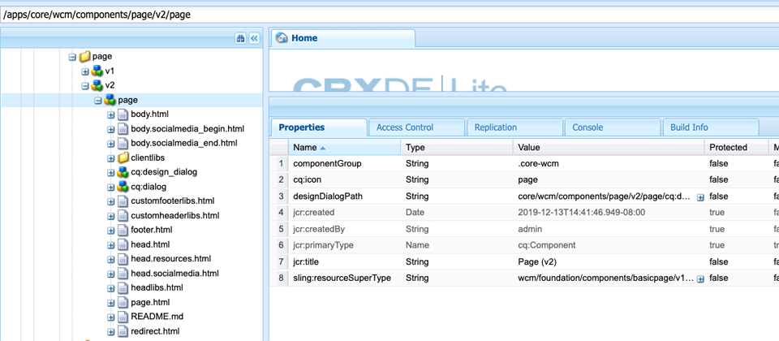

# Sidor och mallar {#pages-and-template}

I det här kapitlet ska vi undersöka förhållandet mellan en bassidkomponent och redigerbara mallar. Vi kommer att bygga ut en ej formaterad artikelmall baserad på några modeller från [AdobeXD](https://www.adobe.com/products/xd.html). Under processen att skapa mallen beskrivs kärnkomponenter och avancerade principkonfigurationer för redigerbara mallar.

## Förutsättningar {#prerequisites}

Granska de verktyg och instruktioner som krävs för att konfigurera en [lokal utvecklingsmiljö](overview.md#local-dev-environment).

### Startprojekt

>[!NOTE]
>
> Om du har slutfört det föregående kapitlet kan du återanvända projektet och hoppa över stegen för att checka ut startprojektet.

Ta en titt på den baslinjekod som självstudiekursen bygger på:

1. Kolla in grenen `tutorial/pages-templates-start` från [GitHub](https://github.com/adobe/aem-guides-wknd)

   ```shell
   $ cd ~/code/aem-guides-wknd
   $ git checkout tutorial/pages-templates-start
   ```

1. Distribuera kodbasen till en lokal AEM med dina Maven-kunskaper:

   ```shell
   $ mvn clean install -PautoInstallSinglePackage
   ```

   >[!NOTE]
   >
   > Om du använder AEM 6.5 eller 6.4 lägger du till profilen `classic` till valfritt Maven-kommando.

   ```shell
   $ mvn clean install -PautoInstallSinglePackage -Pclassic
   ```

Du kan alltid visa den färdiga koden på [GitHub](https://github.com/adobe/aem-guides-wknd/tree/pages-templates/solution) eller checka ut koden lokalt genom att växla till grenen `tutorial/pages-templates-solution`.

## Syfte

1. Inspect är en siddesign som skapats i Adobe XD och som mappas till Core Components.
1. Förstå detaljerna om redigerbara mallar och hur profiler kan användas för att få exakt kontroll över sidinnehållet.
1. Lär dig hur mallar och sidor länkas

## Vad du ska bygga {#what-you-will-build}

I den här delen av självstudiekursen skapar du en ny artikelsidmall som kan användas för att skapa nya artikelsidor och anpassa sig till en gemensam struktur. Artikelsidmallen baseras på design och ett användargränssnittspaket som skapats i AdobeXD. Det här kapitlet handlar endast om att bygga ut mallens struktur eller skelett. Inga format kommer att implementeras, men mallen och sidorna kommer att fungera.



## UI-planering med Adobe XD {#adobexd}

I de flesta fall börjar planering av en ny webbplats med dummies och statisk design. [Adobe ](https://www.adobe.com/products/xd.html) XDär ett designverktyg som bygger upp användarupplevelser. Därefter undersöker vi ett gränssnittspaket och dummies för att planera strukturen för artikelsidmallen.

>[!VIDEO](https://video.tv.adobe.com/v/30214/?quality=12&learn=on)

**Ladda ned designfilen för  [WKND-artikeln](https://github.com/adobe/aem-guides-wknd/releases/download/aem-guides-wknd-0.0.2/AEM_UI-kit-WKND-article-design.xd)**.

## Skapa artikelsidmall

När du skapar en sida måste du välja en mall som ska användas som bas för att skapa den nya sidan. Mallen definierar strukturen för den resulterande sidan, det inledande innehållet och de tillåtna komponenterna.

Det finns tre huvudområden för [Redigerbara mallar](https://experienceleague.adobe.com/docs/experience-manager-65/developing/platform/templates/page-templates-editable.html):

1. **Struktur**  - definierar komponenter som är en del av mallen. Dessa kan inte redigeras av innehållsförfattare.
1. **Ursprungligt innehåll**  - definierar komponenter som mallen ska börja med, som kan redigeras och/eller tas bort av innehållsförfattare
1. **Profiler**  - definierar konfigurationer för hur komponenter ska bete sig och vilka alternativ författare ska ha tillgängliga.

Skapa sedan en ny mall i AEM som matchar strukturen i modellerna. Detta inträffar i en lokal instans av AEM. Följ stegen i videon nedan:

>[!VIDEO](https://video.tv.adobe.com/v/330991/?quality=12&learn=on)

Steg på hög nivå för videon nedan:

### Strukturkonfigurationer

1. Skapa en ny mall med **sidmallstyp**, med namnet **Artikelsida**.
1. Växla till **Struktur**-läge.
1. Lägg till en **Experience Fragment**-komponent som fungerar som **Header** överst i mallen.
   * Konfigurera komponenten så att den pekar på `/content/experience-fragments/wknd/us/en/site/header/master`.
   * Ställ in principen på **Sidhuvud** och kontrollera att **standardelementet** är inställt på `header`. `header`elementet kommer att ha CSS som mål i nästa kapitel.
1. Lägg till en **Experience Fragment**-komponent som fungerar som **sidfot** längst ned i mallen.
   * Konfigurera komponenten så att den pekar på `/content/experience-fragments/wknd/us/en/site/footer/master`.
   * Ställ in principen på **Sidfot** och kontrollera att **Default Element** är inställt på `footer`. `footer`-elementet har CSS som mål i nästa kapitel.
1. Lås **main**-behållaren som inkluderades när mallen skapades.
   * Ställ in principen på **Sidhuvud** och kontrollera att **standardelementet** är inställt på `main`. `main`-elementet har CSS som mål i nästa kapitel.
1. Lägg till en **Image**-komponent i **main**-behållaren.
   * Lås upp komponenten **Image**.
1. Lägg till en **Breadcrumb**-komponent under **Image**-komponenten i huvudbehållaren.
   * Skapa en ny princip för **komponenten Breeze** med namnet **Artikelsida - Breadcrumb**. Ange **Navigeringens startnivå** till **4**.
1. Lägg till en **Container**-komponent under **Breadcrumb**-komponenten och inuti **main**-behållaren. Detta fungerar som **innehållsbehållare** för mallen.
   * Lås upp **Content**-behållaren.
   * Ställ in principen på **Sidinnehåll**.
1. Lägg till ytterligare en **Container**-komponent under **Innehållsbehållaren**. Detta fungerar som **Side Rail**-behållare för mallen.
   * Lås upp behållaren **Side Rail**.
   * Skapa en ny princip med namnet **Artikelsida - sidospalt**.
   * Konfigurera **Tillåtna komponenter** under **WKND Sites Project - Content** till att inkludera: **Knapp**, **Ladda ned**, **Bild**, **Lista**, **Avgränsare**, **Delning av sociala medier**, &lt;a11 6/>Text **och** Titel **.**
1. Uppdatera principen för sidrotsbehållaren. Det här är mallens yttre behållare. Ställ in principen på **Sidrot**.
   * Under **Behållarinställningar** anger du **Layout** till **Responsivt rutnät**.
1. Aktivera layoutläge för **innehållsbehållaren**. Dra handtaget från höger till vänster och krymp behållaren så att den är 8 kolumner bred.
1. Aktivera layoutläge för **sidoskenans behållare**. Dra handtaget från höger till vänster och krymp behållaren så att den är 4 kolumner bred. Dra sedan det vänstra handtaget från vänster till höger 1 kolumn för att göra behållaren 3 kolumner bred och lämna ett kolumnmellanrum mellan **innehållsbehållaren**.
1. Öppna mobilemulatorn och byt till en mobil brytpunkt. Aktivera layoutläget igen och gör **innehållsbehållaren** och **sidospaltbehållaren** till hela sidbredden. Detta kommer att stapla behållarna lodrätt i den mobila brytpunkten.
1. Uppdatera principen för komponenten **Text** i **Innehållsbehållaren**.
   * Ställ in principen på **Innehållstext**.
   * Under **Plugin-program** > **Styckeformat** ska du kontrollera **Aktivera styckeformat** och kontrollera att **offertblocket** är aktiverat.

### Inledande innehållskonfigurationer

1. Växla till läget **Ursprungligt innehåll**.
1. Lägg till en **Title**-komponent i **innehållsbehållaren**. Detta fungerar som artikelrubrik. När den lämnas tom visas den aktuella sidans titel automatiskt.
1. Lägg till en andra **Title**-komponent under den första Title-komponenten.
   * Konfigurera komponenten med texten: &quot;Av författare&quot;. Det här blir en textplatshållare.
   * Ange typen som `H4`.
1. Lägg till en **Text**-komponent under **By Author** Title-komponenten.
1. Lägg till en **Title**-komponent i **Side Rail Container**.
   * Konfigurera komponenten med texten: &quot;Dela den här artikeln&quot;.
   * Ange typen som `H5`.
1. Lägg till en **Dela sociala medier**-komponent under **Dela den här artikeln**.
1. Lägg till en **avgränsarkomponent** under **Delning av sociala medier**-komponenten.
1. Lägg till en **Hämta**-komponent under **avgränsarkomponenten**.
1. Lägg till en **List**-komponent under **Hämta**-komponenten.
1. Uppdatera **Inledande sidegenskaper** för mallen.
   * Under **Delning av sociala medier** > **Delning av sociala medier** ska du kontrollera **Facebook** och **Pinterest**

### Aktivera mallen och lägg till en miniatyrbild

1. Visa mallen i mallkonsolen genom att gå till [http://localhost:4502/libs/wcm/core/content/sites/templates.html/conf/wknd](http://localhost:4502/libs/wcm/core/content/sites/templates.html/conf/wknd)
1. **Aktivera** artikelsidmallen.
1. Redigera egenskaperna för artikelsidmallen och överför följande miniatyrbild för att snabbt identifiera sidor som skapats med artikelsidmallen:

   

## Uppdatera sidhuvud och sidfot med Experience Fragments {#experience-fragments}

Ett vanligt tillvägagångssätt när du skapar globalt innehåll, till exempel ett sidhuvud eller en sidfot, är att använda ett [Experience Fragment](https://docs.adobe.com/content/help/en/experience-manager-learn/sites/experience-fragments/experience-fragments-feature-video-use.html). Med Experience Fragments kan användare kombinera flera komponenter för att skapa en enda referensbar komponent. Experience Fragments har fördelen att det stöder hantering av flera webbplatser och [lokalisering](https://experienceleague.adobe.com/docs/experience-manager-core-components/using/components/experience-fragment.html?lang=en#localized-site-structure).

Den AEM projekttypen genererade ett sidhuvud och en sidfot. Uppdatera sedan Experience Fragments så att de matchar dummyerna. Följ stegen i videon nedan:

>[!VIDEO](https://video.tv.adobe.com/v/330992/?quality=12&learn=on)

Steg på hög nivå för videon nedan:

1. Hämta exempelinnehållspaketet **[WKND-PagesTemplates-Content-Assets.zip](assets/pages-templates/WKND-PagesTemplates-Content-Assets.zip)**.
1. Överför och installera innehållspaketet med Package Manager på [http://localhost:4502/crx/packmgr/index.jsp](http://localhost:4502/crx/packmgr/index.jsp)
1. Uppdatera webbvariationsmallen, som är den mall som används för Experience Fragments på [http://localhost:4502/editor.html/conf/wknd/settings/wcm/templates/xf-web-variation/structure.html](http://localhost:4502/editor.html/conf/wknd/settings/wcm/templates/xf-web-variation/structure.html)
   * Uppdatera principen för komponenten **Container** i mallen.
   * Ställ in principen på **XF Root**.
   * Under **Tillåtna komponenter** markerar du komponentgruppen **WKND-platsprojekt - struktur** så att den inkluderar **språknavigering**, **navigering** och **snabbsökning**-komponenter.

### Uppdatera rubrikupplevelsefragment

1. Öppna det Experience Fragment som återger rubriken på [http://localhost:4502/editor.html/content/experience-fragments/wknd/us/en/site/header/master.html](http://localhost:4502/editor.html/content/experience-fragments/wknd/us/en/site/header/master.html)
1. Konfigurera fragmentets rot **behållare**. Det här är den yttre mest **behållaren**.
   * Ange **layouten** till **Responsivt rutnät**
1. Lägg till **WKND Mörk logotyp** som en bild högst upp i **behållaren**. Logotypen ingick i paketet som installerades i ett tidigare steg.
   * Ändra layouten för **WKND Mörk logotyp** till **2** kolumner bred. Dra handtagen från höger till vänster.
   * Konfigurera logotypen med **Alternativ text** av &quot;WKND Logo&quot;.
   * Konfigurera logotypen till **Länka** till `/content/wknd/us/en` hemsidan.
1. Konfigurera den **navigeringskomponent** som redan finns på sidan.
   * Ange **Uteslut rotnivåer** till **1**.
   * Ange **Navigeringsstrukturdjupet** till **1**.
   * Ändra layouten för **Navigation**-komponenten så att den är **8**-kolumner bred. Dra handtagen från höger till vänster.
1. Ta bort komponenten **Språknavigering**.
1. Ändra layouten för **Search**-komponenten till **2** kolumner bred. Dra handtagen från höger till vänster. Alla komponenter ska nu justeras vågrätt på en enda rad.

### Uppdatera sidfotsupplevelsefragment

1. Öppna det Experience Fragment som återger sidfoten på [http://localhost:4502/editor.html/content/experience-fragments/wknd/us/en/site/footer/master.html](http://localhost:4502/editor.html/content/experience-fragments/wknd/us/en/site/footer/master.html)
1. Konfigurera fragmentets rot **behållare**. Det här är den yttre mest **behållaren**.
   * Ange **layouten** till **Responsivt rutnät**
1. Lägg till **WKND Light-logotypen** som en bild högst upp i **behållaren**. Logotypen ingick i paketet som installerades i ett tidigare steg.
   * Ändra layouten för **WKND Light-logotypen** till **2** kolumner bred. Dra handtagen från höger till vänster.
   * Konfigurera logotypen med **Alternativ text** av &quot;WKND Logo Light&quot;.
   * Konfigurera logotypen till **Länka** till `/content/wknd/us/en` hemsidan.
1. Lägg till en **Navigation**-komponent under logotypen. Konfigurera komponenten **Navigation**:
   * Ange **Uteslut rotnivåer** till **1**.
   * Avmarkera **Samla in alla underordnade sidor**.
   * Ange **Navigeringsstrukturdjupet** till **1**.
   * Ändra layouten för **Navigation**-komponenten så att den är **8**-kolumner bred. Dra handtagen från höger till vänster.

## Skapa en artikelsida

Skapa sedan en ny sida med hjälp av mallen Artikelsida. Skriv innehållet på sidan så att det matchar webbplatsens dummies. Följ stegen i videon nedan:

>[!VIDEO](https://video.tv.adobe.com/v/330993/?quality=12&learn=on)

Steg på hög nivå för videon nedan:

1. Gå till webbplatskonsolen på [http://localhost:4502/sites.html/content/wknd/us/en/magazine](http://localhost:4502/sites.html/content/wknd/us/en/magazine).
1. Skapa en ny sida under **WKND** > **US** > **EN** > **Magazine**.
   * Välj mallen **Artikelsida**.
   * Under **Egenskaper** ställer du in **Title** till &quot;Ultimate Guide to LA Skateparks&quot;
   * Ange **namnet** som &quot;guide-la-skateparks&quot;
1. Ersätt **med författare** med texten&quot;By Stacey Roswells&quot;.
1. Uppdatera **Text**-komponenten så att den innehåller ett stycke som du vill fylla i artikeln. Du kan använda följande textfil som kopia: [la-skate-parks-copy.txt](assets/pages-templates/la-skateparks-copy.txt).
1. Lägg till en annan **Text**-komponent.
   * Uppdatera komponenten så att den innehåller offerten: &quot;Det finns inget bättre ställe att dela med sig av än Los Angeles.&quot;
   * Redigera RTF-redigeraren i helskärmsläge och ändra offerten ovan så att elementet **Citattecken** används.
1. Fortsätt fylla i artikelns brödtext för att matcha dummies.
1. Konfigurera komponenten **Hämta** för att använda en PDF-version av artikeln.
   * Under **Hämta** > **Egenskaper** klickar du i kryssrutan för att **Hämta titeln från DAM-resursen**.
   * Ange **Beskrivning** till: &quot;Hämta hela artikeln&quot;.
   * Ange **åtgärdstexten** till: &quot;Ladda ned PDF&quot;.
1. Konfigurera **List**-komponenten.
   * Välj **Underordnade sidor** under **Listinställningar** > **Skapa lista med**.
   * Ange **den överordnade sidan** till `/content/wknd/us/en/magazine`.
   * Under **Objektinställningar** markerar du **Länkobjekt** och markerar **Visa datum**.

## Inspect nodstrukturen {#node-structure}

Nu är artikelsidan helt klart inte formaterad. Den grundläggande strukturen finns dock på plats. Granska sedan artikelsidans nodstruktur för att få en bättre förståelse för mallens, sidans och komponenternas roll.

Använd verktyget CRXDE-Lite på en lokal AEM för att visa den underliggande nodstrukturen.

1. Öppna [CRXDE-Lite](http://localhost:4502/crx/de/index.jsp#/content/wknd/us/en/magazine/guide-la-skateparks/jcr%3Acontent) och använd trädnavigeringen för att navigera till `/content/wknd/us/en/magazine/guide-la-skateparks`.

1. Klicka på noden `jcr:content` under sidan `la-skateparks` och visa egenskaperna:

   

   Observera värdet för `cq:template`, som pekar på `/conf/wknd/settings/wcm/templates/article-page`, artikelsidmallen som vi skapade tidigare.

   Lägg också märke till värdet `sling:resourceType`, som pekar på `wknd/components/page`. Detta är den sidkomponent som skapas av AEM projekttyp och som ansvarar för återgivningen av sidan baserat på mallen.

1. Expandera noden `jcr:content` under `/content/wknd/us/en/magazine/guide-la-skateparks/jcr:content` och visa nodhierarkin:

   

   Du bör kunna mappa var och en av noderna löst till komponenter som har skapats. Se om du kan identifiera de olika layoutbehållarna som används genom att kontrollera de noder som har prefixet `container`.

1. Kontrollera sedan sidkomponenten på `/apps/wknd/components/page`. Visa komponentegenskaperna i CRXDE Lite:

   

   Observera att det bara finns två HTML-skript, `customfooterlibs.html` och `customheaderlibs.html` under sidkomponenten. *Hur återger den här komponenten sidan?*

   Egenskapen `sling:resourceSuperType` pekar på `core/wcm/components/page/v2/page`. Den här egenskapen gör att WKND:s sidkomponent kan ärva **alla** funktioner i kärnkomponentsidkomponenten. Detta är det första exemplet på något som kallas [Proxykomponentmönster](https://docs.adobe.com/content/help/en/experience-manager-core-components/using/developing/guidelines.html#ProxyComponentPattern). Mer information finns [här.](https://docs.adobe.com/content/help/en/experience-manager-core-components/using/developing/guidelines.html).

1. Inspect är en annan komponent i WKND-komponenterna, `Breadcrumb`-komponenten som finns på: `/apps/wknd/components/breadcrumb`. Observera att samma `sling:resourceSuperType`-egenskap kan hittas, men den här gången pekar den på `core/wcm/components/breadcrumb/v2/breadcrumb`. Detta är ett annat exempel på hur du använder komponentmönstret Proxy för att inkludera en Core-komponent. Faktum är att alla komponenter i WKND-kodbasen är proxies av AEM Core Components (förutom vår kända HelloWorld-komponent). Det är en god vana att försöka återanvända så mycket av funktionerna i Core Components som möjligt *innan* skriver egen kod.

1. Kontrollera sedan Core Component Page på `/libs/core/wcm/components/page/v2/page` med CRXDE Lite:

   >[!NOTE]
   >
   > I AEM 6.5/6.4 finns kärnkomponenterna under `/apps/core/wcm/components`. I AEM som Cloud Service finns kärnkomponenterna under `/libs` och uppdateras automatiskt.

   

   Observera att många fler skript inkluderas under den här sidan. Core Component Page innehåller många funktioner. Den här funktionen är indelad i flera skript för enklare underhåll och läsbarhet. Du kan spåra inkludering av HTML-skript genom att öppna `page.html` och leta efter `data-sly-include`:

   ```html
   <!--/* /libs/core/wcm/components/page/v2/page/page.html */-->
   <!DOCTYPE HTML>
   <html data-sly-use.page="com.adobe.cq.wcm.core.components.models.Page" lang="${page.language}"
       data-sly-use.head="head.html"
       data-sly-use.footer="footer.html"
       data-sly-use.redirect="redirect.html">
       <head data-sly-call="${head.head @ page = page}"></head>
       <body class="${page.cssClassNames}"
           id="${page.id}"
           data-cmp-data-layer-enabled="${page.data ? true : false}">
           <script data-sly-test.dataLayerEnabled="${page.data}">
           window.adobeDataLayer = window.adobeDataLayer || [];
           adobeDataLayer.push({
               page: JSON.parse("${page.data.json @ context='scriptString'}"),
               event:'cmp:show',
               eventInfo: {
                   path: 'page.${page.id @ context="scriptString"}'
               }
           });
           </script>
           <sly data-sly-test.isRedirectPage="${page.redirectTarget && (wcmmode.edit || wcmmode.preview)}"
               data-sly-call="${redirect.redirect @ redirectTarget = page.redirectTarget}"></sly>
           <sly data-sly-test="${!isRedirectPage}">
               <sly data-sly-include="body.skiptomaincontent.html"></sly>
               <sly data-sly-include="body.socialmedia_begin.html"></sly>
               <sly data-sly-include="body.html"></sly>
               <sly data-sly-call="${footer.footer @ page = page}"></sly>
               <sly data-sly-include="body.socialmedia_end.html"></sly>
           </sly>
       </body>
   </html>
   ```

   Den andra anledningen till att HTML delas upp i flera skript är att tillåta proxykomponenterna att åsidosätta enskilda skript för att implementera anpassad affärslogik. HTML-skripten `customfooterlibs.html` och `customheaderlibs.html` skapas för det uttryckliga syftet som ska åsidosättas genom att projekt implementeras.

   Du kan lära dig mer om hur faktorer för redigerbar mall påverkar återgivningen av [innehållssidan genom att läsa den här artikeln](https://experienceleague.adobe.com/docs/experience-manager-65/developing/platform/templates/page-templates-editable.html).

1. Inspect är den andra kärnkomponenten, som Breadcrumb på `/libs/core/wcm/components/breadcrumb/v2/breadcrumb`. Visa `breadcrumb.html`-skriptet för att förstå hur koden för Breadcrumb-komponenten genereras.

## Sparar konfigurationer till källkontrollen {#configuration-persistence}

I många fall, särskilt i början av ett AEM projekt, är det viktigt att behålla konfigurationer som mallar och relaterade innehållsprinciper för källkontroll. Detta garanterar att alla utvecklare arbetar mot samma uppsättning innehåll och konfigurationer och kan säkerställa ytterligare enhetlighet mellan miljöer. När ett projekt når en viss mognadsnivå kan rutinen med mallhantering överföras till en särskild grupp med avancerade användare.

För tillfället kommer vi att behandla mallarna som andra koddelar och synkronisera **artikelsidmallen** nedåt som en del av projektet. Fram tills nu har vi **push**-kod från vårt AEM till en lokal instans av AEM. **Artikelsidmallen** skapades direkt i en lokal instans av AEM, så vi måste **importera** mallen till vårt AEM. Modulen **ui.content** ingår i AEM projekt för detta ändamål.

Nästa steg kommer att utföras med hjälp av VSCode IDE med [VSCode AEM Sync](https://marketplace.visualstudio.com/items?itemName=yamato-ltd.vscode-aem-sync&amp;ssr=false#overview)-pluginen, men kan utföras med valfri IDE som du har konfigurerat att **importera** eller importera innehåll från en lokal instans av AEM.

1. Öppna projektet `aem-guides-wknd` i VSCode.

1. Expandera modulen **ui.content** i Project Explorer. Expandera mappen `src` och navigera till `/conf/wknd/settings/wcm/templates`.

1. [!UICONTROL Right+Click] i  `templates` mappen och välj  **Importera från AEM Server**:

   

   `article-page` ska importeras och `page-content`-, `xf-web-variation`-mallarna ska också uppdateras.

   

1. Upprepa stegen för att importera innehåll men välj mappen **policies** på `/conf/wknd/settings/wcm/policies`.

   

1. Inspect filen `filter.xml` på `ui.content/src/main/content/META-INF/vault/filter.xml`.

   ```xml
   <!--ui.content filter.xml-->
   <?xml version="1.0" encoding="UTF-8"?>
   <workspaceFilter version="1.0">
       <filter root="/conf/wknd" mode="merge"/>
       <filter root="/content/wknd" mode="merge"/>
       <filter root="/content/dam/wknd" mode="merge"/>
       <filter root="/content/experience-fragments/wknd" mode="merge"/>
   </workspaceFilter>
   ```

   Filen `filter.xml` identifierar sökvägarna till noder som ska installeras med paketet. Observera `mode="merge"` för varje filter som anger att befintligt innehåll inte ändras, endast nytt innehåll läggs till. Eftersom innehållsförfattare kan uppdatera dessa sökvägar är det viktigt att en koddistribution **inte** skriver över innehåll. Mer information om hur du arbetar med filterelement finns i [dokumentationen för FileVault](https://jackrabbit.apache.org/filevault/filter.html).

   Jämför `ui.content/src/main/content/META-INF/vault/filter.xml` och `ui.apps/src/main/content/META-INF/vault/filter.xml` för att förstå de olika noder som hanteras av varje modul.

   >[!WARNING]
   >
   > För att säkerställa konsekventa distributioner för WKND-referensplatsen har vissa grenar av projektet konfigurerats så att `ui.content` skriver över ändringar i JCR. Detta är utformat, dvs. för Solution Branches, eftersom kod/format skrivs för specifika profiler.

## Grattis! {#congratulations}

Grattis, du har just skapat en ny mall och sida med Adobe Experience Manager Sites.

### Nästa steg {#next-steps}

Nu är artikelsidan helt klart inte formaterad. Följ självstudiekursen [Klientbibliotek och Front-end-arbetsflöde](client-side-libraries.md) för att lära dig de bästa sätten att inkludera CSS och Javascript för att använda globala format på webbplatsen och integrera en dedikerad front-end-bygge.

Visa den färdiga koden på [GitHub](https://github.com/adobe/aem-guides-wknd) eller granska och distribuera koden lokalt på Git-grenen `tutorial/pages-templates-solution`.

1. Klona [github.com/adobe/aem-wknd-guides](https://github.com/adobe/aem-guides-wknd)-databasen.
1. Kolla in grenen `tutorial/pages-templates-solution`.
