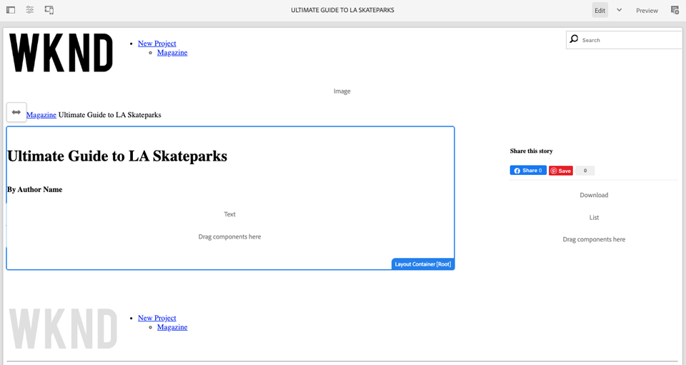

# Sidor och mallar {#pages-and-template}

I det här kapitlet ska vi undersöka förhållandet mellan en bassidkomponent och redigerbara mallar. Vi kommer att bygga ut en ej formaterad artikelmall baserad på några modeller från [AdobeXD](https://www.adobe.com/products/xd.html). Under processen att skapa mallen beskrivs kärnkomponenter och avancerade principkonfigurationer för redigerbara mallar.

## Förutsättningar {#prerequisites}

Granska de verktyg och instruktioner som krävs för att konfigurera en [lokal utvecklingsmiljö](overview.md#local-dev-environment).

### Startprojekt

Ta en titt på den baslinjekod som självstudiekursen bygger på:

1. Klona [github.com/adobe/aem-guides-wknd](https://github.com/adobe/aem-guides-wknd) .
1. Kolla in `pages-templates/start` grenen.

   ```shell
   $ git clone git@github.com:adobe/aem-guides-wknd.git ~/code/aem-guides-wknd
   $ cd ~/code/aem-guides-wknd
   $ git checkout pages-templates/start
   ```

1. Distribuera kodbasen till en lokal AEM med dina Maven-kunskaper:

   ```shell
   $ cd ~/code/aem-guides-wknd
   $ mvn clean install -PautoInstallSinglePackage
   ```

Du kan alltid visa den färdiga koden på [GitHub](https://github.com/adobe/aem-guides-wknd/tree/pages-templates/solution) eller checka ut koden lokalt genom att växla till grenen `pages-templates/solution`.

## Syfte

1. Inspect är en siddesign som skapats i Adobe XD och som mappas till Core Components.
1. Förstå detaljerna om redigerbara mallar och hur profiler kan användas för att få exakt kontroll över sidinnehållet.
1. Lär dig hur mallar och sidor länkas

## Vad du ska bygga {#what-you-will-build}

I den här delen av självstudiekursen skapar du en ny artikelsidmall som kan användas för att skapa nya artikelsidor och anpassa sig till en gemensam struktur. Artikelsidmallen baseras på design och ett användargränssnittspaket som skapats i AdobeXD. Det här kapitlet handlar endast om att bygga ut mallens struktur eller skelett. Inga format kommer att implementeras, men mallen och sidorna kommer att fungera.


## UI Planning with Adobe XD {#adobexd}

I de flesta fall börjar planering av en ny webbplats med dummies och statisk design. [Adobe XD](https://www.adobe.com/products/xd.html) är ett designverktyg för att skapa användarupplevelser. Därefter undersöker vi ett gränssnittspaket och dummies för att planera strukturen för artikelsidmallen.

>[!VIDEO](https://video.tv.adobe.com/v/30214/?quality=12&learn=on)

Ladda ned designfilen för [WKND-artikeln](https://github.com/adobe/aem-guides-wknd/releases/download/aem-guides-wknd-0.0.2/AEM_UI-kit-WKND-article-design.xd).

## Skapa ett sidhuvud och en sidfot med Experience Fragments {#experience-fragments}

Ett vanligt tillvägagångssätt när du skapar globalt innehåll, till exempel ett sidhuvud eller en sidfot, är att använda ett [Experience Fragment](https://docs.adobe.com/content/help/en/experience-manager-learn/sites/experience-fragments/experience-fragments-feature-video-use.html). Med Experience Fragments kan vi kombinera flera komponenter för att skapa en enda referensbar komponent. Experience Fragments har fördelen att det stöder hantering av flera webbplatser och gör att vi kan hantera olika sidhuvuden/sidfötter per språkområde.

Därefter uppdaterar vi Experience Fragment som ska användas som sidhuvud och sidfot för att lägga till WKND-logotypen.

>[!VIDEO](https://video.tv.adobe.com/v/30215/?quality=12&learn=on)

>[!NOTE]
>
> Ser dina Experience Fragments annorlunda ut än i videon? Prova att ta bort dem och installera om startprojektkodsbasen.

Nedan visas de steg på hög nivå som utförs i videon ovan.

1. Uppdatera Experience Fragment Header som finns på [http://localhost:4502/editor.html/content/experience-fragments/wknd/us/en/site/header/master.html](http://localhost:4502/editor.html/content/experience-fragments/wknd/us/en/site/header/master.html) för att inkludera WKND Dark-logotypen.

   

   *WKND Dark, logotyp*

1. Uppdatera Experience Fragment Header som finns på [http://localhost:4502/editor.html/content/experience-fragments/wknd/us/en/site/footer/master.html](http://localhost:4502/editor.html/content/experience-fragments/wknd/us/en/site/footer/master.html) så att logotypen WKND Light visas.

   

   *WKND Light logo*

## Skapa artikelsidmall

När du skapar en sida måste du välja en mall som ska användas som bas för att skapa den nya sidan. Mallen definierar strukturen för den resulterande sidan, det inledande innehållet och de tillåtna komponenterna.

Det finns tre huvudområden för [redigerbara mallar](https://docs.adobe.com/content/help/en/experience-manager-65/developing/platform/templates/page-templates-editable.html):

1. **Struktur** - definierar komponenter som är en del av mallen. Dessa kan inte redigeras av innehållsförfattare.
1. **Ursprungligt innehåll** - definierar komponenter som mallen ska börja med, som kan redigeras och/eller tas bort av innehållsförfattare
1. **Profiler** - definierar konfigurationer för hur komponenter fungerar och vilka alternativ författare har tillgängliga.

Nästa vi ska göra är att skapa artikelsidmallen. Detta inträffar i en lokal instans av AEM.

>[!VIDEO](https://video.tv.adobe.com/v/30217/?quality=12&learn=on)

Nedan visas de steg på hög nivå som utförs i videon ovan.

1. Navigera till mappen WKND Sites Template: **Verktyg** > **Allmänt** > **Mallar** > **WKND-plats**
1. Skapa en ny mall med malltypen **WKND-webbplats tom sida** med en rubrik för **artikelsidmall**
1. I **strukturläge** konfigurerar du mallen så att den innehåller följande element:

   * Experience Fragment Header
   * Bild
   * Breadcrumb
   * Behållare - 8 kolumner bred stationär dator, 12 kolumner bred surfplatta, mobil
   * Behållare - 4 kolumner bred, 12 kolumner bred surfplatta, mobil
   * Experience Fragment Footer

   

   *Struktur - Artikelsidmall*

1. Växla till **ursprungligt innehåll** och lägg till följande komponenter som startinnehåll:

   * **Huvudbehållare**
      * Titel - standardstorlek för H1
      * Titel - *&quot;Efter författarnamn&quot;* med storleken H4
      * Text - tom
   * **Sidbehållare**
      * Title - *&quot;Share this Story&quot;* with a size of H5
      * Delning av sociala medier
      * Avgränsare
      * Hämta
      * Lista

   

   *Ursprungligt innehåll - artikelsidmall*

1. Uppdatera **Inledande sidegenskaper** för att aktivera användardelning för både **Facebook** och **Pinterest**.
1. Överför en bild till **artikelsidmallens** egenskaper för att enkelt identifiera den:

   

   *Miniatyr av artikelsidmall*

1. Aktivera **artikelsidmallarna** i mappen [](http://localhost:4502/libs/wcm/core/content/sites/templates.html/conf/wknd/settings/wcm/templates)WKND-platsmallar.

## Skapa en artikelsida

Nu när vi har en mall kan vi skapa en ny sida med den mallen.

1. Ladda ned zip-paketet [WKND-PagesTemplates-DAM-Assets.zip](assets/pages-templates/WKND-PagesTemplates-DAM-Assets.zip) och installera det via [CRX Package Manager](http://localhost:4502/crx/packmgr/index.jsp).

   Ovanstående paket installerar flera bilder och resurser under `/content/dam/wknd/en/magazine/la-skateparks` för att fylla i en artikelsida i senare steg.

   *Bilder och resurser i ovanstående paket är licensierade kostnadsfritt från[Unsplash.com](https://unsplash.com/).*

   

1. Skapa en ny sida, under **WKND** > **US** > **en**, med namnet **Magazine**. Använd mallen **Innehållssida** .

   Den här sidan kommer att ge webbplatsen en viss struktur och göra det möjligt för oss att se komponenten Breadcrumb in action.

1. Skapa sedan en ny sida under **WKND** > **US** > **en** > **Magazine**. Använd mallen **Artikelsida** . Använd en titel på **Ultimate Guide till LA Skateparks** och ett namn på **guide-la-skateparks**.

   

1. Fyll sidan med innehåll för att matcha de dummies som inspekterats i delen [UI Planning med AdobeXD](#adobexd) . Exempelartikeltext kan [laddas ned här](assets/pages-templates/la-skateparks-copy.txt). Du bör kunna skapa något liknande:

   

   >[!NOTE]
   >
   > Bildkomponenten högst upp på sidan kan redigeras men inte tas bort. Breadcrumb-komponenten visas på sidan men kan inte redigeras eller tas bort.

## Inspect nodstrukturen {#node-structure}

Nu är artikelsidan helt klart inte formaterad. Den grundläggande strukturen finns dock på plats. Därefter tittar vi på artikelsidans nodstruktur för att få en bättre förståelse för mallens och sidkomponentens roll när det gäller att återge innehållet.

Vi kan göra detta med CRXDE-Lite-verktyget på en lokal AEM.

1. Öppna [CRXDE-Lite](http://localhost:4502/crx/de/index.jsp#/content/wknd/us/en/magazine/guide-la-skateparks/jcr%3Acontent) och använd trädnavigeringen för att navigera till `/content/wknd/us/en/magazine/guide-la-skateparks`.

1. Klicka på `jcr:content` noden under `la-skateparks` sidan och visa egenskaperna:

   

   Observera värdet för `cq:template`, som pekar på `/conf/wknd/settings/wcm/templates/article-page`, artikelsidmallen som vi skapade tidigare.

   Lägg också märke till värdet för `sling:resourceType`, som pekar på `wknd/components/structure/page`. Detta är den sidkomponent som skapas av AEM projekttyp och som ansvarar för återgivningen av sidan baserat på mallen.

1. Expandera `jcr:content` noden under `/content/wknd/us/en/magazine/guide-la-skateparks/jcr:content` och visa nodhierarkin:

   

   Du bör kunna mappa var och en av noderna löst till komponenter som har skapats. Se om du kan identifiera de olika layoutbehållarna som används genom att kontrollera de noder som har prefixet `responsivegrid`.

1. Kontrollera sedan sidkomponenten på `/apps/wknd/components/structure/page`. Visa komponentegenskaperna i CRXDE Lite:

   

   Observera att sidkomponenten ligger under en mapp med namnet **structure**. Detta är en konvention som motsvarar mallredigerarens strukturläge och som används för att ange att sidkomponenten inte är något författare interagerar med direkt.

   Observera att det bara finns två HTML-skript `customfooterlibs.html` och `customheaderlibs.html` under sidkomponenten. Hur återger den här komponenten sidan?

   Observera `sling:resourceSuperType` egenskapen och värdet för `core/wcm/components/page/v2/page`. Den här egenskapen gör att WKND:s sidkomponent kan ärva alla funktioner i kärnkomponentsidkomponenten. Detta är det första exemplet på något som kallas [Proxy-komponentmönster](https://docs.adobe.com/content/help/en/experience-manager-core-components/using/developing/guidelines.html#ProxyComponentPattern). Mer information finns [här.](https://docs.adobe.com/content/help/en/experience-manager-core-components/using/developing/guidelines.html).

1. Inspect är en annan komponent i WKND-komponenterna, som `Breadcrumb` finns på: `/apps/wknd/components/content/breadcrumb`. Observera att samma `sling:resourceSuperType` egenskap kan hittas, men den här gången pekar den på `core/wcm/components/breadcrumb/v2/breadcrumb`. Detta är ett annat exempel på hur du använder komponentmönstret Proxy för att inkludera en Core-komponent. Faktum är att alla komponenter i WKND-kodbasen är proxies av AEM Core Components (förutom vår kända HelloWorld-komponent). Det är en god vana att försöka återanvända så mycket av funktionerna i Core Components som möjligt *innan* du skriver egen kod.

1. Kontrollera sedan Core Component Page på `/apps/core/wcm/components/page/v2/page` CRXDE Lite:

   

   Observera att många fler skript inkluderas under den här sidan. Core Component Page innehåller många funktioner. Den här funktionen är indelad i flera skript för enklare underhåll och läsbarhet. Du kan spåra inkludering av HTML-skript genom att öppna `page.html` och leta efter `data-sly-include`:

   ```html
   <!--/* /apps/core/wcm/components/page/v2/page/page.html */-->
   <!DOCTYPE HTML>
   <html data-sly-use.page="com.adobe.cq.wcm.core.components.models.Page" lang="${page.language}"
           data-sly-use.head="head.html"
           data-sly-use.footer="footer.html"
           data-sly-use.redirect="redirect.html">
       <head data-sly-call="${head.head @ page = page}"></head>
       <body class="${page.cssClassNames}">
           <sly data-sly-test.isRedirectPage="${page.redirectTarget && (wcmmode.edit || wcmmode.preview)}"
               data-sly-call="${redirect.redirect @ redirectTarget = page.redirectTarget}"></sly>
           <sly data-sly-test="${!isRedirectPage}">
               <sly data-sly-include="body.socialmedia_begin.html"></sly>
               <sly data-sly-include="body.html"></sly>
               <sly data-sly-call="${footer.footer @ page = page}"></sly>
               <sly data-sly-include="body.socialmedia_end.html"></sly>
           </sly>
       </body>
   </html>
   ```

   Den andra anledningen till att HTML delas upp i flera skript är att tillåta proxykomponenterna att åsidosätta enskilda skript för att implementera anpassad affärslogik. HTML-skripten `customfooterlibs.html` och `customheaderlibs.html`skapas för det uttryckliga syftet att åsidosättas av implementeringsprojekt.

   Du kan läsa mer om hur faktorer för redigerbar mall påverkar återgivningen av [innehållssidan i den här artikeln](https://docs.adobe.com/content/help/en/experience-manager-65/developing/platform/templates/page-templates-editable.html#resultant-content-pages).

1. Inspect är den andra kärnkomponenten, som Breadcrumb på `/apps/core/wcm/components/breadcrumb/v2/breadcrumb`. Visa skriptet för att förstå hur koden för Breadcrumb-komponenten genereras i slutändan `breadcrumb.html` .

## Spara konfigurationer till källkontroll {#configuration-persistence}

I många fall, särskilt i början av ett AEM projekt, är det viktigt att behålla konfigurationer som mallar och relaterade innehållsprinciper för källkontroll. Detta garanterar att alla utvecklare arbetar mot samma uppsättning innehåll och konfigurationer och kan säkerställa ytterligare enhetlighet mellan miljöer. När ett projekt når en viss mognadsnivå kan rutinen med mallhantering överföras till en särskild grupp med avancerade användare.

För tillfället kommer vi att behandla mallarna som andra kodavsnitt och synkronisera **artikelsidmallen** som en del av projektet. Fram tills nu har vi **flyttat** kod från vårt AEM till en lokal instans av AEM. Artikelsidmallen **** skapades direkt i en lokal instans av AEM, så vi måste **hämta** eller importera mallen till vårt AEM. Modulen **ui.content** ingår i AEM projekt för detta ändamål.

Nästa steg kommer att utföras med Eclipse-utvecklingsmiljön, men skulle kunna vara att använda vilken utvecklingsmiljö som helst som du har konfigurerat för att **hämta** eller importera innehåll från en lokal instans av AEM.

1. I Eclipse IDE ser du till att en server har startat plugin-programmet för AEM som ansluter till den lokala AEM och att modulen **ui.content** har lagts till i serverkonfigurationen.

   

1. Expandera modulen **ui.content** i Project Explorer. Expandera `src` mappen (den med den lilla globikonen) och navigera till `/conf/wknd/settings/wcm/templates`.

1. [!UICONTROL Right+Click] Markera `templates` noden och välj **Importera från server..**:

   

   Bekräfta dialogrutan **Importera från databas** och klicka på **Slutför**. Du bör nu se `article-page-template` under `templates` mappen.

1. Upprepa stegen för att importera innehåll men välj **principnoden** som finns på `/conf/wknd/settings/wcm/policies`.

   

1. Inspect filen `filter.xml` finns på `src/main/content/META-INF/vault/filter.xml`.

   ```xml
   <!--ui.content filter.xml-->
   <?xml version="1.0" encoding="UTF-8"?>
   <workspaceFilter version="1.0">
       <filter root="/conf/wknd" mode="merge"/>
       <filter root="/content/wknd" mode="merge"/>
       <filter root="/content/dam/wknd" mode="merge"/>
       <filter root="/content/experience-fragments/wknd" mode="merge"/>
   </workspaceFilter>
   ```

   Filen `filter.xml` identifierar sökvägen till noder som ska installeras med paketet. Observera att `mode="merge"` på varje filter anger att befintligt innehåll inte ändras, utan bara nytt innehåll läggs till. Eftersom innehållsförfattare kanske uppdaterar dessa sökvägar är det viktigt att en koddistribution **inte** skriver över innehåll. Mer information om hur du arbetar med filterelement finns i dokumentationen [för](https://jackrabbit.apache.org/filevault/filter.html) FileVault.

   Jämför `ui.content/src/main/content/META-INF/vault/filter.xml` och `ui.apps/src/main/content/META-INF/vault/filter.xml` förstå de olika noder som hanteras av varje modul.

   >[!WARNING]
   >
   > För att säkerställa konsekventa distributioner för WKND-referensplatsen har vissa grenar av projektet konfigurerats så att ändringar i JCR- `ui.content` artikeln skrivs över. Detta är utformat, dvs. för Solution Branches, eftersom kod/format skrivs för specifika profiler.

## Grattis! {#congratulations}

Grattis, du har just skapat en ny mall och sida med Adobe Experience Manager Sites.

### Nästa steg {#next-steps}

Nu är artikelsidan helt klart inte formaterad. Följ självstudiekurserna [Klientbibliotek och Arbetsflöde](client-side-libraries.md) i gränssnittet för att lära dig de bästa sätten att inkludera CSS och Javascript för att använda globala format på webbplatsen och integrera en dedikerad frontbygge.

Visa den färdiga koden på [GitHub](https://github.com/adobe/aem-guides-wknd) eller granska och distribuera koden lokalt på Git-grenen `pages-templates/solution`.

1. Klona [github.com/adobe/aem-wknd-guides](https://github.com/adobe/aem-guides-wknd) .
1. Kolla in `pages-templates/solution` grenen.
