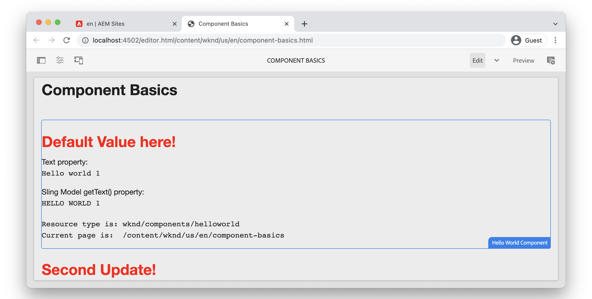

# Grundläggande om komponenter {#component-basics}

I det här kapitlet ska vi utforska den underliggande tekniken i en Adobe Experience Manager (AEM) Sites Component genom ett enkelt `HelloWorld`-exempel. Små ändringar görs i en befintlig komponent, som omfattar ämnen som redigering, HTML, segmenteringsmodeller och klientbibliotek.

## Förutsättningar {#prerequisites}

Granska de verktyg och instruktioner som krävs för att konfigurera en [lokal utvecklingsmiljö](./overview.md#local-dev-environment).

Den IDE som används i videoklippen är [Visual Studio Code](https://code.visualstudio.com/) och plugin-programmet [VSCode AEM Sync](https://marketplace.visualstudio.com/items?itemName=yamato-ltd.vscode-aem-sync) .

## Syfte {#objective}

1. Lär dig vilken roll HTML-mallar och Sling-modeller har för att dynamiskt återge HTML.
1. Förstå hur dialogrutor används för att underlätta framtagning av innehåll.
1. Lär dig grunderna i bibliotek på klientsidan som inkluderar CSS och JavaScript som stöd för en komponent.

## Vad du ska bygga {#what-build}

I det här kapitlet utför du flera ändringar av en enkel `HelloWorld`-komponent. När du uppdaterar komponenten `HelloWorld` får du lära dig mer om de viktigaste områdena AEM komponentutveckling.

## Startprojekt för kapitel {#starter-project}

Det här kapitlet bygger på ett generiskt projekt som genererats av [AEM Project Archetype](https://github.com/adobe/aem-project-archetype). Titta på videon nedan och se [förutsättningarna](#prerequisites) för att komma igång!

>[!NOTE]
>
> Om du har slutfört det föregående kapitlet kan du återanvända projektet och hoppa över stegen för att checka ut startprojektet.

>[!VIDEO](https://video.tv.adobe.com/v/330985?quality=12&learn=on)

Öppna en ny kommandoradsterminal och utför följande åtgärder.

1. Klona [aem-guides-wknd](https://github.com/adobe/aem-guides-wknd)-databasen i en tom katalog:

   ```shell
   $ git clone git@github.com:adobe/aem-guides-wknd.git --branch tutorial/component-basics-start --single-branch
   ```

   >[!NOTE]
   >
   > Du kan också fortsätta använda projektet som skapades i det föregående kapitlet, [Projektinställningar](./project-setup.md).

1. Navigera till mappen `aem-guides-wknd`.

   ```shell
   $ cd aem-guides-wknd
   ```

1. Bygg och distribuera projektet till en lokal instans av AEM med följande kommando:

   ```shell
   $ mvn clean install -PautoInstallSinglePackage
   ```

   >[!NOTE]
   >
   > Om du använder AEM 6.5 eller 6.4 lägger du till profilen `classic` till eventuella Maven-kommandon.

   ```shell
   $ mvn clean install -PautoInstallSinglePackage -Pclassic
   ```

1. Importera projektet till din egen utvecklingsmiljö genom att följa instruktionerna för att konfigurera en [lokal utvecklingsmiljö](overview.md#local-dev-environment).

## Komponentutveckling {#component-authoring}

Komponenter kan ses som små modulära byggstenar på en webbsida. Komponenterna måste vara konfigurerbara för att kunna återanvända dem. Detta sker via författardialogrutan. Låt oss sedan skapa en enkel komponent och kontrollera hur värden från dialogrutan bevaras i AEM.

>[!VIDEO](https://video.tv.adobe.com/v/330986?quality=12&learn=on)

Nedan visas de steg på hög nivå som utförs i videon ovan.

1. Skapa en sida med namnet **Komponentgrunder** under **WKND-plats** `>` **US** `>` **en**.
1. Lägg till **Hello World-komponenten** på den nya sidan.
1. Öppna komponentens dialogruta och ange text. Spara ändringarna för att visa meddelandet på sidan.
1. Växla till utvecklarläge, visa innehållssökvägen i CRXDE-Lite och kontrollera komponentinstansens egenskaper.
1. Använd CRXDE-Lite för att visa skriptet `cq:dialog` och `helloworld.html` från `/apps/wknd/components/content/helloworld`.

## HTML (HTML Template Language) och dialogrutor {#htl-dialogs}

HTML-mallspråk eller **[HTML](https://experienceleague.adobe.com/docs/experience-manager-htl/content/getting-started.html)** är ett lättviktsmallspråk på serversidan som används av AEM komponenter för att återge innehåll.

**Dialogrutor** definierar de konfigurationer som är tillgängliga för en komponent.

Nu uppdaterar vi `HelloWorld` HTML-skriptet för att visa en extra hälsning före textmeddelandet.

>[!VIDEO](https://video.tv.adobe.com/v/330987?quality=12&learn=on)

Nedan visas de steg på hög nivå som utförs i videon ovan.

1. Växla till IDE och öppna projektet i modulen `ui.apps`.
1. Öppna filen `helloworld.html` och uppdatera HTML Markup.
1. Använd IDE-verktygen som [VSCode AEM Sync](https://marketplace.visualstudio.com/items?itemName=yamato-ltd.vscode-aem-sync) för att synkronisera filändringen med den lokala AEM.
1. Återgå till webbläsaren och observera att komponentåtergivningen har ändrats.
1. Öppna filen `.content.xml` som definierar dialogrutan för komponenten `HelloWorld` på:

   ```plain
   <code>/aem-guides-wknd/ui.apps/src/main/content/jcr_root/apps/wknd/components/helloworld/_cq_dialog/.content.xml
   ```

1. Uppdatera dialogrutan för att lägga till ett extra textfält med namnet **Title** med namnet `./title`:

   ```xml
   <?xml version="1.0" encoding="UTF-8"?>
   <jcr:root xmlns:sling="http://sling.apache.org/jcr/sling/1.0" xmlns:cq="http://www.day.com/jcr/cq/1.0" xmlns:jcr="http://www.jcp.org/jcr/1.0" xmlns:nt="http://www.jcp.org/jcr/nt/1.0"
       jcr:primaryType="nt:unstructured"
       jcr:title="Properties"
       sling:resourceType="cq/gui/components/authoring/dialog">
       <content
           jcr:primaryType="nt:unstructured"
           sling:resourceType="granite/ui/components/coral/foundation/fixedcolumns">
           <items jcr:primaryType="nt:unstructured">
               <column
                   jcr:primaryType="nt:unstructured"
                   sling:resourceType="granite/ui/components/coral/foundation/container">
                   <items jcr:primaryType="nt:unstructured">
                       <title
                           jcr:primaryType="nt:unstructured"
                           sling:resourceType="granite/ui/components/coral/foundation/form/textfield"
                           fieldLabel="Title"
                           name="./title"/>
                       <text
                           jcr:primaryType="nt:unstructured"
                           sling:resourceType="granite/ui/components/coral/foundation/form/textfield"
                           fieldLabel="Text"
                           name="./text"/>
                   </items>
               </column>
           </items>
       </content>
   </jcr:root>
   ```

1. Öppna filen `helloworld.html` igen, som representerar det huvudsakliga HTL-skriptet som ansvarar för återgivningen av komponenten `HelloWorld` nedanför sökvägen:

   ```plain
       <code>/aem-guides-wknd.ui.apps/src/main/content/jcr_root/apps/wknd/components/helloworld/helloworld.html
   ```

1. Uppdatera `helloworld.html` för att återge värdet för textfältet **Greeting** som en del av en `H1`-tagg:

   ```html
   <div class="cmp-helloworld" data-cmp-is="helloworld">
       <h1 class="cmp-helloworld__title">${properties.title}</h1>
       ...
   </div>
   ```

1. Distribuera ändringarna till en lokal instans av AEM med utvecklarpluginen eller med dina Maven-kunskaper.

## Sling Models {#sling-models}

Sling Models är annoteringsdrivna Java™ &quot;POJOs&quot; (Plain Old Java™ Objects) som gör det enklare att mappa data från JCR till Java™-variabler. De erbjuder också flera andra institutioner när de utvecklas i samband med AEM.

Sedan gör vi några uppdateringar av `HelloWorldModel`-delningsmodellen för att tillämpa viss affärslogik på de värden som lagras i JCR innan vi skickar dem till sidan.

>[!VIDEO](https://video.tv.adobe.com/v/330988?quality=12&learn=on)

1. Öppna filen `HelloWorldModel.java`, som är den Sling-modell som används med komponenten `HelloWorld`.

   ```plain
   <code>/aem-guides-wknd.core/src/main/java/com/adobe/aem/guides/wknd/core/models/HelloWorldModel.java
   ```

1. Lägg till följande importsatser:

   ```java
   import org.apache.commons.lang3.StringUtils;
   import org.apache.sling.models.annotations.DefaultInjectionStrategy;
   ```

1. Uppdatera `@Model`-anteckningen så att den använder en `DefaultInjectionStrategy`:

   ```java
   @Model(adaptables = Resource.class,
      defaultInjectionStrategy = DefaultInjectionStrategy.OPTIONAL)
      public class HelloWorldModel {
      ...
   ```

1. Lägg till följande rader i klassen `HelloWorldModel` för att mappa värdena för komponentens JCR-egenskaper `title` och `text` till Java™-variabler:

   ```java
   ...
   @Model(adaptables = Resource.class,
   defaultInjectionStrategy = DefaultInjectionStrategy.OPTIONAL)
   public class HelloWorldModel {
   
       ...
   
       @ValueMapValue
       private String title;
   
       @ValueMapValue
       private String text;
   
       @PostConstruct
       protected void init() {
           ...
   ```

1. Lägg till följande metod `getTitle()` i klassen `HelloWorldModel` som returnerar värdet för egenskapen `title`. Den här metoden lägger till ytterligare logik för att returnera strängvärdet &quot;Default Value here!&quot; om egenskapen `title` är null eller tom:

   ```java
   /***
   *
   * @return the value of title, if null or blank returns "Default Value here!"
   */
   public String getTitle() {
       return StringUtils.isNotBlank(title) ? title : "Default Value here!";
   }
   ```

1. Lägg till följande metod `getText()` i klassen `HelloWorldModel` som returnerar värdet för egenskapen `text`. Med den här metoden omvandlas strängen till alla versaler.

   ```java
       /***
       *
       * @return All caps variation of the text value
       */
   public String getText() {
       return StringUtils.isNotBlank(this.text) ? this.text.toUpperCase() : null;
   }
   ```

1. Skapa och distribuera paketet från modulen `core`:

   ```shell
   $ cd core
   $ mvn clean install -PautoInstallBundle
   ```

   >[!NOTE]
   >
   > Använd `mvn clean install -PautoInstallBundle -Pclassic` för AEM 6.4/6.5

1. Uppdatera filen `helloworld.html` vid `aem-guides-wknd.ui.apps/src/main/content/jcr_root/apps/wknd/components/content/helloworld/helloworld.html` om du vill använda de nya metoderna i modellen `HelloWorld`.

   Modellen `HelloWorld` instansieras för den här komponentinstansen via HTML-direktivet: `data-sly-use.model="com.adobe.aem.guides.wknd.core.models.HelloWorldModel"`, och instansen sparas i variabeln `model`.

   Modellinstansen `HelloWorld` är nu tillgänglig i HTML via variabeln `model` med hjälp av `HelloWord`. De här metoderna kan använda förkortad metodsyntax: `${model.getTitle()}` kan förkortas till `${model.title}`.

   På samma sätt injiceras alla HTML-skript med [globala objekt](https://experienceleague.adobe.com/docs/experience-manager-htl/content/global-objects.html) som du kan komma åt med samma syntax som för Sling Model-objekt.

   ```html
   <div class="cmp-helloworld" data-cmp-is="helloworld" 
       data-sly-use.model="com.adobe.aem.guides.wknd.core.models.HelloWorldModel">
       <h1 class="cmp-helloworld__title">${model.title}</h1>
       <div class="cmp-helloworld__item" data-sly-test="${properties.text}">
           <p class="cmp-helloworld__item-label">Text property:</p>
           <pre class="cmp-helloworld__item-output" data-cmp-hook-helloworld="property">${properties.text}</pre>
       </div>
       <div class="cmp-helloworld__item" data-sly-test="${model.text}">
           <p class="cmp-helloworld__item-label">Sling Model getText() property:</p>
           <pre class="cmp-helloworld__item-output" data-cmp-hook-helloworld="property">${model.text}</pre>
       </div>
   </div>
   ```

1. Distribuera ändringarna till en lokal instans av AEM med Eclipse Developer plugin eller med dina Maven-kunskaper.

## Bibliotek på klientsidan {#client-side-libraries}

Klientbibliotek, `clientlibs` för kort, innehåller en mekanism för att organisera och hantera CSS- och JavaScript-filer som krävs för en AEM Sites-implementering. Klientbibliotek är standardsättet att inkludera CSS och JavaScript på en sida i AEM.

Modulen [ui.front](https://experienceleague.adobe.com/docs/experience-manager-core-components/using/developing/archetype/uifrontend.html) är ett frikopplat [webpack](https://webpack.js.org/) -projekt som är integrerat i byggprocessen. Detta gör att du kan använda populära front-end-bibliotek som Sass, LESS och TypeScript. Modulen `ui.frontend` har utforskats mer ingående i kapitlet [Bibliotek på klientsidan](/help/getting-started-wknd-tutorial-develop/project-archetype/client-side-libraries.md).

Uppdatera sedan CSS-formaten för komponenten `HelloWorld`.

>[!VIDEO](https://video.tv.adobe.com/v/340750?quality=12&learn=on)

Nedan visas de steg på hög nivå som utförs i videon ovan.

1. Öppna ett terminalfönster och navigera till katalogen `ui.frontend`

1. Om du befinner dig i katalogen `ui.frontend` kör du kommandot `npm install npm-run-all --save-dev` för att installera nodmodulen [npm-run-all](https://www.npmjs.com/package/npm-run-all) . Det här steget är **obligatoriskt i Archetype 39-genererat AEM**-projekt. I kommande Archetype-version är detta inte nödvändigt.

1. Kör sedan kommandot `npm run watch`:

   ```shell
   $ npm run watch
   ```

1. Växla till IDE och öppna projektet i modulen `ui.frontend`.
1. Öppna filen `ui.frontend/src/main/webpack/components/_helloworld.scss`.
1. Uppdatera filen så att den visar en röd titel:

   ```scss
   .cmp-helloworld {}
   .cmp-helloworld__title {
       color: red;
   }
   ```

1. I terminalen ska du se aktivitet som anger att modulen `ui.frontend` kompilerar och synkroniserar ändringarna med den lokala instansen av AEM.

   ```shell
   Entrypoint site 214 KiB = clientlib-site/site.css 8.45 KiB clientlib-site/site.js 206 KiB
   2022-02-22 17:28:51: webpack 5.69.1 compiled successfully in 119 ms
   change:dist/index.html
   + jcr_root/apps/wknd/clientlibs/clientlib-site/css/site.css
   + jcr_root/apps/wknd/clientlibs/clientlib-site/css
   + jcr_root/apps/wknd/clientlibs/clientlib-site/js/site.js
   + jcr_root/apps/wknd/clientlibs/clientlib-site/js
   + jcr_root/apps/wknd/clientlibs/clientlib-site
   + jcr_root/apps/wknd/clientlibs/clientlib-dependencies/css.txt
   + jcr_root/apps/wknd/clientlibs/clientlib-dependencies/js.txt
   + jcr_root/apps/wknd/clientlibs/clientlib-dependencies
   ```

1. Återgå till webbläsaren och observera att titelfärgen har ändrats.

   

## Grattis! {#congratulations}

Grattis, du har lärt dig grunderna i komponentutveckling i Adobe Experience Manager!

### Nästa steg {#next-steps}

Bekanta dig med Adobe Experience Manager sidor och mallar i nästa kapitel [Sidor och mallar](pages-templates.md). Lär dig mer om hur grundkomponenterna proxideras i projektet och lär dig avancerade policykonfigurationer av redigerbara mallar för att bygga ut en välstrukturerad mall för artikelsidor.

Visa den färdiga koden på [GitHub](https://github.com/adobe/aem-guides-wknd) eller granska och distribuera koden lokalt på Git-grenen `tutorial/component-basics-solution`.
