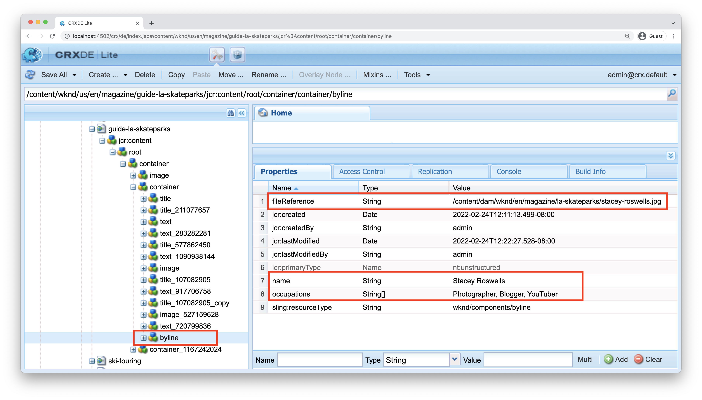
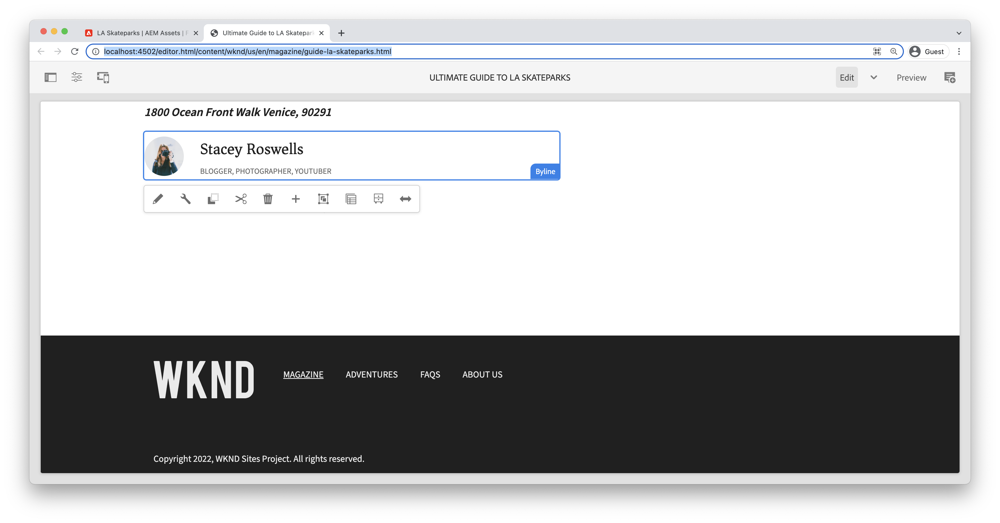

# Egen komponent {#custom-component}

I den här självstudiekursen beskrivs hur du skapar en anpassad AEM Byline-komponent som visar innehåll som har skapats i en dialogruta och utforskar hur du utvecklar en Sling-modell för att kapsla in affärslogik som fyller komponentens HTML-kod.

## Förutsättningar {#prerequisites}

Granska de verktyg och instruktioner som krävs för att konfigurera en [lokal utvecklingsmiljö](overview.md#local-dev-environment).

### Startprojekt

>[!NOTE]
>
> Om du har slutfört det föregående kapitlet kan du återanvända projektet och hoppa över stegen för att checka ut startprojektet.

Ta en titt på den baslinjekod som självstudiekursen bygger på:

1. Kolla in grenen `tutorial/custom-component-start` från [GitHub](https://github.com/adobe/aem-guides-wknd)

   ```shell
   $ cd aem-guides-wknd
   $ git checkout tutorial/custom-component-start
   ```

1. Distribuera kodbasen till en lokal AEM med dina Maven-kunskaper:

   ```shell
   $ mvn clean install -PautoInstallSinglePackage
   ```

   >[!NOTE]
   >
   > Om du använder AEM 6.5 eller 6.4 lägger du till profilen `classic` till valfritt Maven-kommando.

   ```shell
   $ mvn clean install -PautoInstallSinglePackage -Pclassic
   ```

Du kan alltid visa den färdiga koden på [GitHub](https://github.com/adobe/aem-guides-wknd/tree/tutorial/custom-component-solution) eller checka ut koden lokalt genom att växla till grenen `tutorial/custom-component-solution`.

## Syfte

1. Förstå hur du skapar en anpassad AEM
1. Lär dig kapsla in affärslogik med Sling Models
1. Förstå hur du använder en segmenteringsmodell i ett HTML-skript

## Vad du ska bygga {#byline-component}

I den här delen av WKND-självstudiekursen skapas en Byline-komponent som används för att visa redigerad information om en artikels medverkande.


*Byline-komponent*

Implementeringen av komponenten Byline innehåller en dialogruta som samlar in byline-innehållet och en anpassad Sling-modell som hämtar bylines:

* Namn
* Bild
* Yrken

## Skapa Byline-komponent {#create-byline-component}

Skapa först nodstrukturen för Byline-komponenten och definiera en dialogruta. Detta representerar komponenten i AEM och definierar implicit komponentens resurstyp genom sin placering i JCR-läsaren.

Dialogrutan visar gränssnittet som innehållsförfattare kan använda. För den här implementeringen används den AEM WCM Core-komponentens **Image**-komponent för att hantera redigering och återgivning av Bylines bild, så den ställs in som vår komponents `sling:resourceSuperType`.

### Skapa komponentdefinition {#create-component-definition}

1. I modulen **ui.apps** navigerar du till `/apps/wknd/components` och skapar en ny mapp med namnet `byline`.
1. Under mappen `byline` lägger du till en ny fil med namnet `.content.xml`

   

1. Fyll i `.content.xml`-filen med följande:

   ```xml
   <?xml version="1.0" encoding="UTF-8"?>
       <jcr:root xmlns:sling="http://sling.apache.org/jcr/sling/1.0" xmlns:cq="http://www.day.com/jcr/cq/1.0" xmlns:jcr="http://www.jcp.org/jcr/1.0"
       jcr:primaryType="cq:Component"
       jcr:title="Byline"
       jcr:description="Displays a contributor's byline."
       componentGroup="WKND Sites Project - Content"
       sling:resourceSuperType="core/wcm/components/image/v2/image"/>
   ```

   Ovanstående XML-fil innehåller definitionen för komponenten, inklusive rubrik, beskrivning och grupp. `sling:resourceSuperType` pekar på `core/wcm/components/image/v2/image`, som är [kärnbildkomponenten](https://experienceleague.adobe.com/docs/experience-manager-core-components/using/components/image.html).

### Skapa HTML-skriptet {#create-the-htl-script}

1. Under mappen `byline` lägger du till en ny fil `byline.html` som ansvarar för HTML-presentationen av komponenten. Det är viktigt att ge filen samma namn som mappen eftersom det blir standardskriptet som Sling använder för att återge den här resurstypen.

1. Lägg till följande kod i `byline.html`.

   ```html
   <!--/* byline.html */-->
   <div data-sly-use.placeholderTemplate="core/wcm/components/commons/v1/templates.html">
   </div>
   <sly data-sly-call="${placeholderTemplate.placeholder @ isEmpty=true}"></sly>
   ```

`byline.html` kommer att  [granskas senare](#byline-htl) när Sling Model har skapats. HTML-filens aktuella läge gör att komponenten kan visas i ett tomt läge i sidredigeraren i AEM Sites när den dras och släpps på sidan.

### Skapa dialogdefinitionen {#create-the-dialog-definition}

Definiera sedan en dialogruta för den inbyggda komponenten med följande fält:

* **Namn**: ett textfält som medarbetarens namn.
* **Bild**: en referens till medverkarens biobild.
* **Yrken**: en lista över de yrken som tillskrivs medarbetaren. Ytor ska sorteras alfabetiskt i stigande ordning (a till z).

1. Skapa en ny mapp med namnet `_cq_dialog` under mappen `byline`.
1. Under `byline/_cq_dialog` lägger du till en ny fil med namnet `.content.xml`. Det här är XML-definitionen för dialogrutan. Lägg till följande XML:

   ```xml
   <?xml version="1.0" encoding="UTF-8"?>
   <jcr:root xmlns:sling="http://sling.apache.org/jcr/sling/1.0" xmlns:cq="http://www.day.com/jcr/cq/1.0" xmlns:jcr="http://www.jcp.org/jcr/1.0" xmlns:nt="http://www.jcp.org/jcr/nt/1.0"
           jcr:primaryType="nt:unstructured"
           jcr:title="Byline"
           sling:resourceType="cq/gui/components/authoring/dialog">
       <content
               jcr:primaryType="nt:unstructured"
               sling:resourceType="granite/ui/components/coral/foundation/container">
           <items jcr:primaryType="nt:unstructured">
               <tabs
                       jcr:primaryType="nt:unstructured"
                       sling:resourceType="granite/ui/components/coral/foundation/tabs"
                       maximized="{Boolean}false">
                   <items jcr:primaryType="nt:unstructured">
                       <asset
                               jcr:primaryType="nt:unstructured"
                               sling:hideResource="{Boolean}false"/>
                       <metadata
                               jcr:primaryType="nt:unstructured"
                               sling:hideResource="{Boolean}true"/>
                       <properties
                               jcr:primaryType="nt:unstructured"
                               jcr:title="Properties"
                               sling:resourceType="granite/ui/components/coral/foundation/container"
                               margin="{Boolean}true">
                           <items jcr:primaryType="nt:unstructured">
                               <columns
                                       jcr:primaryType="nt:unstructured"
                                       sling:resourceType="granite/ui/components/coral/foundation/fixedcolumns"
                                       margin="{Boolean}true">
                                   <items jcr:primaryType="nt:unstructured">
                                       <column
                                               jcr:primaryType="nt:unstructured"
                                               sling:resourceType="granite/ui/components/coral/foundation/container">
                                           <items jcr:primaryType="nt:unstructured">
                                               <name
                                                       jcr:primaryType="nt:unstructured"
                                                       sling:resourceType="granite/ui/components/coral/foundation/form/textfield"
                                                       emptyText="Enter the contributor's name to display."
                                                       fieldDescription="The contributor's name to display."
                                                       fieldLabel="Name"
                                                       name="./name"
                                                       required="{Boolean}true"/>
                                               <occupations
                                                       jcr:primaryType="nt:unstructured"
                                                       sling:resourceType="granite/ui/components/coral/foundation/form/multifield"
                                                       fieldDescription="A list of the contributor's occupations."
                                                       fieldLabel="Occupations"
                                                       required="{Boolean}false">
                                                   <field
                                                           jcr:primaryType="nt:unstructured"
                                                           sling:resourceType="granite/ui/components/coral/foundation/form/textfield"
                                                           emptyText="Enter an occupation"
                                                           name="./occupations"/>
                                               </occupations>
                                           </items>
                                       </column>
                                   </items>
                               </columns>
                           </items>
                       </properties>
                   </items>
               </tabs>
           </items>
       </content>
   </jcr:root>
   ```

   Dessa noddefinitioner i dialogrutan använder [Sling Resource Merger](https://sling.apache.org/documentation/bundles/resource-merger.html) för att styra vilka dialogrutor som ärvs från komponenten `sling:resourceSuperType`, i det här fallet **Core Components&#39; Image component**.

   

### Skapa dialogrutan Princip {#create-the-policy-dialog}

På samma sätt som när du skapar en dialogruta skapar du en principdialogruta (tidigare kallad designdialogruta) som döljer oönskade fält i principkonfigurationen som ärvts från kärnkomponentens image-komponent.

1. Skapa en ny mapp med namnet `_cq_design_dialog` under mappen `byline`.
1. Under `byline/_cq_design_dialog` skapar du en ny fil med namnet `.content.xml`. Uppdatera filen med följande: med följande XML. Det är enklast att öppna `.content.xml` och kopiera/klistra in XML-filen nedan i den.

   ```xml
   <?xml version="1.0" encoding="UTF-8"?>
   <jcr:root xmlns:sling="http://sling.apache.org/jcr/sling/1.0" xmlns:granite="http://www.adobe.com/jcr/granite/1.0" xmlns:cq="http://www.day.com/jcr/cq/1.0" xmlns:jcr="http://www.jcp.org/jcr/1.0" xmlns:nt="http://www.jcp.org/jcr/nt/1.0"
       jcr:primaryType="nt:unstructured"
       jcr:title="Byline"
       sling:resourceType="cq/gui/components/authoring/dialog">
       <content
               jcr:primaryType="nt:unstructured">
           <items jcr:primaryType="nt:unstructured">
               <tabs
                       jcr:primaryType="nt:unstructured">
                   <items jcr:primaryType="nt:unstructured">
                       <properties
                               jcr:primaryType="nt:unstructured">
                           <items jcr:primaryType="nt:unstructured">
                               <content
                                       jcr:primaryType="nt:unstructured">
                                   <items jcr:primaryType="nt:unstructured">
                                       <decorative
                                               jcr:primaryType="nt:unstructured"
                                               sling:hideResource="{Boolean}true"/>
                                       <altValueFromDAM
                                               jcr:primaryType="nt:unstructured"
                                               sling:hideResource="{Boolean}true"/>
                                       <titleValueFromDAM
                                               jcr:primaryType="nt:unstructured"
                                               sling:hideResource="{Boolean}true"/>
                                       <displayCaptionPopup
                                               jcr:primaryType="nt:unstructured"
                                               sling:hideResource="{Boolean}true"/>
                                       <disableUuidTracking
                                               jcr:primaryType="nt:unstructured"
                                               sling:hideResource="{Boolean}true"/>
                                   </items>
                               </content>
                           </items>
                       </properties>
                       <features
                               jcr:primaryType="nt:unstructured">
                           <items jcr:primaryType="nt:unstructured">
                               <content
                                       jcr:primaryType="nt:unstructured">
                                   <items jcr:primaryType="nt:unstructured">
                                       <accordion
                                               jcr:primaryType="nt:unstructured">
                                           <items jcr:primaryType="nt:unstructured">
                                               <orientation
                                                       jcr:primaryType="nt:unstructured"
                                                       sling:hideResource="{Boolean}true"/>
                                               <crop
                                                       jcr:primaryType="nt:unstructured"
                                                       sling:hideResource="{Boolean}true"/>
                                           </items>
                                       </accordion>
                                   </items>
                               </content>
                           </items>
                       </features>
                   </items>
               </tabs>
           </items>
       </content>
   </jcr:root>
   ```

   Basen för föregående **principdialogruta** XML hämtades från [kärnkomponentavbildningskomponenten](https://github.com/adobe/aem-core-wcm-components/blob/master/content/src/content/jcr_root/apps/core/wcm/components/image/v2/image/_cq_design_dialog/.content.xml).

   Precis som i dialogrutan används [Sling Resource Merger](https://sling.apache.org/documentation/bundles/resource-merger.html) för att dölja irrelevanta fält som annars ärvs från `sling:resourceSuperType`, vilket noddefinitionerna kan se med egenskapen `sling:hideResource="{Boolean}true"`.

### Distribuera koden {#deploy-the-code}

1. Distribuera den uppdaterade kodbasen till en lokal AEM med dina Maven-kunskaper:

   ```shell
   $ cd aem-guides-wknd
   $ mvn clean install -PautoInstallSinglePackage
   ```

## Lägga till komponenten på en sida {#add-the-component-to-a-page}

För att hålla saker enkla och fokuserade på AEM komponentutveckling lägger vi till komponenten Byline i det aktuella läget på en artikelsida för att verifiera att noddefinitionen `cq:Component` är distribuerad och korrekt, AEM känner igen den nya komponentdefinitionen och komponentens dialogruta fungerar för redigering.

### Lägga till en bild i AEM Assets

Ladda först upp ett provhuvud som tagits till AEM Assets för att fylla i bilden i Byline-komponenten.

1. Gå till mappen LA Skateparks i AEM Assets: [http://localhost:4502/assets.html/content/dam/wknd/en/magazine/la-skateparks](http://localhost:4502/assets.html/content/dam/wknd/en/magazine/la-skateparks).

1. Överför huvudbilden för **[stacey-roswells.jpg](assets/custom-component/stacey-roswells.jpg)** till mappen.

   

### Skapa komponenten {#author-the-component}

Lägg sedan till komponenten Byline på en sida i AEM. Eftersom vi har lagt till komponenten Byline i **WKND Sites Project - Content** Component Group, via `ui.apps/src/main/content/jcr_root/apps/wknd/components/byline/.content.xml`-definitionen, är den automatiskt tillgänglig för alla **behållare** vars **policy** tillåter komponentgruppen **WKND Sites Project - Content**, som artikelsidan s Layout Container är.

1. Gå till LA Skatepark-artikeln på: [http://localhost:4502/editor.html/content/wknd/us/en/magazine/guide-la-skateparks.html](http://localhost:4502/editor.html/content/wknd/us/en/magazine/guide-la-skateparks.html)

1. Dra och släpp en **Byline-komponent** från vänster sidofält till **nederst** på den öppnade artikelsidans layoutbehållare.

   

1. Kontrollera att det vänstra sidofältet **är öppet** och synligt, och att **resurssökaren** är markerad.

   

1. Markera **platshållaren för instickskomponenten**, som i sin tur visar åtgärdsfältet och trycker på ikonen **skiftnyckel** för att öppna dialogrutan.

   

1. Öppna dialogrutan och den första fliken (Tillgång) aktiv, öppna det vänstra sidofältet och dra en bild till bildens släppzon från resurssökaren. Sök efter&quot;stacey&quot; för att hitta biobilden Stacey Roswells som finns i WKND-paketet ui.content.

   

1. När du har lagt till en bild klickar du på fliken **Egenskaper** och anger **Namn** och **Ytor**.

   När du anger yrken anger du dem i **omvänd alfabetisk** ordning så att den alfabetiska affärslogik som vi implementerar i Sling Model är tydlig.

   Tryck på knappen **Klar** längst ned till höger för att spara ändringarna.

   

   AEM konfigurerar och redigerar komponenter via dialogrutorna. I nuläget ingår dialogrutorna för datainsamling i utvecklingen av komponenten Byline, men logiken för att återge det redigerade innehållet har ännu inte lagts till. Därför visas bara platshållaren.

1. När du har sparat dialogrutan går du till [CRXDE Lite](http://localhost:4502/crx/de/index.jsp#/content/wknd/us/en/magazine/guide-la-skateparks/jcr%3Acontent/root/container/container/byline) och granskar hur komponentens innehåll lagras på innehållsnoden för instickskomponenten under AEM.

   Hitta innehållsnoden för komponenten Byline under sidan LA Skate Parks, d.v.s. `/content/wknd/us/en/magazine/guide-la-skateparks/jcr:content/root/container/container/byline`.

   Observera att egenskapsnamnen `name`, `occupations` och `fileReference` lagras på **byline-noden**.

   Lägg också märke till att noden `sling:resourceType` är inställd på `wknd/components/content/byline`, vilket är vad som binder den här innehållsnoden till implementeringen av komponenten Byline.

   

## Skapa Byline Sling Model {#create-sling-model}

Sedan skapar vi en Sling-modell som fungerar som datamodell och lagrar affärslogiken för Byline-komponenten.

Sling Models är anteckningsdrivna Java &quot;POJO&#39;s&quot; (Plain Old Java Objects) som underlättar mappningen av data från JCR till Java-variabler och som ger ett antal andra instanser vid utveckling i AEM.

### Granska Maven Dependencies {#maven-dependency}

Byline Sling Model förlitar sig på flera Java-API:er som tillhandahålls av AEM. Dessa API:er är tillgängliga via `dependencies` som anges i POM-filen för modulen `core`. Det projekt som används för den här självstudiekursen har skapats för AEM som Cloud Service. Men den är unik eftersom den är bakåtkompatibel med AEM 6.5/6.4. Därför ingår både beroenden för Cloud Service och AEM 6.x.

1. Öppna filen `pom.xml` under `<src>/aem-guides-wknd/core/pom.xml`.
1. Hitta beroendet för `aem-sdk-api` - **AEM som en Cloud Service Endast**

   ```xml
   <dependency>
       <groupId>com.adobe.aem</groupId>
       <artifactId>aem-sdk-api</artifactId>
   </dependency>
   ```

   [aem-sdk-api](https://experienceleague.adobe.com/docs/experience-manager-cloud-service/implementing/developing/aem-as-a-cloud-service-sdk.html?lang=en#building-for-the-sdk) innehåller alla publika Java-API:er som exponeras av AEM. `aem-sdk-api` används som standard när det här projektet skapas. Versionen bibehålls i den överordnade reaktorversionen som finns i projektets rot på `aem-guides-wknd/pom.xml`.

1. Hitta endast beroendet för `uber-jar` - **AEM 6.5/6.4**

   ```xml
   ...
       <dependency>
           <groupId>com.adobe.aem</groupId>
           <artifactId>uber-jar</artifactId>
           <classifier>apis</classifier>
       </dependency>
   ...
   ```

   `uber-jar` inkluderas bara när profilen `classic` anropas, d.v.s. `mvn clean install -PautoInstallSinglePackage -Pclassic`. Detta är unikt för det här projektet. I ett verkligt projekt som genereras från AEM Project Archetype är `uber-jar` standardvärdet om den AEM versionen är 6.5 eller 6.4.

   [uber-jar](https://docs.adobe.com/content/help/en/experience-manager-65/developing/devtools/ht-projects-maven.html#experience-manager-api-dependencies) innehåller alla publika Java-API:er som exponeras av AEM 6.x. Versionen bibehålls i den överordnade reaktorversionen som finns i projektets rot `aem-guides-wknd/pom.xml`.

1. Hitta beroendet för `core.wcm.components.core`:

   ```xml
    <!-- Core Component Dependency -->
       <dependency>
           <groupId>com.adobe.cq</groupId>
           <artifactId>core.wcm.components.core</artifactId>
       </dependency>
   ```

   Detta är alla offentliga Java-API:er som exponeras av AEM Core Components. AEM är ett projekt som underhålls utanför AEM och därför har en separat releasecykel. Därför är det ett beroende som måste tas med separat och **inte** ingår i `uber-jar` eller `aem-sdk-api`.

   Liksom för uber-jar finns versionen för detta beroende kvar i den överordnade reaktorns pom-fil som finns på `aem-guides-wknd/pom.xml`.

   Senare i den här självstudiekursen använder vi klassen Core Component Image för att visa bilden i komponenten Byline. Det är nödvändigt att ha beroendet av kärnkomponenten för att kunna skapa och kompilera vår Sling-modell.

### Byline-gränssnitt {#byline-interface}

Skapa ett publikt Java-gränssnitt för Byline. `Byline.java` definierar de publika metoder som behövs för att köra  `byline.html` HTML-skriptet.

1. Skapa en ny fil med namnet `Byline.java` i modulen `aem-guides-wknd.core` under `core/src/main/java/com/adobe/aem/guides/wknd/core/models`

   

1. Uppdatera `Byline.java` med följande metoder:

   ```java
   package com.adobe.aem.guides.wknd.core.models;
   
   import java.util.List;
   
   /**
   * Represents the Byline AEM Component for the WKND Site project.
   **/
   public interface Byline {
       /***
       * @return a string to display as the name.
       */
       String getName();
   
       /***
       * Occupations are to be sorted alphabetically in a descending order.
       *
       * @return a list of occupations.
       */
       List<String> getOccupations();
   
       /***
       * @return a boolean if the component has enough content to display.
       */
       boolean isEmpty();
   }
   ```

   De första två metoderna visar värdena för **name** och **arbetsuppgifterna** för Byline-komponenten.

   Metoden `isEmpty()` används för att avgöra om komponenten har något innehåll att återge eller om den väntar på att konfigureras.

   Observera att det inte finns någon metod för bilden. [vi ska ta en titt på varför det är senare](#tackling-the-image-problem).

1. Java-paket som innehåller publika Java-klasser, i det här fallet en Sling-modell, måste versionshanteras med paketets `package-info.java`-fil.

Eftersom WKND-källans Java-paket `com.adobe.aem.guides.wknd.core.models` deklarerar en version av `2.0.0`, och vi lägger till ett hårt offentligt gränssnitt och metoder, måste versionen ökas till `2.1.0`. Öppna filen på `core/src/main/java/com/adobe/aem/guides/wknd/core/models/package-info.java` och uppdatera `@Version("2.0.0")` till `@Version("2.1.0")`.

    &quot;
    @Version(&quot;2.1.0&quot;)
    package com.adobe.aem.guides.wknd.core.models;
    
    import org.osgi.annotation.versioning.Version;
    &quot;

När du ändrar filerna i det här paketet måste du justera [paketversionen semantiskt](https://semver.org/). Om inte, kommer Maven-projektets [bnd-baseline-maven-plugin](https://github.com/bndtools/bnd/tree/master/maven/bnd-baseline-maven-plugin) att upptäcka en ogiltig paketversion och bryta den byggda. Som tur är rapporterar plugin-programmet Maven den ogiltiga versionen av Java-paketet samt versionen som det ska vara. `@Version("...")`-deklarationen i Java-paketets `package-info.java` har uppdaterats till den version som rekommenderas av plugin-programmet för att korrigeras.

### Byline-implementering {#byline-implementation}

`BylineImpl.java` är implementeringen av Sling-modellen som implementerar det  `Byline.java` gränssnitt som definierades tidigare. Den fullständiga koden för `BylineImpl.java` finns längst ned i det här avsnittet.

1. Skapa en ny mapp med namnet `impl` under `core/src/main/java/com/adobe/aem/guides/core/models`.
1. Skapa en ny fil `BylineImpl.java` i mappen `impl`.

   

1. Öppna `BylineImpl.java`. Ange att det implementerar gränssnittet `Byline`. Använd de automatiska funktionerna för IDE eller uppdatera filen manuellt för att inkludera de metoder som behövs för att implementera gränssnittet `Byline`:

   ```java
   package com.adobe.aem.guides.wknd.core.models.impl;
   import java.util.List;
   import com.adobe.aem.guides.wknd.core.models.Byline;
   
   public class BylineImpl implements Byline {
   
       @Override
       public String getName() {
           // TODO Auto-generated method stub
           return null;
       }
   
       @Override
       public List<String> getOccupations() {
           // TODO Auto-generated method stub
           return null;
       }
   
       @Override
       public boolean isEmpty() {
           // TODO Auto-generated method stub
           return false;
       }
   }
   ```

1. Lägg till Sling Model-anteckningar genom att uppdatera `BylineImpl.java` med följande anteckningar på klassnivå. Den här `@Model(..)`anteckningen är det som gör klassen till en Sling-modell.

   ```java
   import org.apache.sling.api.SlingHttpServletRequest;
   import org.apache.sling.models.annotations.Model;
   import org.apache.sling.models.annotations.DefaultInjectionStrategy;
   ...
   @Model(
           adaptables = {SlingHttpServletRequest.class},
           adapters = {Byline.class},
           resourceType = {BylineImpl.RESOURCE_TYPE},
           defaultInjectionStrategy = DefaultInjectionStrategy.OPTIONAL
   )
   public class BylineImpl implements Byline {
       protected static final String RESOURCE_TYPE = "wknd/components/content/byline";
       ...
   }
   ```

   Låt oss granska den här kommentaren och dess parametrar:

   * `@Model`-anteckningen registrerar BylineImpl som en Sling-modell när den distribueras till AEM.
   * Parametern `adaptables` anger att den här modellen kan anpassas av begäran.
   * Parametern `adapters` gör att implementeringsklassen kan registreras under Byline-gränssnittet. Detta gör att HTML-skriptet kan anropa Sling-modellen via gränssnittet (i stället för impl direkt). [Mer information om adaptrar finns här](https://sling.apache.org/documentation/bundles/models.html#specifying-an-alternate-adapter-class-since-110).
   * `resourceType` pekar på Byline-komponentens resurstyp (skapades tidigare) och hjälper till att lösa rätt modell om det finns flera implementeringar. [Mer information om hur du associerar en modellklass med en resurstyp finns här](https://sling.apache.org/documentation/bundles/models.html#associating-a-model-class-with-a-resource-type-since-130).

### Implementera Sling Model-metoder {#implementing-the-sling-model-methods}

#### getName() {#implementing-get-name}

Den första metoden som vi ska ta itu med är `getName()`, som helt enkelt returnerar det värde som lagras till bylines JCR-innehållsnod under egenskapen `name`.

För detta används `@ValueMapValue` Sling Model-anteckningen för att mata in värdet i ett Java-fält med hjälp av Request-resursens ValueMap.


```java
import org.apache.sling.models.annotations.injectorspecific.ValueMapValue;

public class BylineImpl implements Byline {
    ...
    @ValueMapValue
    private String name;

    ...
    @Override
    public String getName() {
        return name;
    }
    ...
}
```

Eftersom JCR-egenskapen har samma namn som Java-fältet (båda är &quot;name&quot;), tolkas associationen automatiskt av `@ValueMapValue` och egenskapens värde injiceras i Java-fältet.

#### getOccupations() {#implementing-get-occupations}

Nästa metod som ska implementeras är `getOccupations()`. Den här metoden samlar in alla funktioner som lagras i JCR-egenskapen `occupations` och returnerar en sorterad (alfabetisk) samling av dem.

Med samma teknik som beskrivs i `getName()` kan egenskapsvärdet injiceras i fältet för delningsmodellen.

När JCR-egenskapsvärdena är tillgängliga i Sling Model via det inmatade Java-fältet `occupations` kan sorteringsaffärslogiken användas i metoden `getOccupations()`.


```java
import java.util.ArrayList;
import java.util.Collections;
  ...

public class BylineImpl implements Byline {
    ...
    @ValueMapValue
    private List<String> occupations;
    ...
    @Override
    public List<String> getOccupations() {
        if (occupations != null) {
            Collections.sort(occupations);
            return new ArrayList<String>(occupations);
        } else {
            return Collections.emptyList();
        }
    }
    ...
}
  ...
```


#### isEmpty() {#implementing-is-empty}

Den sista publika metoden är `isEmpty()` som avgör när komponenten ska se sig själv som&quot;skapad tillräckligt&quot; för att återge.

För den här komponenten har vi affärskrav som anger att alla tre fält, namn, bild och yrken måste fyllas i *innan* komponenten kan återges.


```java
import org.apache.commons.lang3.StringUtils;
  ...
public class BylineImpl implements Byline {
    ...
    @Override
    public boolean isEmpty() {
        if (StringUtils.isBlank(name)) {
            // Name is missing, but required
            return true;
        } else if (occupations == null || occupations.isEmpty()) {
            // At least one occupation is required
            return true;
        } else if (/* image is not null, logic to be determined */) {
            // A valid image is required
            return true;
        } else {
            // Everything is populated, so this component is not considered empty
            return false;
        }
    }
    ...
}
```


#### Hantering av &quot;Bildproblem&quot; {#tackling-the-image-problem}

Det är enkelt att kontrollera namn och villkor för yrket (och klassen Apache Commons Lang3 är alltid användbar [StringUtils](https://commons.apache.org/proper/commons-lang/apidocs/org/apache/commons/lang3/StringUtils.html)), men det är oklart hur **förekomsten av bilden** kan valideras eftersom bildkomponenten Core Components Image används för att visa bilden.

Det finns två sätt att ta itu med detta:

Kontrollera om JCR-egenskapen `fileReference` matchar en resurs. ** ORConvertera den här resursen till en Core Component Image Sling Model och kontrollera att  `getSrc()` metoden inte är tom.

Vi kommer att välja **andra**-metoden. Det första tillvägagångssättet är förmodligen tillräckligt, men i den här självstudien kommer det senare att användas för att vi ska kunna utforska andra funktioner i Sling Models.

1. Skapa en privat metod som hämtar bilden. Den här metoden är privat eftersom vi inte behöver visa bildobjektet i själva HTML-koden och den används bara för att köra `isEmpty().`

   Följande privata metod för `getImage()`:

   ```java
   import com.adobe.cq.wcm.core.components.models.Image;
   ...
   private Image getImage() {
       Image image = null;
       // Figure out how to populate the image variable!
       return image;
   }
   ```

   Som vi nämnt ovan finns det ytterligare två sätt att hämta **Image Sling Model**:

   Den första använder anteckningen `@Self` för att automatiskt anpassa den aktuella begäran till kärnkomponentens `Image.class`

   ```java
   @Self
   private Image image;
   ```

   Den andra använder tjänsten [Apache Sling ModelFactory](https://sling.apache.org/apidocs/sling10/org/apache/sling/models/factory/ModelFactory.html) OSGi, som är en mycket användbar tjänst, och hjälper oss att skapa Sling-modeller av andra typer i Java-kod.

   Vi väljer den andra metoden.

   >[!NOTE]
   >
   >I en implementering i verkligheten är metoden&quot;One&quot; att använda `@Self` att föredra eftersom det är den enklare och mer eleganta lösningen. I den här självstudiekursen ska vi använda den andra metoden, eftersom den kräver att vi utforskar fler aspekter av Sling Models som är extremt användbara är mer komplexa komponenter!

   Eftersom Sling Models är Java POJO:er, och inte OSGi Services, kan de vanliga OSGi-injektionskommentarerna `@Reference` **inte användas, i stället tillhandahåller Sling Models en speciell**[@OSGiService](https://sling.apache.org/documentation/bundles/models.html#injector-specific-annotations)**-anteckning som ger liknande funktioner.**

1. Uppdatera `BylineImpl.java` så att den innehåller `OSGiService`-anteckningen som ska mata in `ModelFactory`:

   ```java
   import org.apache.sling.models.factory.ModelFactory;
   import org.apache.sling.models.annotations.injectorspecific.OSGiService;
   ...
   public class BylineImpl implements Byline {
       ...
       @OSGiService
       private ModelFactory modelFactory;
   }
   ```

   Med `ModelFactory` tillgängligt kan du skapa en Core Component Image Sling-modell med:

   ```java
   modelFactory.getModelFromWrappedRequest(SlingHttpServletRequest request, Resource resource, java.lang.Class<T> targetClass)
   ```

   Den här metoden kräver dock både en begäran och en resurs, som ännu inte är tillgänglig i segmentmodellen. Fler Sling Model-anteckningar används för att få dessa.

   För att hämta den aktuella begäran kan anteckningen **[@Self](https://sling.apache.org/documentation/bundles/models.html#injector-specific-annotations)** användas för att mata in `adaptable` (som definieras i `@Model(..)` som `SlingHttpServletRequest.class` i ett Java-klassfält.

1. Lägg till **@Self**-anteckningen för att hämta **SlingHttpServletRequest-begäran**:

   ```java
   import org.apache.sling.models.annotations.injectorspecific.Self;
   ...
   @Self
   private SlingHttpServletRequest request;
   ```

   Kom ihåg att när du använder `@Self Image image` för att mata in Core Component Image Sling Model var ett alternativ ovanför - `@Self`-anteckningen försöker mata in det adapterbara objektet (i vårt fall en SlingHttpServletRequest) och anpassa sig till anteckningsfältstypen. Eftersom Core Component Image Sling Model är anpassningsbar från SlingHttpServletRequest-objekt, skulle detta ha fungerat och är mindre kod än vår mer utforskande metod.

   Nu har vi injicerat de variabler som krävs för att skapa en instans av vår Image-modell via API:t för ModelFactory. Vi använder Sling Model-anteckningen **[@PostConstruct](https://sling.apache.org/documentation/bundles/models.html#postconstruct-methods)** för att hämta det här objektet efter att Sling Model har instansierats.

   `@PostConstruct` är mycket användbart och fungerar i liknande kapacitet som en konstruktor, men anropas när klassen har instansierats och alla kommenterade Java-fält har injicerats. Andra Sling Model-anteckningar kommenterar Java-klassfält (variabler), `@PostConstruct` kommenterar en void, zero-parametermetod, vanligtvis med namnet `init()` (men kan namnges vad som helst).

1. Lägg till metoden **@PostConstruct**:

   ```java
   import javax.annotation.PostConstruct;
   ...
   public class BylineImpl implements Byline {
       ...
       private Image image;
   
       @PostConstruct
       private void init() {
           image = modelFactory.getModelFromWrappedRequest(request,
                                                           request.getResource(),
                                                           Image.class);
       }
       ...
   }
   ```

   Kom ihåg att Sling Models är **NOT** OSGi Services, så det är säkert att behålla klasstillstånd. `@PostConstruct` härleder och ställer ofta in Sling Model-klasstillstånd för senare användning, som liknar det som en vanlig konstruktor gör.

   Observera att om metoden `@PostConstruct` genererar ett undantag, kommer inte SSLING-modellen att initiera (den kommer att vara null).

1. **getImage()** kan nu uppdateras för att returnera bildobjektet.

   ```java
   /**
       * @return the Image Sling Model of this resource, or null if the resource cannot create a valid Image Sling Model.
   */
   private Image getImage() {
       return image;
   }
   ```

1. Vi går tillbaka till `isEmpty()` och slutför implementeringen:

   ```java
   @Override
   public boolean isEmpty() {
      final Image componentImage = getImage();
   
       if (StringUtils.isBlank(name)) {
           // Name is missing, but required
           return true;
       } else if (occupations == null || occupations.isEmpty()) {
           // At least one occupation is required
           return true;
       } else if (componentImage == null || StringUtils.isBlank(componentImage.getSrc())) {
           // A valid image is required
           return true;
       } else {
           // Everything is populated, so this component is not considered empty
           return false;
       }
   }
   ```

   Observera att flera anrop till `getImage()` inte är problematiska eftersom returnerar den initierade `image`-klassvariabeln och inte anropar `modelFactory.getModelFromWrappedRequest(...)` som inte är alltför dyr, utan bör undvika att anropa i onödan.

1. Den sista `BylineImpl.java` ska se ut så här:


   ```java
   package com.adobe.aem.guides.wknd.core.models.impl;
   
   import java.util.ArrayList;
   import java.util.Collections;
   import java.util.List;
   import javax.annotation.PostConstruct;
   import org.apache.commons.lang3.StringUtils;
   import org.apache.sling.api.SlingHttpServletRequest;
   import org.apache.sling.models.annotations.DefaultInjectionStrategy;
   import org.apache.sling.models.annotations.Model;
   import org.apache.sling.models.annotations.injectorspecific.OSGiService;
   import org.apache.sling.models.annotations.injectorspecific.Self;
   import org.apache.sling.models.annotations.injectorspecific.ValueMapValue;
   import org.apache.sling.models.factory.ModelFactory;
   import com.adobe.aem.guides.wknd.core.models.Byline;
   import com.adobe.cq.wcm.core.components.models.Image;
   
   @Model(
           adaptables = {SlingHttpServletRequest.class},
           adapters = {Byline.class},
           resourceType = {BylineImpl.RESOURCE_TYPE},
           defaultInjectionStrategy = DefaultInjectionStrategy.OPTIONAL
   )
   public class BylineImpl implements Byline {
       protected static final String RESOURCE_TYPE = "wknd/components/content/byline";
   
       @Self
       private SlingHttpServletRequest request;
   
       @OSGiService
       private ModelFactory modelFactory;
   
       @ValueMapValue
       private String name;
   
       @ValueMapValue
       private List<String> occupations;
   
       private Image image;
   
       @PostConstruct
       private void init() {
           image = modelFactory.getModelFromWrappedRequest(request, request.getResource(), Image.class);
       }
   
       @Override
       public String getName() {
           return name;
       }
   
       @Override
       public List<String> getOccupations() {
           if (occupations != null) {
               Collections.sort(occupations);
               return new ArrayList<String>(occupations);
           } else {
               return Collections.emptyList();
           }
       }
   
       @Override
       public boolean isEmpty() {
           final Image componentImage = getImage();
   
           if (StringUtils.isBlank(name)) {
               // Name is missing, but required
               return true;
           } else if (occupations == null || occupations.isEmpty()) {
               // At least one occupation is required
               return true;
           } else if (componentImage == null || StringUtils.isBlank(componentImage.getSrc())) {
               // A valid image is required
               return true;
           } else {
               // Everything is populated, so this component is not considered empty
               return false;
           }
       }
   
       /**
       * @return the Image Sling Model of this resource, or null if the resource cannot create a valid Image Sling Model.
       */
       private Image getImage() {
           return image;
       }
   }
   ```


## Byline HTML {#byline-htl}

I modulen `ui.apps` öppnar du `/apps/wknd/components/byline/byline.html` som vi skapade i den tidigare versionen av AEM.

```html
<div data-sly-use.placeholderTemplate="core/wcm/components/commons/v1/templates.html">
</div>
<sly data-sly-call="${placeholderTemplate.placeholder @ isEmpty=false}"></sly>
```

Låt oss se vad detta HTML-skript gör hittills:

* `placeholderTemplate` pekar på Core Components platshållare, som visas när komponenten inte är helt konfigurerad. Det här återger i AEM Sites Page Editor som en ruta med komponenttiteln, enligt definitionen ovan i `cq:Component`-egenskapen `jcr:title`.

* `data-sly-call="${placeholderTemplate.placeholder @ isEmpty=false}` läser in `placeholderTemplate` som definieras ovan och skickar ett booleskt värde (som för närvarande är hårdkodat till `false`) till platshållarmallen. När `isEmpty` är true återges den grå rutan av platshållarmallen, annars återges ingenting.

### Uppdatera textmarkör-HTML

1. Uppdatera **byline.html** med följande HTML-struktur för skelett:

   ```html
   <div data-sly-use.placeholderTemplate="core/wcm/components/commons/v1/templates.html"
       class="cmp-byline">
           <div class="cmp-byline__image">
               <!--/* Include the Core Components Image Component */-->
           </div>
           <h2 class="cmp-byline__name"><!--/* Include the name */--></h2>
           <p class="cmp-byline__occupations"><!--/* Include the occupations */--></p>
   </div>
   <sly data-sly-call="${placeholderTemplate.placeholder @ isEmpty=true}"></sly>
   ```

   Observera att CSS-klasserna följer [BEM-namnkonventionen](https://getbem.com/naming/). BEM-konventioner är inte obligatoriska, men BEM rekommenderas eftersom det används i CSS-klasser för kärnkomponenter och i allmänhet leder till rena, läsbara CSS-regler.

### Instansierar Sling Model-objekt i HTML {#instantiating-sling-model-objects-in-htl}

[Använd blockprogramsatsen](https://github.com/adobe/htl-spec/blob/master/SPECIFICATION.md#221-use) används för att instansiera Sling Model-objekt i HTL-skriptet och tilldela den till en HTML-variabel.

`data-sly-use.byline="com.adobe.aem.guides.wknd.models.Byline"` använder Byline-gränssnittet (com.adobe.aem.guides.wknd.models.Byline) som implementeras av BylineImpl och anpassar den aktuella SlingHttpServletRequest till det, och resultatet lagras i en HTML-variabelnamnsbit (  `data-sly-use.<variable-name>`).

1. Uppdatera den yttre `div` så att den refererar till **Byline** Sling Model via det publika gränssnittet:

   ```xml
   <div data-sly-use.byline="com.adobe.aem.guides.wknd.core.models.Byline"
       data-sly-use.placeholderTemplate="core/wcm/components/commons/v1/templates.html"
       class="cmp-byline">
       ...
   </div>
   ```

### Åtkomst till Sling Model-metoder {#accessing-sling-model-methods}

HTL lånar från JSTL och använder samma förkortning av Java-get-metodnamn.

Om du till exempel anropar metoden `getName()` för modellen Byline Sling kan den förkortas till `byline.name`, i stället för `byline.isEmpty`, kan det förkortas till `byline.empty`. Det går även att använda fullständiga metodnamn, `byline.getName` eller `byline.isEmpty`. Observera att `()` aldrig används för att anropa metoder i HTML (liknande JSTL).

Java-metoder som kräver parametern **kan inte** användas i HTML. Detta är utformat för att göra logiken i HTML enkel.

1. Du kan lägga till namnet Byline i komponenten genom att anropa metoden `getName()` i modellen Byline Sling eller i HTML: `${byline.name}`.

   Uppdatera taggen `h2`:

   ```xml
   <h2 class="cmp-byline__name">${byline.name}</h2>
   ```

### Använda alternativ för HTML-uttryck {#using-htl-expression-options}

[HTL-uttryck ](https://github.com/adobe/htl-spec/blob/master/SPECIFICATION.md#12-available-expression-options) fungerar som modifierare för innehållet i HTML och varierar från datumformatering till i18n-översättning. Uttryck kan också användas för att sammanfoga listor eller värdematriser, vilket är vad som behövs för att visa arbetsuppgifterna i ett kommaavgränsat format.

Uttryck läggs till via operatorn `@` i HTL-uttrycket.

1. Om du vill gå med i listan över yrken med &quot;, &quot; används följande kod:

   ```html
   <p class="cmp-byline__occupations">${byline.occupations @ join=', '}</p>
   ```

### Villkorlig visning av platshållaren {#conditionally-displaying-the-placeholder}

De flesta HTML-skript för AEM Components använder **platshållarparadigm** för att ge en visuell referens till författare **som anger att en komponent är felaktigt skapad och inte visas i AEM Publish**. Konventionen för att driva detta beslut är att implementera en metod på komponentens bakomliggande Sling Model, i vårt fall: `Byline.isEmpty()`.

`isEmpty()` anropas i Byline Sling-modellen och resultatet (eller snarare dess negativa, via  `!` operatorn) sparas till en HTML-variabel med namnet  `hasContent`:

1. Uppdatera det yttre `div` om du vill spara en HTML-variabel med namnet `hasContent`:

   ```html
    <div data-sly-use.byline="com.adobe.aem.guides.wknd.core.models.Byline"
         data-sly-use.placeholderTemplate="core/wcm/components/commons/v1/templates.html"
         data-sly-test.hasContent="${!byline.empty}"
         class="cmp-byline">
         ...
   </div>
   ```

   Observera att om du använder `data-sly-test` är HTL `test`-blocket intressant eftersom det båda anger en HTML-variabel OCH återger/inte det HTML-element det är på, baserat på om resultatet av HTML-uttrycket är sant eller inte. Om värdet är&quot;true&quot; återges HTML-elementet, annars återges det inte.

   Den här HTML-variabeln `hasContent` kan nu återanvändas för att villkorligt visa/dölja platshållaren.

1. Uppdatera det villkorliga anropet till `placeholderTemplate` längst ned i filen med följande:

   ```html
   <sly data-sly-call="${placeholderTemplate.placeholder @ isEmpty=!hasContent}"></sly>
   ```

### Visa bilden med kärnkomponenter {#using-the-core-components-image}

HTML-skriptet för `byline.html` är nu nästan färdigt och saknar bara bilden.

Eftersom vi använder `sling:resourceSuperType` kärnkomponentavbildningskomponenten för att skapa bilden kan vi även använda kärnkomponentavbildningskomponenten för att återge bilden!

Därför måste vi ta med den aktuella bylineresursen, men tvinga resurstypen för kärnkomponentavbildningskomponenten med resurstypen `core/wcm/components/image/v2/image`. Detta är ett kraftfullt mönster för återanvändning av komponenter. För detta används HTL:s `data-sly-resource`-block.

1. Ersätt `div` med klassen `cmp-byline__image` med följande:

   ```html
   <div class="cmp-byline__image"
       data-sly-resource="${ '.' @ resourceType = 'core/wcm/components/image/v2/image' }"></div>
   ```

   Denna `data-sly-resource`, inkluderade den aktuella resursen via den relativa sökvägen `'.'` och tvingar den aktuella resursen (eller den ursprungliga innehållsresursen) att inkluderas med resurstypen `core/wcm/components/image/v2/image`.

   Core Component-resurstypen används direkt, inte via en proxy, eftersom detta är en skriptbaserad användning som aldrig bevaras i vårt innehåll.

2. Slutförd `byline.html` nedan:

   ```html
   <!--/* byline.html */-->
   <div data-sly-use.byline="com.adobe.aem.guides.wknd.core.models.Byline" 
       data-sly-use.placeholderTemplate="core/wcm/components/commons/v1/templates.html"
       data-sly-test.hasContent="${!byline.empty}"
       class="cmp-byline">
       <div class="cmp-byline__image"
           data-sly-resource="${ '.' @ resourceType = 'core/wcm/components/image/v2/image' }">
       </div>
       <h2 class="cmp-byline__name">${byline.name}</h2>
       <p class="cmp-byline__occupations">${byline.occupations @ join=', '}</p>
   </div>
   <sly data-sly-call="${placeholderTemplate.placeholder @ isEmpty=!hasContent}"></sly>
   ```

3. Distribuera kodbasen till en lokal AEM. Sedan du gjort större ändringar i POM-filerna utför du en fullständig version av Maven från projektets rotkatalog.

   ```shell
   $ cd aem-guides-wknd/
   $ mvn clean install -PautoInstallSinglePackage
   ```

   Anropa profilen `classic` om du distribuerar till AEM 6.5/6.4:

   ```shell
   $ mvn clean install -PautoInstallSinglePackage -Pclassic
   ```

### Granska den oformaterade Byline-komponenten {#reviewing-the-unstyled-byline-component}

1. När du har distribuerat uppdateringen navigerar du till sidan [Ultimate Guide till LA Skateparks ](http://localhost:4502/editor.html/content/wknd/us/en/magazine/guide-la-skateparks.html) eller till den plats där du lade till Byline-komponenten tidigare i kapitlet.

1. **bilden**, **namn** och **yrken** visas nu och vi har en informaterad men fungerande Byline-komponent.

   

### Granska registreringen av försäljningsmodellen {#reviewing-the-sling-model-registration}

I vyn [AEM Web Console&#39;s Sling Models Status](http://localhost:4502/system/console/status-slingmodels) visas alla registrerade Sling Models i AEM. Byline Sling Model kan valideras som installerad och identifieras genom att läsa den här listan.

Om **BylineImpl** inte visas i den här listan uppstod troligen ett problem med Sling Models anteckningar eller så lades Sling Model inte till i det registrerade Sling Models-paketet (com.adobe.aem.guides.wknd.core.models) i huvudprojektet.


*http://localhost:4502/system/console/status-slingmodels*

## Format för pyline {#byline-styles}

Byline-komponenten måste vara formaterad så att den överensstämmer med den kreativa designen för Byline-komponenten. Detta uppnås genom att använda SCSS, som AEM stöder via delprojektet **ui.front** Maven.

### Lägga till ett standardformat

Lägg till standardstilar för komponenten Byline. I **ui.front**-projektet under `/src/main/webpack/components`:

1. Skapa en ny fil med namnet `_byline.scss`.

   

1. Lägg till CSS-koden för Byline-implementeringar (skriven som SCSS) i `default.scss`:

   ```scss
   .cmp-byline {
       $imageSize: 60px;
   
       .cmp-byline__image {
           float: left;
   
       /* This class targets a Core Component Image CSS class */
       .cmp-image__image {
           width: $imageSize;
           height: $imageSize;
           border-radius: $imageSize / 2;
           object-fit: cover;
           }
       }
   
       .cmp-byline__name {
           font-size: $font-size-medium;
           font-family: $font-family-serif;
           padding-top: 0.5rem;
           margin-left: $imageSize + 25px;
           margin-bottom: .25rem;
           margin-top:0rem;
       }
   
       .cmp-byline__occupations {
           margin-left: $imageSize + 25px;
           color: $gray;
           font-size: $font-size-xsmall;
           text-transform: uppercase;
       }
   }
   ```

1. Granska `main.scss` på `ui.frontend/src/main/webpack/site/main.scss`:

   ```scss
   @import 'variables';
   @import 'wkndicons';
   @import 'base';
   @import '../components/**/*.scss';
   @import './styles/*.scss';
   ```

   `main.scss` är huvudingångspunkten för format som ingår i  `ui.frontend` modulen. Det reguljära uttrycket `'../components/**/*.scss'` kommer att innehålla alla filer under mappen `components/`.

1. Skapa och distribuera hela projektet till AEM:

   ```shell
   $ cd aem-guides-wknd/
   $ mvn clean install -PautoInstallSinglePackage
   ```

   Om du använder AEM 6.4/6.5 lägger du till profilen `-Pclassic`.

   >[!TIP]
   >
   >Du kan behöva rensa webbläsarens cacheminne för att vara säker på att inaktuell CSS inte hanteras, och uppdatera sidan med den inbyggda komponenten för att få den fullständiga formateringen.

## Sammanfoga {#putting-it-together}

Nedan visas hur den helt skapade och formaterade Byline-komponenten ska se ut på AEM.



## Grattis! {#congratulations}

Grattis! Du har just skapat en egen komponent från grunden med Adobe Experience Manager!

### Nästa steg {#next-steps}

Fortsätt att lära dig mer om AEM komponentutveckling genom att utforska hur du skriver JUnit-tester för Byline Java-koden för att säkerställa att allt utvecklas på rätt sätt och att implementerad affärslogik är korrekt och fullständig.

* [Skriva enhetstester eller AEM](unit-testing.md)

Visa den färdiga koden på [GitHub](https://github.com/adobe/aem-guides-wknd) eller granska och distribuera koden lokalt på Git-grenen `tutorial/custom-component-solution`.

1. Klona [github.com/adobe/aem-guides-wknd](https://github.com/adobe/aem-guides-wknd)-databasen.
1. Kolla in grenen `tutorial/custom-component-solution`
