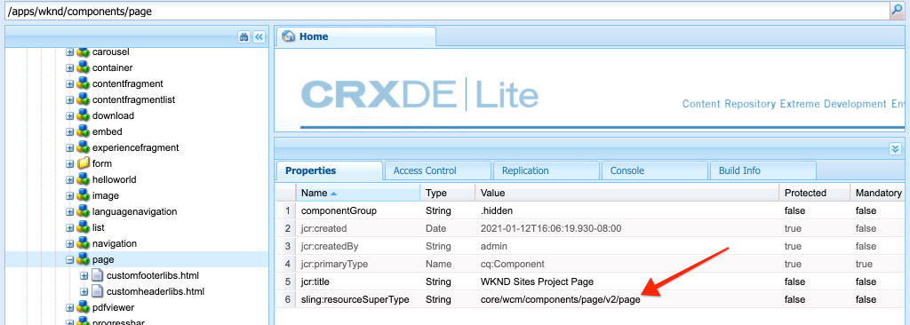
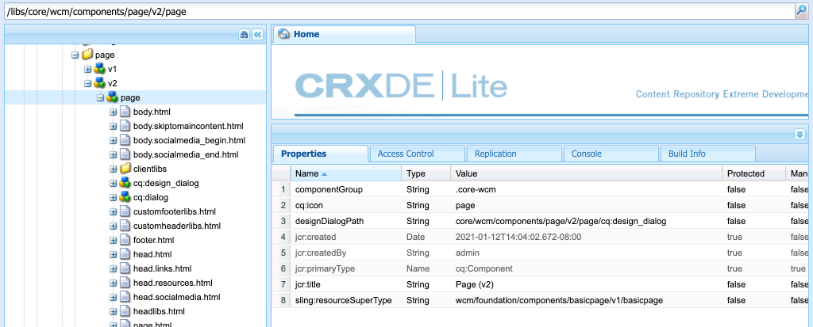

# Sidor och mallar {#pages-and-template}

{{edge-delivery-services-and-page-editor}}

I det här kapitlet tittar vi på förhållandet mellan en bassidkomponent och redigerbara mallar. Lär dig att skapa en oformaterad artikelmall baserad på vissa modeller från [Adobe XD](https://helpx.adobe.com/support/xd.html). Under processen att skapa mallen beskrivs kärnkomponenter och avancerade principkonfigurationer för redigerbara mallar.

## Förutsättningar {#prerequisites}

Granska de verktyg och instruktioner som krävs för att konfigurera en [lokal utvecklingsmiljö](overview.md#local-dev-environment).

### Startprojekt

>[!NOTE]
>
> Om du har slutfört det föregående kapitlet kan du återanvända projektet och hoppa över stegen för att checka ut startprojektet.

Ta en titt på den baslinjekod som självstudiekursen bygger på:

1. Kolla in grenen `tutorial/pages-templates-start` från [GitHub](https://github.com/adobe/aem-guides-wknd)

   ```shell
   $ cd ~/code/aem-guides-wknd
   $ git checkout tutorial/pages-templates-start
   ```

1. Distribuera kodbasen till en lokal AEM med dina Maven-kunskaper:

   ```shell
   $ mvn clean install -PautoInstallSinglePackage
   ```

   >[!NOTE]
   >
   > Om du använder AEM 6.5 eller 6.4 lägger du till profilen `classic` till eventuella Maven-kommandon.

   ```shell
   $ mvn clean install -PautoInstallSinglePackage -Pclassic
   ```

Du kan alltid visa den färdiga koden på [GitHub](https://github.com/adobe/aem-guides-wknd/tree/tutorial/pages-templates-solution) eller checka ut koden lokalt genom att växla till grenen `tutorial/pages-templates-solution`.

## Syfte

1. Inspect är en siddesign som skapats i Adobe XD och som mappas till Core Components.
1. Förstå detaljerna om redigerbara mallar och hur profiler kan användas för att få exakt kontroll över sidinnehållet.
1. Lär dig hur mallar och sidor länkas

## Vad du ska bygga {#what-build}

I den här delen av självstudiekursen skapar du en ny artikelsidmall som kan användas för att skapa artikelsidor och justera i en gemensam struktur. Artikelsidmallen baseras på design och ett användargränssnittspaket som skapats i Adobe XD. Det här kapitlet handlar endast om att bygga ut mallens struktur eller skelett. Inga format implementeras, men mallen och sidorna fungerar.


## UI Planning with Adobe XD {#adobexd}

Vanligtvis börjar planering för en ny webbplats med dummies och statisk design. [Adobe XD](https://helpx.adobe.com/support/xd.html) är ett designverktyg som bygger upp användarupplevelsen. Sedan undersöker vi ett gränssnittspaket och dummies för att planera strukturen för artikelsidmallen.

>[!VIDEO](https://video.tv.adobe.com/v/30214?quality=12&learn=on)

**Hämta [WKND-artikeldesignfilen](https://github.com/adobe/aem-guides-wknd/releases/download/aem-guides-wknd-0.0.2/AEM_UI-kit-WKND-article-design.xd)**.

>[!NOTE]
>
> En allmän [AEM Core Components UI Kit finns också tillgänglig](https://experienceleague.adobe.com/docs/experience-manager-learn/assets/AEM-CoreComponents-UI-Kit.xd) som startpunkt för anpassade projekt.

## Skapa artikelsidmall

När du skapar en sida måste du välja en mall som används som bas för att skapa sidan. Mallen definierar strukturen för den resulterande sidan, det inledande innehållet och de tillåtna komponenterna.

Det finns tre huvudområden för [Redigerbara mallar](https://experienceleague.adobe.com/docs/experience-manager-65/developing/platform/templates/page-templates-editable.html):

1. **Struktur** - definierar komponenter som är en del av mallen. Dessa kan inte redigeras av innehållsförfattare.
1. **Ursprungligt innehåll** - definierar komponenter som mallen börjar med, som kan redigeras och/eller tas bort av innehållsförfattare
1. **Principer** - definierar konfigurationer för hur komponenter beter sig och vilka alternativ författare har.

Skapa sedan en mall i AEM som matchar strukturen i modellerna. Detta inträffar i en lokal instans av AEM. Följ stegen i videon nedan:

>[!VIDEO](https://video.tv.adobe.com/v/330991?quality=12&learn=on)

Steg på hög nivå för videon ovan:

### Strukturkonfigurationer

1. Skapa en mall med **sidmallstypen**, som heter **Artikelsida**.
1. Växla till **strukturläge**.
1. Lägg till en **Experience Fragment**-komponent som fungerar som **Header** överst i mallen.
   * Konfigurera komponenten att peka på `/content/experience-fragments/wknd/us/en/site/header/master`.
   * Ställ in principen på **Sidhuvud** och kontrollera att **Standardelement** är inställt på `header`. Elementet `header` har CSS som mål i nästa kapitel.
1. Lägg till en **Experience Fragment**-komponent som fungerar som **sidfot** längst ned i mallen.
   * Konfigurera komponenten att peka på `/content/experience-fragments/wknd/us/en/site/footer/master`.
   * Ställ in principen på **Sidfot** och kontrollera att **Standardelementet** är inställt på `footer`. Elementet `footer` har CSS som mål i nästa kapitel.
1. Lås behållaren **main** som inkluderades när mallen skapades.
   * Ställ in principen på **Sidhuvudsida** och kontrollera att **standardelementet** är inställt på `main`. Elementet `main` har CSS som mål i nästa kapitel.
1. Lägg till en **bild**-komponent i **main**-behållaren.
   * Lås upp komponenten **Bild**.
1. Lägg till en **Breadcrumb**-komponent under **Image** -komponenten i huvudbehållaren.
   * Skapa en princip för komponenten **Breadcrumb** med namnet **Artikelsida - Breadcrumb**. Ange **Navigeringens startnivå** till **4**.
1. Lägg till en **behållarkomponent** under komponenten **Breadcrumb** och inuti behållaren **main**. Detta fungerar som **innehållsbehållare** för mallen.
   * Lås upp behållaren **Content**.
   * Ställ in principen på **Sidinnehåll**.
1. Lägg till ytterligare en **behållarkomponent** under **Innehållsbehållaren**. Det här fungerar som **Side Rail** -behållare för mallen.
   * Lås upp behållaren **Side Rail**.
   * Skapa en princip med namnet **Artikelsida - sidospalt**.
   * Konfigurera de **tillåtna komponenterna** under **WKND-webbplatsprojektet - innehåll** så att de omfattar: **Knapp**, **Ladda ned**, **Bild**, **Lista**, **Avgränsare**, **Delning via sociala medier**, **Text** och **Titel**.
1. Uppdatera sidrotbehållarens profil. Det här är mallens yttre behållare. Ställ in principen på **Sidrot**.
   * Under **Behållarinställningar** ställer du in **Layout** på **Responsivt Grid**.
1. Aktivera layoutläge för **innehållsbehållaren**. Dra handtaget från höger till vänster och krymp behållaren så att den blir åtta kolumner bred.
1. Aktivera layoutläge för **sidoskenans behållare**. Dra handtaget från höger till vänster och krymp behållaren så att den är fyra kolumner bred. Dra sedan det vänstra handtaget från vänster till höger en kolumn för att göra behållaren 3 kolumner bred och lämna ett mellanrum på 1 kolumn mellan **Innehållsbehållaren**.
1. Öppna mobilemulatorn och byt till en mobil brytpunkt. Aktivera layoutläget igen och gör **Innehållsbehållaren** och **sidoskenbehållaren** till sidans fulla bredd. Detta staplar behållarna lodrätt i den mobila brytpunkten.
1. Uppdatera principen för komponenten **Text** i **innehållsbehållaren**.
   * Ställ in principen på **Innehållstext**.
   * Under **Plugins** > **Styckeformat** markerar du **Aktivera styckeformat** och kontrollerar att **offertblocket** är aktiverat.

### Inledande innehållskonfigurationer

1. Växla till läget **Inledande innehåll**.
1. Lägg till en **Title**-komponent i **Content container**. Detta fungerar som artikelrubrik. När den lämnas tom visas automatiskt den aktuella sidans titel.
1. Lägg till en andra **Title**-komponent under den första Title-komponenten.
   * Konfigurera komponenten med texten: &quot;By Author&quot;. Det här är en textplatshållare.
   * Ange typen som `H4`.
1. Lägg till en **Text**-komponent under **By Author** Title-komponenten.
1. Lägg till en **Title**-komponent i **Side Rail Container**.
   * Konfigurera komponenten med texten: &quot;Share this Story&quot;.
   * Ange typen som `H5`.
1. Lägg till en **Delning via sociala medier**-komponent under **Dela den här artikeln**.
1. Lägg till en **avgränsarkomponent** under komponenten **Delning via sociala medier**.
1. Lägg till en **Hämta**-komponent under **avgränsarkomponenten**.
1. Lägg till en **List**-komponent under komponenten **Download**.
1. Uppdatera mallens **initiala sidegenskaper**.
   * Under **Sociala medier** > **Delning via sociala medier** markerar du **Facebook** och **Pinterest**

### Aktivera mallen och lägg till en miniatyrbild

1. Visa mallen i mallkonsolen genom att gå till [http://localhost:4502/libs/wcm/core/content/sites/templates.html/conf/wknd](http://localhost:4502/libs/wcm/core/content/sites/templates.html/conf/wknd)
1. **Aktivera** artikelsidmallen.
1. Redigera egenskaperna för artikelsidmallen och överför följande miniatyrbild för att snabbt identifiera sidor som skapats med artikelsidmallen:

   

## Uppdatera sidhuvud och sidfot med Experience Fragments {#experience-fragments}

Ett vanligt tillvägagångssätt när du skapar globalt innehåll, till exempel ett sidhuvud eller en sidfot, är att använda ett [Experience Fragment](https://experienceleague.adobe.com/docs/experience-manager-learn/sites/experience-fragments/experience-fragments-feature-video-use.html). Med Experience Fragments kan användare kombinera flera komponenter för att skapa en enda referensbar komponent. Experience Fragments har fördelen att det stöder hantering av flera webbplatser och [lokalisering](https://experienceleague.adobe.com/docs/experience-manager-core-components/using/wcm-components/experience-fragment.html?lang=en).

Den AEM projekttypen genererade ett sidhuvud och en sidfot. Uppdatera sedan Experience Fragments så att de matchar dummyerna. Följ stegen i videon nedan:

>[!VIDEO](https://video.tv.adobe.com/v/330992?quality=12&learn=on)

Steg på hög nivå för videon ovan:

1. Hämta exempelinnehållspaketet **[WKND-PagesTemplates-Content-Assets.zip](assets/pages-templates/WKND-PagesTemplates-Content-Assets-1.1.zip)**.
1. Överför och installera innehållspaketet med Package Manager på [http://localhost:4502/crx/packmgr/index.jsp](http://localhost:4502/crx/packmgr/index.jsp)
1. Uppdatera webbvariationsmallen, som är den mall som används för Experience Fragments på [http://localhost:4502/editor.html/conf/wknd/settings/wcm/templates/xf-web-variation/structure.html](http://localhost:4502/editor.html/conf/wknd/settings/wcm/templates/xf-web-variation/structure.html)
   * Uppdatera principen för komponenten **Container** i mallen.
   * Ställ in principen på **XF Root**.
   * Under **Tillåtna komponenter** markerar du komponentgruppen **WKND-webbplatsprojekt - struktur** så att den innehåller komponenterna **Språknavigering**, **Navigering** och **Snabbsökning** .

### Uppdatera rubrikupplevelsefragment

1. Öppna Experience Fragment som återger rubriken på [http://localhost:4502/editor.html/content/experience-fragments/wknd/us/en/site/header/master.html](http://localhost:4502/editor.html/content/experience-fragments/wknd/us/en/site/header/master.html)
1. Konfigurera fragmentets **rotbehållare**. Det här är den yttre **behållaren**.
   * Ange **layout** som **responsivt stödraster**
1. Lägg till den **mörka WKND-logotypen** som en bild högst upp i **behållaren**. Logotypen ingick i paketet som installerades i ett tidigare steg.
   * Ändra layouten för den mörka logotypen **WKND** så att den blir **två** kolumner bred. Dra handtagen från höger till vänster.
   * Konfigurera logotypen med **Alternativ text** i WKND-logotypen.
   * Konfigurera logotypen till **Länka** till `/content/wknd/us/en` hemsidan.
1. Konfigurera den **navigeringskomponent** som redan finns på sidan.
   * Ange **Uteslut rotnivåer** till **1**.
   * Ange **Navigeringsstrukturdjupet** till **1**.
   * Ändra layouten för komponenten **Navigation** så att den blir **åtta** kolumner bred. Dra handtagen från höger till vänster.
1. Ta bort komponenten **Språknavigering**.
1. Ändra layouten för komponenten **Search** så att den blir **två** kolumner bred. Dra handtagen från höger till vänster. Alla komponenter ska nu justeras vågrätt på en enda rad.

### Uppdatera sidfotsupplevelsefragment

1. Öppna det Experience Fragment som återger sidfoten på [http://localhost:4502/editor.html/content/experience-fragments/wknd/us/en/site/footer/master.html](http://localhost:4502/editor.html/content/experience-fragments/wknd/us/en/site/footer/master.html)
1. Konfigurera fragmentets **rotbehållare**. Det här är den yttre **behållaren**.
   * Ange **layout** som **responsivt stödraster**
1. Lägg till **WKND Light-logotypen** som en bild högst upp i **behållaren**. Logotypen ingick i paketet som installerades i ett tidigare steg.
   * Ändra layouten för **WKND Light-logotypen** så att den blir **två** kolumner bred. Dra handtagen från höger till vänster.
   * Konfigurera logotypen med **Alternativ text** i WKND Logo Light.
   * Konfigurera logotypen till **Länka** till `/content/wknd/us/en` hemsidan.
1. Lägg till en **Navigation**-komponent under logotypen. Konfigurera komponenten **Navigation**:
   * Ange **Uteslut rotnivåer** till **1**.
   * Avmarkera **Samla in alla underordnade sidor**.
   * Ange **Navigeringsstrukturdjupet** till **1**.
   * Ändra layouten för komponenten **Navigation** så att den blir **åtta** kolumner bred. Dra handtagen från höger till vänster.

## Skapa en artikelsida

Skapa sedan en sida med hjälp av mallen Artikelsida. Skriv innehållet på sidan så att det matchar webbplatsens modeller. Följ stegen i videon nedan:

>[!VIDEO](https://video.tv.adobe.com/v/330993?quality=12&learn=on)

Steg på hög nivå för videon ovan:

1. Gå till webbplatskonsolen på [http://localhost:4502/sites.html/content/wknd/us/en/magazine](http://localhost:4502/sites.html/content/wknd/us/en/magazine).
1. Skapa en sida under **WKND** > **US** > **EN** > **Magazine**.
   * Välj mallen **Artikelsida**.
   * Under **Egenskaper** anger du **Title** till&quot;Ultimate Guide to LA Skateparks&quot;
   * Ange **namnet** som&quot;guide-la-skateparks&quot;
1. Ersätt **med författare** med texten&quot;By Stacey Roswells&quot;.
1. Uppdatera komponenten **Text** så att den innehåller ett stycke som fyller i artikeln. Du kan använda följande textfil som kopia: [la-skate-parks-copy.txt](assets/pages-templates/la-skateparks-copy.txt).
1. Lägg till en annan **Text**-komponent.
   * Uppdatera komponenten så att den innehåller citatet:&quot;Det finns ingen bättre plats att dela än Los Angeles.&quot;
   * Redigera RTF-redigeraren i helskärmsläge och ändra offerten ovan så att elementet **Citattecken** används.
1. Fortsätt fylla i artikelns brödtext för att matcha dummies.
1. Konfigurera komponenten **Download** om du vill använda en PDF-version av artikeln.
   * Under **Hämta** > **Egenskaper** klickar du i kryssrutan för att **hämta titeln från DAM-resursen**.
   * Ange **Beskrivning** till:&quot;Hämta hela artikeln&quot;.
   * Ange **åtgärdstexten** till: &quot;Download PDF&quot;.
1. Konfigurera komponenten **List**.
   * Välj **Underordnade sidor** under **Listinställningar** > **Skapa lista med**.
   * Ange **överordnad sida** till `/content/wknd/us/en/magazine`.
   * Under **Objektinställningar** markerar du **Länka objekt** och markerar **Visa datum**.

## Inspect nodstrukturen {#node-structure}

Nu är artikelsidan helt oformaterad. Den grundläggande strukturen finns dock på plats. Granska sedan artikelsidans nodstruktur för att få en bättre förståelse för mallens, sidans och komponenternas roll.

Använd verktyget CRXDE-Lite på en lokal AEM för att visa den underliggande nodstrukturen.

1. Öppna [CRXDE-Lite](http://localhost:4502/crx/de/index.jsp#/content/wknd/us/en/magazine/guide-la-skateparks/jcr%3Acontent) och navigera till `/content/wknd/us/en/magazine/guide-la-skateparks` med trädnavigeringen.

1. Klicka på noden `jcr:content` under sidan `la-skateparks` och visa egenskaperna:

   

   Observera värdet för `cq:template`, som pekar på `/conf/wknd/settings/wcm/templates/article-page`, artikelsidmallen som skapades tidigare.

   Lägg också märke till värdet `sling:resourceType`, som pekar på `wknd/components/page`. Detta är den sidkomponent som skapas av AEM projekttyp och som ansvarar för återgivningen av sidan baserat på mallen.

1. Expandera noden `jcr:content` under `/content/wknd/us/en/magazine/guide-la-skateparks/jcr:content` och visa nodhierarkin:

   

   Du bör kunna mappa var och en av noderna löst till komponenter som har skapats. Se om du kan identifiera de olika layoutbehållarna som används genom att granska noderna som har prefixet `container`.

1. Kontrollera sedan sidkomponenten på `/apps/wknd/components/page`. Visa komponentegenskaperna i CRXDE Lite:

   

   Det finns bara två HTML-skript, `customfooterlibs.html` och `customheaderlibs.html`, under sidkomponenten. *Så hur återger den här komponenten sidan?*

   Egenskapen `sling:resourceSuperType` pekar på `core/wcm/components/page/v2/page`. Den här egenskapen gör att WKND:s sidkomponent kan ärva **alla** funktionaliteten för kärnkomponentsidkomponenten. Detta är det första exemplet på något som kallas [Proxy-komponentmönster](https://experienceleague.adobe.com/docs/experience-manager-core-components/using/developing/guidelines.html#ProxyComponentPattern). Mer information finns [här](https://experienceleague.adobe.com/docs/experience-manager-core-components/using/developing/guidelines.html).

1. Inspect är en annan komponent i WKND-komponenterna, `Breadcrumb`-komponenten från: `/apps/wknd/components/breadcrumb`. Observera att samma `sling:resourceSuperType`-egenskap kan hittas, men den här gången pekar den på `core/wcm/components/breadcrumb/v2/breadcrumb`. Detta är ett annat exempel på hur du använder komponentmönstret Proxy för att inkludera en Core-komponent. Faktum är att alla komponenter i WKND-kodbasen är proxies av AEM Core Components (förutom den anpassade demo-komponenten HelloWorld). Det är en god vana att återanvända så mycket av funktionerna i kärnkomponenterna som möjligt *innan* skriver egen kod.

1. Kontrollera sedan huvudkomponentsidan på `/libs/core/wcm/components/page/v2/page` med CRXDE Lite:

   >[!NOTE]
   >
   > I AEM 6.5/6.4 finns kärnkomponenterna under `/apps/core/wcm/components`. I AEM as a Cloud Service finns kärnkomponenterna under `/libs` och uppdateras automatiskt.

   

   Observera att många skriptfiler inkluderas under den här sidan. Core Component Page innehåller flera funktioner. Den här funktionen är indelad i flera skript för enklare underhåll och läsbarhet. Du kan spåra inkludering av HTML-skript genom att öppna `page.html` och leta efter `data-sly-include`:

   ```html
   <!--/* /libs/core/wcm/components/page/v2/page/page.html */-->
   <!DOCTYPE HTML>
   <html data-sly-use.page="com.adobe.cq.wcm.core.components.models.Page" lang="${page.language}"
       data-sly-use.head="head.html"
       data-sly-use.footer="footer.html"
       data-sly-use.redirect="redirect.html">
       <head data-sly-call="${head.head @ page = page}"></head>
       <body class="${page.cssClassNames}"
           id="${page.id}"
           data-cmp-data-layer-enabled="${page.data ? true : false}">
           <script data-sly-test.dataLayerEnabled="${page.data}">
           window.adobeDataLayer = window.adobeDataLayer || [];
           adobeDataLayer.push({
               page: JSON.parse("${page.data.json @ context='scriptString'}"),
               event:'cmp:show',
               eventInfo: {
                   path: 'page.${page.id @ context="scriptString"}'
               }
           });
           </script>
           <sly data-sly-test.isRedirectPage="${page.redirectTarget && (wcmmode.edit || wcmmode.preview)}"
               data-sly-call="${redirect.redirect @ redirectTarget = page.redirectTarget}"></sly>
           <sly data-sly-test="${!isRedirectPage}">
               <sly data-sly-include="body.skiptomaincontent.html"></sly>
               <sly data-sly-include="body.socialmedia_begin.html"></sly>
               <sly data-sly-include="body.html"></sly>
               <sly data-sly-call="${footer.footer @ page = page}"></sly>
               <sly data-sly-include="body.socialmedia_end.html"></sly>
           </sly>
       </body>
   </html>
   ```

   Den andra anledningen till att HTML delas upp i flera skript är att tillåta proxykomponenterna att åsidosätta enskilda skript för att implementera anpassad affärslogik. HTML-skripten `customfooterlibs.html` och `customheaderlibs.html` skapas för det uttryckliga syftet som ska åsidosättas genom att projekt implementeras.

   Du kan lära dig mer om hur faktorer för redigerbar mall påverkar återgivningen av [innehållssidan genom att läsa den här artikeln](https://experienceleague.adobe.com/docs/experience-manager-65/developing/platform/templates/page-templates-editable.html).

1. Inspect är en annan Core-komponent, som Breadcrumb på `/libs/core/wcm/components/breadcrumb/v2/breadcrumb`. Visa skriptet `breadcrumb.html` om du vill veta hur koden för Breadcrumb-komponenten genereras.

## Spara konfigurationer i Source Control {#configuration-persistence}

Det är ofta viktigt att beständiga konfigurationer, som mallar och relaterade innehållsprinciper, behålls för källkontrollen, särskilt i början av ett AEM projekt. Detta garanterar att alla utvecklare arbetar mot samma uppsättning innehåll och konfigurationer och kan säkerställa ytterligare enhetlighet mellan miljöer. När ett projekt når en viss mognadsnivå kan rutinen med mallhantering överföras till en särskild grupp med avancerade användare.


För närvarande behandlas mallar som andra kodavsnitt och **artikelsidmallen** synkroniseras som en del av projektet.
Fram tills nu överförs kod från det AEM projektet till en lokal instans av AEM. **Artikelsidmallen** skapades direkt på en lokal instans av AEM, så den måste **importera** mallen till det AEM projektet. Modulen **ui.content** ingår i det AEM projektet för detta ändamål.

Nästa steg görs i VSCode IDE med plugin-programmet [VSCode AEM Sync](https://marketplace.visualstudio.com/items?itemName=yamato-ltd.vscode-aem-sync&amp;ssr=false#overview) . Men de kan använda vilken IDE som helst som du har konfigurerat till **import** eller importera innehåll från en lokal instans av AEM.

1. I öppnar VSCode `aem-guides-wknd`-projektet.

1. Expandera modulen **ui.content** i Project Explorer. Expandera mappen `src` och navigera till `/conf/wknd/settings/wcm/templates`.

1. [!UICONTROL Right+Click] mappen `templates` och välj **Importera från AEM server**:

   

   `article-page` ska importeras och mallarna `page-content`, `xf-web-variation` ska också uppdateras.

   

1. Upprepa stegen för att importera innehåll men välj mappen **policies** från `/conf/wknd/settings/wcm/policies`.

   

1. Inspect filen `filter.xml` från `ui.content/src/main/content/META-INF/vault/filter.xml`.

   ```xml
   <!--ui.content filter.xml-->
   <?xml version="1.0" encoding="UTF-8"?>
   <workspaceFilter version="1.0">
       <filter root="/conf/wknd" mode="merge"/>
       <filter root="/content/wknd" mode="merge"/>
       <filter root="/content/dam/wknd" mode="merge"/>
       <filter root="/content/experience-fragments/wknd" mode="merge"/>
   </workspaceFilter>
   ```

   Filen `filter.xml` ansvarar för att identifiera sökvägarna till noder som har installerats med paketet. Observera `mode="merge"` på vart och ett av filtren som anger att befintligt innehåll inte ska ändras, endast nytt innehåll läggs till. Eftersom innehållsförfattare kan uppdatera dessa sökvägar är det viktigt att en koddistribution **inte** skriver över innehåll. Mer information om hur du arbetar med filterelement finns i [dokumentationen för FileVault](https://jackrabbit.apache.org/filevault/filter.html).

   Jämför `ui.content/src/main/content/META-INF/vault/filter.xml` och `ui.apps/src/main/content/META-INF/vault/filter.xml` för att förstå de olika noder som hanteras av varje modul.

   >[!WARNING]
   >
   > För att säkerställa konsekventa distributioner för WKND-referensplatsen har vissa grenar av projektet konfigurerats så att `ui.content` skriver över ändringar i JCR-referensen. Detta är utformat, dvs. för Solution Branches, eftersom kod/format skrivs för specifika profiler.

## Grattis! {#congratulations}

Grattis! Du har skapat en mall och en sida med Adobe Experience Manager Sites.

### Nästa steg {#next-steps}

Nu är artikelsidan helt oformaterad. Följ självstudiekursen [Klientbibliotek och Front-end-arbetsflöde](client-side-libraries.md) för att lära dig de bästa sätten att inkludera CSS och JavaScript för att använda globala format på webbplatsen och integrera en dedikerad front-end-version.

Visa den färdiga koden på [GitHub](https://github.com/adobe/aem-guides-wknd) eller granska och distribuera koden lokalt på Git-grenen `tutorial/pages-templates-solution`.

1. Klona [github.com/adobe/aem-wknd-guides](https://github.com/adobe/aem-guides-wknd)-databasen.
1. Kolla in grenen `tutorial/pages-templates-solution`.
