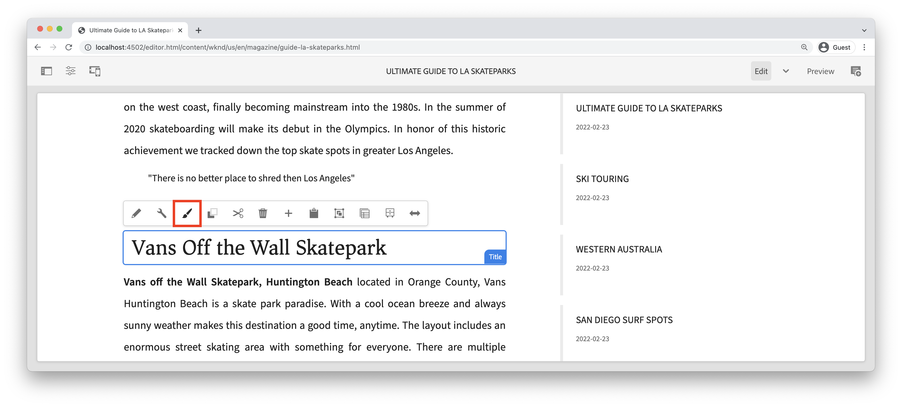

# Utveckla med Style System {#developing-with-the-style-system}

Lär dig hur du implementerar enskilda format och återanvänder kärnkomponenter med Experience Manager Style System. I den här självstudien beskrivs hur du utvecklar för Style System för att utöka grundkomponenterna med varumärkesspecifik CSS och avancerade principkonfigurationer för mallredigeraren.

## Förutsättningar {#prerequisites}

Granska de verktyg och instruktioner som krävs för att konfigurera en [lokal utvecklingsmiljö](overview.md#local-dev-environment).

Vi rekommenderar även att du går igenom självstudiekursen [Klientbibliotek och Front-end-arbetsflöde](client-side-libraries.md) för att förstå grunderna i klientbibliotek och de olika frontverktygen som är inbyggda i AEM-projektet.

### Startprojekt

>[!NOTE]
>
> Om du har slutfört det föregående kapitlet kan du återanvända projektet och hoppa över stegen för att checka ut startprojektet.

Ta en titt på den baslinjekod som självstudiekursen bygger på:

1. Kolla in grenen `tutorial/style-system-start` från [GitHub](https://github.com/adobe/aem-guides-wknd)

   ```shell
   $ cd aem-guides-wknd
   $ git checkout tutorial/style-system-start
   ```

1. Distribuera kodbasen till en lokal AEM-instans med dina Maven-kunskaper:

   ```shell
   $ mvn clean install -PautoInstallSinglePackage
   ```

   >[!NOTE]
   >
   > Om du använder AEM 6.5 eller 6.4 lägger du till profilen `classic` till eventuella Maven-kommandon.

   ```shell
   $ mvn clean install -PautoInstallSinglePackage -Pclassic
   ```

Du kan alltid visa den färdiga koden på [GitHub](https://github.com/adobe/aem-guides-wknd/tree/tutorial/style-system-solution) eller checka ut koden lokalt genom att växla till grenen `tutorial/style-system-solution`.

## Syfte

1. Lär dig hur du använder Style System för att tillämpa varumärkesspecifik CSS på AEM Core Components.
1. Lär dig mer om BEM-notation och hur det kan användas för att skapa mer detaljerade omfång för format.
1. Använd avancerade principkonfigurationer med redigerbara mallar.

## Vad du ska bygga {#what-build}

I det här kapitlet används funktionen [Style System](https://experienceleague.adobe.com/docs/experience-manager-learn/sites/page-authoring/style-system-feature-video-use.html) för att skapa varianter av komponenterna **Title** och **Text** som används på artikelsidan.


*Understrykningsformat som kan användas för titelkomponent*

## Bakgrund {#background}

Med [Style System](https://experienceleague.adobe.com/docs/experience-manager-65/authoring/siteandpage/style-system.html) kan utvecklare och mallredigerare skapa flera visuella varianter av en komponent. Författare kan sedan i sin tur bestämma vilket format som ska användas när en sida disponeras. Style System används i resten av självstudiekursen för att uppnå flera unika format när du använder kärnkomponenter i en lågkodsstrategi.

Den allmänna idén med Style System är att författare kan välja olika stilar för hur en komponent ska se ut. &quot;Styles&quot; backas upp av ytterligare CSS-klasser som injiceras i en komponents yttre div. I klientbiblioteken läggs CSS-regler till baserat på dessa formatklasser så att komponenten ändrar utseende.

[Detaljerad dokumentation om Style System finns här](https://experienceleague.adobe.com/docs/experience-manager-cloud-service/content/sites/authoring/features/style-system.html). Det finns också en fantastisk [teknisk video för att förstå Style System](https://experienceleague.adobe.com/docs/experience-manager-learn/sites/developing/style-system-technical-video-understand.html).

## Understrykningsformat - rubrik {#underline-style}

[Titelkomponenten](https://experienceleague.adobe.com/docs/experience-manager-core-components/using/wcm-components/title.html) har proxynerats in i projektet under `/apps/wknd/components/title` som en del av modulen **ui.apps**. Standardformaten för rubrikelement (`H1`, `H2`, `H3`..) har redan implementerats i modulen **ui.front** .

[WKND-artikeldesignen](assets/pages-templates/wknd-article-design.xd) innehåller ett unikt format för komponenten Title med en understrykning. I stället för att skapa två komponenter eller ändra komponentdialogrutan kan du använda Style System för att ge författarna möjlighet att lägga till ett understruket format.


### Lägg till en titelprincip

Låt oss lägga till en princip för rubrikkomponenterna så att innehållsförfattare kan välja understrykningsformatet som ska användas för specifika komponenter. Detta görs med mallredigeraren i AEM.

1. Navigera till mallen **Artikelsida** från: [http://localhost:4502/editor.html/conf/wknd/settings/wcm/templates/article-page/structure.html](http://localhost:4502/editor.html/conf/wknd/settings/wcm/templates/article-page/structure.html)

1. I läget **Struktur** väljer du ikonen **Princip** bredvid komponenten **Rubrik** i huvudbehållaren **Layoutbehållaren** bredvid komponenten *Tillåtna komponenter*:

   

1. Skapa en profil för komponenten Title med följande värden:

   *Principtitel&#42;*: **WKND-titel**

   *Egenskaper* > *Fliken Format* > *Lägg till ett nytt format*

   **Understruken** : `cmp-title--underline`

   

   Klicka på **Klar** om du vill spara ändringarna i titelprincipen.

   >[!NOTE]
   >
   > Värdet `cmp-title--underline` fyller i CSS-klassen på den yttre diven för komponentens HTML-kod.

### Använda understrykningsformat

Som författare kan vi använda understrykningsformatet på vissa rubrikkomponenter.

1. Gå till artikeln **La Skateparks** i AEM Sites-redigeraren på: [http://localhost:4502/editor.html/content/wknd/us/en/magazine/guide-la-skateparks.html](http://localhost:4502/editor.html/content/wknd/us/en/magazine/guide-la-skateparks.html)
1. Välj en titelkomponent i läget **Redigera**. Klicka på ikonen för **penseln** och välj formatet **Understruken** :

   

   >[!NOTE]
   >
   > För närvarande sker ingen synlig ändring eftersom formatet `underline` inte har implementerats. I nästa övning implementeras den här stilen.

1. Klicka på ikonen **Sidinformation** > **Visa som publicerad** för att kontrollera sidan utanför AEM redigerare.
1. Använd webbläsarens utvecklingsverktyg för att verifiera att CSS-klassen `cmp-title--underline` används på den yttre diven för markeringen runt Title-komponenten.

   

   ```html
   <div class="title cmp-title--underline">
       <div data-cmp-data-layer="{&quot;title-b6450e9cab&quot;:{&quot;@type&quot;:&quot;wknd/components/title&quot;,&quot;repo:modifyDate&quot;:&quot;2022-02-23T17:34:42Z&quot;,&quot;dc:title&quot;:&quot;Vans Off the Wall Skatepark&quot;}}" 
       id="title-b6450e9cab" class="cmp-title">
           <h2 class="cmp-title__text">Vans Off the Wall Skatepark</h2>
       </div>
   </div>
   ```

### Implementera understrykning - ui.front

Implementera sedan understrykningsformatet med modulen **ui.front** i AEM-projektet. Webbpaketets utvecklingsserver som paketeras med modulen **ui.front** för att förhandsgranska formaten *innan* distribueras till en lokal instans av AEM används.

1. Starta processen `watch` inifrån modulen **ui.front**:

   ```shell
   $ cd ~/code/aem-guides-wknd/ui.frontend/
   $ npm run watch
   ```

   Detta startar en process som övervakar ändringar i modulen `ui.frontend` och synkroniserar ändringarna med AEM-instansen.


1. Returnera din IDE och öppna filen `_title.scss` från: `ui.frontend/src/main/webpack/components/_title.scss`.
1. Introducera en ny regel som riktar sig till klassen `cmp-title--underline`:

   ```scss
   /* Default Title Styles */
   .cmp-title {}
   .cmp-title__text {}
   .cmp-title__link {}
   
   /* Add Title Underline Style */
   .cmp-title--underline {
       .cmp-title__text {
           &:after {
           display: block;
               width: 84px;
               padding-top: 8px;
               content: '';
               border-bottom: 2px solid $brand-primary;
           }
       }
   }
   ```

   >[!NOTE]
   >
   >Det anses vara en bra rutin att alltid ha tätt omfång av format till målkomponenten. Detta säkerställer att extra format inte påverkar andra delar av sidan.
   >
   >Alla kärnkomponenter följer **[BEM-notationen](https://github.com/adobe/aem-core-wcm-components/wiki/css-coding-conventions)**. Det är bäst att ha den yttre CSS-klassen som mål när du skapar ett standardformat för en komponent. Ett annat bra tillvägagångssätt är att ange klassnamn som anges av BEM-notationen för kärnkomponenten i stället för HTML-element som mål.

1. Gå tillbaka till webbläsaren och AEM. Du ser att understrykningsformatet har lagts till:

   

1. I AEM Editor bör du nu kunna aktivera och inaktivera formatet **Understruken** och se att ändringarna visas visuellt.

## Blockformat för citat - text {#text-component}

Upprepa sedan liknande steg för att tillämpa ett unikt format på [textkomponenten](https://experienceleague.adobe.com/docs/experience-manager-core-components/using/wcm-components/text.html). Textkomponenten har proxiderats in i projektet under `/apps/wknd/components/text` som en del av modulen **ui.apps**. Standardformaten för styckeelement har redan implementerats i **ui.front**.

[WKND-artikeldesignen](assets/pages-templates/wknd-article-design.xd) innehåller ett unikt format för Text-komponenten med ett citattecken:


### Lägg till en textprofil

Lägg sedan till en profil för textkomponenterna.

1. Navigera till **Artikelsidmallen** från: [http://localhost:4502/editor.html/conf/wknd/settings/wcm/templates/article-page/structure.html](http://localhost:4502/editor.html/conf/wknd/settings/wcm/templates/article-page/structure.html).

1. I läget **Struktur** väljer du ikonen **Princip** bredvid komponenten **Text** i *Layoutbehållaren* i huvudläget **Layoutbehållare**:

   

1. Uppdatera Text-komponentprincipen med följande värden:

   *Principtitel&#42;*: **Innehållstext**

   *Plugins* > *Styckeformat* > *Aktivera styckeformat*

   *Fliken Stilar* > *Lägg till ett nytt format*

   **Citatblock** : `cmp-text--quote`

   

   

   Klicka på **Klar** om du vill spara ändringarna i textprofilen.

### Använda formatet Offertblock

1. Gå till artikeln **La Skateparks** i AEM Sites-redigeraren på: [http://localhost:4502/editor.html/content/wknd/us/en/magazine/guide-la-skateparks.html](http://localhost:4502/editor.html/content/wknd/us/en/magazine/guide-la-skateparks.html)
1. Välj en textkomponent i läget **Redigera**. Redigera komponenten för att inkludera ett citattecken-element:

   

1. Markera textkomponenten och klicka på ikonen **penselpensel** och välj formatet **Citatblock** :

   

1. Använd webbläsarens utvecklingsverktyg för att inspektera markeringen. Du bör se att klassnamnet `cmp-text--quote` har lagts till i komponentens yttre div:

   ```html
   <!-- Quote Block style class added -->
   <div class="text cmp-text--quote">
       <div data-cmp-data-layer="{&quot;text-60910f4b8d&quot;:{&quot;@type&quot;:&quot;wknd/components/text&quot;,&quot;repo:modifyDate&quot;:&quot;2022-02-24T00:55:26Z&quot;,&quot;xdm:text&quot;:&quot;<blockquote>&amp;nbsp; &amp;nbsp; &amp;nbsp;&amp;quot;There is no better place to shred then Los Angeles&amp;quot;</blockquote>\r\n<p>- Jacob Wester, Pro Skater</p>\r\n&quot;}}" id="text-60910f4b8d" class="cmp-text">
           <blockquote>&nbsp; &nbsp; &nbsp;"There is no better place to shred then Los Angeles"</blockquote>
           <p>- Jacob Wester, Pro Skater</p>
       </div>
   </div>
   ```

### Implementera formatet Offertblock - ui.front

Nu implementerar vi formatet Offertblock med modulen **ui.front** i AEM-projektet.

1. Om den inte redan körs startar du `watch`-processen inifrån modulen **ui.front**:

   ```shell
   $ npm run watch
   ```

1. Uppdatera filen `text.scss` från: `ui.frontend/src/main/webpack/components/_text.scss`:

   ```css
   /* Default text style */
   .cmp-text {}
   .cmp-text__paragraph {}
   
   /* WKND Text Quote style */
   .cmp-text--quote {
       .cmp-text {
           background-color: $brand-third;
           margin: 1em 0em;
           padding: 1em;
   
           blockquote {
               border: none;
               font-size: $font-size-large;
               font-family: $font-family-serif;
               padding: 14px 14px;
               margin: 0;
               margin-bottom: 0.5em;
   
               &:after {
                   border-bottom: 2px solid $brand-primary; /*yellow border */
                   content: '';
                   display: block;
                   position: relative;
                   top: 0.25em;
                   width: 80px;
               }
           }
           p {
               font-family:  $font-family-serif;
           }
       }
   }
   ```

   >[!CAUTION]
   >
   > I det här fallet används formaten som mål för raw-HTML-element. Det beror på att komponenten Text har en RTF-redigerare för innehållsförfattare. Du bör skapa format direkt mot RTE-innehåll med försiktighet och det är ännu viktigare att formaten är täta.

1. Återgå till webbläsaren en gång till och se att blockformatet Offert har lagts till:

   

1. Stoppa webbpaketets utvecklingsserver.

## Fast bredd - behållare (Bonus) {#layout-container}

Behållarkomponenter har använts för att skapa artikelsidmallens grundläggande struktur och ange släppzoner där innehållsförfattare kan lägga till innehåll på en sida. Behållare kan också använda Style System, vilket ger innehållsförfattare ännu fler alternativ för att utforma layouter.

**Huvudbehållaren** i artikelsidmallen innehåller de två redigeringsbara behållarna och har en fast bredd.


*Huvudbehållare i artikelsidmallen*.

Principen för **huvudbehållaren** anger standardelementet som `main`:


Den CSS som gör att **huvudbehållaren** är fast anges i modulen **ui.front** vid `ui.frontend/src/main/webpack/site/styles/container_main.scss` :

```SCSS
main.container {
    padding: .5em 1em;
    max-width: $max-content-width;
    float: unset!important;
    margin: 0 auto!important;
    clear: both!important;
}
```

I stället för att använda HTML-elementet `main` som mål kan Style System användas för att skapa ett **fast breddformat** som en del av behållarprincipen. Style System kan ge användare möjlighet att växla mellan behållare med **fast bredd** och **flytande bredd**.

1. **Bonusutmaning** - använd lektioner från tidigare övningar och använd Style System för att implementera formaten **Fast bredd** och **Fluid width** för behållarkomponenten.

## Grattis! {#congratulations}

Artikelsidan är nästan formaterad och du har fått en praktisk upplevelse av AEM Style System.

### Nästa steg {#next-steps}

Lär dig stegen från början till slut för att skapa en [anpassad AEM-komponent](custom-component.md) som visar innehåll som har skapats i en dialogruta och utforskar utveckling av en Sling-modell för att kapsla in affärslogik som fyller i komponentens HTML-kod.

Visa den färdiga koden på [GitHub](https://github.com/adobe/aem-guides-wknd) eller granska och distribuera koden lokalt på Git-grenen `tutorial/style-system-solution`.

1. Klona [github.com/adobe/aem-wknd-guides](https://github.com/adobe/aem-guides-wknd)-databasen.
1. Kolla in grenen `tutorial/style-system-solution`.
