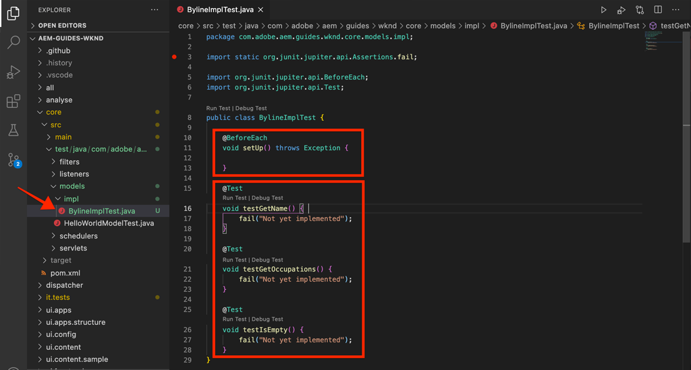
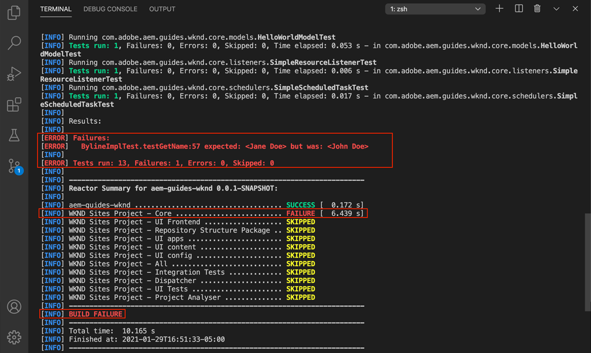

# Enhetstestning {#unit-testing}

I den här självstudiekursen beskrivs implementeringen av ett enhetstest som validerar beteendet för den inbyggda komponentens Sling Model, som skapats i självstudiekursen [Custom Component](./custom-component.md) .

## Förutsättningar {#prerequisites}

Granska de verktyg och instruktioner som krävs för att konfigurera en [lokal utvecklingsmiljö](overview.md#local-dev-environment).

_Om både Java™ 8 och Java™ 11 är installerade i systemet kan VS-kodens testkörare välja den lägre Java™-miljön när testerna körs, vilket resulterar i testfel. Om detta inträffar avinstallerar du Java™ 8._

### Startprojekt

>[!NOTE]
>
> Om du har slutfört det föregående kapitlet kan du återanvända projektet och hoppa över stegen för att checka ut startprojektet.

Ta en titt på den baslinjekod som självstudiekursen bygger på:

1. Kolla in grenen `tutorial/unit-testing-start` från [GitHub](https://github.com/adobe/aem-guides-wknd)

   ```shell
   $ cd aem-guides-wknd
   $ git checkout tutorial/unit-testing-start
   ```

1. Distribuera kodbasen till en lokal AEM-instans med dina Maven-kunskaper:

   ```shell
   $ mvn clean install -PautoInstallSinglePackage
   ```

   >[!NOTE]
   >
   > Om du använder AEM 6.5 eller 6.4 lägger du till profilen `classic` till eventuella Maven-kommandon.

   ```shell
   $ mvn clean install -PautoInstallSinglePackage -Pclassic
   ```

Du kan alltid visa den färdiga koden på [GitHub](https://github.com/adobe/aem-guides-wknd/tree/tutorial/unit-testing-start) eller checka ut koden lokalt genom att växla till grenen `tutorial/unit-testing-start`.

## Syfte

1. Förstå grunderna för enhetstestning.
1. Läs om ramverk och verktyg som ofta används för att testa AEM-kod.
1. Förstå alternativen för att gnugga eller simulera AEM-resurser när du skriver enhetstester.

## Bakgrund {#unit-testing-background}

I den här självstudiekursen ska vi utforska hur du skriver [enhetstester](https://en.wikipedia.org/wiki/Unit_testing) för vår Byline-komponents [segmenteringsmodell](https://sling.apache.org/documentation/bundles/models.html) (skapad i [Skapa en anpassad AEM-komponent](custom-component.md)). Enhetstester är körtidstester skrivna i Java™ som verifierar förväntade beteenden hos Java™-kod. Varje enhetstest är vanligen litet och validerar resultatet av en metod (eller arbetsenheter) mot förväntade resultat.

Vi använder AEM bästa praxis och använder:

* [JUnit 5](https://junit.org/junit5/)
* [Mockito Testing Framework](https://site.mockito.org/)
* [wcm.io Test Framework](https://wcm.io/testing/) (som bygger på [Apache Sling Mocks](https://sling.apache.org/documentation/development/sling-mock.html))

## Enhetstestning och Adobe Cloud Manager {#unit-testing-and-adobe-cloud-manager}

[Adobe Cloud Manager](https://experienceleague.adobe.com/docs/experience-manager-cloud-manager/content/introduction.html) integrerar körning av enhetstest och [rapportering av kodtäckning](https://experienceleague.adobe.com/docs/experience-manager-cloud-manager/content/using/code-quality-testing.html) i sin CI/CD-pipeline för att uppmuntra och främja bästa sättet att testa AEM-kod.

Även om kod för enhetstestning är en bra vana för alla kodbaser är det viktigt att kunna dra nytta av kodkvalitetstestningen och rapporteringsmöjligheterna genom att tillhandahålla enhetstester som Cloud Manager kan köra när man använder Cloud Manager.

## Uppdatera testberoenden för Maven {#inspect-the-test-maven-dependencies}

Det första steget är att undersöka Maven-beroenden för att stödja skrivandet och körningen av testerna. Det krävs fyra beroenden:

1. JUnit5
1. Mockito Test Framework
1. Apache Sling Mocks
1. AEM Mocks Test Framework (av io.wcm)

Testberoendena **JUnit5**, **Mockito och &#x200B;** AEM Mocks** läggs automatiskt till i projektet under installationen med [AEM Maven-arketypen](project-setup.md).

1. Om du vill visa dessa beroenden öppnar du den överordnade reaktorns POM på **aem-guides-wknd/pom.xml**, navigerar till `<dependencies>..</dependencies>` och visar beroendena för JUnit, Mockito, Apache Sling Mocks och AEM Mock Tests av io.wcm under `<!-- Testing -->`.
1. Kontrollera att `io.wcm.testing.aem-mock.junit5` är inställt på **4.1.0**:

   ```xml
   <dependency>
       <groupId>io.wcm</groupId>
       <artifactId>io.wcm.testing.aem-mock.junit5</artifactId>
       <version>4.1.0</version>
       <scope>test</scope>
   </dependency>
   ```

   >[!CAUTION]
   >
   > Arketypen **35** genererar projektet med `io.wcm.testing.aem-mock.junit5` version **4.1.8**. Uppgradera till **4.1.0** om du vill följa resten av det här kapitlet.

1. Öppna **aem-guides-wknd/core/pom.xml** och se att motsvarande testberoenden är tillgängliga.

   En parallell källmapp i **core** -projektet innehåller enhetstesterna och eventuella stödtestfiler. Den här mappen **test** separerar testklasser från källkoden, men gör att testerna fungerar som om de finns i samma paket som källkoden.

## Skapa JUnit-testet {#creating-the-junit-test}

Enhetstester kan normalt mappa 1 till 1 med Java™-klasser. I det här kapitlet ska vi skriva ett JUnit-test för **BylineImpl.java**, som är den Sling-modell som stöder Byline-komponenten.


*Plats där enhetstester lagras.*

1. Skapa ett enhetstest för `BylineImpl.java` genom att skapa en ny Java™-klass under `src/test/java` i en mappstruktur för Java™-paket som speglar platsen för den Java™-klass som ska testas.

   

   Eftersom vi testar

   * `src/main/java/com/adobe/aem/guides/wknd/core/models/impl/BylineImpl.java`

   skapa motsvarande enhetstest Java™-klass på

   * `src/test/java/com/adobe/aem/guides/wknd/core/models/impl/BylineImplTest.java`

   `Test`-suffixet i enhetstestfilen `BylineImplTest.java` är en konvention som gör att vi kan

   1. Identifiera den enkelt som testfil _för_ `BylineImpl.java`
   1. Men skiljer också testfilen _från_ klassen som testas, `BylineImpl.java`

## Granska BylineImplTest.java {#reviewing-bylineimpltest-java}

Nu är JUnit-testfilen en tom Java™-klass.

1. Uppdatera filen med följande kod:

   ```java
   package com.adobe.aem.guides.wknd.core.models.impl;
   
   import static org.junit.jupiter.api.Assertions.*;
   
   import org.junit.jupiter.api.BeforeEach;
   import org.junit.jupiter.api.Test;
   
   public class BylineImplTest {
   
       @BeforeEach
       void setUp() throws Exception {
   
       }
   
       @Test 
       void testGetName() { 
           fail("Not yet implemented");
       }
   
       @Test 
       void testGetOccupations() { 
           fail("Not yet implemented");
       }
   
       @Test 
       void testIsEmpty() { 
           fail("Not yet implemented");
       }
   }
   ```

1. Den första metoden `public void setUp() { .. }` kommenteras med JUnit:s `@BeforeEach`, som instruerar JUnit-testköraren att köra den här metoden innan varje testmetod körs i den här klassen. Detta är en praktisk plats där du kan initiera vanliga testtillstånd som krävs för alla tester.

1. De efterföljande metoderna är testmetoderna, vars namn är prefix med `test` enligt konvention och märkta med `@Test`-anteckningen. Observera att som standard kommer alla våra tester att misslyckas eftersom vi ännu inte har implementerat dem.

   Till att börja med har vi en enda testmetod för varje offentlig metod för den klass vi testar, så här:

   | BylineImpl.java |              | BylineImplTest.java |
   | ------------------|--------------|---------------------|
   | getName() | testas av | testGetName() |
   | getOccupations() | testas av | testGetOccupations() |
   | isEmpty() | testas av | testIsEmpty() |

   Dessa metoder kan vid behov färdigställas, vilket vi kommer att se senare i det här kapitlet.

   När denna JUnit-testklass (kallas även JUnit-testfall) körs, kommer varje metod som är markerad med `@Test` att köras som ett test som antingen kan godkännas eller misslyckas.



*`core/src/test/java/com/adobe/aem/guides/wknd/core/models/impl/BylineImplTest.java`*

1. Kör JUnit Test Case genom att högerklicka på filen `BylineImplTest.java` och trycka på **Run**.
Som förväntat misslyckas alla tester eftersom de ännu inte har implementerats.

   

   *Högerklicka på BylineImplTests.java > Kör*

## Granska BylineImpl.java {#reviewing-bylineimpl-java}

När enhetstester skrivs finns det två primära metoder:

* [TDD eller Test Driven Development](https://en.wikipedia.org/wiki/Test-driven_development), som innebär att enhetstesterna skrivs stegvis, omedelbart innan implementeringen utvecklas. Skriv ett test och gör testet.
* Utveckling av implementering först, vilket innebär att först utveckla arbetskoden och sedan skriva tester som validerar den koden.

I den här självstudiekursen används den senare metoden (eftersom vi redan har skapat en fungerande **BylineImpl.java** i ett tidigare kapitel). På grund av detta måste vi granska och förstå hur dess publika metoder fungerar, men också en del av dess implementeringsdetaljer. Detta kan låta tvärtom, eftersom ett bra test endast bör omfatta in- och utdata, men när du arbetar i AEM finns det olika implementeringsöverväganden som måste förstås för att kunna konstruera arbetstester.

TDD inom ramen för AEM kräver expertis och används bäst av AEM-utvecklare som är skickliga på AEM-utveckling och enhetstestning av AEM-kod.

## Konfigurera testkontext för AEM  {#setting-up-aem-test-context}

De flesta koder som skrivs för AEM använder JCR-, Sling- eller AEM-API:er, som i sin tur kräver att en AEM körs på rätt sätt.

Eftersom enhetstester utförs vid bygget, utanför en AEM-instans som körs, finns det ingen sådan kontext. För att underlätta detta skapar [wcm.ios AEM Mocks](https://wcm.io/testing/aem-mock/usage.html) en dummikontext som tillåter att dessa API:er _fungerar till största delen_ som om de körs i AEM.

1. Skapa en AEM-kontext med **wcm.ios** `AemContext` i **BylineImplTest.java** genom att lägga till den som ett JUnit-tillägg som dekorerats med `@ExtendWith` i filen **BylineImplTest.java** . Tillägget hanterar alla initierings- och rensningsåtgärder som krävs. Skapa en klassvariabel för `AemContext` som kan användas för alla testmetoder.

   ```java
   import org.junit.jupiter.api.extension.ExtendWith;
   import io.wcm.testing.mock.aem.junit5.AemContext;
   import io.wcm.testing.mock.aem.junit5.AemContextExtension;
   ...
   
   @ExtendWith(AemContextExtension.class)
   class BylineImplTest {
   
       private final AemContext ctx = new AemContext();
   ```

   Den här variabeln, `ctx`, visar en AEM-kontext som innehåller vissa AEM- och Sling-abstraktioner:

   * BylineImpl Sling Model är registrerad i den här kontexten
   * Mock JCR-innehållsstrukturer skapas i det här sammanhanget
   * Anpassade OSGi-tjänster kan registreras i den här kontexten
   * Innehåller olika vanliga modellobjekt och hjälpprogram som SlingHttpServletRequest-objekt, olika tjänster för Mock Sling och AEM OSGi som ModelFactory, PageManager, Page, Template, ComponentManager, Component, TagManager, Tag, etc.
      * *Alla metoder för dessa objekt är inte implementerade!*
   * Och [mycket mer](https://wcm.io/testing/aem-mock/usage.html)!

   Objektet **`ctx`** fungerar som startpunkt för större delen av vår modellkontext.

1. I metoden `setUp(..)`, som körs före varje `@Test` -metod, definierar du ett vanligt modelltestläge:

   ```java
   @BeforeEach
   public void setUp() throws Exception {
       ctx.addModelsForClasses(BylineImpl.class);
       ctx.load().json("/com/adobe/aem/guides/wknd/core/models/impl/BylineImplTest.json", "/content");
   }
   ```

   * **`addModelsForClasses`** registrerar den Sling-modell som ska testas i AEM-standardkontexten, så att den kan instansieras i `@Test`-metoderna.
   * **`load().json`** läser in resursstrukturer i standardkontexten, vilket gör att koden kan interagera med dessa resurser som om de vore från en riktig databas. Resursdefinitionerna i filen **`BylineImplTest.json`** läses in i JCR-standardkontexten under **/content**.
   * **`BylineImplTest.json`** finns inte än, så vi skapar den och definierar de JCR-resursstrukturer som behövs för testet.

1. JSON-filerna som representerar modellresursstrukturerna lagras under **core/src/test/resources** efter samma paketsökväg som JUnit Java™-testfilen.

   Skapa en JSON-fil på `core/test/resources/com/adobe/aem/guides/wknd/core/models/impl` med namnet **BylineImplTest.json** med följande innehåll:

   ```json
   {
       "byline": {
       "jcr:primaryType": "nt:unstructured",
       "sling:resourceType": "wknd/components/content/byline"
       }
   }
   ```

   

   Denna JSON definierar en modellresurs (JCR-nod) för Byline-komponentenhetstestet. I det här skedet har JSON den minsta uppsättning egenskaper som krävs för att representera en innehållsresurs för en instickskomponent, `jcr:primaryType` och `sling:resourceType`.

   En allmän regel när du arbetar med enhetstester är att skapa den minimala uppsättningen av modellinnehåll, kontext och kod som krävs för att uppfylla varje test. Undvik frestelsen att bygga ut en komplett modellkontext innan du skriver testerna, eftersom det ofta leder till onödiga artefakter.

   Nu när **BylineImplTest.json** finns, läses modellresursdefinitionerna in i kontexten vid sökvägen **/content när `ctx.json("/com/adobe/aem/guides/wknd/core/models/impl/BylineImplTest.json", "/content")` körs.**

## Testar getName() {#testing-get-name}

Nu när vi har skapat en grundläggande modellkontext kan vi skriva vårt första test för **BylineImpls getName()**. Det här testet måste säkerställa att metoden **getName()** returnerar det korrekta skrivna namnet som lagras i resursens **name**-egenskap.

1. Uppdatera metoden **testGetName**() i **BylineImplTest.java** enligt följande:

   ```java
   import com.adobe.aem.guides.wknd.core.models.Byline;
   ...
   @Test
   public void testGetName() {
       final String expected = "Jane Doe";
   
       ctx.currentResource("/content/byline");
       Byline byline = ctx.request().adaptTo(Byline.class);
   
       String actual = byline.getName();
   
       assertEquals(expected, actual);
   }
   ```

   * **`String expected`** anger det förväntade värdet. Vi anger det här till **Jane Done**.
   * **`ctx.currentResource`** anger kontexten för den modellresurs som koden ska utvärderas mot, så detta anges som **/content/byline** eftersom det är där den ursprungliga modellens innehållsresurs läses in.
   * **`Byline byline`** instansierar Byline Sling-modellen genom att anpassa den från Mock Request-objektet.
   * **`String actual`** anropar den metod som vi testar, `getName()`, i objektet Byline Sling Model.
   * **`assertEquals`** kontrollerar att det förväntade värdet matchar det värde som returneras av objektet Byline Sling Model. Om dessa värden inte är lika misslyckas testet.

1. Kör testet.. och det misslyckas med en `NullPointerException`.

   Det här testet misslyckas INTE eftersom vi aldrig har definierat en `name`-egenskap i JSON-modellens, vilket kommer att göra att testet misslyckas, men testkörningen har inte kommit till den punkten! Det här testet misslyckas på grund av att `NullPointerException` finns på själva benypobjektet.

1. Om `@PostConstruct init()` genererar ett undantag i `BylineImpl.java` förhindras Sling Model från att instansieras och detta Sling Model-objekt blir null.

   ```java
   @PostConstruct
   private void init() {
       image = modelFactory.getModelFromWrappedRequest(request, request.getResource(), Image.class);
   }
   ```

   Det visar sig att även om ModelFactory OSGi-tjänsten tillhandahålls via `AemContext` (via Apache Sling Context) så implementeras inte alla metoder, inklusive `getModelFromWrappedRequest(...)` som anropas i BylineImpls `init()` -metod. Detta resulterar i ett [AbstractMethodError](https://docs.oracle.com/en/java/javase/11/docs/api/java.base/java/lang/AbstractMethodError.html) som i termen orsakar att `init()` misslyckas och den resulterande anpassningen av `ctx.request().adaptTo(Byline.class)` är ett null-objekt.

   Eftersom de angivna modellerna inte kan hantera koden måste vi implementera standardkontexten själva. För detta kan vi använda Mockito för att skapa ett ModelFactory-modellobjekt som returnerar ett modellbildobjekt när `getModelFromWrappedRequest(...)` anropas.

   Eftersom den här modelltypen måste finnas på plats för att instansiera Byline Sling Model kan vi lägga till den i metoden `@Before setUp()`. Vi måste också lägga till `MockitoExtension.class` i `@ExtendWith`-anteckningen ovanför klassen **BylineImplTest**.

   ```java
   package com.adobe.aem.guides.wknd.core.models.impl;
   
   import org.mockito.junit.jupiter.MockitoExtension;
   import org.mockito.Mock;
   
   import com.adobe.aem.guides.wknd.core.models.Byline;
   import com.adobe.cq.wcm.core.components.models.Image;
   
   import io.wcm.testing.mock.aem.junit5.AemContext;
   import io.wcm.testing.mock.aem.junit5.AemContextExtension;
   
   import org.apache.sling.models.factory.ModelFactory;
   import org.junit.jupiter.api.BeforeEach;
   import org.junit.jupiter.api.Test;
   import org.junit.jupiter.api.extension.ExtendWith;
   
   import static org.junit.jupiter.api.Assertions.*;
   import static org.mockito.Mockito.*;
   import org.apache.sling.api.resource.Resource;
   
   @ExtendWith({ AemContextExtension.class, MockitoExtension.class })
   public class BylineImplTest {
   
       private final AemContext ctx = new AemContext();
   
       @Mock
       private Image image;
   
       @Mock
       private ModelFactory modelFactory;
   
       @BeforeEach
       public void setUp() throws Exception {
           ctx.addModelsForClasses(BylineImpl.class);
   
           ctx.load().json("/com/adobe/aem/guides/wknd/core/models/impl/BylineImplTest.json", "/content");
   
           lenient().when(modelFactory.getModelFromWrappedRequest(eq(ctx.request()), any(Resource.class), eq(Image.class)))
                   .thenReturn(image);
   
           ctx.registerService(ModelFactory.class, modelFactory, org.osgi.framework.Constants.SERVICE_RANKING,
                   Integer.MAX_VALUE);
       }
   
       @Test
       void testGetName() { ...
   }
   ```

   * **`@ExtendWith({AemContextExtension.class, MockitoExtension.class})`** markerar klassen Test Case som ska köras med [ Mockito JUnit Jupiter Extension](https://www.javadoc.io/static/org.mockito/mockito-junit-jupiter/4.11.0/org/mockito/junit/jupiter/MockitoExtension.html) som tillåter användning av @Mock-anteckningar för att definiera modellobjekt på klassnivå.
   * **`@Mock private Image`** skapar ett modellobjekt av typen `com.adobe.cq.wcm.core.components.models.Image`. Detta definieras på klassnivå så att `@Test`-metoder kan ändra sitt beteende efter behov.
   * **`@Mock private ModelFactory`** skapar ett modellobjekt av typen ModelFactory. Det här är en helt sann Mockito-mock och har inga metoder implementerade på den. Detta definieras på klassnivå så att `@Test`metoder kan ändra sitt beteende efter behov.
   * **`when(modelFactory.getModelFromWrappedRequest(..)`** registrerar modellbeteende för när `getModelFromWrappedRequest(..)` anropas i modellmodellobjektet ModelFactory. Resultatet som definieras i `thenReturn (..)` är att returnera modellbildobjektet. Det här beteendet anropas bara när: den första parametern är lika med `ctx`s begäranobjekt, den andra parametern är ett Resource-objekt och den tredje parametern måste vara Core Components Image-klass. Vi accepterar alla resurser eftersom vi under testerna ställer in `ctx.currentResource(...)` på olika modellresurser som definieras i **BylineImplTest.json**. Observera att vi lägger till strängen **leenient()** eftersom vi senare vill åsidosätta det här beteendet för ModelFactory.
   * **`ctx.registerService(..)`.** registrerar Mock ModelFactory-objektet i AemContext, med den högsta rangordningen. Detta är obligatoriskt eftersom ModelFactory som används i BylineImpl:en `init()` injiceras via fältet `@OSGiService ModelFactory model`. För att AemContext ska kunna injicera **vårt**-modellobjekt, som hanterar anrop till `getModelFromWrappedRequest(..)`, måste vi registrera det som den högsta rangordningstjänsten av den typen (ModelFactory).

1. Kör testet igen och det misslyckas igen, men den här gången är det tydligt att meddelandet misslyckades.

   

   *testGetName() misslyckades på grund av försäkran*

   Vi får ett **AssertionError** som innebär att villkoret assert i testet misslyckades, och det anger att det **förväntade värdet är &quot;Jane Doe&quot;**, men det **faktiska värdet är null**. Detta är rimligt eftersom egenskapen **name** inte har lagts till i resursdefinitionen mock **/content/byline** i **BylineImplTest.json**, så vi lägger till den:

1. Uppdatera **BylineImplTest.json** för att definiera `"name": "Jane Doe".`

   ```json
   {
       "byline": {
       "jcr:primaryType": "nt:unstructured",
       "sling:resourceType": "wknd/components/content/byline",
       "name": "Jane Doe"
       }
   }
   ```

1. Kör testet igen och **`testGetName()`** godkänns nu!

   


## Testar getOccupations() {#testing-get-occupations}

Okej bra! Det första testet har klarat! Låt oss gå vidare och testa `getOccupations()`. Eftersom modellkontexten initierades i metoden `@Before setUp()` är den tillgänglig för alla `@Test`-metoder i det här testfallet, inklusive `getOccupations()`.

Kom ihåg att den här metoden måste returnera en alfabetiskt sorterad lista med befattningar (fallande) som lagras i egenskapen ockupationer.

1. Uppdatera **`testGetOccupations()`** enligt följande:

   ```java
   import java.util.List;
   import com.google.common.collect.ImmutableList;
   ...
   @Test
   public void testGetOccupations() {
       List<String> expected = new ImmutableList.Builder<String>()
                               .add("Blogger")
                               .add("Photographer")
                               .add("YouTuber")
                               .build();
   
       ctx.currentResource("/content/byline");
       Byline byline = ctx.request().adaptTo(Byline.class);
   
       List<String> actual = byline.getOccupations();
   
       assertEquals(expected, actual);
   }
   ```

   * **`List<String> expected`** definierar det förväntade resultatet.
   * **`ctx.currentResource`** ställer in den aktuella resursen för att utvärdera kontexten mot standardresursdefinitionen på /content/byline. Detta garanterar att **BylineImpl.java** körs i kontexten för vår modellresurs.
   * **`ctx.request().adaptTo(Byline.class)`** instansierar Byline Sling-modellen genom att anpassa den från Mock Request-objektet.
   * **`byline.getOccupations()`** anropar den metod som vi testar, `getOccupations()`, i objektet Byline Sling Model.
   * **`assertEquals(expected, actual)`** hävdar att den förväntade listan är densamma som den faktiska listan.

1. Kom ihåg, precis som **`getName()`** ovan, att **BylineImplTest.json** inte definierar yrken, så det här testet misslyckas om det körs eftersom `byline.getOccupations()` returnerar en tom lista.

   Uppdatera **BylineImplTest.json** så att den innehåller en lista över yrken, och de är inställda i icke-alfabetisk ordning för att säkerställa att våra tester validerar att yrken sorteras alfabetiskt efter **`getOccupations()`**.

   ```json
   {
       "byline": {
       "jcr:primaryType": "nt:unstructured",
       "sling:resourceType": "wknd/components/content/byline",
       "name": "Jane Doe",
       "occupations": ["Photographer", "Blogger", "YouTuber"]
       }
   }
   ```

1. Kör testet, och återigen godkänns vi! Det ser ut som att få de sorterade arbetsuppgifterna att fungera!

   

   *testGetOccupations() passerar*

## Testing isEmpty() {#testing-is-empty}

Den sista metoden för att testa **`isEmpty()`**.

Testningen av `isEmpty()` är intressant eftersom den kräver testning för olika villkor. Granska `isEmpty()`-metoden för **BylineImpl.java** måste följande villkor testas:

* Returnera true när namnet är tomt
* Returnera true när yrken är null eller tomma
* Returnera true när bilden är null eller saknar src-URL
* Returnera falskt när namnet, befattningarna och bilden (med en src-URL) finns

För detta måste vi skapa testmetoder, där varje testning av ett specifikt villkor och nya modellresursstrukturer i `BylineImplTest.json` för att köra dessa tester.

Den här kontrollen gjorde att vi kunde hoppa över testning för när `getName()`, `getOccupations()` och `getImage()` är tomma eftersom det förväntade beteendet för det läget testas via `isEmpty()`.

1. Det första testet testar villkoret för en helt ny komponent som inte har några egenskaper angivna.

   Lägg till en ny resursdefinition i `BylineImplTest.json` och ge den det semantiska namnet **empty**

   ```json
   {
       "byline": {
           "jcr:primaryType": "nt:unstructured",
           "sling:resourceType": "wknd/components/content/byline",
           "name": "Jane Doe",
           "occupations": ["Photographer", "Blogger", "YouTuber"]
       },
       "empty": {
           "jcr:primaryType": "nt:unstructured",
           "sling:resourceType": "wknd/components/content/byline"
       }
   }
   ```

   **`"empty": {...}`** definierar en ny resursdefinition med namnet&quot;empty&quot; som bara har en `jcr:primaryType` och `sling:resourceType`.

   Kom ihåg att vi läser in `BylineImplTest.json` i `ctx` innan varje testmetod körs i `@setUp`, så den nya resursdefinitionen är omedelbart tillgänglig för oss i tester på **/content/empty.**

1. Uppdatera `testIsEmpty()` enligt följande och ställ in den aktuella resursen på den nya **empty**-modellresursdefinitionen.

   ```java
   @Test
   public void testIsEmpty() {
       ctx.currentResource("/content/empty");
       Byline byline = ctx.request().adaptTo(Byline.class);
   
       assertTrue(byline.isEmpty());
   }
   ```

   Kör testet och se till att det lyckas.

1. Skapa sedan en uppsättning metoder för att se till att `isEmpty()` returnerar true om någon av de obligatoriska datapunkterna (namn, befattningar eller bild) är tom.

   För varje test används en diskret modellresursdefinition. Uppdatera **BylineImplTest.json** med ytterligare resursdefinitioner för **without-name** och **without-ockations**.

   ```json
   {
       "byline": {
           "jcr:primaryType": "nt:unstructured",
           "sling:resourceType": "wknd/components/content/byline",
           "name": "Jane Doe",
           "occupations": ["Photographer", "Blogger", "YouTuber"]
       },
       "empty": {
           "jcr:primaryType": "nt:unstructured",
           "sling:resourceType": "wknd/components/content/byline"
       },
       "without-name": {
           "jcr:primaryType": "nt:unstructured",
           "sling:resourceType": "wknd/components/content/byline",
           "occupations": "[Photographer, Blogger, YouTuber]"
       },
       "without-occupations": {
           "jcr:primaryType": "nt:unstructured",
           "sling:resourceType": "wknd/components/content/byline",
           "name": "Jane Doe"
       }
   }
   ```

   Skapa följande testmetoder för att testa alla dessa lägen.

   ```java
   @Test
   public void testIsEmpty() {
       ctx.currentResource("/content/empty");
   
       Byline byline = ctx.request().adaptTo(Byline.class);
   
       assertTrue(byline.isEmpty());
   }
   
   @Test
   public void testIsEmpty_WithoutName() {
       ctx.currentResource("/content/without-name");
   
       Byline byline = ctx.request().adaptTo(Byline.class);
   
       assertTrue(byline.isEmpty());
   }
   
   @Test
   public void testIsEmpty_WithoutOccupations() {
       ctx.currentResource("/content/without-occupations");
   
       Byline byline = ctx.request().adaptTo(Byline.class);
   
       assertTrue(byline.isEmpty());
   }
   
   @Test
   public void testIsEmpty_WithoutImage() {
       ctx.currentResource("/content/byline");
   
       lenient().when(modelFactory.getModelFromWrappedRequest(eq(ctx.request()),
           any(Resource.class),
           eq(Image.class))).thenReturn(null);
   
       Byline byline = ctx.request().adaptTo(Byline.class);
   
       assertTrue(byline.isEmpty());
   }
   
   @Test
   public void testIsEmpty_WithoutImageSrc() {
       ctx.currentResource("/content/byline");
   
       when(image.getSrc()).thenReturn("");
   
       Byline byline = ctx.request().adaptTo(Byline.class);
   
       assertTrue(byline.isEmpty());
   }
   ```

   **`testIsEmpty()`** testar mot den tomma modellresursdefinitionen och försäkrar att `isEmpty()` är sant.

   **`testIsEmpty_WithoutName()`** testar mot en standardresursdefinition som har befattningar men inget namn.

   **`testIsEmpty_WithoutOccupations()`** testar mot en standardresursdefinition som har ett namn men inga arbeten.

   **`testIsEmpty_WithoutImage()`** testar mot en modellresursdefinition med ett namn och en funktion, men ställer in att standardbilden ska returneras till null. Observera att vi vill åsidosätta beteendet `modelFactory.getModelFromWrappedRequest(..)` som definierats i `setUp()` för att se till att det bildobjekt som returneras av anropet är null. Mockito-stubs-funktionen är strikt och vill inte ha duplicerad kod. Därför ställer vi in parametern med **`lenient`**-inställningar för att explicit notera att vi åsidosätter beteendet i metoden `setUp()`.

   **`testIsEmpty_WithoutImageSrc()`** testar mot en modellresursdefinition med ett namn och en funktion, men ställer in att modellbilden ska returnera en tom sträng när `getSrc()` anropas.

1. Skriv slutligen ett test för att se till att **isEmpty()** returnerar false när komponenten är korrekt konfigurerad. För det här villkoret kan vi återanvända **/content/byline** som representerar en fullt konfigurerad Byline-komponent.

   ```java
   @Test
   public void testIsNotEmpty() {
       ctx.currentResource("/content/byline");
       when(image.getSrc()).thenReturn("/content/bio.png");
   
       Byline byline = ctx.request().adaptTo(Byline.class);
   
       assertFalse(byline.isEmpty());
   }
   ```

1. Kör nu alla enhetstester i filen BylineImplTest.java och granska Java™ Test Report.


## Kör enhetstester som en del av bygget {#running-unit-tests-as-part-of-the-build}

Enhetstester utförs och krävs för att passera som en del av maven-byggnaden. Detta garanterar att alla tester lyckas innan ett program distribueras. För att köra Maven-mål som paketering eller installation anropas automatiskt och alla enhetstester i projektet måste godkännas.

```shell
$ mvn package
```


```shell
$ mvn package
```

Om vi ändrar en testmetod till att misslyckas, misslyckas också bygget och rapporterar att testet misslyckades och varför.



## Granska koden {#review-the-code}

Visa den färdiga koden på [GitHub](https://github.com/adobe/aem-guides-wknd) eller granska och distribuera koden lokalt på Git-grenen `tutorial/unit-testing-solution`.
