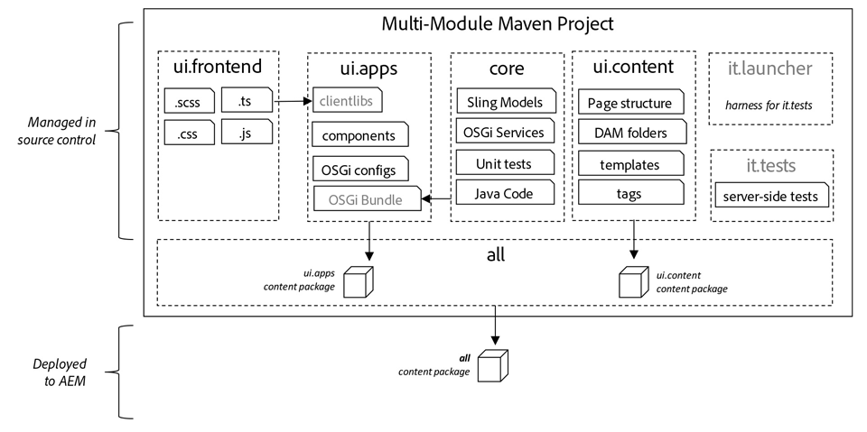
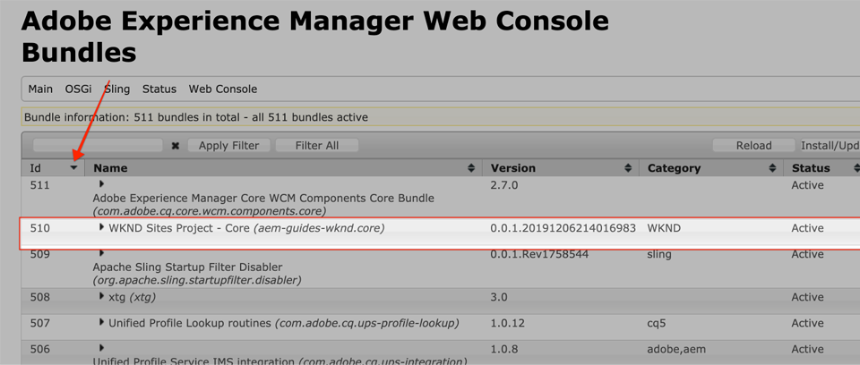
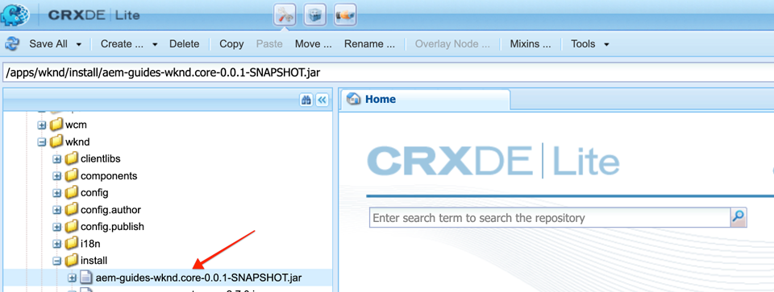

# Projektinställningar {#project-setup}

I den här självstudiekursen beskrivs hur du skapar ett Maven Multi Module-modulprojekt för att hantera kod och konfigurationer för en Adobe Experience Manager-webbplats.

## Förutsättningar {#prerequisites}

Granska de verktyg och instruktioner som krävs för att konfigurera en [lokal utvecklingsmiljö](overview.md#local-dev-environment). Se till att du har en ny instans av Adobe Experience Manager tillgänglig lokalt och att inga fler exempel-/demopaket har installerats (förutom obligatoriska Service Pack).

## Syfte {#objective}

1. Lär dig hur du skapar ett nytt AEM med en Maven-arkityp.
1. Förstå de olika moduler som genereras av den AEM projekttypen och hur de fungerar tillsammans.
1. Förstå hur AEM kärnkomponenter inkluderas i ett AEM projekt.

## Vad du ska bygga {#what-build}

>[!VIDEO](https://video.tv.adobe.com/v/30152/?quality=12&learn=on)

I det här kapitlet genererar du ett nytt Adobe Experience Manager-projekt med [AEM Project Archetype](https://github.com/adobe/aem-project-archetype). Ditt AEM innehåller all kod, allt innehåll och alla konfigurationer som används för en webbplatsimplementering. Det projekt som skapas i detta kapitel kommer att fungera som grund för en implementering av WKND-webbplatsen och kommer att byggas vidare i framtida kapitel.

## Bakgrund {#background}

**Vad är ett Maven-projekt?** - [Apache Maven](https://maven.apache.org/) är ett programhanteringsverktyg för att skapa projekt. *Alla Adobe Experience Manager* -implementeringar använder Maven-projekt för att skapa, hantera och distribuera anpassad kod utöver AEM.

**Vad är en Maven-arketype?** - En [Maven-arkityp](https://maven.apache.org/archetype/index.html) är en mall eller ett mönster för att generera nya projekt. Med den AEM projekttypen kan vi generera ett nytt projekt med ett anpassat namnutrymme och inkludera en projektstruktur som följer bästa praxis, vilket avsevärt snabbar upp vårt projekt.

## Skapa projektet {#create}

Det finns ett par sätt att skapa ett flermodulsprojekt i Maven för AEM. Den här självstudiekursen kommer att utnyttja [Maven AEM Project Archetype **22**](https://github.com/adobe/aem-project-archetype). I Cloud Manager [finns även en guide](https://docs.adobe.com/content/help/en/experience-manager-cloud-manager/using/getting-started/create-an-application-project.html) för användargränssnitt som initierar skapandet av ett AEM programprojekt. Det underliggande projektet som skapas av användargränssnittet i Cloud Manager resulterar i samma struktur som när du använder typen av arkiv direkt.

>[!NOTE]
>
>Använd version **22** av arketypen för att följa den här självstudiekursen. Det är dock alltid en god vana att använda den **senaste** versionen av typen för att generera ett nytt projekt.

Nästa serie steg kommer att utföras med en UNIX-baserad kommandoradsterminal, men de bör vara lika om en Windows-terminal används.

1. Öppna en kommandoradsterminal och kontrollera att Maven har installerats och lagts till i kommandoradens sökväg:

   ```shell
   $ mvn --version
   Apache Maven 3.6.2
   Maven home: /Library/apache-maven-3.6.2
   Java version: 11.0.4, vendor: Oracle Corporation, runtime: /Library/Java/JavaVirtualMachines/jdk-11.0.4.jdk/Contents/Home
   ```

1. Kontrollera att **adobe-public** -profilen är aktiv genom att köra följande kommando:

   ```shell
   $ mvn help:effective-settings
       ...
   <activeProfiles>
       <activeProfile>adobe-public</activeProfile>
   </activeProfiles>
   <pluginGroups>
       <pluginGroup>org.apache.maven.plugins</pluginGroup>
       <pluginGroup>org.codehaus.mojo</pluginGroup>
   </pluginGroups>
   </settings>
   [INFO] ------------------------------------------------------------------------
   [INFO] BUILD SUCCESS
   [INFO] ------------------------------------------------------------------------
   [INFO] Total time:  0.856 s
   ```

   Om du **inte** ser **adobe-public** är det en indikation på att Adobe repo inte refereras korrekt i din `~/.m2/settings.xml` fil. Gå igenom stegen för att installera och konfigurera Apache Maven i [en lokal utvecklingsmiljö](https://docs.adobe.com/content/help/en/experience-manager-learn/foundation/development/set-up-a-local-aem-development-environment.html#install-apache-maven).

1. Navigera till en katalog där du vill generera det AEM projektet. Detta kan vara vilken katalog som helst där du vill underhålla projektets källkod. En katalog med namnet `code` under användarens hemkatalog:

   ```shell
   $ cd ~/code
   ```

1. Klistra in följande på kommandoraden för att [generera projektet i gruppläge](https://maven.apache.org/archetype/maven-archetype-plugin/examples/generate-batch.html):

   ```shell
   $ mvn archetype:generate -B \
       -DarchetypeGroupId=com.adobe.granite.archetypes \
       -DarchetypeArtifactId=aem-project-archetype \
       -DarchetypeVersion=22 \
       -DgroupId=com.adobe.aem.guides \
       -Dversion=0.0.1-SNAPSHOT \
       -DappsFolderName=wknd \
       -DartifactId=aem-guides-wknd \
       -Dpackage=com.adobe.aem.guides.wknd \
       -DartifactName="WKND Sites Project" \
       -DcomponentGroupName=WKND \
       -DconfFolderName=wknd \
       -DcontentFolderName=wknd \
       -DcssId=wknd \
       -DisSingleCountryWebsite=n \
       -Dlanguage_country=en_us \
       -DoptionAemVersion=6.5.0 \
       -DoptionDispatcherConfig=none \
       -DoptionIncludeErrorHandler=n \
       -DoptionIncludeExamples=y \
       -DoptionIncludeFrontendModule=y \
       -DpackageGroup=wknd \
       -DsiteName="WKND Site"
   ```

   >[!NOTE]
   >
   >Som standard används interaktivt läge när du genererar ett projekt från Maven-arkitypen. För att undvika att fet fingrar på värden som vi har genererat i gruppläge. Det går också att skapa projektet Maven AEM med [AEM Developer Tools för Eclipse](https://helpx.adobe.com/experience-manager/6-5/sites/developing/using/aem-eclipse.html).

   >[!CAUTION]
   >
   >Om du får något av följande fel: *Det gick inte att köra målet org.apache.maven.plugins:maven-archietype-plugin:3.1.1:generate (default-cli) i fristående projekt: Den önskade arkitypen finns* inte. Det är en indikation på att Adobe repo inte refereras korrekt i din `~/.m2/settings.xml` fil. Gå igenom de tidigare stegen och kontrollera att filen settings.xml refererar till Adobe repo.

   I följande tabell visas de värden som används för den här självstudiekursen:

   | Namn | Värden | Beskrivning |
   |-----------------------------|---------|--------------------|
   | groupId | com.adobe.aem.guides | Base Maven groupId |
   | artifactId | aem-guides-wknd | Base Maven ArtifactId |
   | version | 0.0.1-ÖGONBLICKSBILD | Version |
   | package | com.adobe.aem.guides.wknd | Java-källpaket |
   | appsFolderName | wknd | /programmappnamn |
   | artifactName | WKND Sites Project | Maven Project Name |
   | componentGroupName | WKND | AEM |
   | contentFolderName | wknd | /content folder name |
   | confFolderName | wknd | /conf mappnamn |
   | cssId | wknd | prefix som används i genererad CSS |
   | packageGroup | wknd | Gruppnamn för innehållspaket |
   | siteName | WKND-plats | AEM webbplatsnamn |
   | optionAemVersion | 6.5.0 | AEM |
   | language_country | en_us | språk/landskod för att skapa innehållsstrukturen från (t.ex. en_us) |
   | optionIncludeExamples | y | Inkludera en exempelwebbplats för komponentbibliotek |
   | optionIncludeErrorHandler | n | Inkludera en anpassad 404-svarssida |
   | optionIncludeFrontendModule | y | Inkludera en dedikerad klientmodul |
   | isSingleCountryWebsite | n | Skapa språkstruktur överordnad i exempelinnehåll |
   | optionDispatcherConfig | inga | Generera en dispatcherkonfigurationsmodul |

1. Följande mapp- och filstruktur genereras av Maven-arkivtypen i det lokala filsystemet:

   ```plain
    ~/code/
       |--- aem-guides-wknd/
           |--- all/
           |--- core/
           |--- ui.apps/
           |--- ui.content/
           |--- ui.frontend /
           |--- it.launcher/
           |--- it.tests/
           |--- pom.xml
           |--- README.md
           |--- .gitignore
   ```

## Bygg projektet {#build}

Nu när vi har skapat ett nytt projekt kan vi distribuera projektkoden till en lokal instans av AEM.

1. Kontrollera att du har en instans av AEM som körs lokalt på port **4502**.
1. Navigera från kommandoraden till `aem-guides-wknd` projektkatalogen.

   ```shell
   $ cd aem-guides-wknd
   ```

1. Kör följande kommando för att skapa och distribuera hela projektet till AEM:

   ```shell
   $ mvn -PautoInstallSinglePackage clean install
   ...
   [INFO] ------------------------------------------------------------------------
   [INFO] Reactor Summary for aem-guides-wknd 0.0.1-SNAPSHOT:
   [INFO]
   [INFO] aem-guides-wknd .................................... SUCCESS [  0.394 s]
   [INFO] WKND Sites Project - Core .......................... SUCCESS [  7.299 s]
   [INFO] WKND Sites Project - UI Frontend ................... SUCCESS [ 31.938 s]
   [INFO] WKND Sites Project - Repository Structure Package .. SUCCESS [  0.736 s]
   [INFO] WKND Sites Project - UI apps ....................... SUCCESS [  4.025 s]
   [INFO] WKND Sites Project - UI content .................... SUCCESS [  1.447 s]
   [INFO] WKND Sites Project - All ........................... SUCCESS [  0.881 s]
   [INFO] WKND Sites Project - Integration Tests Bundles ..... SUCCESS [  1.052 s]
   [INFO] WKND Sites Project - Integration Tests Launcher .... SUCCESS [  1.239 s]
   [INFO] ------------------------------------------------------------------------
   [INFO] BUILD SUCCESS
   [INFO] ------------------------------------------------------------------------
   ```

   Profilen Maven `autoInstallSinglePackage` kompilerar de enskilda modulerna i projektet och distribuerar ett paket till AEM. Som standard distribueras det här paketet till en AEM som körs lokalt på port **4502** och med autentiseringsuppgifterna `admin:admin`.

1. Navigera till Package Manager på den lokala AEM instansen: [http://localhost:4502/crx/packmgr/index.jsp](http://localhost:4502/crx/packmgr/index.jsp). Du borde se tre paket för `aem-guides-wknd.ui.apps`, `aem-guides-wknd.ui.content`och `aem-guides-wknd.all`.

   Du bör också se flera paket för [AEM kärnkomponenter](https://docs.adobe.com/content/help/en/experience-manager-core-components/using/introduction.html) som ingår i projektet av typen architype. Detta beskrivs senare i självstudiekursen.

1. Gå till webbplatskonsolen: [http://localhost:4502/sites.html/content](http://localhost:4502/sites.html/content). WKND-platsen blir en av platserna. Den kommer att innehålla en webbplatsstruktur med hierarkin USA och Språkmallsidor. Den här platshierarkin baseras på värdena för `language_country` och `isSingleCountryWebsite` när projektet genereras med hjälp av arkitypen.

1. Öppna sidan för **amerikansk** `>` engelska **genom att markera sidan och klicka på knappen** Redigera **** i menyraden:

   

1. En del innehåll har redan skapats och flera komponenter är tillgängliga för att läggas till på en sida. Experimentera med de här komponenterna för att få en uppfattning om funktionaliteten. Hur den här sidan och komponenterna är konfigurerade kommer att utforskas i detalj senare i självstudiekursen.

## Inspect {#project-structure}

Den AEM typen består av individuella Maven-moduler:

* [core](https://docs.adobe.com/content/help/en/experience-manager-core-components/using/developing/archetype/core.html) - Java bundle som innehåller alla kärnfunktioner som OSGi-tjänster, avlyssnare eller schemaläggare, liksom komponentrelaterad Java-kod som servrar eller begärandefilter.
* [ui.apps](https://docs.adobe.com/content/help/en/experience-manager-core-components/using/developing/archetype/uiapps.html) - innehåller /apps-delar av projektet, t.ex. JS&amp;CSS clientlibs, components och OSGi configs
* [ui.content](https://docs.adobe.com/content/help/en/experience-manager-core-components/using/developing/archetype/uicontent.html) - innehåller strukturerat innehåll och konfigurationer som redigerbara mallar, metadatamappningar (/content, /conf)
* ui.tests - Java bundle containing JUnit tests that are execserver-side. Paketet ska inte distribueras till produktionen.
* ui.launcher - innehåller limkod som distribuerar paketet ui.tests (och beroende paket) till servern och utlöser fjärrexekveringen av JUnit
* [ui.front](https://docs.adobe.com/content/help/en/experience-manager-core-components/using/developing/archetype/uifrontend.html) - (valfritt) innehåller de artefakter som krävs för att använda den Webpack-baserade front-end-modulen.
* all - det här är en tom Maven-modul som kombinerar ovanstående moduler till ett enda paket som kan distribueras till en AEM miljö.



Läs [AEM Project Archetype-dokumentation](https://docs.adobe.com/content/help/en/experience-manager-core-components/using/developing/archetype/overview.html) om du vill veta mer om Maven-modulerna.

## Avancerade Maven-kommandon {#advanced-maven-commands}

Under utvecklingen kanske du bara arbetar med en av modulerna och vill undvika att bygga upp hela projektet för att spara tid. Du kanske också vill distribuera direkt till en AEM Publish-instans eller kanske till en instans av AEM som inte körs på port 4502.

Därefter ska vi titta på några av de Maven-profiler och kommandon du kan använda för större flexibilitet under utvecklingen.

### Kärnmodul {#core-module}

Kärnmodulen innehåller **[all](https://docs.adobe.com/content/help/en/experience-manager-core-components/using/developing/archetype/core.html)** Java-kod som är kopplad till projektet. När den byggts distribueras ett OSGi-paket till AEM. Så här skapar du bara den här modulen:

1. Navigera till `core` mappen (under `aem-guides-wknd`):

   ```shell
   $ cd core/
   ```

1. Kör följande kommando:

   ```shell
   $ mvn -PautoInstallBundle clean install
   ...
   [INFO] --- sling-maven-plugin:2.4.0:install (install-bundle) @ aem-guides-wknd.core ---
   [INFO] Installing Bundle aem-guides-wknd.core(~/code/aem-guides-wknd/core/target/aem-guides-wknd.core-0.0.1-SNAPSHOT.jar) to http://localhost:4502/system/console via WebConsole
   [INFO] Bundle installed
   [INFO] ------------------------------------------------------------------------
   [INFO] BUILD SUCCESS
   [INFO] ------------------------------------------------------------------------
   [INFO] Total time:  8.558 s
   [INFO] Finished at: 2019-12-06T13:40:21-08:00
   [INFO] ------------------------------------------------------------------------
   ```

1. Gå till [http://localhost:4502/system/console/bundles](http://localhost:4502/system/console/bundles). Det här är OSGi-webbkonsolen och innehåller information om alla paket som är installerade på AEM.

1. Växla sorteringskolumnen för **ID** så ser du WKND-paketet som är installerat och aktivt.

   

1. Du kan se var behållaren finns i [CRXDE-Lite](http://localhost:4502/crx/de/index.jsp#/apps/wknd/install/wknd-sites-guide.core-0.0.1-SNAPSHOT.jar):

   

### Ui.apps och Ui.content-moduler {#apps-content-module}

Modul **[ui.apps](https://docs.adobe.com/content/help/en/experience-manager-core-components/using/developing/archetype/uiapps.html)** maven innehåller all återgivningskod som behövs för webbplatsen under `/apps`. Detta inkluderar CSS/JS som lagras i ett AEM som kallas [clientlibs](https://helpx.adobe.com/experience-manager/6-5/sites/developing/using/clientlibs.html). Detta inkluderar även [HTML](https://docs.adobe.com/docs/en/htl/overview.html) -skript för återgivning av dynamisk HTML. Du kan tänka dig modulen **ui.apps** som en karta till strukturen i JCR men i ett format som kan lagras i ett filsystem och användas för källkontroll. Modulen **ui.apps** innehåller bara kod.

Så här skapar du bara den här modulen:

1. Från kommandoraden. Navigera till `ui.apps` mappen (under `aem-guides-wknd`):

   ```shell
   $ cd ../ui.apps
   ```

1. Kör följande kommando:

   ```shell
   $ mvn -PautoInstallPackage clean install
   ...
   Package installed in 122ms.
   [INFO] ------------------------------------------------------------------------
   [INFO] BUILD SUCCESS
   [INFO] ------------------------------------------------------------------------
   [INFO] Total time:  6.972 s
   [INFO] Finished at: 2019-12-06T14:44:12-08:00
   [INFO] ------------------------------------------------------------------------
   ```

1. Gå till [http://localhost:4502/crx/packmgr/index.jsp](http://localhost:4502/crx/packmgr/index.jsp). Du bör se paketet som det första installerade paketet och det bör ha en senare tidsstämpel än något av de andra paketen. `ui.apps`

   

1. Återgå till kommandoraden och kör följande kommando (i `ui.apps` mappen):

   ```shell
   $ mvn -PautoInstallPackagePublish clean install
   ...
   [INFO] --- content-package-maven-plugin:1.0.2:install (install-package-publish) @ aem-guides-wknd.ui.apps ---
   [INFO] Installing aem-guides-wknd.ui.apps (/Users/dgordon/code/aem-guides-wknd/ui.apps/target/aem-guides-wknd.ui.apps-0.0.1-SNAPSHOT.zip) to http://localhost:4503/crx/packmgr/service.jsp
   [INFO] I/O exception (java.net.ConnectException) caught when processing request: Connection refused (Connection refused)
   [INFO] Retrying request
   [INFO] I/O exception (java.net.ConnectException) caught when processing request: Connection refused (Connection refused)
   [INFO] Retrying request
   [INFO] I/O exception (java.net.ConnectException) caught when processing request: Connection refused (Connection refused)
   [INFO] Retrying request
   [INFO] ------------------------------------------------------------------------
   [INFO] BUILD FAILURE
   [INFO] ------------------------------------------------------------------------
   [INFO] Total time:  6.717 s
   [INFO] Finished at: 2019-12-06T14:51:45-08:00
   [INFO] ------------------------------------------------------------------------
   ```

   Profilen `autoInstallPackagePublish` är avsedd att distribuera paketet till en publiceringsmiljö som körs på port **4503**. Ovanstående fel förväntas om det inte går att hitta en AEM som körs på http://localhost:4503.

1. Kör slutligen följande kommando för att distribuera `ui.apps` paketet på port **4504**:

   ```shell
   $ mvn -PautoInstallPackage clean install -Daem.port=4504
   ...
   [INFO] --- content-package-maven-plugin:1.0.2:install (install-package) @ aem-guides-wknd.ui.apps ---
   [INFO] Installing aem-guides-wknd.ui.apps (/Users/dgordon/code/aem-guides-wknd/ui.apps/target/aem-guides-wknd.ui.apps-0.0.1-SNAPSHOT.zip) to http://localhost:4504/crx/packmgr/service.jsp
   [INFO] I/O exception (java.net.ConnectException) caught when processing request: Connection refused (Connection refused)
   [INFO] Retrying request
   [INFO] I/O exception (java.net.ConnectException) caught when processing request: Connection refused (Connection refused)
   [INFO] Retrying request
   [INFO] I/O exception (java.net.ConnectException) caught when processing request: Connection refused (Connection refused)
   [INFO] Retrying request
   [INFO] ------------------------------------------------------------------------
   [INFO] BUILD FAILURE
   [INFO] --------------------------------------------------------------------
   ```

   Ett byggfel förväntas inträffa igen om det inte finns någon AEM som körs på port **4504** . Parametern `aem.port` definieras i POM-filen på `aem-guides-wknd/pom.xml`.

Modulen **[ui.content](https://docs.adobe.com/content/help/en/experience-manager-core-components/using/developing/archetype/uicontent.htm)** är strukturerad på samma sätt som modulen **ui.apps** . Den enda skillnaden är att modulen **ui.content** innehåller det som kallas **muterbart** innehåll. **Muterbart** innehåll avser i huvudsak icke-kodkonfigurationer som mallar, profiler eller mappstrukturer som lagras i källkontrollen **men** kan ändras direkt på en AEM. Detta beskrivs mer ingående i kapitlet om sidor och mallar. För närvarande är det viktiga att samma Maven-kommandon som används för att skapa modulen **ui.apps** kan användas för att skapa modulen **ui.content** . Upprepa stegen ovan i mappen **ui.content** .

### Ui.frontModule {#ui-frontend-module}

Modulen **[ui.front](https://docs.adobe.com/content/help/en/experience-manager-core-components/using/developing/archetype/uifrontend.html)** är en Maven-modul som egentligen är ett [webbpaketsprojekt](https://webpack.js.org/) . Modulen är konfigurerad att vara ett dedikerat frontendsystem som genererar JavaScript- och CSS-filer, som i sin tur distribueras till AEM. Med modulen **ui.front** kan utvecklare koda med språk som [Sass](https://sass-lang.com/), [TypeScript](https://www.typescriptlang.org/), använda [npm](https://www.npmjs.com/) -moduler och integrera utdata direkt i AEM.

Modulen **ui.front** beskrivs mer ingående i kapitlet om bibliotek på klientsidan och frontendutveckling. Nu ska vi titta på hur den är integrerad i projektet.

1. Från kommandoraden. Navigera till `ui.frontend` mappen (under `aem-guides-wknd`):

   ```shell
   $ cd ../ui.frontend
   ```

1. Kör följande kommando:

   ```shell
   $ mvn clean install
   ...
   [INFO] write clientlib asset txt file (type: js): ../ui.apps/src/main/content/jcr_root/apps/wknd/clientlibs/clientlib-site/js.txt
   [INFO] copy: dist/clientlib-site/site.js ../ui.apps/src/main/content/jcr_root/apps/wknd/clientlibs/clientlib-site/js/site.js
   [INFO]
   [INFO] write clientlib asset txt file (type: css): ../ui.apps/src/main/content/jcr_root/apps/wknd/clientlibs/clientlib-site/css.txt
   [INFO] copy: dist/clientlib-site/site.css ../ui.apps/src/main/content/jcr_root/apps/wknd/clientlibs/clientlib-site/css/site.css
   [INFO]
   [INFO] --- maven-assembly-plugin:3.1.1:single (default) @ aem-guides-wknd.ui.frontend ---
   [INFO] Reading assembly descriptor: assembly.xml
   [INFO] Building zip: /Users/dgordon/code/aem-guides-wknd/ui.frontend/target/aem-guides-wknd.ui.frontend-0.0.1-SNAPSHOT.zip
   [INFO]
   [INFO] --- maven-install-plugin:2.5.2:install (default-install) @ aem-guides-wknd.ui.frontend ---
   [INFO] Installing /Users/dgordon/code/aem-guides-wknd/ui.frontend/pom.xml to /Users/dgordon/.m2/repository/com/adobe/aem/guides/aem-guides-wknd.ui.frontend/0.0.1-SNAPSHOT/aem-guides-wknd.ui.frontend-0.0.1-SNAPSHOT.pom
   [INFO] Installing /Users/dgordon/code/aem-guides-wknd/ui.frontend/target/aem-guides-wknd.ui.frontend-0.0.1-SNAPSHOT.zip to /Users/dgordon/.m2/repository/com/adobe/aem/guides/aem-guides-wknd.ui.frontend/0.0.1-SNAPSHOT/aem-guides-wknd.ui.frontend-0.0.1-SNAPSHOT.zip
   [INFO] ------------------------------------------------------------------------
   [INFO] BUILD SUCCESS
   [INFO] ------------------------------------------------------------------------
   [INFO] Total time:  13.520 s
   [INFO] Finished at: 2019-12-06T15:26:16-08:00
   ```

   Lägg märke till strecken som `copy: dist/clientlib-site/site.js ../ui.apps/src/main/content/jcr_root/apps/wknd/clientlibs/clientlib-site/js/site.js`. Detta anger att kompilerad CSS och JS kopieras till `ui.apps` mappen.

1. Visa den ändrade tidsstämpeln för filen `aem-guides-wknd/ui.apps/src/main/content/jcr_root/apps/wknd/clientlibs/clientlib-site/css.txt`. Den bör uppdateras senare än de andra filerna i `ui.apps` modulen.

   Till skillnad från de andra modulerna vi tittade på distribueras inte modulen **ui.front** direkt till AEM. I stället kopieras CSS och JS till modulen **ui.apps** och sedan distribueras modulen **ui.apps** till AEM. Om du tittar på byggordningen från det allra första Maven-kommandot ser du att **ui.front** alltid är skapat *före* **ui.apps**.

   Senare i kursen ska vi titta på de avancerade funktionerna i modulen **ui.front** och den inbäddade webbpaketutvecklingsservern för snabb utveckling.

## Inkludering av kärnkomponenter {#core-components}

Arkitypen bäddar automatiskt in [AEM kärnkomponenter](https://docs.adobe.com/content/help/en/experience-manager-core-components/using/introduction.html) i projektet. Tidigare ingick flera paket relaterade till kärnkomponenter när de distribuerade paketen granskades AEM. Core Components är en uppsättning baskomponenter som utformats för att påskynda utvecklingen av ett AEM Sites-projekt. Core Components är öppen källkod och tillgängliga på [GitHub](https://github.com/adobe/aem-core-wcm-components). Mer information om hur kärnkomponenter [ingår i projektet finns här](https://docs.adobe.com/content/help/en/experience-manager-core-components/using/developing/archetype/overview.html#core-components).

1. Använd din favorittextredigerare öppen `aem-guides-wknd/pom.xml`.

1. Search for `core.wcm.components.version`. Här ser du vilken version av Core Components som ingår:

   ```xml
       <core.wcm.components.version>2.x.x</core.wcm.components.version>
   ```

   >[!NOTE]
   >
   > AEM Project Archetype innehåller en version av AEM Core Components, men dessa projekt har olika releasecykler, och därmed kanske inte den medföljande versionen av Core Components är den senaste. Det bästa sättet är att alltid utnyttja den senaste versionen av Core Components. Nya funktioner och felkorrigeringar uppdateras ofta. Den senaste [versionsinformationen finns på GitHub](https://github.com/adobe/aem-core-wcm-components/releases).

1. Om du bläddrar nedåt till `dependencies` avsnittet bör du se de enskilda Core Component-beroendena:

   ```xml
   <dependency>
       <groupId>com.adobe.cq</groupId>
       <artifactId>core.wcm.components.core</artifactId>
       <version>${core.wcm.components.version}</version>
   </dependency>
   <dependency>
       <groupId>com.adobe.cq</groupId>
       <artifactId>core.wcm.components.content</artifactId>
       <type>zip</type>
       <version>${core.wcm.components.version}</version>
   </dependency>
   <dependency>
       <groupId>com.adobe.cq</groupId>
       <artifactId>core.wcm.components.config</artifactId>
       <type>zip</type>
       <version>${core.wcm.components.version}</version>
   </dependency>
   <dependency>
       <groupId>com.adobe.cq</groupId>
       <artifactId>core.wcm.components.examples</artifactId>
       <type>zip</type>
       <version>${core.wcm.components.version}</version>
   </dependency>
   ```

## Hantering av källkontroll {#source-control}

Det är alltid en bra idé att använda någon form av källkontroll för att hantera koden i programmet. I den här självstudien används git och GitHub. Det finns flera filer som genereras av Maven och/eller valfri IDE som ska ignoreras av SCM.

Maven skapar en målmapp när du skapar och installerar kodpaketet. Målmappen och innehållet ska uteslutas från SCM.

Under ui.apps kommer du också att märka många .content.xml-filer som skapas. Dessa XML-filer mappar nodtyperna och egenskaperna för innehåll som är installerat i JCR-läsaren. Dessa filer är viktiga och ska **inte** ignoreras.

Den AEM projekttypen genererar en exempelfil `.gitignore` som kan användas som startpunkt för vilken filer kan ignoreras. Filen genereras i `<src>/aem-guides-wknd/.gitignore`.

## Granska {#chapter-review}

>[!VIDEO](https://video.tv.adobe.com/v/30153/?quality=12&learn=on)

## Grattis! {#congratulations}

Grattis, du har just skapat ditt första AEM projekt!

### Nästa steg {#next-steps}

Förstå den underliggande tekniken i en Adobe Experience Manager (AEM) Sites Component genom ett enkelt `HelloWorld` exempel med självstudiekursen [Component Basics](component-basics.md) .
