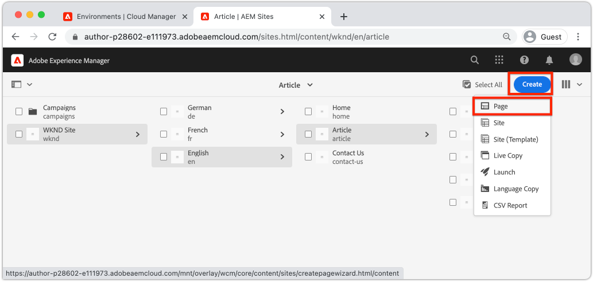
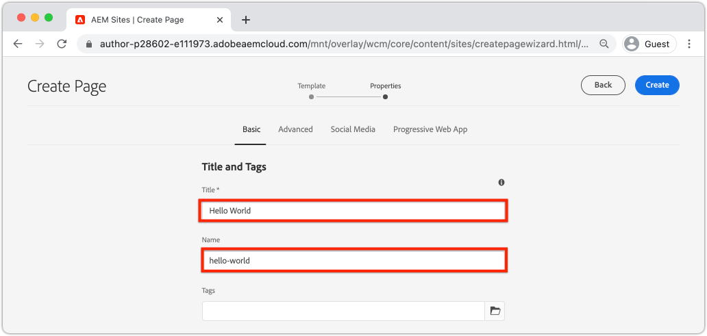
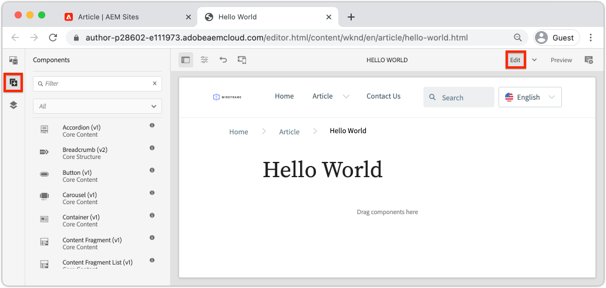
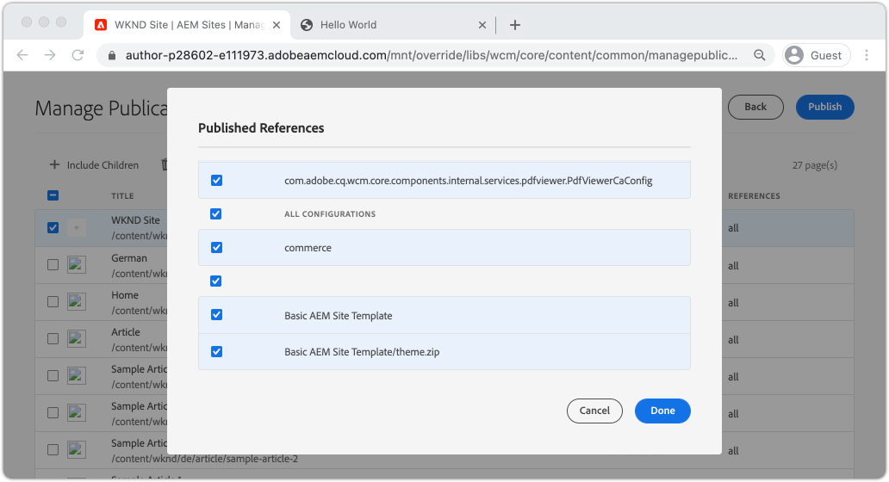
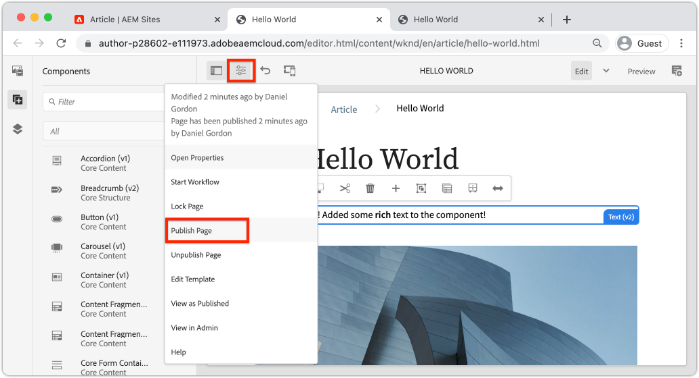

# Introduktion till redigering och publicering {#author-content-publish}

Det är viktigt att förstå hur en användare uppdaterar innehåll för webbplatsen. I det här kapitlet ska vi anta en profil för en **innehållsförfattare** och göra vissa redigeringsuppdateringar av webbplatsen som genererats i det föregående kapitlet. I slutet av kapitlet kommer vi att publicera ändringarna för att förstå hur den publicerade webbplatsen uppdateras.

## Förutsättningar {#prerequisites}

Det här är en självstudiekurs i flera delar och det antas att stegen som beskrivs i kapitlet [Skapa en plats](./create-site.md) har slutförts.

## Syfte {#objective}

1. Förstå begreppen för **Sidor** och **komponenter** i AEM Sites.
1. Lär dig hur du uppdaterar innehåll på webbplatsen.
1. Lär dig hur du publicerar ändringar på den publicerade webbplatsen.

## Skapa en ny sida {#create-page}

En webbplats delas vanligtvis upp i sidor för att skapa en flersidig upplevelse. AEM strukturerar innehållet på samma sätt. Skapa sedan en ny sida för webbplatsen.

1. Logga in på AEM **Författartjänst** som användes i föregående kapitel.
1. Klicka på **Webbplatser** > **WKND-plats** > **Engelska** > **Artikel** på AEM startskärm
1. Klicka på **Skapa** > **Sida** i det övre högra hörnet.

   

   Guiden **Skapa sida** visas.

1. Välj mallen **Artikelsida** och klicka på **Nästa**.

   Sidor i AEM skapas utifrån en sidmall. Sidmallar beskrivs mer ingående i kapitlet [Sidmallar](page-templates.md).

1. Under **Egenskaper** anger du **Title** för Hello World.
1. Ange att **Name** ska vara `hello-world` och klicka på **Create**.

   

1. Klicka på **Öppna** i popup-fönstret för att öppna den nya sidan.

## Skapa en komponent {#author-component}

AEM kan ses som små modulära byggstenar på en webbsida. Genom att dela upp användargränssnittet i logiska segment eller komponenter blir det mycket enklare att hantera. För att återanvända komponenter måste komponenterna vara konfigurerbara. Detta sker via författardialogrutan.

AEM tillhandahåller en uppsättning [kärnkomponenter](https://experienceleague.adobe.com/docs/experience-manager-core-components/using/introduction.html) som är färdiga att använda. **Kärnkomponenterna** sträcker sig från grundläggande element som [Text](https://experienceleague.adobe.com/docs/experience-manager-core-components/using/components/text.html) och [Bild](https://experienceleague.adobe.com/docs/experience-manager-core-components/using/components/image.html) till mer komplexa gränssnittselement som [Carousel](https://experienceleague.adobe.com/docs/experience-manager-core-components/using/components/carousel.html).

Skapa sedan några komponenter med AEM Page Editor.

1. Navigera till sidan **Hello World** som skapades i föregående övning.
1. Kontrollera att du är i läget **Redigera** och klicka på ikonen **Komponenter** i den vänstra sidlisten.

   

   Komponentbiblioteket öppnas och de tillgängliga komponenter som kan användas på sidan visas.

1. Bläddra nedåt och **Dra+släpp** en **Text (v2)** -komponent på sidans redigerbara huvudområde.

   

1. Klicka på komponenten **Text** för att markera och klicka sedan på ikonen **skiftnyckel**  för att öppna komponentens dialogruta. Ange text och spara ändringarna i dialogrutan.

   

   Komponenten **Text** bör nu visa den formaterade texten på sidan.

1. Upprepa stegen ovan, förutom att dra en instans av komponenten **Image(v2)** till sidan. Öppna dialogrutan för komponenten **Bild**.

1. I den vänstra listen växlar du till **Resurssökaren** genom att klicka på **Assets** -ikonen  .
1. **Dra och släpp** en bild i komponentens dialogruta och klicka på **Klar** för att spara ändringarna.

   

1. Observera att det finns komponenter på sidan, till exempel **Rubrik**, **Navigering** och **Sök**, som är åtgärdade. De här områdena är konfigurerade som en del av sidmallen och kan inte ändras på en enskild sida. Detta beskrivs mer i nästa kapitel.

Experimentera fritt med några andra komponenter. Dokumentation om varje [kärnkomponent finns här](https://experienceleague.adobe.com/docs/experience-manager-core-components/using/introduction.html). En detaljerad videoserie om [Sidredigering finns här](https://experienceleague.adobe.com/docs/experience-manager-learn/sites/page-authoring/aem-sites-authoring-overview.html).

## Publish-uppdateringar {#publish-updates}

AEM har delats mellan en **författartjänst** och en **Publish-tjänst**. I det här kapitlet har vi gjort flera ändringar av webbplatsen på **författartjänsten**. För att webbplatsbesökarna ska kunna se ändringarna måste de publiceras på **Publish-tjänsten**.

*Högt innehållsflöde från författare till Publish*

**1.** Innehållsförfattare uppdaterar webbplatsinnehållet. Uppdateringarna kan förhandsgranskas, granskas och godkännas för publicering.

**2.**-innehåll publiceras. Publicering kan utföras on demand eller planeras för ett framtida datum.

**3.** Besökare på webbplatsen kommer att se ändringarna som återspeglas i Publish-tjänsten.

### Publish the changes

Nu ska vi publicera ändringarna.

1. Gå till **Webbplatser** från AEM startsida och välj **WKND-plats**.
1. Klicka på **Hantera publikation** på menyraden.

   

   Eftersom det här är en helt ny webbplats vill vi publicera alla sidor och kan använda guiden Hantera publikation för att definiera exakt vad som behöver publiceras.

1. Under **Alternativ** låter du standardinställningarna vara **Publish** och schemalägger dem för **Now**. Klicka på **Nästa**.
1. Under **Omfång** markerar du **WKND-platsen** och klickar på **Inkludera underordnade inställningar**. Markera **Inkludera underordnade** i dialogrutan. Avmarkera resten av rutorna för att säkerställa att hela webbplatsen publiceras.

   

1. Klicka på knappen **Publicerade referenser**. Kontrollera att allt är markerat i dialogrutan. Detta inkluderar **standardplatsmallen** och flera konfigurationer som genereras av platsmallen. Klicka på **Klar** för att uppdatera.

   

1. Markera kryssrutan intill **WKND-plats** och klicka på **Nästa** i det övre högra hörnet.
1. Ange en **arbetsflödesrubrik** i steget **Arbetsflöden**. Detta kan vara vilken text som helst och kan vara användbart som en del av en granskningsversion senare. Ange&quot;Inledande publicering&quot; och klicka på **Publish**.

## Visa publicerat innehåll {#publish}

Gå sedan till Publish-tjänsten för att se ändringarna.

1. Ett enkelt sätt att hämta URL:en för Publish-tjänsten är att kopiera författar-URL:en och ersätta ordet `author` med `publish`. Till exempel:

   * **Författar-URL** - `https://author-pYYYY-eXXXX.adobeaemcloud.com/`
   * **Publish URL** - `https://publish-pYYYY-eXXXX.adobeaemcloud.com/`

1. Lägg till `/content/wknd.html` i Publish URL så att den slutliga URL:en ser ut så här: `https://publish-pYYYY-eXXXX.adobeaemcloud.com/content/wknd.html`.

   >[!NOTE]
   >
   > Ändra `wknd.html` så att det matchar namnet på din webbplats, om du angav ett unikt namn när [platsen skapades](create-site.md).

1. Om du navigerar till Publish URL bör du se webbplatsen, utan någon AEM redigeringsfunktion.

   

1. Använd menyn **Navigering** och klicka på **Artikel** > **Hello World** för att navigera till sidan Hello World som skapades tidigare.
1. Gå tillbaka till **AEM författartjänsten** och gör ytterligare innehållsändringar i sidredigeraren.
1. Publish dessa ändringar direkt från sidredigeraren genom att klicka på ikonen **Sidegenskaper** > **Publish Page**

   

1. Gå tillbaka till **AEM Publish-tjänsten** om du vill visa ändringarna. Troligen kommer du **inte** omedelbart att se uppdateringarna. Detta beror på att **AEM Publish-tjänsten** inkluderar [cachelagring via en Apache-webbserver och CDN](https://experienceleague.adobe.com/docs/experience-manager-cloud-service/implementing/content-delivery/caching.html). Som standard cachelagras HTML innehåll i cirka 5 minuter.

1. Om du vill kringgå cachen för testnings-/felsökningssyften lägger du bara till en frågeparameter som `?nocache=true`. URL:en skulle se ut som `https://publish-pYYYY-eXXXX.adobeaemcloud.com/content/wknd/en/article/hello-world.html?nocache=true`. Mer information om cachningsstrategi och konfigurationer som är tillgängliga [finns här](https://experienceleague.adobe.com/docs/experience-manager-cloud-service/implementing/content-delivery/overview.html).

1. Du kan även hitta URL:en till Publish-tjänsten i Cloud Manager. Navigera till **Cloud Manager-programmet** > **Miljö** > **Miljö**.

   

   Under **Miljösegment** hittar du länkar till tjänsterna **Författare** och **Publish**.

## Grattis! {#congratulations}

Grattis! Du har just skrivit och publicerat ändringar på din AEM webbplats!

### Nästa steg {#next-steps}

I en implementeringsplanering i verkligheten kommer en webbplats med dummies och gränssnittsdesign vanligtvis före webbplatsskapandet. Läs om hur Adobe XD UI Kits kan användas för att utforma och snabba upp Adobe Experience Manager Sites-implementeringen i [gränssnittsplaneringen med Adobe XD](./ui-planning-adobe-xd.md).

Vill du fortsätta utforska AEM Sites funktioner? Du kan gå direkt in i kapitlet om [Sidmallar](./page-templates.md) för att förstå relationen mellan en sidmall och en sida.

