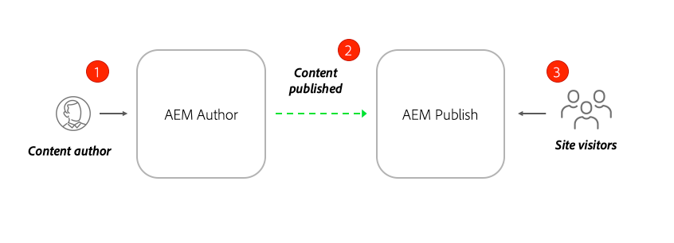

# Skriv innehåll och publicera ändringar {#author-content-publish}

>[!CAUTION]
>
> De snabba funktionerna som visas här kommer att släppas under andra halvåret 2021. Den relaterade dokumentationen är tillgänglig för förhandsgranskning.

Det är viktigt att förstå hur en användare uppdaterar innehåll för webbplatsen. I det här kapitlet ska vi anta en profil för en **innehållsförfattare** och göra vissa redigeringsuppdateringar av webbplatsen som genererats i det föregående kapitlet. I slutet av kapitlet kommer vi att publicera ändringarna för att förstå hur den publicerade webbplatsen uppdateras.

## Förutsättningar {#prerequisites}

Det här är en självstudiekurs i flera delar och det antas att stegen som beskrivs i kapitlet [Skapa en plats](./create-site.md) har slutförts.

## Mål {#objective}

1. Förstå begreppen för **Sidor** och **Komponenter** i AEM Sites.
1. Lär dig hur du uppdaterar innehåll på webbplatsen.
1. Lär dig hur du publicerar ändringar på den publicerade webbplatsen.

## Skapa en ny sida {#create-page}

En webbplats delas vanligtvis upp i sidor för att skapa en flersidig upplevelse. AEM strukturerar innehållet på samma sätt. Skapa sedan en ny sida för webbplatsen.

1. Logga in på AEM **Författare**-tjänst som användes i föregående kapitel.
1. Klicka på **Platser** > **WKND-plats** > **Engelska** > **Artikel** från AEM startskärmen.
1. Klicka på **Skapa** > **Sida** i det övre högra hörnet.

   

   Då visas guiden **Skapa sida**.

1. Välj mallen **Artikelsida** och klicka på **Nästa**.

   Sidor i AEM skapas utifrån en sidmall. Utforska sidmallar i detalj i kapitlet [Sidmallar](page-templates.md).

1. Under **Egenskaper** anger du **Title** of &quot;Hello World&quot;.
1. Ange **Namn** som `hello-world` och klicka på **Skapa**.

   

1. Klicka på **Öppna** i dialogrutan för att öppna den nya sidan.

## Skapa en komponent {#author-component}

AEM kan ses som små modulära byggstenar på en webbsida. Genom att dela upp användargränssnittet i logiska segment eller komponenter blir det mycket enklare att hantera. För att återanvända komponenter måste komponenterna vara konfigurerbara. Detta sker via författardialogrutan.

AEM innehåller en uppsättning [kärnkomponenter](https://experienceleague.adobe.com/docs/experience-manager-core-components/using/introduction.html) som är färdiga att använda. **Kärnkomponenterna** sträcker sig från grundläggande element som [Text](https://experienceleague.adobe.com/docs/experience-manager-core-components/using/components/text.html) och [Bild](https://experienceleague.adobe.com/docs/experience-manager-core-components/using/components/image.html) till mer komplexa gränssnittselement som [Carousel](https://experienceleague.adobe.com/docs/experience-manager-core-components/using/components/carousel.html).

Låt oss nu skapa några komponenter med AEM Page Editor.

1. Navigera till sidan **Hello World** som skapades i föregående övning.
1. Kontrollera att du är i **redigeringsläget** och klicka på ikonen **Komponenter** till vänster.

   

   Komponentbiblioteket öppnas och de tillgängliga komponenter som kan användas på sidan visas.

1. Rulla nedåt och **Dra+Släpp** en **Text (v2)**-komponent till det redigerbara huvudområdet på sidan.

   

1. Klicka på **Text**-komponenten som ska markeras och klicka sedan på **skiftnyckel**-ikonen  för att öppna komponentens dialogruta. Ange text och spara ändringarna i dialogrutan.

   

   Komponenten **Text** ska nu visa den formaterade texten på sidan.

1. Upprepa stegen ovan, förutom att dra en instans av **Image(v2)**-komponenten till sidan. Öppna dialogrutan för **Image**-komponenten.

1. I den vänstra listen växlar du till **tillgångssökaren** genom att klicka på ikonen **Resurser** .
1. **Dra+** Dropan-bilden till komponentens dialogruta och klicka på  **** Gör om du vill spara ändringarna.

   

1. Observera att det finns komponenter på sidan, som **Rubrik**, **Navigering**, **Sök** som är fasta. De här områdena är konfigurerade som en del av sidmallen och kan inte ändras på en enskild sida. Detta kommer att utforskas mer i nästa kapitel.

Experimentera med några andra komponenter. Dokumentation om respektive [kärnkomponent finns här](https://experienceleague.adobe.com/docs/experience-manager-core-components/using/introduction.html). En detaljerad videoserie om [Sidredigering finns här](https://experienceleague.adobe.com/docs/experience-manager-learn/sites/page-authoring/aem-sites-authoring-overview.html).

## Publicera uppdateringar {#publish-updates}

AEM delas mellan en **författartjänst** och en **publiceringstjänst**. I det här kapitlet har vi gjort flera ändringar av webbplatsen på **författartjänsten**. För att webbplatsbesökarna ska kunna se ändringarna måste de publiceras i **Publiceringstjänsten**.

*Högnivåflöde av innehåll från författare till publicering*

**1.** Innehållsförfattare uppdaterar webbplatsens innehåll. Uppdateringarna kan förhandsgranskas, granskas och godkännas för publicering.

**2.** Innehåll publiceras. Publicering kan utföras on demand eller planeras för ett framtida datum.

**3.** Besökarna ser ändringarna i publiceringstjänsten.

### Publicera ändringarna

Nu ska vi publicera ändringarna.

1. Gå till **Platser** från AEM Start och välj **WKND-plats**.
1. Klicka på **Hantera publikation** på menyraden.

   

   Eftersom det här är en helt ny webbplats vill vi publicera alla sidor och kan använda guiden Hantera publikation för att definiera exakt vad som behöver publiceras.

1. Under **Alternativ** låter du standardinställningarna vara **Publicera** och schemalägg det för **Now**. Klicka på **Nästa**.
1. Under **Scope** markerar du **WKND-platsen** och klickar på **Inkludera underordnade**. Avmarkera alla rutor i dialogrutan. Vi vill publicera hela webbplatsen.

   

1. Klicka på knappen **Publicerade referenser**. Kontrollera att allt är markerat i dialogrutan. Detta inkluderar **grundläggande AEM** platsmall och flera konfigurationer som genereras av platsmallen. Klicka på **Klar** för att uppdatera.

   

1. Klicka slutligen på **Publicera** i det övre högra hörnet för att publicera innehållet.

## Visa publicerat innehåll {#publish}

Navigera sedan till Publicera-tjänsten för att visa ändringarna.

1. Ett enkelt sätt att hämta URL:en för publiceringstjänsten är att kopiera författar-URL:en och ersätta `author`-ordet med `publish`. Till exempel:

   * **Författar-URL** -  `https://author-pYYYY-eXXXX.adobeaemcloud.com/`
   * **Publicera URL** -  `https://publish-pYYYY-eXXXX.adobeaemcloud.com/`

1. Lägg till `/content/wknd.html` i publicerings-URL:en så att den slutliga URL:en ser ut så här: `https://publish-pYYYY-eXXXX.adobeaemcloud.com/content/wknd.html`.

   >[!NOTE]
   >
   > Ändra `wknd.html` så att det matchar namnet på platsen, om du angav ett unikt namn när du skapade [platsen](create-site.md).

1. Navigera till publicerings-URL:en som du vill visa webbplatsen utan någon AEM redigeringsfunktion.

   

1. Använd menyn **Navigering** och klicka på **Article** > **Hello World** för att navigera till sidan Hello World som skapades tidigare.
1. Gå tillbaka till **AEM Author Service** och gör ytterligare innehållsändringar i sidredigeraren.
1. Publicera dessa ändringar direkt i sidredigeraren genom att klicka på ikonen **Sidegenskaper** > **Publicera sida**

   

1. Gå tillbaka till **AEM Publish Service** för att se ändringarna. Det är troligt att du **inte** omedelbart kommer att se uppdateringarna. Detta beror på att **AEM Publish Service** innehåller [cachelagring via en Apache-webbserver och CDN](https://experienceleague.adobe.com/docs/experience-manager-cloud-service/implementing/content-delivery/caching.html). Som standard cachelagras HTML-innehåll i ~5 minuter.

1. Om du vill kringgå cacheminnet för testnings-/felsökningssyften lägger du bara till en frågeparameter som `?nocache=true`. URL:en skulle se ut som `https://publish-pYYYY-eXXXX.adobeaemcloud.com/content/wknd/en/article/hello-world.html?nocache=true`. Mer information om cachningsstrategi och konfigurationer som är tillgängliga [finns här](https://experienceleague.adobe.com/docs/experience-manager-cloud-service/implementing/content-delivery/overview.html).

1. Du kan också hitta URL:en till publiceringstjänsten i Cloud Manager. Gå till **Cloud Manager-programmet** > **Miljö** > **Miljö**.

   

   Under **Miljösegment** hittar du länkar till tjänsterna **Författare** och **Publicera**.

## Grattis! {#congratulations}

Grattis! Du har just skrivit och publicerat ändringar på din AEM webbplats!

### Nästa steg {#next-steps}

Lär dig hur du skapar och ändrar [Sidmallar](./page-templates.md). Förstå förhållandet mellan en sidmall och en sida. Lär dig hur du konfigurerar profiler för en sidmall för att få en mer detaljerad styrning och enhetlig varumärkeshantering för innehåll.  En välstrukturerad artikel i tidskriften kommer att skapas utifrån en dummy från Adobe XD.
