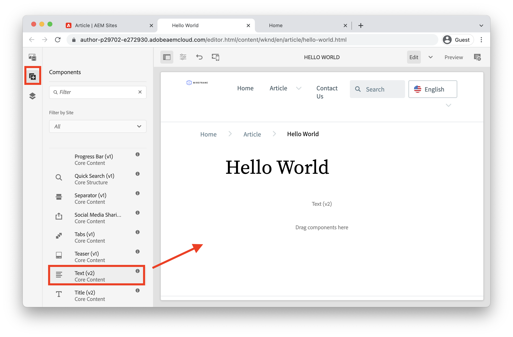
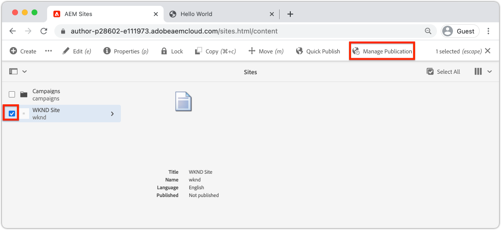

# Introduktion till redigering och publicering {#author-content-publish}

Det är viktigt att förstå hur en användare uppdaterar innehåll för webbplatsen. I det här kapitlet kommer vi att anta **Innehållsförfattare** och gör några redaktionella uppdateringar av webbplatsen som skapades i det föregående kapitlet. I slutet av kapitlet kommer vi att publicera ändringarna för att förstå hur den publicerade webbplatsen uppdateras.

## Förutsättningar {#prerequisites}

Det här är en självstudiekurs i flera delar och det antas att stegen som beskrivs i [Skapa en plats](./create-site.md) kapitlet har slutförts.

## Syfte {#objective}

1. Förstå begreppen för **Sidor** och **Komponenter** i AEM Sites.
1. Lär dig hur du uppdaterar innehåll på webbplatsen.
1. Lär dig hur du publicerar ändringar på den publicerade webbplatsen.

## Skapa en ny sida {#create-page}

En webbplats delas vanligtvis upp i sidor för att skapa en flersidig upplevelse. AEM strukturerar innehållet på samma sätt. Skapa sedan en ny sida för webbplatsen.

1. Logga in på AEM **Upphovsman** Tjänst som användes i föregående kapitel.
1. AEM startskärmen klickar du på **Webbplatser** > **WKND-plats** > **Engelska** > **Artikel**
1. Klicka i det övre högra hörnet **Skapa** > **Sida**.

   

   Det här tar upp **Skapa sida** guide.

1. Välj **Artikelsida** mall och klicka på **Nästa**.

   Sidor i AEM skapas utifrån en sidmall. Sidmallar beskrivs mer ingående i [Sidmallar](page-templates.md) kapitel.

1. Under **Egenskaper** ange en **Titel** &quot;Hello World&quot;.
1. Ange **Namn** att `hello-world` och klicka **Skapa**.

   

1. I popup-fönstret i dialogrutan klickar du på **Öppna** för att öppna den nya sidan.

## Skapa en komponent {#author-component}

AEM kan ses som små modulära byggstenar på en webbsida. Genom att dela upp användargränssnittet i logiska segment eller komponenter blir det mycket enklare att hantera. För att återanvända komponenter måste komponenterna vara konfigurerbara. Detta sker via författardialogrutan.

AEM innehåller en uppsättning [Kärnkomponenter](https://experienceleague.adobe.com/docs/experience-manager-core-components/using/introduction.html) som är färdiga att använda. The **Kärnkomponenter** från grundläggande element som [Text](https://experienceleague.adobe.com/docs/experience-manager-core-components/using/components/text.html) och [Bild](https://experienceleague.adobe.com/docs/experience-manager-core-components/using/components/image.html) till mer komplicerade gränssnittselement som [Carousel](https://experienceleague.adobe.com/docs/experience-manager-core-components/using/components/carousel.html).

Skapa sedan några komponenter med AEM Page Editor.

1. Navigera till **Hello World** sida som skapades i föregående övning.
1. Se till att du är **Redigera** och i den vänstra sidlisten klickar du på **Komponenter** -ikon.

   

   Komponentbiblioteket öppnas och de tillgängliga komponenter som kan användas på sidan visas.

1. Rulla ned och **Dra och släpp** a **Text (v2)** till det redigerbara huvudområdet på sidan.

   

1. Klicka på **Text** som ska markeras och sedan klicka på **wrench** icon  för att öppna komponentens dialogruta. Ange text och spara ändringarna i dialogrutan.

   

   The **Text** ska nu visa den formaterade texten på sidan.

1. Upprepa stegen ovan, förutom att dra en instans av **Bild (v2)** till sidan. Öppna **Bild** -komponentens dialogruta.

1. I den vänstra listen växlar du till **Resurssökare** genom att klicka på **Resurser** icon .
1. **Dra och släpp** en bild till komponentens dialogruta och klicka på **Klar** för att spara ändringarna.

   

1. Observera att det finns komponenter på sidan, som **Titel**, **Navigering**, **Sök** som är fasta. De här områdena är konfigurerade som en del av sidmallen och kan inte ändras på en enskild sida. Detta beskrivs mer i nästa kapitel.

Experimentera fritt med några andra komponenter. Dokumentation om varje [Kärnkomponenten finns här](https://experienceleague.adobe.com/docs/experience-manager-core-components/using/introduction.html). En detaljerad videoserie om [Här finns sidredigering](https://experienceleague.adobe.com/docs/experience-manager-learn/sites/page-authoring/aem-sites-authoring-overview.html).

## Publicera uppdateringar {#publish-updates}

AEM-miljöer delas mellan **Författartjänst** och **Publiceringstjänst**. I det här kapitlet har vi gjort flera ändringar av webbplatsen på **Författartjänst**. För att webbplatsbesökarna ska kunna se ändringarna måste vi publicera dem på **Publiceringstjänst**.

*Högnivåflöde av innehåll från författare till publicering*

**1.** Innehållsförfattare uppdaterar webbplatsens innehåll. Uppdateringarna kan förhandsgranskas, granskas och godkännas för publicering.

**2.** Innehåll publiceras. Publicering kan utföras on demand eller planeras för ett framtida datum.

**3.** Besökarna ser ändringarna i publiceringstjänsten.

### Publicera ändringarna

Nu ska vi publicera ändringarna.

1. Navigera AEM startskärmen till **Webbplatser** och väljer **WKND-plats**.
1. Klicka på **Hantera publikation** på menyraden.

   

   Eftersom det här är en helt ny webbplats vill vi publicera alla sidor och kan använda guiden Hantera publikation för att definiera exakt vad som behöver publiceras.

1. Under **Alternativ** lämna standardinställningarna till **Publicera** och schemalägg **Nu**. Klicka på **Nästa**.
1. Under **Omfång** väljer du **WKND-plats** och klicka **Inkludera underordnade inställningar**. I dialogrutan markerar du **Inkludera underordnade**. Avmarkera resten av rutorna för att säkerställa att hela webbplatsen publiceras.

   

1. Klicka på **Publicerade referenser** -knappen. Kontrollera att allt är markerat i dialogrutan. Detta kommer att inkludera **Standardmall för webbplats** och flera konfigurationer som genereras av platsmallen. Klicka **Klar** att uppdatera.

   

1. Markera kryssrutan intill **WKND-plats** och klicka **Nästa** längst upp till höger.
1. I **Arbetsflöden** steg, ange **Arbetsflödets titel**. Detta kan vara vilken text som helst och kan vara användbart som en del av en granskningsversion senare. Ange&quot;Inledande publicering&quot; och klicka på **Publicera**.

## Visa publicerat innehåll {#publish}

Navigera sedan till Publicera-tjänsten för att visa ändringarna.

1. Ett enkelt sätt att hämta URL:en för publiceringstjänsten är att kopiera författarens URL och ersätta `author` ord med `publish`. Till exempel:

   * **Författar-URL** - `https://author-pYYYY-eXXXX.adobeaemcloud.com/`
   * **Publicera URL** - `https://publish-pYYYY-eXXXX.adobeaemcloud.com/`

1. Lägg till `/content/wknd.html` till publicerings-URL:en så att den slutliga URL:en ser ut så här: `https://publish-pYYYY-eXXXX.adobeaemcloud.com/content/wknd.html`.

   >[!NOTE]
   >
   > Ändra `wknd.html` för att matcha namnet på din webbplats, om du angav ett unikt namn under [webbplatsgenerering](create-site.md).

1. Navigera till publicerings-URL:en som du vill ska se webbplatsen, utan någon AEM redigeringsfunktion.

   

1. Använda **Navigering** meny klicka **Artikel** > **Hello World** för att navigera till sidan Hello World som skapades tidigare.
1. Återgå till **AEM författartjänst** och gör ytterligare innehållsändringar i sidredigeraren.
1. Publicera dessa ändringar direkt inifrån sidredigeraren genom att klicka på **Sidegenskaper** ikon > **Publicera sida**

   

1. Återgå till **AEM Publiceringstjänst** för att visa ändringarna. Troligen kommer du **not** omedelbart se uppdateringarna. Det beror på att **AEM Publiceringstjänst** inkluderar [cachelagring via en Apache-webbserver och CDN](https://experienceleague.adobe.com/docs/experience-manager-cloud-service/implementing/content-delivery/caching.html). Som standard cachelagras HTML innehåll i cirka 5 minuter.

1. Om du vill kringgå cacheminnet för testnings-/felsökningsändamål lägger du bara till en frågeparameter som `?nocache=true`. URL:en ser ut så här `https://publish-pYYYY-eXXXX.adobeaemcloud.com/content/wknd/en/article/hello-world.html?nocache=true`. Mer information om cachningsstrategi och tillgängliga konfigurationer [finns här](https://experienceleague.adobe.com/docs/experience-manager-cloud-service/implementing/content-delivery/overview.html).

1. Du kan också hitta URL:en till publiceringstjänsten i Cloud Manager. Navigera till **Cloud Manager-program** > **Miljö** > **Miljö**.

   

   Under **Miljösegment** finns länkar till **Upphovsman** och **Publicera** tjänster.

## Grattis! {#congratulations}

Grattis! Du har just skrivit och publicerat ändringar på din AEM webbplats!

### Nästa steg {#next-steps}

I en implementeringsplanering i verkligheten kommer en webbplats med dummies och gränssnittsdesign vanligtvis före webbplatsskapandet. Läs om hur Adobe XD UI Kits kan användas för att designa och snabba upp Adobe Experience Manager Sites-implementeringen i [UI-planering med Adobe XD](./ui-planning-adobe-xd.md).

Vill du fortsätta utforska AEM Sites funktioner? Gå direkt in i kapitlet om [Sidmallar](./page-templates.md) om du vill veta hur en sidmall och en sida fungerar.

