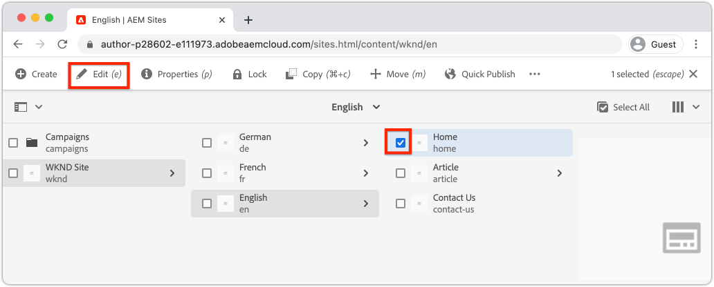
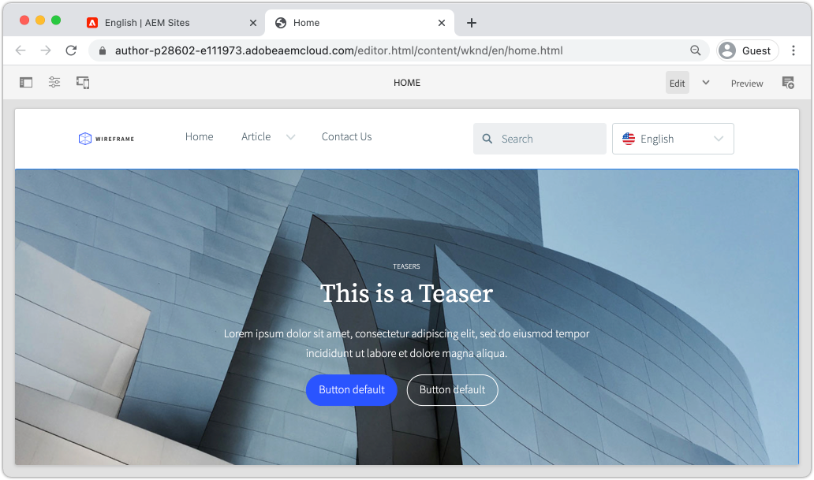

# Skapa en plats {#create-site}

Som en del av guiden Skapa webbplats i Adobe Experience Manager, AEM, använder du guiden Skapa webbplats för att skapa en ny webbplats. Standardwebbplatsmallen från Adobe används som utgångspunkt för den nya webbplatsen.

## Förutsättningar {#prerequisites}

Stegen i det här kapitlet kommer att utföras i en Adobe Experience Manager as a Cloud Service-miljö. Kontrollera att du har administratörsbehörighet för AEM-miljön. Vi rekommenderar att du använder ett [Sandbox-program](https://experienceleague.adobe.com/docs/experience-manager-cloud-service/onboarding/getting-access/sandbox-programs/introduction-sandbox-programs.html) och [Utvecklingsmiljö](https://experienceleague.adobe.com/docs/experience-manager-cloud-service/implementing/using-cloud-manager/manage-environments.html) när du slutför den här självstudiekursen.

[Produktionsprogram](https://experienceleague.adobe.com/docs/experience-manager-cloud-service/content/implementing/using-cloud-manager/programs/introduction-production-programs.html) -miljöer kan även användas för den här självstudiekursen. Se dock till att aktiviteterna i den här självstudiekursen inte påverkar det arbete som utförs i målmiljöerna, eftersom den här självstudiekursen distribuerar innehåll och kod till AEM-målmiljön.

[AEM SDK](https://experienceleague.adobe.com/docs/experience-manager-learn/cloud-service/local-development-environment-set-up/aem-runtime.html) kan användas för delar av den här självstudien. De aspekter av den här självstudiekursen som är beroende av molntjänster, till exempel [distribuera teman med Cloud Manager frontendpipeline](https://experienceleague.adobe.com/docs/experience-manager-learn/getting-started-wknd-tutorial-develop/site-template/theming.html), kan inte utföras på AEM SDK.

Mer information finns i [introduktionsdokumentationen](https://experienceleague.adobe.com/docs/experience-manager-cloud-service/onboarding/home.html).

## Syfte {#objective}

1. Lär dig hur du använder guiden Skapa plats för att skapa en ny plats.
1. Förstå webbplatsmallarnas roll.
1. Utforska AEM webbplats.

## Logga in på Adobe Experience Manager Author {#author}

Som ett första steg loggar du in i din AEM as a Cloud Service-miljö. AEM-miljöer delas mellan en **författartjänst** och en **publiceringstjänst**.

* **Författartjänst** - där webbplatsinnehåll skapas, hanteras och uppdateras. Vanligtvis har bara interna användare åtkomst till **författartjänsten** och finns bakom en inloggningsskärm.
* **Publiceringstjänst** - är värd för den publicerade webbplatsen. Detta är den tjänst som slutanvändarna kommer att se och vanligtvis är allmänt tillgänglig.

Huvuddelen av självstudiekursen kommer att äga rum med **författartjänsten**.

1. Gå till Adobe Experience Cloud [https://experience.adobe.com/](https://experience.adobe.com/). Logga in med ditt personliga konto eller ett företags-/skolkonto.
1. Kontrollera att rätt organisation är markerad på menyn och klicka på **Experience Manager**.

   

1. Under **Cloud Manager** klickar du på **Starta**.
1. Håll muspekaren över det program du vill använda och klicka på ikonen **Cloud Manager Program** .

   

1. Klicka på **Miljö** på den översta menyn för att visa de tilldelade miljöerna.

1. Hitta den miljö du vill använda och klicka på **författar-URL**.

   

   >[!NOTE]
   >
   >Vi rekommenderar att du använder en **utvecklingsmiljö** för den här självstudiekursen.

1. En ny flik startas för AEM **Författartjänst**. Klicka på **Logga in med Adobe** så loggas du in automatiskt med samma inloggningsuppgifter för Experience Cloud.

1. När du har omdirigerats och autentiserats bör du nu se startskärmen för AEM.

   

>[!NOTE]
>
> Har du problem med att få åtkomst till Experience Manager? Granska [startdokumentationen](https://experienceleague.adobe.com/docs/experience-manager-cloud-service/onboarding/home.html)

## Ladda ned mallen för grundläggande webbplats

En platsmall är en startpunkt för en ny plats. En webbplatsmall innehåller grundläggande teman, sidmallar, konfigurationer och exempelinnehåll. Det är utvecklaren som bestämmer vad som ingår i webbplatsmallen. Adobe tillhandahåller en **grundläggande webbplatsmall** som snabbar upp nya implementeringar.

1. Öppna en ny flik i webbläsaren och navigera till projektet Basic Site Template på GitHub: [https://github.com/adobe/aem-site-template-standard](https://github.com/adobe/aem-site-template-standard). Projektet har öppen källkod och licensierats för att användas av alla.
1. Klicka på **Releaser** och navigera till den [senaste versionen](https://github.com/adobe/aem-site-template-standard/releases/latest).
1. Expandera listrutan **Assets** och hämta zip-mallfilen:

   

   Den här ZIP-filen används i nästa övning.

   >[!NOTE]
   >
   > Den här självstudiekursen är skriven med version **1.1.0** av mallen för grundläggande webbplats. När du startar ett nytt projekt för produktion bör du alltid använda den senaste versionen.

## Skapa en ny plats

Generera sedan en ny plats med hjälp av platsmallen från föregående övning.

1. Gå tillbaka till AEM. Gå till **Webbplatser** från startskärmen i AEM.
1. Klicka på **Skapa** > **Plats (mall)** i det övre högra hörnet. Då visas guiden **Skapa plats**.
1. Under **Välj en webbplatsmall** klickar du på knappen **Importera** .

   Överför mallfilen **.zip** som hämtats från föregående övning.

1. Markera **den grundläggande AEM-webbplatsmallen** och klicka på **Nästa**.

   

1. Under **Webbplatsinformation** > **Webbplatsrubrik** anger du `WKND Site`.

   I en implementering skulle&quot;WKND Site&quot; ersättas av företagets eller organisationens varumärke. I den här självstudiekursen simulerar vi skapandet av en sajt för ett påhittat livsstilsmärke,&quot;WKND&quot;.

1. Under **Platsnamn** anger du `wknd`.

   

   >[!NOTE]
   >
   > Om du använder en delad AEM-miljö lägger du till en unik identifierare till **platsnamnet**. Till exempel `wknd-site-johndoe`. Detta garanterar att flera användare kan slutföra samma självstudiekurs, utan några kollisioner.

1. Klicka på **Skapa** om du vill skapa platsen. Klicka på **Klar** i dialogrutan **Klart** när AEM har skapat webbplatsen.

## Utforska den nya webbplatsen

1. Navigera till AEM Sites-konsolen, om den inte redan är där.
1. En ny **WKND-plats** har skapats. Den kommer att innehålla en platsstruktur med en flerspråkig hierarki.
1. Öppna sidan **Engelska** > **Hem** genom att markera sidan och klicka på knappen **Redigera** i menyraden:

   

1. Startinnehåll har redan skapats och flera komponenter är tillgängliga för att läggas till på en sida. Experimentera med de här komponenterna för att få en uppfattning om funktionerna. Du får lära dig grunderna för en komponent i nästa kapitel.

   

   *Exempelinnehåll från webbplatsmallen*

## Grattis! {#congratulations}

Grattis! Du har just skapat din första AEM-webbplats!

### Nästa steg {#next-steps}

Använd sidredigeraren i Adobe Experience Manager, AEM för att uppdatera webbplatsens innehåll i kapitlet [Författare och publicera](author-content-publish.md). Lär dig hur atomiska komponenter kan konfigureras för att uppdatera innehåll. Förstå skillnaden mellan en AEM Author- och Publish-miljö och lär dig hur man publicerar uppdateringar till den publicerade webbplatsen.
