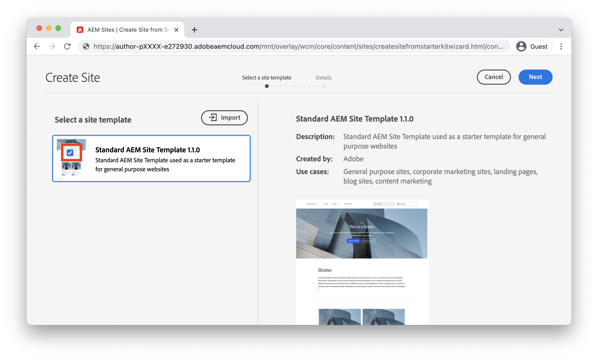

# Skapa en plats {#create-site}

>[!CAUTION]
>
> De snabba funktionerna som visas här kommer att släppas under andra halvåret 2021. Den relaterade dokumentationen är tillgänglig för förhandsgranskning.

I det här kapitlet beskrivs hur du skapar en ny webbplats i Adobe Experience Manager. Standardwebbplatsmallen som tillhandahålls av Adobe används som utgångspunkt.

## Förutsättningar {#prerequisites}

Stegen i det här kapitlet kommer att utföras i en Adobe Experience Manager-Cloud Service. Kontrollera att du har administratörsbehörighet för AEM. Du bör använda ett [sandlådeprogram](https://experienceleague.adobe.com/docs/experience-manager-cloud-service/onboarding/getting-access/sandbox-programs/introduction-sandbox-programs.html) och [Utvecklingsmiljö](https://experienceleague.adobe.com/docs/experience-manager-cloud-service/implementing/using-cloud-manager/manage-environments.html) när du slutför den här självstudiekursen.

Mer information finns i [startdokumentationen](https://experienceleague.adobe.com/docs/experience-manager-cloud-service/onboarding/home.html).

## Mål {#objective}

1. Lär dig hur du använder guiden Skapa plats för att skapa en ny plats.
1. Förstå webbplatsmallarnas roll.
1. Utforska den genererade AEM.

## Logga in på Adobe Experience Manager Author {#author}

Som ett första steg loggar du in på AEM som en Cloud Service-miljö. AEM delas mellan en **författartjänst** och en **publiceringstjänst**.

* **Författartjänst**  - där webbplatsinnehåll skapas, hanteras och uppdateras. Vanligtvis har bara interna användare åtkomst till **författartjänsten** och är bakom en inloggningsskärm.
* **Publiceringstjänst**  - är värd för den publicerade webbplatsen. Detta är den tjänst som slutanvändarna kommer att se och vanligtvis är allmänt tillgänglig.

Huvuddelen av självstudiekursen äger rum med **författartjänsten**.

1. Gå till Adobe Experience Cloud [https://experience.adobe.com/](https://experience.adobe.com/). Logga in med ditt personliga konto eller ett företags-/skolkonto.
1. Kontrollera att rätt organisation är markerad på menyn och klicka på **Experience Manager**.

   

1. Under **Cloud Manager** klickar du på **Starta**.
1. Håll muspekaren över det program du vill använda och klicka på ikonen **Cloud Manager Program**.

   

1. Klicka på **Miljöer** på den översta menyn för att visa de tilldelade miljöerna.

1. Hitta den miljö du vill använda och klicka på **författar-URL**.

   

   >[!NOTE]
   >
   >Du bör använda en **Development**-miljö för den här självstudiekursen.

1. En ny flik startas till AEM **Författartjänst**. Klicka på **Logga in med Adobe** och du bör loggas in automatiskt med samma inloggningsuppgifter för Experience Cloud.

1. När du har omdirigerat och autentiserat dig bör du nu se AEM startskärm.

   

>[!NOTE]
>
> Har du svårt att få åtkomst till Experience Manager? Läs [dokumentationen om introduktion](https://experienceleague.adobe.com/docs/experience-manager-cloud-service/onboarding/home.html)

## Ladda ned mallen för grundläggande webbplats

En platsmall är en startpunkt för en ny plats. En webbplatsmall innehåller grundläggande teman, sidmallar, konfigurationer och exempelinnehåll. Det är utvecklaren som bestämmer vad som ingår i webbplatsmallen. Adobe tillhandahåller en **grundläggande webbplatsmall** som snabbar upp nya implementeringar.

1. Öppna en ny flik i webbläsaren och gå till projektet Basic Site Template på GitHub: [https://github.com/adobe/aem-site-template-basic](https://github.com/adobe/aem-site-template-basic). Projektet har öppen källkod och licensierats för att användas av alla.
1. Klicka på **Releaser** och navigera till [den senaste versionen](https://github.com/adobe/aem-site-template-basic/releases/latest).
1. Expandera listrutan **Resurser** och hämta zip-mallfilen:

   

   Den här ZIP-filen kommer att användas i nästa övning.

   >[!NOTE]
   >
   > Den här självstudiekursen är skriven med version **5.0.0** av mallen för grundläggande plats. Om du startar ett nytt projekt bör du alltid använda den senaste versionen.

## Skapa en ny plats

Generera sedan en ny plats med hjälp av platsmallen från föregående övning.

1. Återgå till AEM. Navigera från AEM startskärm till **Platser**.
1. Klicka på **Skapa** > **Plats (mall)** i det övre högra hörnet. Då visas guiden **Skapa plats**.
1. Under **Välj en platsmall** klickar du på knappen **Importera**.

   Ladda upp **.zip**-mallfilen som hämtats från föregående övning.

1. Välj **AEM för grundläggande plats** och klicka på **Nästa**.

   

1. Under **Platsinformation** > **Platstitel** anger du `WKND Site`.
1. Under **Platsnamn** anger du `wknd`.

   

   >[!NOTE]
   >
   > Om du använder en delad AEM lägger du till en unik identifierare i **platsnamnet**. Till exempel `wknd-johndoe`. Detta garanterar att flera användare kan slutföra samma självstudiekurs, utan några kollisioner.

1. Klicka på **Skapa** för att generera platsen. Klicka på **Klar** i dialogrutan **Klart** när AEM har skapat webbplatsen.

## Utforska den nya webbplatsen

1. Navigera till AEM Sites-konsolen, om den inte redan är där.
1. En ny **WKND-plats** har skapats. Den kommer att innehålla en platsstruktur med en flerspråkig hierarki.
1. Öppna sidan **Engelska** > **Hem** genom att markera sidan och klicka på knappen **Redigera** i menyraden:

   

1. Startinnehåll har redan skapats och flera komponenter är tillgängliga för att läggas till på en sida. Experimentera med de här komponenterna för att få en uppfattning om funktionaliteten. Du får lära dig grunderna för en komponent i nästa kapitel.

   

   *Exempelinnehåll från webbplatsmallen*

## Grattis! {#congratulations}

Grattis, du har just skapat din första AEM webbplats!

### Nästa steg {#next-steps}

Använd sidredigeraren i Adobe Experience Manager, AEM, för att uppdatera webbplatsens innehåll i kapitlet [Författare och publicera](author-content-publish.md). Lär dig hur atomiska komponenter kan konfigureras för att uppdatera innehåll. Förstå skillnaden mellan en AEM Author- och Publish-miljö och lär dig hur man publicerar uppdateringar till den publicerade webbplatsen.
