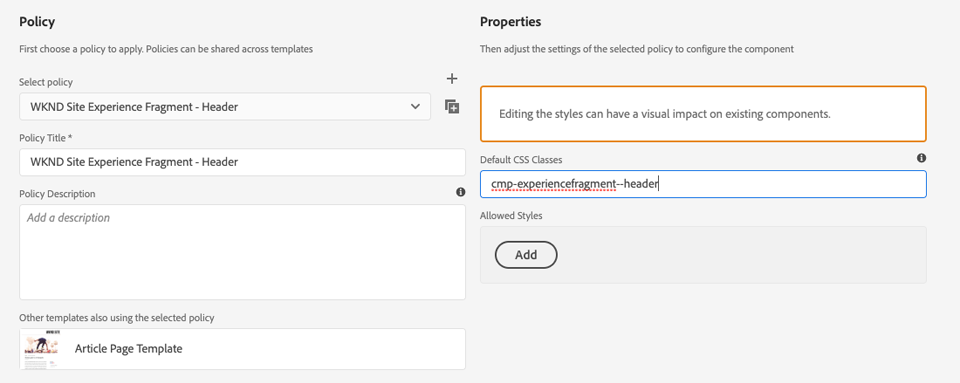
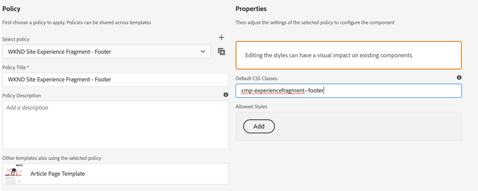

# Utveckla med formatsystemet {#developing-with-the-style-system}

Lär dig hur du implementerar enskilda format och återanvänder kärnkomponenter med Experience Manager Style System. I den här självstudien beskrivs hur du utvecklar för Style System för att utöka grundkomponenterna med varumärkesspecifik CSS och avancerade principkonfigurationer för mallredigeraren.

## Förutsättningar {#prerequisites}

Granska de verktyg och instruktioner som krävs för att konfigurera en [lokal utvecklingsmiljö](overview.md#local-dev-environment).

Vi rekommenderar också att du går igenom självstudiekursen [Klientbibliotek och Front-end-arbetsflöde](client-side-libraries.md) för att förstå grunderna i klientbibliotek och de olika frontverktygen som är inbyggda i AEM.

### Startprojekt

Ta en titt på den baslinjekod som självstudiekursen bygger på:

1. Klona [github.com/adobe/aem-guides-wknd](https://github.com/adobe/aem-guides-wknd)-databasen.
1. Kolla in grenen `style-system/start`

   ```shell
   $ git clone git@github.com:adobe/aem-guides-wknd.git ~/code/aem-guides-wknd
   $ cd ~/code/aem-guides-wknd
   $ git checkout style-system/start
   ```

1. Distribuera kodbasen till en lokal AEM med dina Maven-kunskaper:

   ```shell
   $ cd ~/code/aem-guides-wknd
   $ mvn clean install -PautoInstallSinglePackage
   ```

Du kan alltid visa den färdiga koden på [GitHub](https://github.com/adobe/aem-guides-wknd/tree/style-system/solution) eller checka ut koden lokalt genom att växla till grenen `style-system/solution`.

## Syfte

1. Lär dig hur du använder Style System för att tillämpa varumärkesspecifik CSS på AEM kärnkomponenter.
1. Lär dig mer om BEM-notation och hur det kan användas för att skapa mer detaljerade omfång för format.
1. Använd avancerade principkonfigurationer med redigerbara mallar.

## Vad du ska bygga {#what-you-will-build}

I det här kapitlet ska vi använda funktionen [Style System](https://docs.adobe.com/content/help/en/experience-manager-learn/sites/page-authoring/style-system-feature-video-use.html) för att skapa flera varianter av komponenter som används på artikelsidan. Vi använder också Style System för att skapa variationer för strukturella element som sidhuvud/sidfot och layoutbehållare.

>[!VIDEO](https://video.tv.adobe.com/v/30386/?quality=12&learn=on)

## Bakgrund {#background}

Med [Style System](https://docs.adobe.com/content/help/en/experience-manager-65/developing/components/style-system.html) kan utvecklare och mallredigerare skapa flera visuella varianter av en komponent. Författare kan sedan i sin tur bestämma vilket format som ska användas när en sida disponeras. Vi utnyttjar Style System i resten av självstudiekursen för att få fram flera unika format, samtidigt som vi utnyttjar kärnkomponenterna i en lågkodsstrategi.

Den allmänna idén med Style System är att författare kan välja olika stilar för hur en komponent ska se ut. &quot;Styles&quot; backas upp av ytterligare CSS-klasser som injiceras i en komponents yttre div. I klientbiblioteken läggs CSS-regler till baserat på dessa formatklasser så att komponenten ändrar utseende.

Du hittar [detaljerad dokumentation om Style System här](https://docs.adobe.com/content/help/en/experience-manager-65/developing/components/style-system.html). Det finns också en bra [teknisk video för att förstå Style System](https://docs.adobe.com/content/help/en/experience-manager-learn/sites/developing/style-system-technical-video-understand.html).

## Rubrikkomponentformat {#title-component}

I det här läget har [titelkomponenten](https://docs.adobe.com/content/help/en/experience-manager-core-components/using/components/title.html) proxynerats in i projektet under `/apps/wknd/components/content/title` som en del av modulen **ui.apps**. Standardformaten för rubrikelement (`H1`, `H2`, `H3`...) har redan implementerats i modulen **ui.front** i filen `_elements.scss` under `ui.frontend/src/main/webpack/base/sass/_elements.scss`.

### Understrykningsformat

[WKND-artikeldesignen](assets/pages-templates/wknd-article-design.xd) innehåller ett unikt format för komponenten Title med en understrykning. I stället för att skapa två komponenter eller ändra komponentdialogrutan kan du använda Style System för att ge författarna möjlighet att lägga till ett understruket format.


### Inspect Title Component Markup

Som gränssnittsutvecklare är det första steget för att formatera en Core-komponent att förstå den kod som genereras av komponenten.

Som en del av det genererade projektet är arkitypen inbäddad i **Core Component Examples**-projektet. För utvecklare och innehållsförfattare innehåller detta en enkel referens för att förstå alla funktioner som finns i Core Components. En liveversion är också [tillgänglig](https://opensource.adobe.com/aem-core-wcm-components/library.html).

1. Öppna en ny webbläsare och visa komponenten Title:

   Lokal AEM: [http://localhost:4502/editor.html/content/core-components-examples/library/title.html](http://localhost:4502/editor.html/content/core-components-examples/library/title.html)

   Exempel: [https://opensource.adobe.com/aem-core-wcm-components/library/title.html](https://opensource.adobe.com/aem-core-wcm-components/library/title.html)

1. Nedan finns koden för komponenten Title:

   ```html
   <div class="cmp-title">
       <h1 class="cmp-title__text">Lorem Ipsum</h1>
   </div>
   ```

   The BEM notation of the Title Component:

   ```plain
   BLOCK cmp-title
       ELEMENT cmp-title__text
   ```

1. Style-systemet lägger till en CSS-klass i den yttre div som omger komponenten. Den kod vi ska rikta in oss på liknar alltså följande:

   ```html
   <div class="STYLE-SYSTEM-CLASS-HERE"> <!-- Custom CSS class - implementation gets to define this -->
       <div class="cmp-title">
           <h1 class="cmp-title__text">Lorem Ipsum</h1>
       </div>
   </div>
   ```

### Implementera understrykning - ui.front

Därefter implementerar vi understrykningsformatet med hjälp av modulen **ui.front** i vårt projekt. Vi använder webbpaketets utvecklingsserver som medföljer modulen **ui.front** för att förhandsgranska formaten *innan* distribueras till en lokal instans av AEM.

1. Starta webbpaketets dev-server genom att köra följande kommando i modulen **ui.front**:

   ```shell
   $ cd ~/code/aem-guides-wknd/ui.frontend/
   $ npm start
   
   > aem-maven-archetype@1.0.0 start code/aem-guides-wknd/ui.frontend
   > webpack-dev-server --open --config ./webpack.dev.js
   ```

   Då öppnas en webbläsare på [http://localhost:8080](http://localhost:8080).

   >[!NOTE]
   >
   > Om bilderna verkar vara brutna kontrollerar du att startprojektet har distribuerats till en lokal instans av AEM (som körs på port 4502) och att webbläsaren som används också har loggat in i den lokala AEM.

   

1. I Eclipse eller den IDE du väljer öppnar du filen `index.html` som finns på: `ui.frontend/src/main/webpack/static/index.html`. Detta är den statiska kod som används av webbpaketets utvecklingsserver.
1. I `index.html` söker du efter en instans av den Title Component som understrykningsformatet ska läggas till i genom att söka i dokumentet efter *cmp-title*. Välj komponenten Title med texten *&quot;Vans utanför Wall Skatepark&quot;* (rad 218). Lägg till klassen `cmp-title--underline` i den omgivande diven:

   ```html
    <!-- before -->
    <div class="title aem-GridColumn aem-GridColumn--default--8">
        <div class="cmp-title">
            <h2 class="cmp-title__text">Vans off the Wall Skatepark</h2>
        </div>
    </div>
   ```

   ```html
    <!-- After -->
    <div class="cmp-title--underline title aem-GridColumn aem-GridColumn--default--8">
        <div class="cmp-title">
            <h2 class="cmp-title__text">Vans off the Wall Skatepark</h2>
        </div>
    </div>
   ```

1. Återgå till webbläsaren och kontrollera att den extra klassen återspeglas i koden.
1. Återgå till modulen **ui.front** och uppdatera filen `title.scss` som finns på: `ui.frontend/src/main/webpack/components/content/title/scss/title.scss`:

   ```css
   /* Add Title Underline Style */
   .cmp-title--underline {
   
       .cmp-title {
       }
   
       .cmp-title__text {
           &:after {
           display: block;
               width: 84px;
               padding-top: 8px;
               content: '';
               border-bottom: 2px solid $brand-primary;
           }
       }
   }
   ```

   >[!NOTE]
   >
   >Det anses vara en bra rutin att alltid ha tätt omfång av format till målkomponenten. Detta säkerställer att extra format inte påverkar andra delar av sidan.
   >
   >Alla kärnkomponenter följer **[BEM-notation](https://github.com/adobe/aem-core-wcm-components/wiki/css-coding-conventions)**. Det är bäst att ha den yttre CSS-klassen som mål när du skapar ett standardformat för en komponent. Ett annat tips är att ange klassnamn som mål som anges av BEM-notationen för kärnkomponenten i stället för HTML-element.

1. Återgå till webbläsaren en gång till och du bör se understrykningsformatet som lagts till:

   

1. Stoppa webbpaketets utvecklingsserver.

### Lägg till en titelprincip

Därefter måste vi lägga till en ny policy för rubrikkomponenter så att innehållsförfattare kan välja understrykningsformatet som ska gälla för specifika komponenter. Detta görs med mallredigeraren i AEM.

1. Distribuera kodbasen till en lokal AEM med dina Maven-kunskaper:

   ```shell
   $ cd ~/code/aem-guides-wknd
   $ mvn clean install -PautoInstallSinglePackage
   ```

1. Navigera till **Artikelsidmallen** som finns på: [http://localhost:4502/editor.html/conf/wknd/settings/wcm/templates/article-page-template/structure.html](http://localhost:4502/editor.html/conf/wknd/settings/wcm/templates/article-page-template/structure.html).

1. I **Structure**-läget, i huvudbehållaren **Layoutbehållare**, väljer du ikonen **Policy** bredvid komponenten **Title** under *Tillåtna komponenter*:

   

1. Skapa en ny princip för komponenten Title med följande värden:

   *Policytitel **:  **WKND**

   *Egenskaper*  >  *Fliken*  Format >  *Lägg till ett nytt format*

   **Understruken** :  `cmp-title--underline`

   

   Klicka på **Klar** om du vill spara ändringarna i titelprincipen.

   >[!NOTE]
   >
   > Värdet `cmp-title--underline` matchar den CSS-klass som vi angav tidigare vid utveckling i modulen **ui.front**.

### Använda understrykningsformat

Slutligen kan vi som författare välja att använda understrykningsformatet på vissa rubrikkomponenter.

1. Gå till artikeln **La Skateparks** i AEM Sites Editor på: [http://localhost:4502/editor.html/content/wknd/us/en/magazine/guide-la-skateparks.html](http://localhost:4502/editor.html/content/wknd/us/en/magazine/guide-la-skateparks.html)
1. Välj en titelkomponent i **redigeringsläget**. Klicka på ikonen **penselns** och välj formatet **Understruken**:

   

   Som författare bör du kunna aktivera/avaktivera formatet.

1. Klicka på ikonen **Sidinformation** > **Visa som publicerad** för att inspektera sidan utanför AEM redigerare.

   

   Använd webbläsarens utvecklingsverktyg för att verifiera koden runt Title-komponenten där CSS-klassen `cmp-title--underline` används på den yttre diven.

## Textkomponentformat {#text-component}

Därefter upprepar vi liknande steg för att tillämpa ett unikt format på [textkomponenten](https://docs.adobe.com/content/help/en/experience-manager-core-components/using/components/text.html). Textkomponenten har proxiderats in i projektet under `/apps/wknd/components/content/text` som en del av modulen **ui.apps**. Standardformaten för styckeelement har redan implementerats i modulen **ui.front** i filen `_elements.scss` under `ui.frontend/src/main/webpack/base/sass/_elements.scss`.

### Blockformat för citat

[WKND-artikeldesignen](assets/pages-templates/wknd-article-design.xd) innehåller ett unikt format för Text-komponenten med ett citattecken:


### Inspect Text Component Markup

Återigen kommer vi att granska textkomponentens markering.

1. Öppna en ny webbläsare och visa Text-komponenten som en del av Core Component Library:
Lokal AEM: [http://localhost:4502/editor.html/content/core-components-examples/library/text.html](http://localhost:4502/editor.html/content/core-components-examples/library/text.html)

   Exempel: [https://opensource.adobe.com/aem-core-wcm-components/library/text.html](https://opensource.adobe.com/aem-core-wcm-components/library/text.html)

1. Nedan finns koden för komponenten Text:

   ```html
   <div class="cmp-text">
       <p><b>Bold </b>can be used to emphasize a word or phrase, as can <u>underline</u> and <i>italics.&nbsp;</i><sup>Superscript</sup> and <sub>subscript</sub> are useful for mathematical (E = mc<sup>2</sup>) or scientific (h<sub>2</sub>O) expressions. Paragraph styles can provide alternative renderings, such as quote sections:</p>
       <blockquote>"<i>Be yourself; everyone else is already taken"</i></blockquote>
       <b>- Oscar Wilde</b>
   </div>
   ```

   The BEM notation of the Title Component:

   ```plain
   BLOCK cmp-text
       ELEMENT
   ```

1. Style-systemet lägger till en CSS-klass i den yttre div som omger komponenten. Den kod vi ska rikta in oss på liknar alltså följande:

   ```html
   <div class="STYLE-SYSTEM-CLASS-HERE"> <!-- Custom CSS class - implementation gets to define this -->
       <div class="cmp-text">
           <p><b>Bold </b>can be used to emphasize a word or phrase, as can <u>underline</u> and <i>italics.&nbsp;</i><sup>Superscript</sup> and <sub>subscript</sub> are useful for mathematical (E = mc<sup>2</sup>) or scientific (h<sub>2</sub>O) expressions. Paragraph styles can provide alternative renderings, such as quote sections:</p>
           <blockquote>"<i>Be yourself; everyone else is already taken"</i></blockquote>
           <b>- Oscar Wilde</b>
       </div>
   </div>
   ```

### Implementera formatet Offertblock - ui.front

Därefter implementerar vi formatet Offertblock med hjälp av modulen **ui.front** i vårt projekt.

1. Starta webbpaketets dev-server genom att köra följande kommando i modulen **ui.front**:

   ```shell
   $ cd ~/code/aem-guides-wknd/ui.frontend/
   $ npm start
   
   > aem-maven-archetype@1.0.0 start code/aem-guides-wknd/ui.frontend
   > webpack-dev-server --open --config ./webpack.dev.js
   ```

1. I Eclipse eller den IDE du väljer öppnar du filen `index.html` som finns på: `ui.frontend/src/main/webpack/static/index.html`. Detta är den statiska kod som används av webbpaketets utvecklingsserver.
1. I `index.html` söker du efter en instans av textkomponenten genom att söka efter texten *&quot;Jacob Wester&quot;* (rad 210). Lägg till klassen `cmp-text--quote` i den omgivande diven:

   ```html
    <!-- before -->
    <div class="text aem-GridColumn aem-GridColumn--default--8">
        <div class="cmp-text">
            <blockquote>"There is no better place to shred then Los Angeles"</blockquote>
            <p>Jacob Wester - Pro Skater</p>
        </div>
    </div>
   ```

   ```html
    <!-- After -->
    <div class="cmp-text--quote text aem-GridColumn aem-GridColumn--default--8">
        <div class="cmp-text">
            <blockquote>"There is no better place to shred then Los Angeles"</blockquote>
            <p>Jacob Wester - Pro Skater</p>
        </div>
    </div>
   ```

1. Återgå till webbläsaren och kontrollera att den extra klassen återspeglas i koden.
1. Återgå till modulen **ui.front** och uppdatera filen `text.scss` som finns på: `ui.frontend/src/main/webpack/components/content/text/scss/text.scss`:

   ```css
   /* WKND Text Quote style */
   
   .cmp-text--quote {
   
       .cmp-text {
           background-color: $brand-third;
           margin: 1em 0em;
           padding: 1em;
   
           blockquote {
               border: none;
               font-size: $font-size-h2;
               font-family: $font-family-serif;
               padding: 14px 14px;
               margin: 0;
               margin-bottom: 0.5em;
   
               &:after {
                   border-bottom: 2px solid $brand-primary; /*yellow border */
                   content: '';
                   display: block;
                   position: relative;
                   top: 0.25em;
                   width: 80px;
               }
           }
   
           p {
               font-size:    $font-size-large;
               font-family:  $font-family-serif;
           }
       }
   }
   ```

   >[!CAUTION]
   >
   > I det här fallet används formatet som mål för raw-HTML-element. Det beror på att komponenten Text har en RTF-redigerare för innehållsförfattare. Du bör skapa format direkt mot RTE-innehåll med försiktighet och det är ännu viktigare att formaten är täta.

1. Återgå till webbläsaren en gång till så bör du se det nya formatet för offertblock:

   

1. Stoppa webbpaketets utvecklingsserver.

### Lägg till en textprofil

Lägg sedan till en ny princip för textkomponenterna.

1. Distribuera kodbasen till en lokal AEM med dina Maven-kunskaper:

   ```shell
   $ cd ~/code/aem-guides-wknd
   $ mvn clean install -PautoInstallSinglePackage
   ```

1. Navigera till **Artikelsidmallen** som finns på: [http://localhost:4502/editor.html/conf/wknd/settings/wcm/templates/article-page-template/structure.html](http://localhost:4502/editor.html/conf/wknd/settings/wcm/templates/article-page-template/structure.html).

1. I **Structure**-läget, i **layoutbehållaren**, väljer du ikonen **Policy** bredvid **Text**-komponenten som listas under *Tillåtna komponenter*:

   

1. Skapa en ny princip för komponenten Text med följande värden:

   *Policytitel **:  **WKND-text**

   *Plugins*  >  *Paragraph Styles* >  *Enable paragraph styles*

   *Fliken*  Format >  *Lägg till ett nytt format*

   **Citatblock** :  `cmp-text--quote`

   

   

   Klicka på **Klar** om du vill spara ändringarna i textprofilen.

### Använda formatet Offertblock

1. Gå till artikeln **La Skateparks** i AEM Sites Editor på: [http://localhost:4502/editor.html/content/wknd/us/en/magazine/guide-la-skateparks.html](http://localhost:4502/editor.html/content/wknd/us/en/magazine/guide-la-skateparks.html)
1. Välj en textkomponent i **redigeringsläget**. Redigera komponenten så att den innehåller ett citattecken:

   

1. Markera textkomponenten och klicka på ikonen **penselns** och välj formatet **Citatblock**:

   

   Som författare bör du kunna aktivera/avaktivera formatet.

## Layoutbehållare {#layout-container}

Layoutbehållare har använts för att skapa artikelsidmallens grundläggande struktur och ange släppzoner där innehållsförfattare kan lägga till innehåll på en sida. Layoutbehållare kan också utnyttja Style System och ge innehållsförfattarna ännu fler alternativ för att utforma layouter.

För närvarande används en CSS-regel på hela sidan med fast bredd. I stället är det mer flexibelt att skapa en **fast bredd**-stil som innehållsförfattare kan aktivera/inaktivera.

### Implementera stilen Fast bredd - ui.front

Vi börjar implementera stilen Fast bredd i modulen **ui.front** i vårt projekt.

1. Starta webbpaketets dev-server genom att köra följande kommando i modulen **ui.front**:

   ```shell
   $ cd ~/code/aem-guides-wknd/ui.frontend/
   $ npm start
   ```

1. Öppna filen `index.html` som finns på: `ui.frontend/src/main/webpack/static/index.html`.
1. Vi vill att texten i artikelsidmallen ska ha fast bredd, så att sidhuvudet och sidfoten kan utvidgas. Därför vill vi rikta in den andra `<div class='responsivegrid aem-GridColumn aem-GridColumn--default--12'` (Layoutbehållare) mellan de två upplevelsefragmenten (rad 136)

   

1. Lägg till klassen `cmp-layout-container--fixed` i `div` som identifierades i föregående steg.

   ```html
   <!-- Experience Fragment Header -->
   <div class="experiencefragment aem-GridColumn aem-GridColumn--default--12">
       ...
   </div>
   <!-- Main body Layout Container -->
   <div class="responsivegrid cmp-layout-container--fixed aem-GridColumn aem-GridColumn--default--12">
       ...
   </div>
   <!-- Experience Fragment Footer -->
   <div class="experiencefragment aem-GridColumn aem-GridColumn--default--12">
       ...
   </div>
   ```

1. Uppdatera filen `container.scss` som finns på: `ui.frontend/src/main/webpack/components/content/container/scss/container.scss`:

   ```css
   /* WKND Layout Container - Fixed Width */
   
   .cmp-layout-container--fixed {
       @media (min-width: $screen-medium + 1) {
           display:block;
           max-width:  $max-width !important;
           float: unset !important;
           margin: 0 auto !important;
           padding: 0 $gutter-padding;
           clear: both !important;
       }
   }
   ```

1. Uppdatera filen `_elements.scss` som finns på: `ui.frontend/src/main/webpack/base/sass/_elements.scss` och ändra regeln `.root` så att den nya maxbredden anges till variabeln `$max-body-width`.

   ```css
    /* Before */
    body {
        ...
   
        .root {
            max-width: $max-width;
            margin: 0 auto;
            padding-top: 12px;
        }
    }
   ```

   ```css
    /* After */
    body {
        ...
   
        .root {
            max-width: $max-body-width;
            margin: 0 auto;
            padding-top: 12px;
        }
    }
   ```

   >[!NOTE]
   >
   > Den fullständiga listan med variabler och värden finns här: `ui.frontend/src/main/webpack/base/sass/_variables.scss`.

1. När du återgår till webbläsaren ser du att sidans huvudinnehåll ser likadant ut, men sidhuvudet och sidfoten tänjs ut mycket mer. Detta förväntas.

   

### Uppdatera layoutbehållarprincipen

Därefter lägger vi till stilen Fast bredd genom att uppdatera reglerna för Layoutbehållare i AEM.

1. Distribuera kodbasen till en lokal AEM med dina Maven-kunskaper:

   ```shell
   $ cd ~/code/aem-guides-wknd
   $ mvn clean install -PautoInstallSinglePackage
   ```

1. Navigera till **Artikelsidmallen** som finns på: [http://localhost:4502/editor.html/conf/wknd/settings/wcm/templates/article-page-template/structure.html](http://localhost:4502/editor.html/conf/wknd/settings/wcm/templates/article-page-template/structure.html).

1. I **Struktur**-läge väljer du huvudbehållaren **Layoutbehållare** (mellan Experience Fragment Header och Footer ) och väljer ikonen **Policy**.

   

1. Uppdatera principen **WKND-platsens standard** om du vill inkludera ett ytterligare format för **Fast bredd** med värdet `cmp-layout-container--fixed`:

   

   Spara ändringarna och uppdatera sidan Artikelsidmall.

1. Markera återigen huvudbehållaren **Layoutbehållare** (mellan Experience Fragment Header och Footer). Den här gången ska ikonen **penselns** visas och du kan välja **Fast bredd** i listrutan Format.

   

   Du bör kunna aktivera/inaktivera formaten.

1. Gå till artikeln **La Skateparks** i AEM Sites Editor på: [http://localhost:4502/editor.html/content/wknd/us/en/magazine/guide-la-skateparks.html](http://localhost:4502/editor.html/content/wknd/us/en/magazine/guide-la-skateparks.html). Du bör se hur behållaren med fast bredd fungerar.

## Header/Footer - Experience Fragment {#experience-fragment}

Därefter ska vi lägga till format i sidhuvudet och sidfoten för att slutföra artikelsidmallen. Både sidhuvud och sidfot har implementerats som en Experience Fragment, som är en gruppering av komponenter inuti en behållare. Vi kan tillämpa en unik CSS-klass på Experience Fragment-komponenter, precis som andra Core-komponenter med Style System.

### Implementera sidhuvudsformatet - ui.front

Komponenterna i Header-komponenten är redan formaterade för att matcha [AdobeXD-designen](assets/pages-templates/wknd-article-design.xd), endast vissa små layoutändringar behövs.

1. Starta webbpaketets dev-server genom att köra följande kommando i modulen **ui.front**:

   ```shell
   $ cd ~/code/aem-guides-wknd/ui.frontend/
   $ npm start
   ```

1. Öppna filen `index.html` som finns på: `ui.frontend/src/main/webpack/static/index.html`.
1. Sök efter den första **instansen** av Experience Fragment-komponenten genom att söka efter *class=&quot;experience efragment* (rad 48).
1. Lägg till klassen `cmp-experiencefragment--header` i `div` som identifierades i föregående steg.

   ```html
       ...
       <div class="root responsivegrid">
           <div class="aem-Grid aem-Grid--12 aem-Grid--default--12 ">
   
           <!-- add cmp-experiencefragment--header -->
           <div class="experiencefragment cmp-experiencefragment--header aem-GridColumn aem-GridColumn--default--12">
               ...
   ```

1. Öppna filen `experiencefragment.scss` som finns på: `ui.frontend/src/main/webpack/components/content/experiencefragment/scss/experiencefragment.scss`. Lägg till följande format i filen:

   ```css
   /* Header Style */
   .cmp-experiencefragment--header {
   
       .cmp-experiencefragment {
           max-width: $max-width;
           margin: 0 auto;
       }
   
       /* Logo Image */
       .cmp-image__image {
           max-width: 8rem;
           margin-top: $gutter-padding / 2;
           margin-bottom: $gutter-padding / 2;
       }
   
       @media (max-width: $screen-medium) {
   
           .cmp-experiencefragment {
               padding-top: 1rem;
               padding-bottom: 1rem;
           }
           /* Logo Image */
           .cmp-image__image {
               max-width: 6rem;
               margin-top: .75rem;
           }
       }
   }
   ```

   >[!CAUTION]
   >
   > Vi tar en del av en genväg här för att formatera logotypen i huvudet. Logotypen är egentligen bara en bildkomponent som råkar vara inuti Experience Fragment. Säg senare att vi måste lägga till en annan bild i sidhuvudet. Vi kan inte skilja mellan dem. Om det behövs kan en&quot;logotyp&quot;-klass alltid läggas till i Image-komponenten här.

1. Återgå till webbläsaren och visa webbpaketets dev-server. Sidhuvudsformaten ska uppdateras så att de justeras mot resten av innehållet. När du krymper webbläsaren till en surfplatta/mobil enhetsbredd bör du även lägga märke till att logotypens storlek är bättre.

   

### Implementera sidfotsformat - ui.front

Sidfoten i [AdobeXD-designen](assets/pages-templates/wknd-article-design.xd) innehåller en svart bakgrund med ljus text. Vi måste utforma innehållet i Experience Fragment Footer för att återspegla detta.

1. Öppna filen `index.html` som finns på: `ui.frontend/src/main/webpack/static/index.html`.

1. Hitta den **andra** instansen av Experience Fragment-komponenten genom att söka efter *class=&quot;experience efragment* (rad 385).

1. Lägg till klassen `cmp-experiencefragment--footer` i `div` som identifierades i föregående steg.

   ```html
   <!-- add cmp-experiencefragment--footer -->
   <div class="experiencefragment cmp-experiencefragment--footer aem-GridColumn aem-GridColumn--default--12">
   ```

1. Öppna filen `experiencefragment.scss` igen som finns på: `ui.frontend/src/main/webpack/components/content/experiencefragment/scss/experiencefragment.scss`. **Lägg** till följande format i filen:

   ```css
   /* Footer Style */
   .cmp-experiencefragment--footer {
   
       background-color: $black;
       color: $gray-light;
       margin-top: 5rem;
   
       p {
           font-size: $font-size-small;
       }
   
       .cmp-experiencefragment {
           max-width: $max-width;
           margin: 0 auto;
           padding-bottom: 0rem;
       }
   
       /* Separator */
       .cmp-separator {
           margin-top: 2rem;
           margin-bottom: 2rem;
       }
   
       .cmp-separator__horizontal-rule {
           border: 0;
       }
   
       /* Navigation */
       .cmp-navigation__item-link {
           color: $nav-link-inverse;
           &:hover,
           &:focus {
               background-color: unset;
               text-decoration: underline;
           }
       }
   
       .cmp-navigation__item--level-1.cmp-navigation__item--active .cmp-navigation__item-link {
           background-color: unset;
           color: $gray-lighter;
           text-decoration: underline;
       }
   
   }
   ```

   >[!CAUTION]
   >
   > Återigen tar vi en del av en genväg genom att åsidosätta standardformaten för navigeringskomponenten i CSS-sidfoten i Experience Fragment. Det är inte troligt att det någonsin finns flera navigeringskomponenter i sidfoten och det är inte heller troligt att en innehållsförfattare vill växla mellan olika navigeringsformat. Ett bättre tillvägagångssätt är att skapa en sidfotstil bara för navigeringskomponenten.

1. Återgå till webbläsaren och webbpaketets dev-server. Sidfotsformaten bör uppdateras så att de överensstämmer närmare XD.

   

1. Stoppa webbpaketets utvecklingsserver.

### Uppdatera Experience Fragment-princip

Därefter lägger vi till formaten för sidhuvud och sidfot genom att uppdatera principen för komponenten Experience Fragment i AEM.

1. Distribuera kodbasen till en lokal AEM med dina Maven-kunskaper:

   ```shell
   $ cd ~/code/aem-guides-wknd
   $ mvn clean install -PautoInstallSinglePackage
   ```

1. Navigera till **Artikelsidmallen** som finns på: [http://localhost:4502/editor.html/conf/wknd/settings/wcm/templates/article-page-template/structure.html](http://localhost:4502/editor.html/conf/wknd/settings/wcm/templates/article-page-template/structure.html).

1. I **Struktur**-läge väljer du Header **Experience Fragment** och sedan ikonen **Policy**.

   

1. Uppdatera **WKND Site Experience Fragment - Header**-principen om du vill lägga till en **standard-CSS-klass** med värdet `cmp-experiencefragment--header`:

   

   Spara ändringarna och du bör nu se hur rätt CSS-format för sidhuvud används.

   >[!NOTE]
   >
   > Eftersom du inte behöver växla rubrikformatet annat än i mallen kan du helt enkelt ange det som standard-CSS-format.

1. Välj sedan sidfoten **Experience Fragment** och klicka på ikonen **Policy** för att öppna principkonfigurationen.

1. Uppdatera **WKND Site Experience Fragment - Footer**-principen om du vill lägga till en **standard-CSS-klass** med värdet `cmp-experiencefragment--footer`:

   

   Spara ändringarna och du bör se vilka CSS-format för sidfot som används.

   

1. Gå till artikeln **La Skateparks** i AEM Sites Editor på: [http://localhost:4502/editor.html/content/wknd/us/en/magazine/guide-la-skateparks.html](http://localhost:4502/editor.html/content/wknd/us/en/magazine/guide-la-skateparks.html). Det uppdaterade sidhuvudet och sidfoten visas.

## Granska {#review}

Granska de format och funktioner som implementerats som en del av kapitlet.

>[!VIDEO](https://video.tv.adobe.com/v/30378/?quality=12&learn=on)

## Grattis! {#congratulations}

Artikelsidan är nästan helt formaterad och du har fått en praktisk upplevelse med AEM Style System.

### Nästa steg {#next-steps}

Lär dig stegen från början till slut om du vill skapa en [anpassad AEM](custom-component.md)-komponent som visar innehåll som har skapats i en dialogruta, och utforskar utvecklingen av en delningsmodell för att kapsla in affärslogik som fyller i komponentens HTML-kod.

Visa den färdiga koden på [GitHub](https://github.com/adobe/aem-guides-wknd) eller granska och distribuera koden lokalt på Git-grenen `style-system/solution`.

1. Klona [github.com/adobe/aem-wknd-guides](https://github.com/adobe/aem-guides-wknd)-databasen.
1. Kolla in grenen `style-system/solution`.
