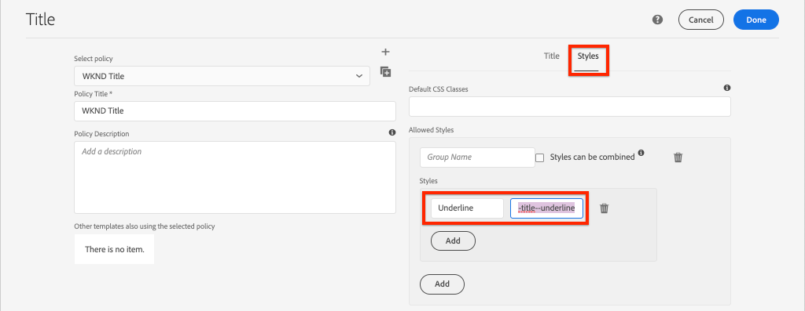
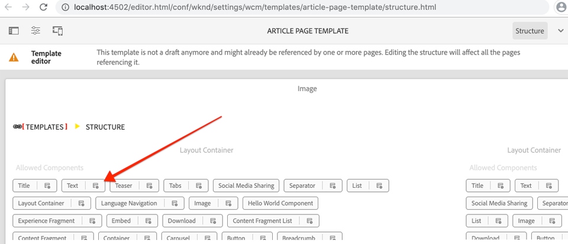
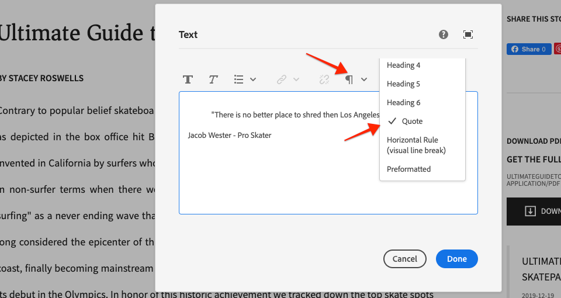

# Utveckla med formatsystemet {#developing-with-the-style-system}

Lär dig hur du implementerar enskilda format och återanvänder kärnkomponenter med Experience Manager Style System. I den här självstudien beskrivs hur du utvecklar för Style System för att utöka grundkomponenterna med varumärkesspecifik CSS och avancerade principkonfigurationer för mallredigeraren.

## Förutsättningar {#prerequisites}

Granska de verktyg och instruktioner som krävs för att konfigurera en [lokal utvecklingsmiljö](overview.md#local-dev-environment).

Vi rekommenderar också att du går igenom självstudiekursen [Klientbibliotek och Front-end-arbetsflöde](client-side-libraries.md) för att förstå grunderna i klientbibliotek och de olika frontverktygen som är inbyggda i AEM.

### Startprojekt

>[!NOTE]
>
> Om du har slutfört det föregående kapitlet kan du återanvända projektet och hoppa över stegen för att checka ut startprojektet.

Ta en titt på den baslinjekod som självstudiekursen bygger på:

1. Kolla in grenen `tutorial/style-system-start` från [GitHub](https://github.com/adobe/aem-guides-wknd)

   ```shell
   $ cd aem-guides-wknd
   $ git checkout tutorial/style-system-start
   ```

1. Distribuera kodbasen till en lokal AEM med dina Maven-kunskaper:

   ```shell
   $ mvn clean install -PautoInstallSinglePackage
   ```

   >[!NOTE]
   >
   > Om du använder AEM 6.5 eller 6.4 lägger du till profilen `classic` till valfritt Maven-kommando.

   ```shell
   $ mvn clean install -PautoInstallSinglePackage -Pclassic
   ```

Du kan alltid visa den färdiga koden på [GitHub](https://github.com/adobe/aem-guides-wknd/tree/tutorial/style-system-solution) eller checka ut koden lokalt genom att växla till grenen `tutorial/style-system-solution`.

## Syfte

1. Lär dig hur du använder Style System för att tillämpa varumärkesspecifik CSS på AEM kärnkomponenter.
1. Lär dig mer om BEM-notation och hur det kan användas för att skapa mer detaljerade omfång för format.
1. Använd avancerade principkonfigurationer med redigerbara mallar.

## Vad du ska bygga {#what-you-will-build}

I det här kapitlet ska vi använda funktionen [Style System](https://docs.adobe.com/content/help/en/experience-manager-learn/sites/page-authoring/style-system-feature-video-use.html) för att skapa varianter av komponenterna **Title** och **Text** som används på artikelsidan.


*Understrykningsformat som kan användas för komponenten Title*

## Bakgrund {#background}

Med [Style System](https://docs.adobe.com/content/help/en/experience-manager-65/developing/components/style-system.html) kan utvecklare och mallredigerare skapa flera visuella varianter av en komponent. Författare kan sedan i sin tur bestämma vilket format som ska användas när en sida disponeras. Vi utnyttjar Style System i resten av självstudiekursen för att få fram flera unika format, samtidigt som vi utnyttjar kärnkomponenterna i en lågkodsstrategi.

Den allmänna idén med Style System är att författare kan välja olika stilar för hur en komponent ska se ut. &quot;Styles&quot; backas upp av ytterligare CSS-klasser som injiceras i en komponents yttre div. I klientbiblioteken läggs CSS-regler till baserat på dessa formatklasser så att komponenten ändrar utseende.

Du hittar [detaljerad dokumentation om Style System här](https://experienceleague.adobe.com/docs/experience-manager-cloud-service/sites/authoring/features/style-system.html). Det finns också en bra [teknisk video för att förstå Style System](https://experienceleague.adobe.com/docs/experience-manager-learn/sites/developing/style-system-technical-video-understand.html).

## Understrykningsformat - rubrik {#underline-style}

[Titelkomponenten](https://experienceleague.adobe.com/docs/experience-manager-core-components/using/components/title.html) har proxynerats in i projektet under `/apps/wknd/components/title` som en del av modulen **ui.apps**. Standardformaten för rubrikelement (`H1`, `H2`, `H3`...) har redan implementerats i modulen **ui.front**.

[WKND-artikeldesignen](assets/pages-templates/wknd-article-design.xd) innehåller ett unikt format för komponenten Title med en understrykning. I stället för att skapa två komponenter eller ändra komponentdialogrutan kan du använda Style System för att ge författarna möjlighet att lägga till ett understruket format.


### Inspect Title markup

Som gränssnittsutvecklare är det första steget för att formatera en Core-komponent att förstå den kod som genereras av komponenten.

1. Öppna en ny webbläsare och visa komponenten Title på AEM Core Component Library-webbplatsen: [https://www.aemcomponents.dev/content/core-components-examples/library/page-authoring/title.html](https://www.aemcomponents.dev/content/core-components-examples/library/page-authoring/title.html)

1. Nedan finns koden för komponenten Title:

   ```html
   <div class="cmp-title">
       <h1 class="cmp-title__text">Lorem Ipsum</h1>
   </div>
   ```

   The BEM notation of the Title Component:

   ```plain
   BLOCK cmp-title
       ELEMENT cmp-title__text
   ```

1. Style-systemet lägger till en CSS-klass i den yttre div som omger komponenten. Den kod vi ska rikta in oss på liknar alltså följande:

   ```html
   <div class="STYLE-SYSTEM-CLASS-HERE"> <!-- Custom CSS class - implementation gets to define this -->
       <div class="cmp-title">
           <h1 class="cmp-title__text">Lorem Ipsum</h1>
       </div>
   </div>
   ```

### Implementera understrykning - ui.front

Implementera sedan understrykningsformatet med hjälp av modulen **ui.front** i vårt projekt. Vi använder webbpaketets utvecklingsserver som medföljer modulen **ui.front** för att förhandsgranska formaten *innan* distribueras till en lokal instans av AEM.

1. Starta webbpaketets dev-server genom att köra följande kommando i modulen **ui.front**:

   ```shell
   $ cd ~/code/aem-guides-wknd/ui.frontend/
   $ npm start
   
   > aem-maven-archetype@1.0.0 start code/aem-guides-wknd/ui.frontend
   > webpack-dev-server --open --config ./webpack.dev.js
   ```

   Då öppnas en webbläsare på [http://localhost:8080](http://localhost:8080).

   >[!NOTE]
   >
   > Om bilderna verkar vara brutna kontrollerar du att startprojektet har distribuerats till en lokal instans av AEM (som körs på port 4502) och att webbläsaren som används också har loggat in i den lokala AEM.

   

1. I IDE öppnar du filen `index.html` som finns på: `ui.frontend/src/main/webpack/static/index.html`. Detta är den statiska kod som används av webbpaketets utvecklingsserver.
1. I `index.html` söker du efter en instans av den Title Component som understrykningsformatet ska läggas till i genom att söka i dokumentet efter *cmp-title*. Välj komponenten Title med texten *&quot;Vans utanför Wall Skatepark&quot;* (rad 218). Lägg till klassen `cmp-title--underline` i den omgivande diven:

   ```diff
   - <div class="title aem-GridColumn--phone--12 aem-GridColumn aem-GridColumn--default--8">
   + <div class="cmp-title--underline title aem-GridColumn--phone--12 aem-GridColumn aem-GridColumn--default--8">
        <div data-cmp-data-layer="{&#34;title-8bea562fa0&#34;:{&#34;@type&#34;:&#34;wknd/components/title&#34;,&#34;repo:modifyDate&#34;:&#34;2021-01-22T18:54:20Z&#34;,&#34;dc:title&#34;:&#34;Vans Off the Wall&#34;}}" id="title-8bea562fa0" class="cmp-title">
            <h2 class="cmp-title__text">Vans Off the Wall</h2>
        </div>
    </div>
   ```

1. Återgå till webbläsaren och kontrollera att den extra klassen återspeglas i koden.
1. Återgå till modulen **ui.front** och uppdatera filen `title.scss` som finns på: `ui.frontend/src/main/webpack/components/_title.scss`:

   ```css
   /* Add Title Underline Style */
   .cmp-title--underline {
       .cmp-title__text {
           &:after {
           display: block;
               width: 84px;
               padding-top: 8px;
               content: '';
               border-bottom: 2px solid $brand-primary;
           }
       }
   }
   ```

   >[!NOTE]
   >
   >Det anses vara en bra rutin att alltid ha tätt omfång av format till målkomponenten. Detta säkerställer att extra format inte påverkar andra delar av sidan.
   >
   >Alla kärnkomponenter följer **[BEM-notation](https://github.com/adobe/aem-core-wcm-components/wiki/css-coding-conventions)**. Det är bäst att ha den yttre CSS-klassen som mål när du skapar ett standardformat för en komponent. Ett annat tips är att ange klassnamn som mål som anges av BEM-notationen för kärnkomponenten i stället för HTML-element.

1. Återgå till webbläsaren en gång till och du bör se understrykningsformatet som lagts till:

   

1. Stoppa webbpaketets utvecklingsserver.

### Lägg till en titelprincip

Därefter måste vi lägga till en ny policy för rubrikkomponenter så att innehållsförfattare kan välja understrykningsformatet som ska gälla för specifika komponenter. Detta görs med mallredigeraren i AEM.

1. Distribuera kodbasen till en lokal AEM med dina Maven-kunskaper:

   ```shell
   $ cd ~/code/aem-guides-wknd
   $ mvn clean install -PautoInstallSinglePackage
   ```

1. Navigera till mallen **Artikelsida** som finns på: [http://localhost:4502/editor.html/conf/wknd/settings/wcm/templates/article-page/structure.html](http://localhost:4502/editor.html/conf/wknd/settings/wcm/templates/article-page/structure.html)

1. I **Structure**-läget, i huvudbehållaren **Layoutbehållare**, väljer du ikonen **Policy** bredvid komponenten **Title** under *Tillåtna komponenter*:

   

1. Skapa en ny princip för komponenten Title med följande värden:

   *Policytitel **:  **WKND**

   *Egenskaper*  >  *Fliken*  Format >  *Lägg till ett nytt format*

   **Understruken** :  `cmp-title--underline`

   

   Klicka på **Klar** om du vill spara ändringarna i titelprincipen.

   >[!NOTE]
   >
   > Värdet `cmp-title--underline` matchar den CSS-klass som vi angav tidigare vid utveckling i modulen **ui.front**.

### Använda understrykningsformat

Slutligen kan vi som författare välja att använda understrykningsformatet på vissa rubrikkomponenter.

1. Gå till artikeln **La Skateparks** i AEM Sites Editor på: [http://localhost:4502/editor.html/content/wknd/us/en/magazine/guide-la-skateparks.html](http://localhost:4502/editor.html/content/wknd/us/en/magazine/guide-la-skateparks.html)
1. Välj en titelkomponent i **redigeringsläget**. Klicka på ikonen **penselns** och välj formatet **Understruken**:

   

   Som författare bör du kunna aktivera/avaktivera formatet.

1. Klicka på ikonen **Sidinformation** > **Visa som publicerad** för att inspektera sidan utanför AEM redigerare.

   

   Använd webbläsarens utvecklingsverktyg för att verifiera koden runt Title-komponenten där CSS-klassen `cmp-title--underline` används på den yttre diven.

## Blockformat för citat - text {#text-component}

Upprepa sedan liknande steg för att tillämpa ett unikt format på [textkomponenten](https://experienceleague.adobe.com/docs/experience-manager-core-components/using/components/text.html). Textkomponenten har proxiderats in i projektet under `/apps/wknd/components/text` som en del av modulen **ui.apps**. Standardformaten för styckeelement har redan implementerats i **ui.front**.

[WKND-artikeldesignen](assets/pages-templates/wknd-article-design.xd) innehåller ett unikt format för Text-komponenten med ett citattecken:


### Inspect Text Component Markup

Återigen kommer vi att granska textkomponentens markering.

1. Granska koden för textkomponenten på: [https://www.aemcomponents.dev/content/core-components-examples/library/page-authoring/text.html](https://www.aemcomponents.dev/content/core-components-examples/library/page-authoring/text.html)

1. Nedan finns koden för komponenten Text:

   ```html
   <div class="text">
       <div class="cmp-text" data-cmp-data-layer="{&quot;text-2d9d50c5a7&quot;:{&quot;@type&quot;:&quot;core/wcm/components/text/v2/text&quot;,&quot;repo:modifyDate&quot;:&quot;2019-01-22T11:56:17Z&quot;,&quot;xdm:text&quot;:&quot;<p>Lorem ipsum dolor sit amet, consectetur adipiscing elit, sed do eiusmod tempor incididunt ut labore et dolore magna aliqua. Eu mi bibendum neque egestas congue quisque egestas. Varius morbi enim nunc faucibus a pellentesque. Scelerisque eleifend donec pretium vulputate sapien nec sagittis.</p>\n&quot;}}" id="text-2d9d50c5a7">
           <p>Lorem ipsum dolor sit amet, consectetur adipiscing elit, sed do eiusmod tempor incididunt ut labore et dolore magna aliqua. Eu mi bibendum neque egestas congue quisque egestas. Varius morbi enim nunc faucibus a pellentesque. Scelerisque eleifend donec pretium vulputate sapien nec sagittis.</p>
       </div>
   </div>
   ```

   BEM-notation för textkomponenten:

   ```plain
   BLOCK cmp-text
       ELEMENT
   ```

1. Style-systemet lägger till en CSS-klass i den yttre div som omger komponenten. Den kod vi ska rikta in oss på liknar alltså följande:

   ```html
   <div class="text STYLE-SYSTEM-CLASS-HERE"> <!-- Custom CSS class - implementation gets to define this -->
       <div class="cmp-text" data-cmp-data-layer="{&quot;text-2d9d50c5a7&quot;:{&quot;@type&quot;:&quot;core/wcm/components/text/v2/text&quot;,&quot;repo:modifyDate&quot;:&quot;2019-01-22T11:56:17Z&quot;,&quot;xdm:text&quot;:&quot;<p>Lorem ipsum dolor sit amet, consectetur adipiscing elit, sed do eiusmod tempor incididunt ut labore et dolore magna aliqua. Eu mi bibendum neque egestas congue quisque egestas. Varius morbi enim nunc faucibus a pellentesque. Scelerisque eleifend donec pretium vulputate sapien nec sagittis.</p>\n&quot;}}" id="text-2d9d50c5a7">
           <p>Lorem ipsum dolor sit amet, consectetur adipiscing elit, sed do eiusmod tempor incididunt ut labore et dolore magna aliqua. Eu mi bibendum neque egestas congue quisque egestas. Varius morbi enim nunc faucibus a pellentesque. Scelerisque eleifend donec pretium vulputate sapien nec sagittis.</p>
       </div>
   </div>
   ```

### Implementera formatet Offertblock - ui.front

Därefter implementerar vi formatet Offertblock med hjälp av modulen **ui.front** i vårt projekt.

1. Starta webbpaketets dev-server genom att köra följande kommando i modulen **ui.front**:

   ```shell
   $ cd ~/code/aem-guides-wknd/ui.frontend/
   $ npm start
   ```

1. Öppna filen `index.html` i den integrerade utvecklingsmiljön: `ui.frontend/src/main/webpack/static/index.html`.
1. I `index.html` söker du efter en instans av textkomponenten genom att söka efter texten *&quot;Jacob Wester&quot;* (rad 210). Lägg till klassen `cmp-text--quote` i den omgivande diven:

   ```diff
   - <div class="text aem-GridColumn--phone--12 aem-GridColumn aem-GridColumn--default--8">
   + <div class="cmp-text--quote text aem-GridColumn--phone--12 aem-GridColumn aem-GridColumn--default--8">
        <div data-cmp-data-layer="{&#34;text-a15f39a83a&#34;:{&#34;@type&#34;:&#34;wknd/components/text&#34;,&#34;repo:modifyDate&#34;:&#34;2021-01-22T00:23:27Z&#34;,&#34;xdm:text&#34;:&#34;&lt;blockquote>&amp;quot;There is no better place to shred then Los Angeles.”&lt;/blockquote>\r\n&lt;p>- Jacob Wester, Pro Skater&lt;/p>\r\n&#34;}}" id="text-a15f39a83a" class="cmp-text">
            <blockquote>&quot;There is no better place to shred then Los Angeles.”</blockquote>
            <p>- Jacob Wester, Pro Skater</p>
        </div>
    </div>
   ```

1. Uppdatera filen `text.scss` som finns på: `ui.frontend/src/main/webpack/components/_text.scss`:

   ```css
   /* WKND Text Quote style */
   .cmp-text--quote {
       .cmp-text {
           background-color: $brand-third;
           margin: 1em 0em;
           padding: 1em;
   
           blockquote {
               border: none;
               font-size: $font-size-large;
               font-family: $font-family-serif;
               padding: 14px 14px;
               margin: 0;
               margin-bottom: 0.5em;
   
               &:after {
                   border-bottom: 2px solid $brand-primary; /*yellow border */
                   content: '';
                   display: block;
                   position: relative;
                   top: 0.25em;
                   width: 80px;
               }
           }
           p {
               font-family:  $font-family-serif;
           }
       }
   }
   ```

   >[!CAUTION]
   >
   > I det här fallet används formatet som mål för raw-HTML-element. Det beror på att komponenten Text har en RTF-redigerare för innehållsförfattare. Du bör skapa format direkt mot RTE-innehåll med försiktighet och det är ännu viktigare att formaten är täta.

1. Återgå till webbläsaren en gång till så bör du se det nya formatet för offertblock:

   

1. Stoppa webbpaketets utvecklingsserver.

### Lägg till en textprofil

Lägg sedan till en ny princip för textkomponenterna.

1. Distribuera kodbasen till en lokal AEM med dina Maven-kunskaper:

   ```shell
   $ cd ~/code/aem-guides-wknd
   $ mvn clean install -PautoInstallSinglePackage
   ```

1. Navigera till **Artikelsidmallen** som finns på: [http://localhost:4502/editor.html/conf/wknd/settings/wcm/templates/article-page/structure.html](http://localhost:4502/editor.html/conf/wknd/settings/wcm/templates/article-page/structure.html)).

1. I **Structure**-läget, i **layoutbehållaren**, väljer du ikonen **Policy** bredvid **Text**-komponenten som listas under *Tillåtna komponenter*:

   

1. Uppdatera Text-komponentprincipen med följande värden:

   *Policytitel **:  **Innehållstext**

   *Plugins*  >  *Paragraph Styles* >  *Enable paragraph styles*

   *Fliken*  Format >  *Lägg till ett nytt format*

   **Citatblock** :  `cmp-text--quote`

   

   

   Klicka på **Klar** om du vill spara ändringarna i textprofilen.

### Använda formatet Offertblock

1. Gå till artikeln **La Skateparks** i AEM Sites Editor på: [http://localhost:4502/editor.html/content/wknd/us/en/magazine/guide-la-skateparks.html](http://localhost:4502/editor.html/content/wknd/us/en/magazine/guide-la-skateparks.html)
1. Välj en textkomponent i **redigeringsläget**. Redigera komponenten så att den innehåller ett citattecken:

   

1. Markera textkomponenten och klicka på ikonen **penselns** och välj formatet **Citatblock**:

   

   Som författare bör du kunna aktivera/avaktivera formatet.

## Fast bredd - behållare (Bonus) {#layout-container}

Behållarkomponenter har använts för att skapa artikelsidmallens grundläggande struktur och ange släppzoner där innehållsförfattare kan lägga till innehåll på en sida. Behållare kan också utnyttja Style System och ge innehållsförfattarna ännu fler alternativ för att utforma layouter.

**Huvudbehållaren** för artikelsidmallen innehåller de två behållare som kan redigeras och har en fast bredd.


*Huvudbehållare i artikelsidmallen*.

Principen för **huvudbehållaren** anger standardelementet som `main`:


Den CSS som gör att **huvudbehållaren** är fast anges i modulen **ui.front** på `ui.frontend/src/main/webpack/site/styles/container_main.scss`:

```SCSS
main.container {
    padding: .5em 1em;
    max-width: $max-content-width;
    float: unset!important;
    margin: 0 auto!important;
    clear: both!important;
}
```

I stället för att rikta in sig på HTML-elementet `main` kan Style System användas för att skapa formatet **Fast bredd** som en del av behållarprincipen. Style System kan ge användare möjlighet att växla mellan **behållare med fast bredd** och **flytande bredd**.

1. **Bonus Challenge**  - använd lektioner från tidigare övningar och använd Style System för att implementera en  **fast** bredd och  **flytande** widgetar för behållarkomponenten.

## Grattis! {#congratulations}

Artikelsidan är nästan helt formaterad och du har fått en praktisk upplevelse med AEM Style System.

### Nästa steg {#next-steps}

Lär dig stegen från början till slut om du vill skapa en [anpassad AEM](custom-component.md)-komponent som visar innehåll som har skapats i en dialogruta, och utforskar utvecklingen av en delningsmodell för att kapsla in affärslogik som fyller i komponentens HTML-kod.

Visa den färdiga koden på [GitHub](https://github.com/adobe/aem-guides-wknd) eller granska och distribuera koden lokalt på Git-grenen `tutorial/style-system-solution`.

1. Klona [github.com/adobe/aem-wknd-guides](https://github.com/adobe/aem-guides-wknd)-databasen.
1. Kolla in grenen `tutorial/style-system-solution`.
