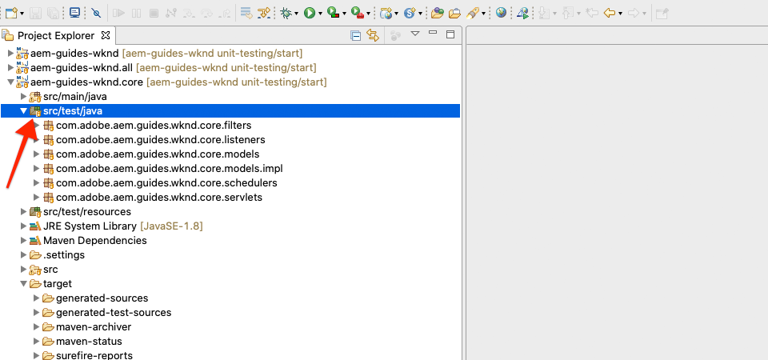
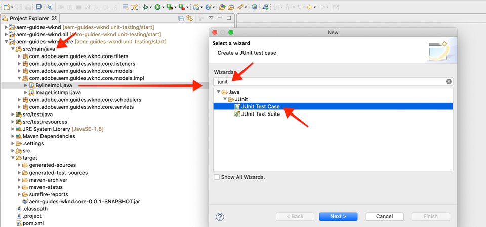
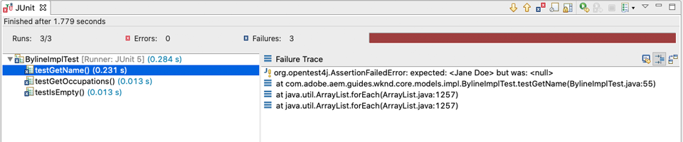
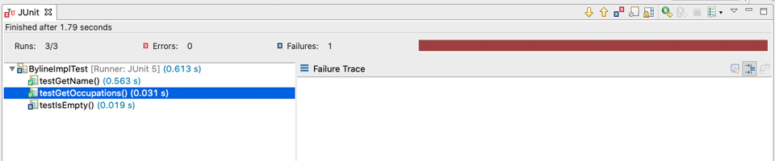

# Enhetstestning {#unit-testing}

I den här självstudiekursen beskrivs implementeringen av ett enhetstest som validerar beteendet för den inbyggda komponentens Sling Model, som skapats i självstudiekursen för [anpassade komponenter](./custom-component.md) .

## Förutsättningar {#prerequisites}

Ta en titt på den baslinjekod som självstudiekursen bygger på:

1. Klona [github.com/adobe/aem-guides-wknd](https://github.com/adobe/aem-guides-wknd) .
1. Kolla in `unit-testing/start` grenen

```shell
$ git clone git@github.com:adobe/aem-guides-wknd.git ~/code/aem-guides-wknd
$ cd ~/code/aem-guides-wknd
$ git checkout unit-testing/start
```

Du kan alltid visa den färdiga koden på [GitHub](https://github.com/adobe/aem-guides-wknd/tree/unit-testing/solution) eller checka ut koden lokalt genom att växla till grenen `unit-testing/solution`.

## Syfte

1. Förstå grunderna för enhetstestning.
1. Lär dig mer om ramverk och verktyg som ofta används för att testa AEM kod.
1. Förstå alternativen för att gungera eller simulera AEM när du skriver enhetstester.

## Bakgrund {#unit-testing-background}

I den här självstudiekursen får vi lära oss att skriva [enhetstester](https://en.wikipedia.org/wiki/Unit_testing) för vår Byline-komponents [Sling Model](https://sling.apache.org/documentation/bundles/models.html) (som skapats i [Skapa en anpassad AEM](custom-component.md)). Enhetstester är körtidstester skrivna i Java som verifierar det förväntade beteendet hos Java-kod. Varje enhetstest är vanligen litet och validerar resultatet av en metod (eller arbetsenheter) mot förväntade resultat.

Vi kommer att använda AEM bästa praxis och använda:

* [JUnit 5](https://junit.org/junit5/)
* [Mockito Testing Framework](https://site.mockito.org/)
* [wcm.io Test Framework](https://wcm.io/testing/) (som bygger på [Apache Sling Mocks](https://sling.apache.org/documentation/development/sling-mock.html))

>[!VIDEO](https://video.tv.adobe.com/v/30207/?quality=12&learn=on)

## Enhetstestning och Adobe Cloud Manager {#unit-testing-and-adobe-cloud-manager}

[Adobe Cloud Manager](https://docs.adobe.com/content/help/en/experience-manager-cloud-manager/using/introduction-to-cloud-manager.html) integrerar körning av enhetstest och rapportering [av](https://docs.adobe.com/content/help/en/experience-manager-cloud-manager/using/how-to-use/understand-your-test-results.html#code-quality-testing) kodtäckningar i CI/CD-flödet för att uppmuntra och främja bästa praxis för enhetstestning AEM kod.

Även om kod för enhetstestning är en bra vana för alla kodbaser är det viktigt att kunna dra nytta av dess funktioner för kodkvalitetstestning och rapportering när du använder Cloud Manager genom att tillhandahålla enhetstester som Cloud Manager kan köra.

## Inspect testning av Maven-beroenden {#inspect-the-test-maven-dependencies}

Det första steget är att undersöka Maven-beroenden för att stödja skrivandet och körningen av testerna. Det krävs fyra beroenden:

1. JUnit5
1. Mockito Test Framework
1. Apache Sling Mocks
1. AEM Mocks Test Framework (av io.wcm)

Beroenden för **JUnit5**, **Mockito** och **AEM Mocks** -tester läggs automatiskt till i projektet under installationen med [AEM Maven-arkitypen](project-setup.md).

1. Om du vill visa dessa beroenden öppnar du den överordnade reaktorns POM på **aem-guides-wknd/pom.xml**, navigerar till `<dependencies>..</dependencies>` och ser till att följande beroenden är definierade:

   ```xml
   <dependencies>
       ...
       <!-- Testing -->
       <dependency>
           <groupId>org.junit</groupId>
           <artifactId>junit-bom</artifactId>
           <version>5.5.2</version>
           <type>pom</type>
           <scope>import</scope>
       </dependency>
       <dependency>
           <groupId>org.slf4j</groupId>
           <artifactId>slf4j-simple</artifactId>
           <version>1.7.25</version>
           <scope>test</scope>
       </dependency>
       <dependency>
           <groupId>org.mockito</groupId>
           <artifactId>mockito-core</artifactId>
           <version>2.25.1</version>
           <scope>test</scope>
       </dependency>
       <dependency>
           <groupId>org.mockito</groupId>
           <artifactId>mockito-junit-jupiter</artifactId>
           <version>2.25.1</version>
           <scope>test</scope>
       </dependency>
       <dependency>
           <groupId>junit-addons</groupId>
           <artifactId>junit-addons</artifactId>
           <version>1.4</version>
           <scope>test</scope>
       </dependency>
       <dependency>
           <groupId>io.wcm</groupId>
           <artifactId>io.wcm.testing.aem-mock.junit5</artifactId>
           <!-- Prefer the latest version of AEM Mock Junit5 dependency -->
           <version>2.5.2</version>
           <scope>test</scope>
       </dependency>
       ...
   </dependencies>
   ```

1. Öppna **aem-guides-wknd/core/pom.xml** och se att motsvarande testberoenden är tillgängliga:

   ```xml
   ...
   <dependency>
       <groupId>org.junit.jupiter</groupId>
       <artifactId>junit-jupiter</artifactId>
       <scope>test</scope>
   </dependency>
   <dependency>
       <groupId>org.mockito</groupId>
       <artifactId>mockito-core</artifactId>
       <scope>test</scope>
   </dependency>
   <dependency>
       <groupId>org.mockito</groupId>
       <artifactId>mockito-junit-jupiter</artifactId>
       <scope>test</scope>
   </dependency>
   <dependency>
       <groupId>junit-addons</groupId>
       <artifactId>junit-addons</artifactId>
   </dependency>
   <dependency>
       <groupId>io.wcm</groupId>
       <artifactId>io.wcm.testing.aem-mock.junit5</artifactId>
   </dependency>
   ...
   ```

   En parallell källmapp i **kärnprojektet** kommer att innehålla enhetstesterna och eventuella tillhörande testfiler. Den här **testmappen** separerar testklasser från källkoden, men gör att testerna fungerar som om de finns i samma paket som källkoden.

## Skapa JUnit-testet {#creating-the-junit-test}

Enhetstester mappas vanligtvis 1 till 1 med Java-klasser. I det här kapitlet ska vi skriva ett JUnit-test för **BylineImpl.java**, som är den Sling-modell som stöder Byline-komponenten.



*Plats där enhetstester lagras.*

1. Det kan vi göra i Eclipse genom att högerklicka på den Java-klass som ska testas och välja **Nytt > Annat > Java > JUnit > JUnit Test Case**.

   

1. Verifiera följande på den första guideskärmen:

   * JUnit-testtypen är **New JUnit Jupiter test** eftersom det här är JUnit Maven-beroenden som är inställda i **pom.xml**.
   * Paketet **är** java-paketet för den klass som testas (`BylineImpl.java`)
   * Källmappen pekar på **huvudprojektet** (`aem-guides-wknd.core/src/test/java`) som instruerar Eclipse var enhetens testfiler lagras.
   * Metodstub `setUp()` skapas manuellt. kommer vi att se hur detta används senare.
   * Klassen som ska testas är `BylineImpl.java`den Java-klass vi vill testa.

   

   *Guiden Testfall för JUnit - steg 2*

1. Klicka på knappen **Nästa** längst ned i guiden.

   I nästa steg får du hjälp med automatisk generering av testmetoder. Vanligtvis har alla publika metoder i Java-klassen minst en motsvarande testmetod som validerar dess beteende. Ett enhetstest kommer ofta att ha flera testmetoder som testar en enda offentlig metod, där var och en representerar olika indata eller lägen.

   I guiden väljer du alla metoder under `BylineImpl`, med undantag för `init()` vilka en metod används internt av Sling Model (via `@PostConstruct`). Vi kommer att testa `init()` genom att testa alla andra metoder, eftersom de andra metoderna kräver att de `init()` utförs korrekt.

   Nya testmetoder kan läggas till när som helst i JUnit-testklassen. Den här sidan av guiden är bara till för att underlätta.

   

   *Guiden Testfall för JUnit (forts.)*

1. Klicka på knappen Slutför längst ned i guiden för att generera JUnit5-testfilen.
1. Kontrollera att JUnit5-testfilen har skapats i motsvarande paketstruktur på **aem-guides-wknd.core** > **/src/test/java** som en fil med namnet `BylineImplTest.java`.

## Granska BylineImplTest.java {#reviewing-bylineimpltest-java}

Vår testfil har ett antal autogenererade metoder. För närvarande finns det inget AEM specifikt om denna JUnit-testfil.

Den första metoden är `public void setUp() { .. }` som kommenteras med `@BeforeEach`.

Anteckningen är en JUnit-anteckning som instruerar JUnit-testet som körs att köra den här metoden innan varje testmetod körs i den här klassen. `@BeforeEach`

De efterföljande metoderna är själva testmetoderna och markeras som sådana med `@Test` anteckningen. Observera att som standard kommer alla våra tester att misslyckas.

När denna JUnit-testklass (även kallad JUnit Test Case) körs, körs varje metod som är markerad med `@Test` som ett test som antingen godkänns eller misslyckas.


*`core/src/test/java/com/adobe/aem/guides/wknd/core/models/impl/BylineImplTest.java`*

1. Kör JUnit Test Case genom att högerklicka på klassnamnet och **Kör som > JUnit Test**.

   

   *Högerklicka på BylineImplTests.java > Kör som > JUnit Test*

1. Som förväntat misslyckas alla tester.

   

   *JUnit-vyn på Eclipse > Fönster > Visa > Java > JUnit*

## Granska BylineImpl.java {#reviewing-bylineimpl-java}

När enhetstester skrivs finns det två primära metoder:

* [TDD eller testdriven utveckling](https://en.wikipedia.org/wiki/Test-driven_development), vilket innebär att enhetstesterna skrivs stegvis, omedelbart innan implementeringen utvecklas. skriva ett test, skriva implementeringen för att göra testet godkänt.
* Utveckling av implementering först, vilket innebär att först utveckla arbetskoden och sedan skriva tester som validerar den koden.

I den här självstudiekursen används den senare metoden (eftersom vi redan har skapat en fungerande **BylineImpl.java** i ett tidigare kapitel). På grund av detta måste vi granska och förstå hur dess publika metoder fungerar, men också en del av dess implementeringsdetaljer. Detta kan låta tvärtom, eftersom ett bra test endast bör omfatta in- och utdata, men när AEM utförs finns det en mängd olika implementeringsöverväganden som måste förstås för att de tester som körs ska kunna skapas.

TDD krävs inom ramen för AEM och är bäst lämpat för AEM utvecklare som är skickliga på AEM utveckling och enhetstestning av AEM kod.

>[!VIDEO](https://video.tv.adobe.com/v/30208/?quality=12&learn=on)

## Konfigurera AEM testkontext  {#setting-up-aem-test-context}

De flesta koder som skrivits för AEM är beroende av JCR-, Sling- eller AEM-API:er, som i sin tur kräver att en AEM körs på rätt sätt.

Eftersom enhetstester körs vid bygget, utanför kontexten för en AEM som körs, finns det ingen sådan resurs. För att underlätta detta skapar [wcm.ios AEM Mocks](https://wcm.io/testing/aem-mock/usage.html) ett dummikontext som gör att dessa API:er i huvudsak fungerar som om de körs i AEM.

1. Skapa ett AEM med **wcm.ios** `AemContext` i **BylineImplTest.java** genom att lägga till det som ett JUnit-tillägg som dekoreras med `@ExtendWith` i filen **BylineImplTest.java** . Tillägget hanterar alla initierings- och rensningsåtgärder som krävs. Skapa en klassvariabel för `AemContext` som kan användas för alla testmetoder.

   ```java
   import org.junit.jupiter.api.extension.ExtendWith;
   import io.wcm.testing.mock.aem.junit5.AemContext;
   import io.wcm.testing.mock.aem.junit5.AemContextExtension;
   ...
   
   @ExtendWith(AemContextExtension.class)
   class BylineImplTest {
   
       private final AemContext ctx = new AemContext();
   ```

   Den här variabeln `ctx`visar ett AEM som innehåller ett antal AEM- och Sling-abstraktioner:

   * BylineImpl Sling Model registreras i den här kontexten
   * Mock JCR-innehållsstrukturer skapas i det här sammanhanget
   * Anpassade OSGi-tjänster kan registreras i den här kontexten
   * Innehåller en mängd vanliga nödvändiga modellobjekt och hjälpmedel, till exempel SlingHttpServletRequest-objekt, en mängd olika tjänster för modellering och AEM OSGi, till exempel ModelFactory, PageManager, Page, Template, ComponentManager, Component, TagManager, Tag osv.
      * *Observera att inte alla metoder för dessa objekt implementeras!*
   * And [much more](https://wcm.io/testing/aem-mock/usage.html)!

   Objektet fungerar som **`ctx`** startpunkt för större delen av vår modellkontext.

1. I `setUp(..)` metoden, som körs före varje `@Test` metod, definierar du ett vanligt modelltestläge:

   ```java
   @BeforeEach
   public void setUp() throws Exception {
       ctx.addModelsForClasses(BylineImpl.class);
       ctx.load().json("/com/adobe/aem/guides/wknd/core/models/impl/BylineImplTest.json", "/content");
   }
   ```

   * **`addModelsForClasses`** registrerar den Sling-modell som ska testas i AEM Context, så att den kan instansieras i `@Test` metoderna.
   * **`load().json`** läser in resursstrukturer i standardkontexten, vilket gör att koden kan interagera med dessa resurser som om de vore från en verklig databas. Resursdefinitionerna i filen **`BylineImplTest.json`** läses in i JCR-standardkontexten under **/innehåll**.
   * **`BylineImplTest.json`** finns inte än, så vi skapar den och definierar de JCR-resursstrukturer som behövs för testet.

1. JSON-filerna som representerar modellresursstrukturerna lagras under **core/src/test/resources** efter samma paketsökväg som JUnit Java-testfilen.

   Skapa en ny JSON-fil på **core/test/resources/com/adobe/aem/guides/wknd/core/models/impl** med namnet **BylineImplTest.json** med följande innehåll:

   ```json
   {
       "byline": {
       "jcr:primaryType": "nt:unstructured",
       "sling:resourceType": "wknd/components/content/byline"
       }
   }
   ```

   

   Denna JSON definierar en modellresursdefinition för Byline-komponentenhetstestet. I det här läget har JSON den minsta uppsättning egenskaper som krävs för att representera en innehållsresurs för en Byline-komponent, `jcr:primaryType` och `sling:resourceType`.

   En allmän regel för dem när de arbetar med enhetstester är att skapa den minimala uppsättningen av modellinnehåll, kontext och kod som krävs för att uppfylla varje test. Undvik frestelsen att bygga ut en komplett modellkontext innan du skriver testerna, eftersom det ofta leder till onödiga artefakter.

   Nu när **BylineImplTest.json** finns, läses modellresursdefinitionerna in i kontexten vid sökvägen `ctx.json("/com/adobe/aem/guides/wknd/core/models/impl/BylineImplTest.json", "/content")` /innehållet när de **körs.**

## Testar getName() {#testing-get-name}

Nu när vi har en grundläggande konfiguration av modellkontext kan vi skriva vårt första test för **BylineImpls getName()**. Det här testet måste se till att metoden **getName()** returnerar rätt skrivet namn som lagras i resursens **name-** egenskap.

1. Uppdatera metoden **testGetName**() i **BylineImplTest.java** enligt följande:

   ```java
   import com.adobe.aem.guides.wknd.core.components.Byline;
   import static org.junit.jupiter.api.Assertions.assertEquals;
   ...
   @Test
   public void testGetName() {
       final String expected = "Jane Doe";
   
       ctx.currentResource("/content/byline");
       Byline byline = ctx.request().adaptTo(Byline.class);
   
       String actual = byline.getName();
   
       assertEquals(expected, actual);
   }
   ```

   * **`String expected`** anger det förväntade värdet. Vi sätter det här till &quot;**Jane Done**&quot;.
   * **`ctx.currentResource`** ställer in kontexten för den modellresurs som koden ska utvärderas mot, så detta ställs in på **/content/byline** på samma sätt som när standardbaslinjeinnehållsresursen läses in.
   * **`Byline byline`** instansierar Byline Sling-modellen genom att anpassa den från Mock Request-objektet.
   * **`String actual`** anropar metoden som vi testar `getName()`i objektet Byline Sling Model.
   * **`assertEquals`** kontrollerar att det förväntade värdet matchar det värde som returneras av byline Sling Model-objektet. Om dessa värden inte är lika misslyckas testet.

1. Kör testet.. och det misslyckas med en `NullPointerException`.

   Observera att det här testet INTE misslyckas eftersom vi aldrig har definierat en `name` egenskap i JSON-mockningen, vilket kommer att göra att testet misslyckas, men testkörningen har inte kommit till den punkten! Det här testet misslyckas på grund av ett fel `NullPointerException` på själva benypobjektet.

1. I videon [Reviewing BylineImpl.java](#reviewing-bylineimpl-java) ovan diskuterar vi hur om `@PostConstruct init()` ett undantag genererar förhindrar det att Sling Model instansieras, och det är det som händer här.

   ```java
   @PostConstruct
   private void init() {
       image = modelFactory.getModelFromWrappedRequest(request, request.getResource(), Image.class);
   }
   ```

   Det visar sig att även om ModelFactory OSGi-tjänsten tillhandahålls via `AemContext` (via Apache Sling Context) så implementeras inte alla metoder, inklusive `getModelFromWrappedRequest(...)` som anropas i BylineImpls `init()` -metod. Detta resulterar i ett [AbstractMethodError](https://docs.oracle.com/javase/8/docs/api/java/lang/AbstractMethodError.html)som i termen orsakar `init()` fel och den resulterande anpassningen av `ctx.request().adaptTo(Byline.class)` objektet är ett null-objekt.

   Eftersom de mocks som tillhandahålls inte kan rymma vår kod måste vi implementera modellsammanhanget själva. För detta kan vi använda Mockito för att skapa ett ModelFactory-modellobjekt som returnerar ett modellbildobjekt när det `getModelFromWrappedRequest(...)` anropas.

   Eftersom den här modelltypen måste finnas på plats för att instansiera Byline Sling-modellen kan vi lägga till den i `@Before setUp()` metoden. Vi måste också lägga till `MockitoExtension.class` i `@ExtendWith` anteckningen ovanför **klassen BylineImplTest** .

   ```java
   package com.adobe.aem.guides.wknd.core.models.impl;
   
   import org.mockito.junit.jupiter.MockitoExtension;
   import org.mockito.Mock;
   
   import com.adobe.aem.guides.wknd.core.models.Byline;
   import com.adobe.cq.wcm.core.components.models.Image;
   
   import io.wcm.testing.mock.aem.junit5.AemContext;
   import io.wcm.testing.mock.aem.junit5.AemContextExtension;
   
   import org.apache.sling.models.factory.ModelFactory;
   import org.junit.jupiter.api.BeforeEach;
   import org.junit.jupiter.api.Test;
   import org.junit.jupiter.api.extension.ExtendWith;
   
   import static org.junit.jupiter.api.Assertions.assertEquals;
   import static org.junit.jupiter.api.Assertions.fail;
   import static org.mockito.Mockito.*;
   import org.apache.sling.api.resource.Resource;
   
   @ExtendWith({ AemContextExtension.class, MockitoExtension.class })
   public class BylineImplTest {
   
       private final AemContext ctx = new AemContext();
   
       @Mock
       private Image image;
   
       @Mock
       private ModelFactory modelFactory;
   
       @BeforeEach
       public void setUp() throws Exception {
           ctx.addModelsForClasses(BylineImpl.class);
   
           ctx.load().json("/com/adobe/aem/guides/wknd/core/models/impl/BylineImplTest.json", "/content");
   
           lenient().when(modelFactory.getModelFromWrappedRequest(eq(ctx.request()), any(Resource.class), eq(Image.class)))
                   .thenReturn(image);
   
           ctx.registerService(ModelFactory.class, modelFactory, org.osgi.framework.Constants.SERVICE_RANKING,
                   Integer.MAX_VALUE);
       }
   
       @Test
       void testGetName() { ...
   }
   ```

   * **`@ExtendWith({AemContextExtension.class, MockitoExtension.class})`** markerar klassen Test Case som ska köras med [Mockito JUnit Jupiter Extension](https://www.javadoc.io/page/org.mockito/mockito-junit-jupiter/latest/org/mockito/junit/jupiter/MockitoExtension.html) , som gör att @Mock-anteckningar kan användas för att definiera modellobjekt på klassnivå.
   * **`@Mock private Image`** skapar ett modellobjekt av typen `com.adobe.cq.wcm.core.components.models.Image`. Observera att detta definieras på klassnivå så att metoder vid behov kan ändra sitt beteende efter behov `@Test` .
   * **`@Mock private ModelFactory`** skapar ett modellobjekt av typen ModelFactory. Observera att det här är en ren Mockito-mock och att inga metoder har implementerats på den. Observera att detta definieras på klassnivå så att `@Test`metoder vid behov kan ändra sitt beteende.
   * **`when(modelFactory.getModelFromWrappedRequest(..)`** registrerar modellbeteende för när `getModelFromWrappedRequest(..)` anropas i Mock ModelFactory-objektet. Resultatet som definieras i `thenReturn (..)` är att returnera modellbildobjektet. Observera att det här beteendet bara anropas när: den första parametern är lika med `ctx`dess request-objekt, den andra parametern är ett Resource-objekt och den tredje parametern måste vara Core Components Image-klass. Vi accepterar alla resurser eftersom vi under testerna kommer att ställa in `ctx.currentResource(...)` på olika modellresurser som definieras i **BylineImplTest.json**. Observera att vi lägger till **lindrig()** strikthet eftersom vi senare vill åsidosätta det här beteendet för ModelFactory.
   * **`ctx.registerService(..)`.** registrerar Mock ModelFactory-objektet i AemContext, med den högsta rangordningen. Detta är nödvändigt eftersom ModelFactory som används i BylineImpl- `init()` erna injiceras via `@OSGiService ModelFactory model` fältet. För att AemContext ska kunna injicera **vårt** modellobjekt, som hanterar anrop till `getModelFromWrappedRequest(..)`det, måste vi registrera det som den högsta rangordningstjänsten av den typen (ModelFactory).

1. Kör testet igen och misslyckas igen, men den här gången är det tydligt att meddelandet misslyckades.

   

   *testGetName() misslyckades på grund av kontroll*

   Vi får ett **AssertionError** , vilket innebär att villkoret assert i testet misslyckades, och det **förväntade värdet är &quot;Jane Doe&quot;** , men det **faktiska värdet är null**. Detta är vettigt eftersom egenskapen &quot;**name&quot;** inte har lagts till i resursdefinitionen mock **/content/byline** i **BylineImplTest.json**, så vi lägger till den:

1. Uppdatera **BylineImplTest.json** för att definiera `"name": "Jane Doe".`

   ```json
   {
       "byline": {
       "jcr:primaryType": "nt:unstructured",
       "sling:resourceType": "wknd/components/content/byline",
       "name": "Jane Doe"
       }
   }
   ```

1. Kör testet igen och **`testGetName()`** godkänns nu!

## Testar getOccupations() {#testing-get-occupations}

Bra! Vårt första test har passerat! Låt oss gå vidare och testa `getOccupations()`. Eftersom initieringen av modellkontexten gjordes i `@Before setUp()`metoden är den tillgänglig för alla `@Test` metoder i det här testfallet, inklusive `getOccupations()`.

Kom ihåg att den här metoden måste returnera en alfabetiskt sorterad lista med befattningar (fallande) som lagras i egenskapen ockupationer.

1. Uppdatera **`testGetOccupations()`** enligt följande:

   ```java
   import java.util.List;
   import com.google.common.collect.ImmutableList;
   ...
   @Test
   public void testGetOccupations() {
       List<String> expected = new ImmutableList.Builder<String>()
                               .add("Blogger")
                               .add("Photographer")
                               .add("YouTuber")
                               .build();
   
       ctx.currentResource("/content/byline");
       Byline byline = ctx.request().adaptTo(Byline.class);
   
       List<String> actual = byline.getOccupations();
   
       assertEquals(expected, actual);
   }
   ```

   * **`List<String> expected`** definiera det förväntade resultatet.
   * **`ctx.currentResource`** ställer in den aktuella resursen så att kontexten utvärderas mot standardresursdefinitionen på /content/byline. Detta garanterar att **BylineImpl.java** körs i kontexten för vår modellresurs.
   * **`ctx.request().adaptTo(Byline.class)`** instansierar Byline Sling-modellen genom att anpassa den från Mock Request-objektet.
   * **`byline.getOccupations()`** anropar metoden som vi testar `getOccupations()`i objektet Byline Sling Model.
   * **`assertEquals(expected, actual)`** anger att den förväntade listan är densamma som den faktiska listan.

1. Kom ihåg, precis som **`getName()`** ovan, att **BylineImplTest.json** inte definierar yrken, så det här testet misslyckas om vi kör det, eftersom `byline.getOccupations()` en tom lista returneras.

   Uppdatera **BylineImplTest.json** så att den innehåller en lista över yrken, och de ställs in i en icke-alfabetisk ordning för att säkerställa att våra tester validerar att yrken sorteras efter **`getOccupations()`**.

   ```json
   {
       "byline": {
       "jcr:primaryType": "nt:unstructured",
       "sling:resourceType": "wknd/components/content/byline",
       "name": "Jane Doe",
       "occupations": ["Photographer", "Blogger", "YouTuber"]
       }
   }
   ```

1. Kör testet, och återigen godkänns vi! Det ser ut som att få de sorterade arbetsuppgifterna att fungera!

   

   *testGetOccupations() passerar*

## Testing isEmpty() {#testing-is-empty}

Den sista metoden som ska testas **`isEmpty()`**.

Testningen `isEmpty()` är intressant eftersom den kräver testning för en mängd olika villkor. Om du tittar på **metoden för BylineImpl.java**`isEmpty()` måste följande villkor testas:

* Returnera true när namnet är tomt
* Returnera true när yrken är null eller tomma
* Returnera true när bilden är null eller saknar src-URL
* Returnera falskt när namnet, befattningarna och bilden (med en src-URL) finns

Därför måste vi skapa nya testmetoder, där varje testning av ett specifikt tillstånd och nya modellresursstrukturer i `BylineImplTest.json` för att köra dessa tester.

Observera att den här kontrollen gjorde att vi kunde hoppa över testning för när `getName()`, `getOccupations()` och `getImage()` är tomma eftersom det förväntade beteendet för det läget testas via `isEmpty()`.

1. Det första testet testar villkoret för en helt ny komponent som inte har några egenskaper angivna.

   Lägg till en ny resursdefinition i `BylineImplTest.json`och ge den det semantiska namnet&quot;**empty**&quot;

   ```json
   {
       "byline": {
       "jcr:primaryType": "nt:unstructured",
       "sling:resourceType": "wknd/components/content/byline",
       "name": "Jane Doe",
       "occupations": ["Photographer", "Blogger", "YouTuber"]
       },
       "empty": {
       "jcr:primaryType": "nt:unstructured",
       "sling:resourceType": "wknd/components/content/byline"
       }
   }
   ```

   **`"empty": {...}`** Definiera en ny resursdefinition med namnet&quot;empty&quot; som bara har en `jcr:primaryType` och `sling:resourceType`.

   Kom ihåg att vi läser in `BylineImplTest.json` i `ctx` innan varje testmetod körs i `@setUp`, så den nya resursdefinitionen är omedelbart tillgänglig för oss i tester på **/content/empty.**

1. Uppdatera `testIsEmpty()` enligt följande och ställ in den aktuella resursen på den nya &quot;**tomma**&quot; modellresursdefinitionen.

   ```java
   @Test
   public void testIsEmpty() {
       ctx.currentResource("/content/empty");
       Byline byline = ctx.request().adaptTo(Byline.class);
   
       assertTrue(byline.isEmpty());
   }
   ```

   Kör testet och se till att det lyckas.

1. Skapa sedan en uppsättning metoder som ser till att returnerar true om någon av de obligatoriska datapunkterna (namn, befattningar eller bild) är tom `isEmpty()` .

   För varje test används en diskret modellresursdefinition. Uppdatera **BylineImplTest.json** med ytterligare resursdefinitioner för **utan namn** och **utan** bruk.

   ```json
   {
       "byline": {
       "jcr:primaryType": "nt:unstructured",
       "sling:resourceType": "wknd/components/content/byline",
       "name": "Jane Doe",
       "occupations": ["Photographer", "Blogger", "YouTuber"]
       },
       "empty": {
       "jcr:primaryType": "nt:unstructured",
       "sling:resourceType": "wknd/components/content/byline"
       },
       "without-name": {
       "jcr:primaryType": "nt:unstructured",
       "sling:resourceType": "wknd/components/content/byline",
       "occupations": "[Photographer, Blogger, YouTuber]"
       },
       "without-occupations": {
       "jcr:primaryType": "nt:unstructured",
       "sling:resourceType": "wknd/components/content/byline",
       "name": "Jane Doe"
       }
   }
   ```

   Skapa följande testmetoder för att testa vart och ett av dessa lägen.

   ```java
   @Test
   public void testIsEmpty() {
       ctx.currentResource("/content/empty");
   
       Byline byline = ctx.request().adaptTo(Byline.class);
   
       assertTrue(byline.isEmpty());
   }
   
   @Test
   public void testIsEmpty_WithoutName() {
       ctx.currentResource("/content/without-name");
   
       Byline byline = ctx.request().adaptTo(Byline.class);
   
       assertTrue(byline.isEmpty());
   }
   
   @Test
   public void testIsEmpty_WithoutOccupations() {
       ctx.currentResource("/content/without-occupations");
   
       Byline byline = ctx.request().adaptTo(Byline.class);
   
       assertTrue(byline.isEmpty());
   }
   
   @Test
   public void testIsEmpty_WithoutImage() {
       ctx.currentResource("/content/byline");
   
       lenient().when(modelFactory.getModelFromWrappedRequest(eq(ctx.request()),
           any(Resource.class),
           eq(Image.class))).thenReturn(null);
   
       Byline byline = ctx.request().adaptTo(Byline.class);
   
       assertTrue(byline.isEmpty());
   }
   
   @Test
   public void testIsEmpty_WithoutImageSrc() {
       ctx.currentResource("/content/byline");
   
       when(image.getSrc()).thenReturn("");
   
       Byline byline = ctx.request().adaptTo(Byline.class);
   
       assertTrue(byline.isEmpty());
   }
   ```

   **`testIsEmpty()`** testar mot den tomma modellresursdefinitionen och försäkrar att `isEmpty()` värdet är true.

   **`testIsEmpty_WithoutName()`** testar mot en modellresursdefinition som har befattningar men inget namn.

   **`testIsEmpty_WithoutOccupations()`** testar mot en modellresursdefinition som har ett namn men inga arbeten.

   **`testIsEmpty_WithoutImage()`** testar mot en modellresursdefinition med ett namn och en funktion, men ställer in att standardbilden ska returneras till null. Observera att vi vill åsidosätta `modelFactory.getModelFromWrappedRequest(..)`beteendet som definierats i `setUp()` för att säkerställa att det bildobjekt som returneras av anropet är null. Mockito-stubs-funktionen är strikt och vill inte ha duplicerad kod. Därför ställer vi in dummyn med **`lenient`** inställningar för att uttryckligen notera att vi åsidosätter beteendet i `setUp()` metoden.

   **`testIsEmpty_WithoutImageSrc()`** testar mot en modellresursdefinition med ett namn och en funktion, men ställer in att modellbilden ska returnera en tom sträng när `getSrc()` anropas.

1. Skriv slutligen ett test för att se till att **isEmpty()** returnerar false när komponenten är korrekt konfigurerad. För det här villkoret kan vi återanvända **/content/byline** som representerar en fullt konfigurerad Byline-komponent.

   ```java
   @Test
   public void testIsNotEmpty() {
   ctx.currentResource("/content/byline");
   when(image.getSrc()).thenReturn("/content/bio.png");
   
   Byline byline = ctx.request().adaptTo(Byline.class);
   
   assertFalse(byline.isEmpty());
   }
   ```

## Kodtäckning {#code-coverage}

Kodtäckning är mängden källkod som omfattas av enhetstester. Moderna IDE:er innehåller verktyg som automatiskt kontrollerar vilken källkod som körs under enhetstesterna. Även om kodtäckningen i sig inte är en indikator på kodkvaliteten är det bra att veta om det finns viktiga områden i källkoden som inte har testats med enhetstester.

1. Högerklicka på **BylineImplTest.java** i Eclipse Project Explorer och välj **Täckning som > JUnit-test**

   Se till att svyn för sammanfattning av täckningen är öppen (Fönster > Visa > Annan > Java > Täckning).

   Detta kör enhetstesterna i den här filen och ger en rapport som anger kodtäckningen. Genom att gå in i klassen och metoderna får du tydligare indikationer på vilka delar av filen som testas och vilka som inte gör det.

   

   *Sammanfattning av kodtäckning*

   Eclipse ger en snabb översikt av hur mycket av varje klass och metod som omfattas av enhetstestet. Eclipse even color codes the lines of code:

   * **Grön** är kod som körs av minst ett test
   * **Gult** anger en gren som inte utvärderas av något test
   * **Rött** anger kod som inte körs av något test

1. I disponeringsrapporten har den identifierats som grenen som körs när fältet för yrken är null och returnerar en tom lista, utvärderas aldrig. Detta indikeras av att raderna 571 och 86 är gula, vilket indikerar att en förgrening av if/else inte körs och att rad 75 i rött anger att kodraden aldrig körs.

   

1. Detta kan åtgärdas genom att ett test läggs till för `getOccupations()` att en tom lista returneras när det inte finns något yrkesvärde för resursen. Lägg till följande nya testmetod i **BylineImplTests.java**.

   ```java
   @Test
   public void testGetOccupations_WithoutOccupations() {
       List<String> expected = Collections.emptyList();
   
       ctx.currentResource("/content/empty");
       Byline byline = ctx.request().adaptTo(Byline.class);
   
       List<String> actual = byline.getOccupations();
   
       assertEquals(expected, actual);
   }
   ```

   **`Collections.emptyList();`** anger det förväntade värdet till en tom lista.

   **`ctx.currentResource("/content/empty")`** anger att den aktuella resursen ska vara /content/empty, som vi vet inte har någon definierad ockupationsegenskap.

1. Om du kör Coverage As igen rapporteras det att **BylineImpl.java** nu har 100 % täckning, men det finns fortfarande en gren som inte utvärderas i isEmpty() som åter har att göra med arbetsuppgifterna. I det här fallet utvärderas ockupationerna == null, men filen ockations.isEmpty() är inte eftersom det inte finns någon modellresursdefinition som ställer in `"occupations": []`.

   

   *Täckning med testGetOccupations_WithoutOccupations()*

1. Detta kan enkelt lösas genom att skapa en annan testmetod som används som en modellresursdefinition som ställer in uppsättningarna på den tomma arrayen.

   Lägg till en ny modellresursdefinition i **BylineImplTest.json** , som är en kopia av **&quot;utan uppsättningar&quot;** och lägg till en uppsättningsegenskap i den tomma arrayen, och ge den namnet **&quot;utan-ockations-empty-array&quot;**.

   ```json
   "without-occupations-empty-array": {
      "jcr:primaryType": "nt:unstructured",
      "sling:resourceType": "wknd/components/content/byline",
      "name": "Jane Doe",
      "occupations": []
    }
   ```

   Skapa en ny **@Test** -metod i `BylineImplTest.java` som använder den här nya modellresursen, och försäkrar att den `isEmpty()` returnerar true.

   ```java
   @Test
   public void testIsEmpty_WithEmptyArrayOfOccupations() {
       ctx.currentResource("/content/without-occupations-empty-array");
   
       Byline byline = ctx.request().adaptTo(Byline.class);
   
       assertTrue(byline.isEmpty());
   }
   ```

   

   *Täckning med testIsEmpty_WithEmptyArrayOfOccupations()*

1. Med det här sista tillägget `BylineImpl.java` får du 100 % kodtäckning och alla dess villkorliga målning utvärderas.

   Testerna validerar det förväntade beteendet hos `BylineImpl` utan samtidigt som de förlitar sig på en minimal uppsättning implementeringsdetaljer.

## Kör enhetstester som en del av bygget {#running-unit-tests-as-part-of-the-build}

Enhetstester måste utföras som en del av maven-byggnaden. Detta garanterar att alla tester lyckas innan ett program distribueras. För att köra Maven-mål som paketering eller installation anropas automatiskt och alla enhetstester i projektet måste godkännas.

```shell
$ mvn package
```


```shell
$ mvn package
```

Om vi ändrar en testmetod till att misslyckas, misslyckas också bygget och rapporterar att testet misslyckades och varför.


## Granska koden {#review-the-code}

Visa den färdiga koden på [GitHub](https://github.com/adobe/aem-guides-wknd) eller granska och distribuera koden lokalt på Git-grenen `unit-testing/solution`.
