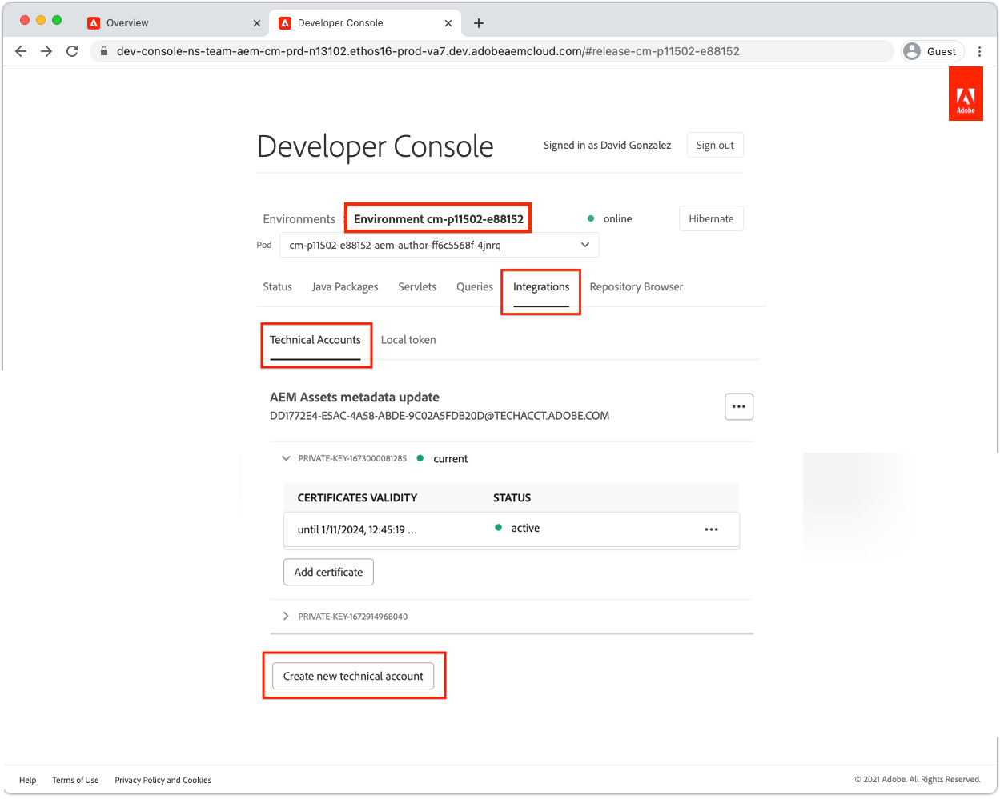

# Autentiseringsuppgifter för tjänsten

Integrationer med Adobe Experience Manager (AEM) as a Cloud Service måste kunna autentiseras säkert i AEM. AEM Developer Console ger åtkomst till Service Credentials, som används för att underlätta för externa program, system och tjänster att programmässigt interagera med AEM Author eller Publish services via HTTP.

AEM kan integreras med andra Adobe-produkter med hjälp av [S2S OAuth som hanteras via Adobe Developer Console](https://experienceleague.adobe.com/en/docs/experience-manager-cloud-service/content/security/setting-up-ims-integrations-for-aem-as-a-cloud-service). För anpassade integreringar med tjänstkonton används och hanteras JWT-autentiseringsuppgifter i AEM Developer Console.

>[!VIDEO](https://video.tv.adobe.com/v/330519?quality=12&learn=on)

Autentiseringsuppgifterna för tjänsten kan se ut som [Åtkomsttoken för lokal utveckling](./local-development-access-token.md) men skiljer sig på några viktiga sätt:

+ Autentiseringsuppgifter för tjänsten är kopplade till tekniska konton. Flera tjänstreferenser kan vara aktiva för ett tekniskt konto.
+ Tjänstautentiseringsuppgifterna är _inte_ åtkomsttoken, utan de är autentiseringsuppgifter som används för att _hämta_ åtkomsttoken.
+ Tjänstautentiseringsuppgifterna är mer permanenta (certifikatet upphör att gälla var 365:e dag) och ändras inte om det inte återkallas, medan token för lokal utvecklingsåtkomst upphör att gälla dagligen.
+ Tjänstreferenser för en AEM as a Cloud Service-miljömappning till en enskild AEM-användare, medan Local Development Access-token autentiseras som den AEM-användare som genererade åtkomsttoken.
+ En AEM as a Cloud Service-miljö kan ha upp till tio tekniska konton, var och en med sina egna Service Credentials, där varje mappning görs till AEM-användare med ett separat tekniskt konto.

Både tjänstautentiseringsuppgifter och åtkomsttoken som de genererar, och token för lokal utvecklingsåtkomst, ska hållas hemliga. Som alla tre kan användas för att få tillgång till deras respektive AEM as a Cloud Service-miljö.

## Generera autentiseringsuppgifter för tjänsten

Generering av servicereferenser delas upp i två steg:

1. Ett tekniskt konto som skapas en gång av en Adobe IMS-organisationsadministratör
1. Hämtning och användning av JSON för tjänstreferenser för det tekniska kontot

### Skapa ett tekniskt konto

Till skillnad från token för lokal utvecklingsåtkomst kräver tjänstautentiseringsuppgifter att ett tekniskt konto skapas av en Adobe Org IMS-administratör innan de kan hämtas. Separata tekniska konton bör skapas för varje klient som kräver programmatisk åtkomst till AEM.


Tekniska konton skapas en gång, men de privata nycklarna använder för att hantera tjänstens autentiseringsuppgifter som är kopplade till det tekniska kontot. De kan hanteras med tiden. Till exempel måste nya privata nycklar/autentiseringsuppgifter för tjänsten genereras innan den aktuella privata nyckeln förfaller, så att en användare av tjänstautentiseringsuppgifterna kan få tillgång utan avbrott.

1. Se till att du är inloggad som:
   + __Systemadministratör för Adobe IMS-organisation__
   + Medlem av __AEM-administratörerna__ IMS-produktprofil på __AEM Author__
1. Logga in på [Adobe Cloud Manager](https://my.cloudmanager.adobe.com)
1. Öppna programmet som innehåller AEM as a Cloud Service-miljön för att integrera inställningarna för tjänstens autentiseringsuppgifter för
1. Tryck på ellipsen bredvid miljön i avsnittet __Miljö__ och välj __Developer Console__
1. Tryck på fliken __Integrationer__
1. Tryck på fliken __Tekniska konton__
1. Tryck på knappen __Skapa nytt tekniskt konto__
1. Det tekniska kontots inloggningsuppgifter initieras och visas som JSON



När tjänstinloggningsuppgifterna för AEM som Cloud Service har initierats kan andra AEM-utvecklare i din Adobe IMS-organisation hämta dem.

### Hämta tjänstens autentiseringsuppgifter


När du hämtar tjänstens autentiseringsuppgifter följer du stegen som är desamma som initieringen.

1. Se till att du är inloggad som:
   + __Administratör för Adobe IMS-organisation__
   + Medlem av __AEM-administratörerna__ IMS-produktprofil på __AEM Author__
1. Logga in på [Adobe Cloud Manager](https://my.cloudmanager.adobe.com)
1. Öppna programmet som innehåller AEM as a Cloud Service-miljön som du kan integrera med
1. Tryck på ellipsen bredvid miljön i avsnittet __Miljö__ och välj __Developer Console__
1. Tryck på fliken __Integrationer__
1. Tryck på fliken __Tekniska konton__
1. Expandera det __tekniska kontot__ som ska användas
1. Expandera den __privata nyckeln__ vars tjänstautentiseringsuppgifter ska hämtas och kontrollera att statusen är __Aktiv__
1. Tryck på __..__ > __Visa__ som är associerad med den __privata nyckeln__, som visar JSON för tjänstautentiseringsuppgifter
1. Tryck på nedladdningsknappen i det övre vänstra hörnet för att hämta JSON-filen som innehåller värdet för tjänstens autentiseringsuppgifter och spara filen på en säker plats

## Installera autentiseringsuppgifterna för tjänsten

Tjänstautentiseringsuppgifterna innehåller den information som behövs för att generera en JWT, som byts ut mot en åtkomsttoken som används för att autentisera med AEM as a Cloud Service. Tjänstinloggningsuppgifterna måste lagras på en säker plats som är tillgänglig för externa program, system eller tjänster som använder dem för att få tillgång till AEM. Hur och var serviceautentiseringsuppgifterna hanteras är unika per kund.

För enkelhetens skull skickar den här självstudiekursen tjänstens autentiseringsuppgifter via kommandoraden. Samarbeta dock med IT-säkerhetsteamet för att förstå hur du ska lagra och få tillgång till dessa uppgifter i enlighet med organisationens säkerhetsriktlinjer.

1. Kopiera [hämtade JSON](#download-service-credentials) för tjänstautentiseringsuppgifter till en fil med namnet `service_token.json` i projektets rot
   + Kom ihåg att aldrig implementera _några autentiseringsuppgifter_ för Git!

## Använd tjänstens autentiseringsuppgifter

Tjänstautentiseringsuppgifterna, som är ett fullständigt JSON-objekt, är inte samma som JWT eller åtkomsttoken. I stället används tjänstens autentiseringsuppgifter (som innehåller en privat nyckel) för att generera en JWT, som byts ut mot Adobe IMS API:er för en åtkomsttoken.


1. Hämta tjänstens autentiseringsuppgifter från AEM Developer Console till en säker plats
1. Det externa programmet behöver programmässigt interagera med AEM as a Cloud Service-miljön
1. Det externa programmet läser i tjänstens autentiseringsuppgifter från en säker plats
1. Det externa programmet använder information från tjänstens autentiseringsuppgifter för att skapa en JWT-token
1. JWT-token skickas till Adobe IMS för utbyte mot en åtkomsttoken
1. Adobe IMS returnerar en åtkomsttoken som kan användas för åtkomst till AEM as a Cloud Service
   + Åtkomsttoken kan inte ändra en förfallotid.
1. Det externa programmet gör HTTP-begäranden till AEM as a Cloud Service och lägger till åtkomsttoken som en Bearer-token i HTTP-begäransens auktoriseringshuvud
1. AEM as a Cloud Service tar emot HTTP-begäran, autentiserar begäran och utför det arbete som begärdes av HTTP-begäran och returnerar ett HTTP-svar till det externa programmet

### Uppdateringar till det externa programmet

För att få åtkomst till AEM as a Cloud Service med hjälp av tjänstens autentiseringsuppgifter måste det externa programmet uppdateras på tre sätt:

1. Läs i tjänstens autentiseringsuppgifter

+ För enkelhetens skull läses tjänstens autentiseringsuppgifter in från den hämtade JSON-filen, men i realtidsscenarier måste tjänstens autentiseringsuppgifter lagras på ett säkert sätt i enlighet med organisationens säkerhetsriktlinjer

1. Generera en JWT från tjänstens autentiseringsuppgifter
1. Byt ut JWT för en åtkomsttoken

+ När tjänstautentiseringsuppgifter finns använder det externa programmet denna åtkomsttoken i stället för den lokala utvecklingsåtkomsttoken vid åtkomst till AEM as a Cloud Service

I den här självstudiekursen används Adobe `@adobe/jwt-auth` npm-modulen för att både (1) generera JWT från tjänstens autentiseringsuppgifter och (2) byta ut det mot en åtkomsttoken i ett enda funktionsanrop. Om ditt program inte är JavaScript-baserat kan du utveckla anpassad kod på ditt språk som skapar JWT från inloggningsuppgifterna och byter ut den mot en åtkomsttoken med Adobe IMS.

## Läs autentiseringsuppgifterna för tjänsten

Granska `getCommandLineParams()` så att du kan se hur JSON-filen för tjänstautentiseringsuppgifter läses med samma kod som används för att läsa i JSON-token för lokal utvecklingsåtkomst.

```javascript
function getCommandLineParams() {
    ...

    // Read in the credentials from the provided JSON file
    // Since both the Local Development Access Token and Service Credentials files are JSON, this same approach can be re-used
    if (parameters.file) {
        parameters.developerConsoleCredentials = JSON.parse(fs.readFileSync(parameters.file));
    }

    ...
    return parameters;
}
```

## Skapa en JWT och byt ut mot en Access-token

När tjänstens autentiseringsuppgifter läses används de för att generera en JWT som sedan byts ut mot Adobe IMS API:er för en åtkomsttoken. Denna åtkomsttoken kan sedan användas för åtkomst till AEM as a Cloud Service.

Exempelprogrammet är Node.js-baserat, så det är bäst att använda modulen [@adobe/jwt-auth](https://www.npmjs.com/package/@adobe/jwt-auth) npm för att underlätta (1) JWT-generering och (20) utbyte med Adobe IMS. Om ditt program har utvecklats på ett annat språk kan du läsa [de lämpliga kodexemplen](https://developer.adobe.com/developer-console/docs/guides/authentication/JWT/samples) om hur du konstruerar HTTP-begäran för Adobe IMS med andra programmeringsspråk.

1. Uppdatera `getAccessToken(..)` för att inspektera JSON-filens innehåll och avgöra om den representerar en lokal utvecklingsåtkomsttoken eller tjänstautentiseringsuppgifter. Detta kan enkelt uppnås genom att kontrollera om egenskapen `.accessToken` finns, vilket bara finns för Local Development Access Token JSON.

   Om Service Credentials anges genererar programmet en JWT och byter ut den mot Adobe IMS för en åtkomsttoken. Använd funktionen [&#x200B; för &#x200B;](https://www.npmjs.com/package/@adobe/jwt-auth)@adobe/jwt-auth`auth(...)` som genererar en JWT och byter ut den mot en åtkomsttoken i ett enda funktionsanrop. Parametrarna för metoden `auth(..)` är ett [&#x200B; JSON-objekt som består av specifik information &#x200B;](https://www.npmjs.com/package/@adobe/jwt-auth#config-object) som finns tillgänglig från JSON för tjänstautentiseringsuppgifter, vilket beskrivs nedan i koden.

```javascript
 async function getAccessToken(developerConsoleCredentials) {

     if (developerConsoleCredentials.accessToken) {
         // This is a Local Development access token
         return developerConsoleCredentials.accessToken;
     } else {
         // This is the Service Credentials JSON object that must be exchanged with Adobe IMS for an access token
         let serviceCredentials = developerConsoleCredentials.integration;

         // Use the @adobe/jwt-auth library to pass the service credentials generated a JWT and exchange that with Adobe IMS for an access token.
         // If other programming languages are used, please see these code samples: https://www.adobe.io/authentication/auth-methods.html#!AdobeDocs/adobeio-auth/master/JWT/samples/samples.md
         let { access_token } = await auth({
             clientId: serviceCredentials.technicalAccount.clientId, // Client Id
             technicalAccountId: serviceCredentials.id,              // Technical Account Id
             orgId: serviceCredentials.org,                          // Adobe IMS Org Id
             clientSecret: serviceCredentials.technicalAccount.clientSecret, // Client Secret
             privateKey: serviceCredentials.privateKey,              // Private Key to sign the JWT
             metaScopes: serviceCredentials.metascopes.split(','),   // Meta Scopes defining level of access the access token should provide
             ims: `https://${serviceCredentials.imsEndpoint}`,       // IMS endpoint used to obtain the access token from
         });

         return access_token;
     }
 }
```

    Beroende på vilken JSON-fil (Local Development Access Token JSON eller Service Credentials JSON) som skickas via kommandoradsparametern &quot;file&quot;, kommer programmet nu att erhålla en åtkomsttoken.
    
    Kom ihåg att medan tjänstautentiseringsuppgifterna upphör att gälla var 365:e dag så upphör JWT och motsvarande åtkomsttoken ofta att gälla och måste uppdateras innan de går ut. Detta kan du göra genom att använda en refresh_token [tillhandahålls av Adobe IMS](https://www.adobe.io/authentication/auth-methods.html#!AdobeDocs/adobeio-auth/master/OAuth/OAuth.md#access-tokens).

1. När de här ändringarna är på plats hämtades JSON för tjänstreferenser från AEM Developer Console och sparades som `service_token.json` i samma mapp som denna `index.js`. Nu kör vi programmet som ersätter kommandoradsparametern `file` med `service_token.json` och uppdaterar `propertyValue` till ett nytt värde så att effekterna syns i AEM.

   ```shell
   $ node index.js \
       aem=https://author-p1234-e5678.adobeaemcloud.com \
       folder=/wknd-shared/en/adventures/napa-wine-tasting \
       propertyName=metadata/dc:rights \
       propertyValue="WKND Restricted Use" \
       file=service_token.json
   ```

   Utdata till terminalen ser ut så här:

   ```shell
   200 - OK @ https://author-p1234-e5678.adobeaemcloud.com/api/assets/wknd-shared/en/adventures/napa-wine-tasting.json
   403 - Forbidden @ https://author-p1234-e5678.adobeaemcloud.com/api/assets/wknd-shared/en/adventures/napa-wine-tasting/AdobeStock_277654931.jpg.json
   403 - Forbidden @ https://author-p1234-e5678.adobeaemcloud.com/api/assets/wknd-shared/en/adventures/napa-wine-tasting/AdobeStock_239751461.jpg.json
   403 - Forbidden @ https://author-p1234-e5678.adobeaemcloud.com/api/assets/wknd-shared/en/adventures/napa-wine-tasting/AdobeStock_280313729.jpg.json
   403 - Forbidden @ https://author-p1234-e5678.adobeaemcloud.com/api/assets/wknd-shared/en/adventures/napa-wine-tasting/AdobeStock_286664352.jpg.json
   ```

   Raderna __403 - Otillåten__ anger fel i HTTP API-anropen till AEM as a Cloud Service. Dessa 403 får inte förekomma när metadata för resurserna uppdateras.

   Orsaken till detta är att en åtkomsttoken härledd till tjänsten autentiserar begäran till AEM med ett automatiskt skapat tekniskt konto som AEM-användare, som som standard endast har läsåtkomst. Om du vill ge programmet skrivåtkomst till AEM måste det tekniska konto som AEM-användaren som är kopplad till åtkomsttoken beviljas behörighet i AEM.

## Konfigurera åtkomst i AEM

En token härledd för tjänstinloggningsåtkomst använder ett tekniskt konto för AEM-användare som har medlemskap i AEM-användargruppen __Medarbetare__.


När det tekniska kontot som AEM-användaren har finns i AEM (efter den första HTTP-begäran med åtkomsttoken) kan den här AEM-användarens behörigheter hanteras på samma sätt som andra AEM-användare.

1. Leta först reda på det tekniska kontots AEM-inloggningsnamn genom att öppna JSON för tjänstinloggning som hämtats från AEM Developer Console och leta reda på värdet `integration.email`, som ska se ut ungefär som: `12345678-abcd-9000-efgh-0987654321c@techacct.adobe.com`.
1. Logga in på motsvarande AEM-miljös författartjänst som AEM-administratör
1. Navigera till __Verktyg__ > __Säkerhet__ > __Användare__
1. Leta upp AEM-användaren med __inloggningsnamnet__ som identifieras i steg 1 och öppna dess __Egenskaper__
1. Navigera till fliken __Grupper__ och lägg till gruppen __DAM-användare__ (som skrivåtkomst till resurser)
   + [Se listan över användargrupper från AEM](https://experienceleague.adobe.com/docs/experience-manager-65/administering/security/security.html#built-in-users-and-groups) som du kan lägga till tjänstanvändaren i för att få optimal behörighet. Om det inte finns tillräckligt med användargrupper från AEM kan du skapa en egen och lägga till rätt behörigheter.
1. Tryck på __Spara och stäng__

Kör programmet igen med det tekniska kontot som är tillåtet i AEM för skrivbehörighet för resurser:

```shell
$ node index.js \
    aem=https://author-p1234-e5678.adobeaemcloud.com \
    folder=/wknd-shared/en/adventures/napa-wine-tasting \
    propertyName=metadata/dc:rights \
    propertyValue="WKND Restricted Use" \
    file=service_token.json
```

Utdata till terminalen ser ut så här:

```
200 - OK @ https://author-p1234-e5678.adobeaemcloud.com/api/assets/wknd-shared/en/adventures/napa-wine-tasting.json
200 - OK @ https://author-p1234-e5678.adobeaemcloud.com/api/assets/wknd-shared/en/adventures/napa-wine-tasting/AdobeStock_277654931.jpg.json
200 - OK @ https://author-p1234-e5678.adobeaemcloud.com/api/assets/wknd-shared/en/adventures/napa-wine-tasting/AdobeStock_286664352.jpg.json
200 - OK @ https://author-p1234-e5678.adobeaemcloud.com/api/assets/wknd-shared/en/adventures/napa-wine-tasting/AdobeStock_239751461.jpg.json
200 - OK @ https://author-p1234-e5678.adobeaemcloud.com/api/assets/wknd-shared/en/adventures/napa-wine-tasting/AdobeStock_280313729.jpg.json
```

## Verifiera ändringarna

1. Logga in i AEM as a Cloud Service-miljön som har uppdaterats (med samma värdnamn som finns i kommandoradsparametern `aem`)
1. Navigera till __Assets__ > __Filer__
1. Navigera till resursmappen som anges av kommandoradsparametern `folder`, till exempel __WKND__ > __Engelska__ > __Anteckningar__ > __Napa-vindstick__
1. Öppna __egenskaperna__ för alla resurser i mappen
1. Gå till fliken __Avancerat__
1. Granska värdet för den uppdaterade egenskapen, till exempel __Copyright__ som är mappad till den uppdaterade JCR-egenskapen `metadata/dc:rights` som nu återspeglar värdet som anges i parametern `propertyValue`, till exempel __WKND begränsad användning__


## Grattis!

Nu när vi programmatiskt har kommit åt AEM as a Cloud Service via en lokal åtkomsttoken och en produktionsklar åtkomsttoken för tjänsten till tjänsten!
