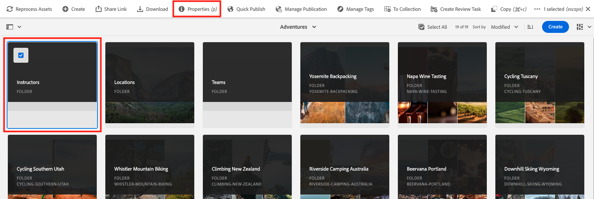
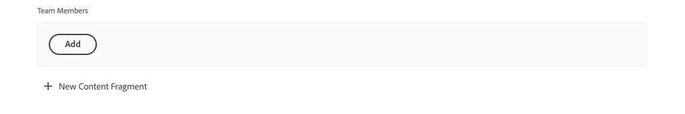

# Skapa innehållsfragment

I [föregående kapitel](/help/headless-tutorial/graphql/advanced-graphql/create-content-fragment-models.md)har du skapat fem modeller för innehållsfragment: person, team, plats, adress och kontaktinformation. I det här kapitlet får du hjälp med att skapa innehållsfragment baserat på dessa modeller. Den undersöker också hur du skapar mappprofiler för att begränsa vad Content Fragment Models kan användas i mappen.

## Förutsättningar {#prerequisites}

Det här dokumentet är en del av en självstudiekurs i flera delar. Se till att [föregående kapitel](create-content-fragment-models.md) har slutförts innan du fortsätter med detta kapitel.

## Mål {#objectives}

Läs om hur du gör följande i det här kapitlet:

* Skapa mappar och ange gränser med mappprofiler
* Skapa fragmentreferenser direkt från redigeraren för innehållsfragment
* Använd datatyperna Tab, Date och JSON Object
* Infoga innehålls- och fragmentreferenser i textredigeraren med flera rader
* Lägga till flera fragmentreferenser
* Kapsla innehållsfragment

## Installera exempelinnehåll {#sample-content}

Installera ett AEM som innehåller flera mappar och exempelbilder som används för att snabba upp självstudiekursen.

1. Ladda ned [Advanced-GraphQL-Tutorial-Starter-Package-1.1.zip](/help/headless-tutorial/graphql/advanced-graphql/assets/tutorial-files/Advanced-GraphQL-Tutorial-Starter-Package-1.1.zip)
1. I AEM navigerar du till **verktyg** > **Distribution** > **Paket** för åtkomst **Pakethanteraren**.
1. Ladda upp och installera det paket (zip-fil) som laddats ned i föregående steg.

   

## Skapa mappar och ange gränser med mappprofiler

På AEM hemsida väljer du **Resurser** > **Filer** > **WKND delad** > **Engelska**. Här ser du de olika kategorierna för innehållsfragment, inklusive Anvisningar och Medarbetare.

### Skapa mappar {#create-folders}

Navigera till **Annonser** mapp. Du ser att mappar för team och platser redan har skapats för att lagra innehållsfragment för team och platser.

Skapa en mapp för instruktörsinnehållsfragment som är baserade på personinnehållets fragmentmodell.

1. På sidan Tillägg väljer du **Skapa** > **Mapp** längst upp till höger.

   

1. Ange &quot;Instruktörer&quot; i dialogrutan Skapa mapp. **Titel** fält. Lägg märke till&quot;s&quot; i slutet. Titlar på mappar som innehåller många fragment måste vara plurala. Välj **Skapa**.

   

   Du har nu skapat en mapp där Adventure Instructors ska lagras.

### Ange gränser med mappprinciper

I AEM kan du definiera behörigheter och profiler för mapparna för innehållsfragment. Genom att använda behörigheter kan du bara ge vissa användare (författare) eller grupper av författare åtkomst till vissa mappar. Genom att använda mappprofiler kan du begränsa vad författare av innehållsfragmentmodeller kan använda i de mapparna. I det här exemplet ska vi begränsa en mapp till modellerna för person- och kontaktinformation. Så här konfigurerar du en mappprincip:

1. Välj **Instruktörer** mapp som du har skapat och sedan väljer **Egenskaper** i det övre navigeringsfältet.

   

1. Välj **Profiler** och sedan avmarkera **Ärvs från /content/dam/wknd-shared**. I **Tillåtna modeller för innehållsfragment efter sökväg** markerar du mappikonen.

   

1. I dialogrutan Välj bana som öppnas följer du banan **conf** > **WKND delad**. Personinnehållsfragmentmodellen, som skapades i föregående kapitel, innehåller en referens till kontaktinformationens innehållsfragmentmodell. Både person- och kontaktinformationsmodeller måste tillåtas i mappen Instruktörer för att ett instruktörsinnehållsfragment ska kunna skapas. Välj **Person** och **Kontaktinformation** och sedan trycka **Välj** för att stänga dialogrutan.

   

1. Välj **Spara och stäng** och markera **OK** i den dialogruta som visas.

1. Du har nu konfigurerat en mappprofil för mappen Instruktörer. Navigera till **Instruktörer** mapp och markera **Skapa** > **Innehållsfragment**. De enda modellerna som du nu kan välja är **Person** och **Kontaktinformation**.

   

## Skapa innehållsfragment för lärare

Navigera till **Instruktörer** mapp. Här skapar vi en kapslad mapp där du kan lagra kontaktinformationen för instruktörerna.

Följ stegen som beskrivs i avsnittet på [skapa mappar](#create-folders) om du vill skapa en mapp med namnet&quot;Kontaktinformation&quot;. Den kapslade mappen ärver mapprinciper för den överordnade mappen. Du kan konfigurera mer specifika profiler så att den nya mappen bara tillåter att kontaktinformationsmodellen används.

### Skapa ett innehåll för instruktörer

Låt oss skapa fyra personer som kan läggas till i ett team med Adventure Instructors.

1. I mappen Instruktörer skapar du ett innehållsfragment baserat på modellen Personinnehållsfragment och ger det titeln&quot;Jacob Wester&quot;.

   Det nya innehållsfragmentet ser ut så här:

   

1. Ange följande innehåll i fälten:

   * **Fullständigt namn**: Jacob Wester
   * **Biografi**: Jacob Wester har varit vandrande instruktör i tio år och har älskat i det hela! Jacob är en äventyrssökande med talang för klättring och ryggsäck. Jacob är vinnare i klättertävlingar, bland annat i strid med tävlingen i Bay bouldering. Jacob bor för närvarande i Kalifornien.
   * **Upplevelsenivå för lärare**: Expert
   * **Kompetens**: Stenklättring, Surfning, Backpackaging
   * **Administratörsinformation** Jacob Wester har samordnat bakomliggande äventyr i tre år.

1. I **Profilbild** lägger du till en innehållsreferens till en bild. Bläddra till **WKND delad** > **Engelska** > **Medarbetare** > **jacob_wester.jpg** för att skapa en bana till bilden.

### Skapa en fragmentreferens från redigeraren för innehållsfragment {#fragment-reference-from-editor}

AEM gör att du kan skapa en fragmentreferens direkt från redigeraren för innehållsfragment. Låt oss skapa en referens till Jakobs kontaktinformation.

1. Välj **Nytt innehållsfragment** nedanför **Kontaktinformation** fält.

   

1. Det nya innehållsfragmentet öppnas. Följ banan på fliken Välj mål **Annonser** > **Instruktörer** och markera kryssrutan bredvid **Kontaktinformation** mapp. Välj **Nästa** för att gå vidare till fliken Egenskaper.

   

1. Under fliken Egenskaper anger du &quot;Jacob Wester Contact Info&quot; i dialogrutan **Titel** fält. Välj **Skapa** och sedan trycka **Öppna** i den dialogruta som visas.

   

   Nya fält visas där du kan redigera innehållsfragmentet för kontaktinformation.

   

1. Ange följande innehåll i fälten:

   * **Telefon**: 209-888-0000
   * **E-post**: jwester@wknd.com

   När du är klar väljer du **Spara**. Du har nu skapat ett innehållsfragment för kontaktinformation.

1. Om du vill gå tillbaka till Instruktörens innehållsfragment väljer du **Jacob Wester** i det övre vänstra hörnet av redigeraren.

   

   The **Kontaktinformation** fältet innehåller nu sökvägen till det refererade kontaktinformationsfragmentet. Detta är en kapslad fragmentreferens. Det färdiga innehållsfragmentet för instruktören ser ut så här:

   

1. Välj **Spara och stäng** om du vill spara innehållsfragmentet. Nu har du ett nytt innehållsfragment för instruktörer.

### Skapa ytterligare fragment

Följ samma process som beskrivs i [föregående avsnitt](#fragment-reference-from-editor) om du vill skapa ytterligare tre innehållsavsnitt för instruktörer och tre innehållsavsnitt för kontaktinformation för dessa instruktörer. Lägg till följande innehåll i instruktionsfragmenten:

**Stacey Roswells**

| Fält | Värden |
| --- | --- |
| Content Fragment Title | Stacey Roswells |
| Fullständigt namn | Stacey Roswells |
| Kontaktinformation | /content/dam/wknd-shared/en/adventures/instructors/contact-info/stacey-roswells-contact-info |
| Profilbild | /content/dam/wknd-shared/en/contributors/stacey-roswells.jpg |
| Biografi | Stacey Roswells är en skicklig klippare och alfanäventyrare. Stacey är född i Baltimore, Maryland, och är yngst av sex barn. Staceys far var överste i USA:s flotta och mor var en modern dansinstruktör. Staceys familj flyttade ofta med fars arbetsuppgifter och tog de första bilderna när fadern var stationerad i Thailand. Det här är också där Stacey lärde sig att klättra. |
| Upplevelsenivå för lärare | Avancerat |
| Kompetens | Groda klättrar | Skickar | Bakpackning |

**Kumar Selvaraj**

| Fält | Värden |
| --- | --- |
| Content Fragment Title | Kumar Selvaraj |
| Fullständigt namn | Kumar Selvaraj |
| Kontaktinformation | /content/dam/wknd-shared/en/adventures/instructors/contact-info/kumar-selvaraj-contact-info |
| Profilbild | /content/dam/wknd-shared/en/contributors/kumar-selvaraj.jpg |
| Biografi | Kumar Selvaraj är en erfaren AMGA Certified Professional-instruktör vars främsta mål är att hjälpa eleverna att förbättra sina klättring- och vandringsfärdigheter. |
| Upplevelsenivå för lärare | Avancerat |
| Kompetens | Groda klättrar | Bakpackning |

**Ayo Ogunseinde**

| Fält | Värden |
| --- | --- |
| Content Fragment Title | Ayo Ogunseinde |
| Fullständigt namn | Ayo Ogunseinde |
| Kontaktinformation | /content/dam/wknd-shared/en/adventures/instructors/contact-info/ayo-ogunseinde-contact-info |
| Profilbild | /content/dam/wknd-shared/en/contributors/ayo-ogunseinde-237739.jpg |
| Biografi | Ayo Ogunseinde är en professionell timmerlärare och handledare i Fresno i CentralKalifornien. Ayos mål är att vägleda de anställda i deras mest episnationella parkäventyr. |
| Upplevelsenivå för lärare | Avancerat |
| Kompetens | Groda klättrar | Cykling | Bakpackning |

Lämna **Ytterligare information** fältet är tomt.

Lägg till följande information i kontaktinformationsfragmenten:

| Content Fragment Title | Telefon | E-post |
| ------- | -------- | -------- |
| Kontaktinformation för Stacey Roswells | 209-888-0011 | sroswells@wknd.com |
| Kumar Selvaraj-kontaktinformation | 209-888-0002 | kselvaraj@wknd.com |
| Ayo Ogunseinde Contact Info | 209-888-0304 | aogunseinde@wknd.com |

Nu kan du skapa ett team!

## Skapa innehållsfragment för platser

Navigera till **Platser** mapp. Här ser du två kapslade mappar som redan har skapats: Yosemite nationalpark och Yosemite Valley Lodge.


Ignorera mappen Yosemite Valley Lodge för tillfället. Vi kommer tillbaka till det senare i det här avsnittet när vi skapar en plats som fungerar som hembas för vårt team med instruktörer.

Navigera till **Yosemite nationalpark** mapp. För närvarande innehåller den bara en bild på Yosemite nationalpark. Låt oss skapa ett innehållsfragment med Location Content Fragment Model och ge det namnet&quot;Yosemite National Park&quot;.

### Platshållare för flikar

Med AEM kan du använda platshållare för flikar för att gruppera olika typer av innehåll och göra dina innehållsfragment enklare att läsa och hantera. I föregående kapitel lade du till platshållare för tabbar i platsmodellen. Det innebär att det nu finns två tabbavsnitt i avsnittet Placera innehåll: **Platsinformation** och **Platsadress**.


The **Platsinformation** -fliken innehåller **Namn**, **Beskrivning**, **Kontaktinformation**, **Platsbild** och **Väder efter säsong** fält, medan **Platsadress** -fliken innehåller en referens till ett adressinnehållsfragment. Flikarna gör det tydligt vilka typer av innehåll som måste fyllas i, så att det blir enklare att hantera redigeringsinnehållet.

### JSON-objektdatatyp

The **Väder efter säsong** -fältet är en JSON-objekttyp, vilket betyder att det accepterar data i JSON-format. Den här datatypen är flexibel och kan användas för alla data som du vill inkludera i ditt innehåll.

Du kan se fältbeskrivningen som skapades i föregående kapitel genom att hålla markören över informationsikonen till höger om fältet.


I det här fallet måste vi ange det genomsnittliga vädret för platsen. Ange följande data:

```json
{
    "summer": "81 / 89°F",
    "fall": "56 / 83°F",
    "winter": "46 / 51°F",
    "spring": "57 / 71°F"
}
```

The **Väder efter säsong** ska nu se ut så här:


### Lägg till innehåll

Låt oss lägga till resten av innehållet i Location Content Fragment för att fråga efter informationen med GraphQL i nästa kapitel.

1. I **Platsinformation** anger du följande information i fälten:

   * **Namn**: Yosemite nationalpark
   * **Beskrivning**: Yosemite National Park ligger i California&#39;s Sierra Nevada-bergen. Det är känt för sina fantastiska vattenfall, enorma sekvoiaträd och ikoniska vyer av klippen El Capitan och Half Dome. Att gå på vandring och tält är det bästa sättet att uppleva Yosemite. Många spår ger oändliga möjligheter till äventyr och utforskande.

1. Från **Kontaktinformation** skapar du ett innehållsfragment baserat på kontaktinformationsmodellen och ger det rubriken&quot;Yosemite National Park Contact Info&quot;. Följ samma process som beskrivs i föregående avsnitt om [skapa en fragmentreferens från redigeraren](#fragment-reference-from-editor) och ange följande data i fälten:

   * **Telefon**: 209-999-0000
   * **E-post**: yosemite@wknd.com

1. Från **Platsbild** fält, bläddra till **Annonser** > **Platser** > **Yosemite nationalpark** > **yosemite-national-park.jpeg** för att skapa en bana till bilden.

   Kom ihåg, i föregående kapitel som du konfigurerade bildvalideringen, att platsbildens mått måste vara mindre än 2 560 x 1 800 och att filstorleken måste vara mindre än 3 MB.

1. Med all information tillagd **Platsinformation** ser nu ut så här:

   

1. Navigera till **Platsadress** -fliken. Från **Adress** skapar du ett innehållsfragment med namnet&quot;Yosemite National Park Address&quot; med adressfragmentmodellen som du skapade i föregående kapitel. Följ samma process som beskrivs i avsnittet om [skapa en fragmentreferens från redigeraren](#fragment-reference-from-editor) och ange följande data i fälten:

   * **Gatuadress**: 9010 CFUND Village Drive
   * **Ort**: Yosemite Valley
   * **Läge**: CA
   * **Postnummer**: 95389
   * **Land**: USA

1. Slutförd **Platsadress** Fliken i Yosemite National Park-avsnittet ser ut så här:

   

1. Välj **Spara och stäng**.

### Skapa ett fragment till

1. Navigera till **Yosemite Valley Lodge** mapp. Skapa ett innehållsfragment med Location Content Fragment Model och ge det rubriken&quot;Yosemite Valley Lodge&quot;.

1. I **Platsinformation** anger du följande information i fälten:

   * **Namn**: Yosemite Valley Lodge
   * **Beskrivning**: Yosemite Valley Lodge är ett nav för gruppmöten och alla typer av aktiviteter, som att handla, äta, fiska, vandra och mycket annat.

1. Från **Kontaktinformation** skapar du ett innehållsfragment baserat på modellen Kontaktinformation och ger det rubriken&quot;Yosemite Valley Lodge Contact Info&quot;. Följ samma process som beskrivs i avsnittet om [skapa en fragmentreferens från redigeraren](#fragment-reference-from-editor) och ange följande data i fälten för det nya innehållsfragmentet:

   * **Telefon**: 209-992-0000
   * **E-post**: yosemitelodge@wknd.com

   Spara det nya innehållsfragmentet.

1. Navigera tillbaka till **Yosemite Valley Lodge** och går till **Platsadress** -fliken. Från **Adress** skapar du ett innehållsfragment med namnet&quot;Yosemite Valley Lodge Address&quot; med adressfragmentmodellen som du skapade i föregående kapitel. Följ samma process som beskrivs i avsnittet om [skapa en fragmentreferens från redigeraren](#fragment-reference-from-editor) och ange följande data i fälten:

   * **Gatuadress**: 9006 Yosemite Loader Drive
   * **Ort**: Yosemite nationalpark
   * **Läge**: CA
   * **Postnummer**: 95389
   * **Land**: USA

   Spara det nya innehållsfragmentet.

1. Navigera tillbaka till **Yosemite Valley Lodge** väljer **Spara och stäng**. The **Yosemite Valley Lodge** mappen innehåller nu tre innehållsfragment: Yosemite Valley Lodge, Yosemite Valley Lodge Contact Info och Yosemite Valley Lodge Address.

   

## Skapa ett teaminnehållsfragment

Bläddra bland mappar till **Team** > **Yosemite Team**. Du ser att Yosemite Team-mappen för närvarande bara innehåller teamlogotypen.


Låt oss skapa ett innehållsfragment med teamets innehållsfragmentmodell och ge det namnet&quot;Yosemite Team&quot;.

### Innehålls- och fragmentreferenser i en textredigerare med flera rader

Med AEM kan du lägga till innehåll och fragmentreferenser direkt i textredigeraren med flera rader och hämta dem senare med hjälp av GraphQL-frågor. Vi lägger till både innehåll- och fragmentreferenser i **Beskrivning** fält.

1. Lägg först till följande text i **Beskrivning** Fält:&quot;The team of professional adventurers and hiking instructors working in Yosemite National Park.&quot;

1. Om du vill lägga till en innehållsreferens väljer du **Infoga resurs** i verktygsfältet i textredigeraren med flera rader.

   

1. I den modal som visas väljer du **team-yosemite-logo.png** och tryck **Välj**.

   

   Innehållsreferensen har nu lagts till i **Beskrivning** fält.

Kom ihåg att du i föregående kapitel tillät att fragmentreferenser läggs till i **Beskrivning** fält. Vi lägger till en här.

1. Välj **Infoga innehållsfragment** i verktygsfältet i textredigeraren med flera rader.

   

1. Bläddra till **WKND delad** > **Engelska** > **Annonser** > **Platser** > **Yosemite Valley Lodge** > **Yosemite Valley Lodge**. Tryck **Välj** om du vill infoga innehållsfragmentet.

   

   The **Beskrivning** ser nu fältet ut så här:

   

Du har nu lagt till innehålls- och fragmentreferenserna direkt i textredigeraren med flera rader.

### Datatypen Datum och tid

Låt oss titta på datatypen Datum och tid. Välj **Kalender** ikonen till höger om **Gruppens grunddatum** för att öppna kalendervyn.


Tidigare eller framtida datum kan anges med hjälp av framåt- och bakåtpilarna på båda sidor om månaden. Låt oss säga att Yosemite-teamet grundades den 24 maj 2016, så vi bestämmer datumet då.

### Lägga till flera fragmentreferenser

Låt oss lägga till instruktörer i fragmentreferensen för teammedlemmar.

1. Välj **Lägg till** i **Teammedlemmar** fält.

   

1. I det nya fältet som visas väljer du mappikonen för att öppna modal Välj sökväg. Bläddra bland mappar till **WKND delad** > **Engelska** > **Annonser** > **Instruktörer** markerar du kryssrutan bredvid **jacob-wester**. Tryck **Välj** för att spara banan.

   

1. Välj **Lägg till** tre gånger till. Använd de nya fälten för att lägga till de tre återstående lärarna i teamet. The **Teammedlemmar** ser nu fältet ut så här:

   

1. Välj **Spara och stäng** om du vill spara teamets innehållsfragment.

### Lägga till fragmentreferenser till ett Adventure-innehållsfragment

Låt oss slutligen lägga till våra nya innehållsfragment i en äventyr.

1. Navigera till **Annonser** > **Yosemite Backpackaging** och öppna Yosemite Backpackaging Content Fragment. Längst ned i formuläret kan du se de tre fält som du har skapat i föregående kapitel: **Plats**, **Instruktörsteamet** och **Administratör**.

1. Lägg till fragmentreferensen i **Plats** fält. Sökvägen till platsen ska hänvisa till det Yosemite National Park Content Fragment som du skapade: `/content/dam/wknd-shared/en/adventures/locations/yosemite-national-park/yosemite-national-park`.

1. Lägg till fragmentreferensen i **Instruktörsteamet** fält. Teamsökvägen ska referera till det Yosemite Team Content Fragment som du har skapat: `/content/dam/wknd-shared/en/adventures/teams/yosemite-team/yosemite-team`. Detta är en kapslad fragmentreferens. Team Content Fragment innehåller en referens till personmodellen som refererar till kontaktinformation och adressmodeller. Därför har du kapslat innehållsfragment tre nivåer ned.

1. Lägg till fragmentreferensen i **Administratör** fält. Säg att Jacob Wester är administratör för Yosemite Backpackaging Adventure. Sökvägen ska leda till Jacob Wester Content Fragment och visas enligt följande: `/content/dam/wknd-shared/en/adventures/instructors/jacob-wester`.

1. Du har nu lagt till tre fragmentreferenser till ett Adventure Content Fragment. Fälten ser ut så här:

   

1. Välj **Spara och stäng** för att spara ditt innehåll.

## Grattis!

Grattis! Du har nu skapat innehållsfragment baserat på de avancerade modeller för innehållsfragment som skapades i föregående kapitel. Du har också skapat en mappprofil som begränsar vad Content Fragment Models kan väljas i en mapp.

## Nästa steg

I [nästa kapitel](/help/headless-tutorial/graphql/advanced-graphql/explore-graphql-api.md)får du lära dig att skicka avancerade GraphQL-frågor med GraphiQL Integrated Development Environment (IDE). Med hjälp av de här frågorna kan vi visa de data som skapas i det här kapitlet och till slut lägga till de här frågorna i WKND-appen.
