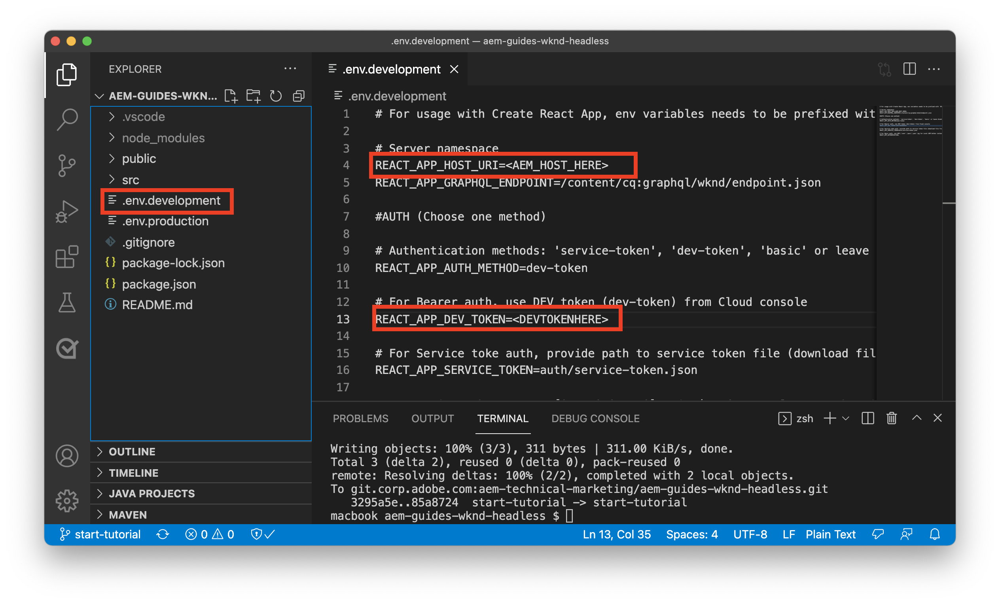
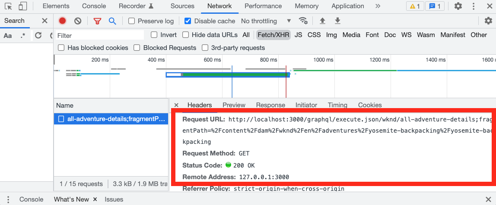

# Integrering av klientprogram

I det föregående kapitlet skapade och uppdaterade du beständiga frågor med HTTP PUT och POST.

I det här kapitlet beskrivs stegen för att integrera dessa beständiga frågor med WKND-appen med HTTP GET-begäranden i fem React-komponenter:

* Plats
* Adress
* Instruktörer
* Administratör
* Team

## Förutsättningar {#prerequisites}

Det här dokumentet är en del av en självstudiekurs i flera delar. Se till att föregående kapitel har fyllts i innan du fortsätter med det här kapitlet. Slutförande av [grundläggande självstudiekurs](/help/headless-tutorial/graphql/multi-step/overview.md) rekommenderas.

_Skärmbilder från IDE i det här kapitlet kommer från [Visual Studio Code](https://code.visualstudio.com/)_

### Kapitel 1-4 Lösningspaket (valfritt) {#solution-package}

Det finns ett lösningspaket som kan installeras och som slutför stegen i AEM för kapitel 1-4. Det här paketet är **behövs inte** om föregående kapitel har fyllts i.

1. Hämta [Advanced-GraphQL-Tutorial-Solution-Package-1.1.zip](/help/headless-tutorial/graphql/advanced-graphql/assets/tutorial-files/Advanced-GraphQL-Tutorial-Solution-Package-1.1.zip).
1. I AEM navigerar du till **verktyg** > **Distribution** > **Paket** för åtkomst **Pakethanteraren**.
1. Överför och installera det paket (zip-fil) som hämtades i föregående steg.

## Mål {#objectives}

I den här självstudiekursen får du lära dig hur du integrerar begäranden om beständiga frågor i exempelappen WKND GraphQl React med hjälp av JavaScript utan AEM Headless [SDK](https://github.com/adobe/aem-headless-client-js).

## Installera och kör exempelklientprogrammet {#install-client-app}

För att snabba upp självstudiekursen finns en React JS-app med startfunktion.

>[!NOTE]
> 
> Nedan finns instruktioner om hur du ansluter React-appen till en **Upphovsman** miljö AEM as a Cloud Service med [åtkomsttoken för lokal utveckling](/help/headless-tutorial/authentication/local-development-access-token.md). Det går också att ansluta appen till en [lokal författarinstans med AEMaaCS SDK](/help/headless-tutorial/graphql/quick-setup/local-sdk.md) med grundläggande autentisering.

1. Hämta **[aem-guides-wknd-headless-start-tutorial.zip](/help/headless-tutorial/graphql/advanced-graphql/assets/tutorial-files/aem-guides-wknd-headless-start-tutorial.zip)**.
1. Zippa upp filen och öppna projektet i din utvecklingsmiljö.
1. Hämta en [lokal utvecklingstoken](/help/headless-tutorial/authentication/local-development-access-token.md) för AEM.
1. Öppna filen i projektet `.env.development`.
   1. Ange `REACT_APP_DEV_TOKEN` lika med `accessToken` värde från den lokala utvecklingstoken. (Inte hela JSON-filen)
   1. Ange `REACT_APP_HOST_URI` till AEM **Upphovsman** miljö.

   
1. Öppna en ny terminal och navigera till projektmappen. Kör följande kommandon:

   ```shell
   $ npm install
   $ npm start
   ```

1. En ny webbläsare ska öppnas på `http://localhost:3000/aem-guides-wknd-pwa`.
1. Tryck **Camping** > **Yosemite Backpackaging** för att visa Yosemite Backpackaging-presentationsinformation.

   

1. Öppna webbläsarens utvecklarverktyg och kontrollera `XHR` förfrågan

   

   Du borde se en `POST` till GraphQL-slutpunkten. Visa `Payload`visas den fullständiga GraphQL-frågan som skickades. I nästa avsnitt uppdateras appen till att använda **beständig** frågor.


## Komma igång

I den grundläggande självstudiekursen används en parametriserad GraphQl-fråga för att begära ett enda innehållsfragment och återge äventyrsinformationen. Uppdatera sedan `adventureDetailQuery` om du vill ta med nya fält och använda beständiga frågor som skapats i det föregående kapitlet.

Fem komponenter skapas:

| Reaktionskomponent | Plats |
|-------|------|
| Administratör | `src/components/Administrator.js` |
| Team | `src/components/Team.js` |
| Plats | `src/components/Location.js` |
| Instruktörer | `src/components/Instructors.js` |
| Adress | `src/components/Address.js` |

## Uppdatera krok för useGraphQL

En anpassad [Reaktionseffektkrok](https://reactjs.org/docs/hooks-overview.html#effect-hook) skapades som lyssnar efter ändringar i appens `query`och vid ändring görs en HTTP-POST-begäran till den AEM GraphQL-slutpunkten och JSON-svaret returneras till programmet.

Skapa en ny krok att använda **beständig** frågor. Appen kan sedan göra HTTP GET-begäranden för Adventure-information. The `runPersistedQuery` i [AEM Headless Client SDK](https://github.com/adobe/aem-headless-client-js) används för att göra det enklare att köra en beständig fråga.

1. Öppna filen `src/api/useGraphQL.js`
1. Lägg till en ny krok för `useGraphQLPersisted`:

   ```javascript
   /**
   * Custom React Hook to perform a GraphQL query to a persisted query endpoint
   * @param persistedPath - the short path to the persisted query
   * @param fragmentPathParam - optional parameters object that can be passed in for parameterized persistent queries
   */
   export function useGraphQLPersisted(persistedPath, fragmentPathVariable) {
       let [data, setData] = useState(null);
       let [errors, setErrors] = useState(null);
   
       useEffect(() => {
           let queryVariables = {};
   
           // we pass in a primitive fragmentPathVariable (String) and then construct the object {fragmentPath: fragmentPathParam} to pass as query params to the persisted query
           // It is simpler to pass a primitive into a React hooks, as comparing the state of a dependent object can be difficult. see https://reactjs.org/docs/hooks-faq.html#can-i-skip-an-effect-on-updates
           if(fragmentPathVariable) {
               queryVariables = {fragmentPath: fragmentPathVariable};
           }
   
           // execute a persisted query using the given path and pass in variables (if needed)
           sdk.runPersistedQuery(persistedPath, queryVariables)
               .then(({ data, errors }) => {
               if (errors) setErrors(mapErrors(errors));
               if (data) setData(data);
           })
           .catch((error) => {
           setErrors(error);
           });
   }, [persistedPath, fragmentPathVariable]);
   
   return { data, errors }
   }
   ```
1. Spara ändringarna i filen.

## Uppdatera Adventure Details-komponent

Filen `src/api/queries.js` innehåller GraphQL-frågor som används för att driva programmet `adventureDetailQuery` returnerar information för ett enskilt äventyr med GraphQL-standardbegäran för POST. Uppdatera sedan `AdventureDetail` som ska använda den beständiga `wknd/all-adventure-details` fråga.

1. Öppna `src/screens/AdventureDetail.js`.
1. Kommentera först följande rad:

   ```javascript
   export default function AdventureDetail() {
   
       ...
   
       //const { data, errors } = useGraphQL(adventureDetailQuery(adventureFragmentPath));
   ```

   I ovanstående används den vanliga GraphQL-POSTEN för att hämta äventyrsinformation baserat på en `adventureFragmentPath`

1. Så här använder du `useGraphQLPersisted` krok, lägg till följande rad:

   ```javascript
   export default function AdventureDetail() {
   
      //const { data, errors } = useGraphQL(adventureDetailQuery(adventureFragmentPath));
       const {data, errors} = useGraphQLPersisted("wknd/all-adventure-details", adventureFragmentPath);
   ```

   Observera sökvägen `wknd/all-adventure-details` är sökvägen till den beständiga fråga som skapades i föregående kapitel.

   >[!CAUTION]
   >
   > För att den uppdaterade frågan ska fungera `wknd/all-adventure-details` måste sparas i AEM. Granska stegen i [Beständiga GraphQL-frågor](/help/headless-tutorial/graphql/advanced-graphql/graphql-persisted-queries.md#cache-control-all-adventures) eller installera [AEM](/help/headless-tutorial/graphql/advanced-graphql/assets/tutorial-files/Advanced-GraphQL-Tutorial-Solution-Package-1.1.zip)

1. Återgå till appen som körs i webbläsaren och använd webbläsarens utvecklarverktyg för att inspektera begäran efter att ha navigerat till en **Information om äventyr** sida.

   

   ```
   http://localhost:3000/graphql/execute.json/wknd/all-adventure-details;fragmentPath=/content/dam/wknd/en/adventures/yosemite-backpacking/yosemite-backpacking
   ```

   Nu bör du se en `GET` begäran som använder den beständiga frågan på `wknd/all-adventure-details`.

1. Navigera till andra äventyrsdetaljer och observera samma `GET` begäran görs men med olika fragmentsökvägar. Programmet bör fortsätta att fungera som tidigare.

Se `AdventureDetail.js` i [aem-guides-wknd-headless-solution-tutorial.zip](/help/headless-tutorial/graphql/advanced-graphql/assets/tutorial-files/aem-guides-wknd-headless-solution-tutorial.zip) för ett fullständigt exempel på den uppdaterade komponenten.

Skapa sedan **Plats**, **Administratör** och **Instruktörer** för att återge platsdata. The **Adress** -komponenten refereras i **Team** -komponenten.

## Utveckla komponenten Plats

1. I `AdventureDetail.js` fil, lägga till en referens till `<Location>` som skickar platsdata från `adventure` dataobjekt:

   ```javascript
   export default function AdventureDetail() {
       ...
   
       return (
           ...
   
           <Location data={adventure.location} />
   ```

1. Granska filen på `src/components/Location.js`. The `Location` -komponenten återger data för var de ska mötas, kontaktinformation, information om vädret och en platsbild från **Plats** Content Fragment Model. Som ett minimum `Location` en komponent förväntar sig `address` objekt som ska skickas.
1. Se `Location.js` i [aem-guides-wknd-headless-solution-tutorial.zip](/help/headless-tutorial/graphql/advanced-graphql/assets/tutorial-files/aem-guides-wknd-headless-solution-tutorial.zip) för ett fullständigt exempel på den uppdaterade komponenten.

När uppdateringarna är klara bör detaljsidan se ut så här:


## Utveckla teamkomponenten

1. I `AdventureDetail.js` fil, lägga till en referens till `<Team>` -komponenten (under `<Location>` komponent) skicka `instructorTeam` data från `adventure` dataobjekt:

   ```javascript
   <Location data={adventure.location} />
   <Team data={adventure.instructorTeam} />
   ```

1. Granska filen på `src/components/Team.js`. The `Team` -komponenten återger data om gruppens grunddatum, bild och beskrivning från **Team** Innehållsfragment.

1. I `Team.js` notera att `Address` -komponenten.

   ```javascript
   export default function Team({data}) {
       ...
       {teamPath && <Address _path={teamPath}/>}
   ```

   Här skickas en väg till det aktuella teamet till `Address` -komponent, som i sin tur kör en fråga för att hämta adressen baserat på teamet.

1. Se `Team.js` i [aem-guides-wknd-headless-solution-tutorial.zip](/help/headless-tutorial/graphql/advanced-graphql/assets/tutorial-files/aem-guides-wknd-headless-solution-tutorial.zip) för ett fullständigt exempel på komponenten.

När frågan har integrerats bör den se ut så här:


## Utveckla komponenten Adress

1. Granska filen på `src/components/Address.js`. The `Address` -komponenten återger adressuppgifter som gatuadress, ort, delstat, postnummer, land från **Adress** Innehållsfragment, telefon och e-post från **Kontaktinformation** fragmentreferens.
1. The `Address` -komponenten liknar `AdventureDetails` på så sätt att det gör ett beständigt anrop för att hämta data baserat på en sökväg. Skillnaden är att den använder `/wknd/team-location-by-location-path` för att göra en förfrågan.
1. Se `Address.js` i [aem-guides-wknd-headless-solution-tutorial.zip](/help/headless-tutorial/graphql/advanced-graphql/assets/tutorial-files/aem-guides-wknd-headless-solution-tutorial.zip) för ett fullständigt exempel på komponenten.

## Utveckla komponenten Administratör

1. I `AdventureDetail.js` fil, lägga till en referens till `<Adminstrator>` -komponenten (under `<Team>` komponent) skicka `administrator` data från `adventure` dataobjekt:

   ```javascript
   <Location data={adventure.location} />
   <Team data={adventure.instructorTeam} />
   <Administrator data={adventure.administrator} /> 
   ```

1. Granska filen på `src/components/Administrator.js`. The `Administrator` återger detaljer som deras fullständiga namn från **Administratör** Content Fragment, och återge telefon och e-post från **Kontaktinformation** fragmentreferens.
1. Se `Administrator.js` in [aem-guides-wknd-headless-solution-tutorial.zip](/help/headless-tutorial/graphql/advanced-graphql/assets/tutorial-files/aem-guides-wknd-headless-solution-tutorial.zip) för ett fullständigt exempel på komponenten.

När du har skapat administratörskomponenten kan du återge programmet. Utdata bör matcha bilden nedan:


## Utveckla komponenten Instruktörer

1. I `AdventureDetail.js` fil, lägga till en referens till `<Instructors>` -komponenten (under `<Administrator>` komponent) skicka `instructorTeam` data från `adventure` dataobjekt:

   ```javascript
   <Location data={adventure.location} />
   <Team data={adventure.instructorTeam}/>
   <Administrator data={adventure.administrator} />             
   <Instructors data={adventure.instructorTeam} />
   ```

1. Granska filen på `src/components/Instructors.js`. The `Instructors` -komponenten återger data om var och en av gruppmedlemmarna, inklusive fullständigt namn, biografi, bild, telefonnummer, erfarenhetsnivå och kunskaper. Komponenten itererar över en array för att visa varje medlem.
1. Se `Instructors.js` in [aem-guides-wknd-headless-solution-tutorial.zip](/help/headless-tutorial/graphql/advanced-graphql/assets/tutorial-files/aem-guides-wknd-headless-solution-tutorial.zip) för ett fullständigt exempel på komponenten.

När du återger programmet bör utdata matcha bilden nedan:


## WKND-exempelappen har slutförts

Den färdiga appen bör se ut så här:


### Slutligt klientprogram

Den slutliga versionen av programmet kan hämtas och användas:
**[aem-guides-wknd-headless-solution-tutorial.zip](/help/headless-tutorial/graphql/advanced-graphql/assets/tutorial-files/aem-guides-wknd-headless-solution-tutorial.zip)**

## Grattis

Grattis! Du har nu slutfört integreringen och implementeringen av de beständiga frågorna i WKND-exempelappen.