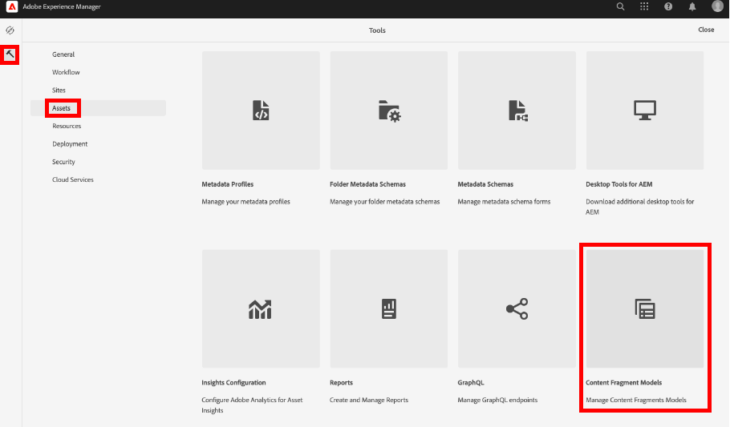
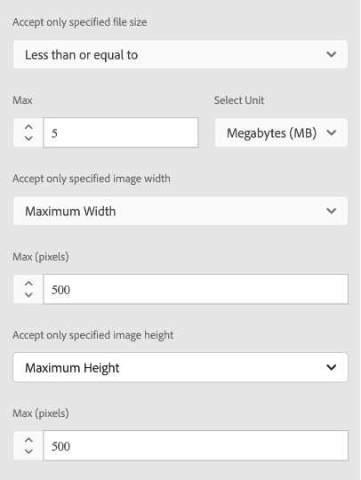
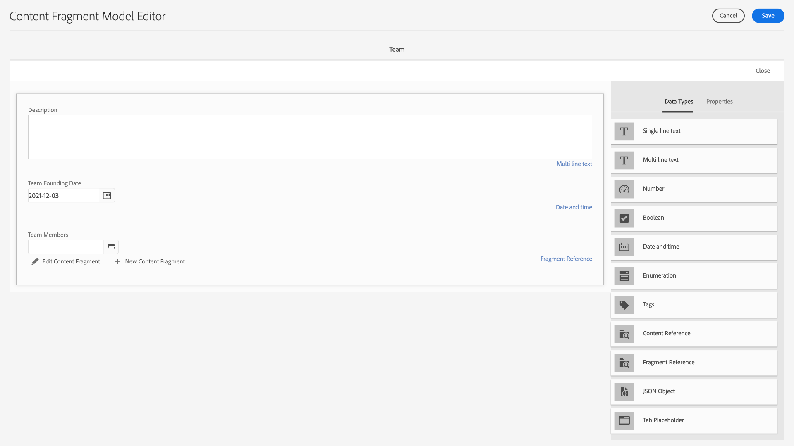
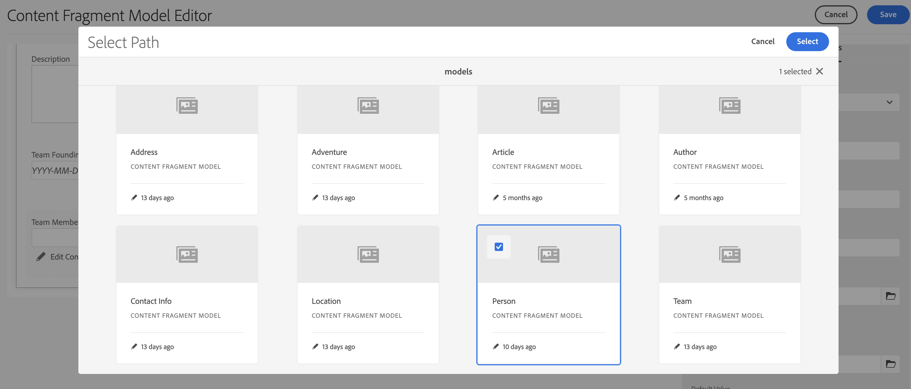

# Skapa modeller för innehållsfragment {#create-content-fragment-models}

I det här kapitlet går vi igenom stegen för att skapa fem modeller för innehållsfragment:

* **Kontaktinformation**
* **Adress**
* **Person**
* **Plats**
* **Team**

Med innehållsfragmentmodeller kan du definiera relationer mellan innehållstyper och beständiga relationer som scheman. Använd kapslade fragmentreferenser, olika innehållsdatatyper och fliktypen för att ordna visuellt innehåll. Mer avancerade datatyper som platshållare för tabbar, fragmentreferenser, JSON-objekt och datatypen date-and-time.

I det här kapitlet beskrivs även hur du förbättrar valideringsregler för innehållsreferenser som bilder.

## Förutsättningar {#prerequisites}

Det här är en avancerad självstudiekurs. Kontrollera att du har slutfört [snabbinstallationen](../quick-setup/cloud-service.md) innan du fortsätter med det här kapitlet. Se till att du även har läst igenom det föregående kapitlet [översikt](../overview.md) för mer information om hur du konfigurerar den avancerade självstudiekursen.

## Mål {#objectives}

* Skapa modeller för innehållsfragment.
* Lägg till tabbplatshållare, datum och tid, JSON-objekt, fragmentreferenser och innehållsreferenser till modellerna.
* Lägg till validering i innehållsreferenser.

## Översikt över modell för innehållsfragment {#content-fragment-model-overview}

I följande video ges en kort introduktion till modeller för innehållsfragment och hur de används i den här självstudiekursen.

>[!VIDEO](https://video.tv.adobe.com/v/3449523?quality=12&learn=on&captions=swe)

## Skapa modeller för innehållsfragment {#create-models}

Låt oss skapa några innehållsfragmentmodeller för WKND-appen. Om du behöver en grundläggande introduktion till att skapa modeller för innehållsfragment kan du läsa motsvarande kapitel i den [grundläggande självstudiekursen](../multi-step/content-fragment-models.md).

1. Navigera till **Verktyg** > **Allmänt** > **Modeller för innehållsfragment**.

   

1. Välj **WKND delad** om du vill visa listan över befintliga modeller för innehållsfragment för webbplatsen.

### Kontaktinformationsmodell {#contact-info-model}

Skapa sedan en modell som innehåller kontaktinformationen för en person eller plats.

1. Välj **Skapa** i det övre högra hörnet.

1. Ge modellen titeln Kontaktinformation och välj sedan **Skapa**. I den lyckade modal som visas väljer du **Öppna** för att redigera den nyskapade modellen.

1. Börja med att dra ett **enkelradigt textfält** till modellen. Ge den **fältetiketten** som är &quot;Telefon&quot; på fliken **Egenskaper**. Egenskapsnamnet fylls i automatiskt som `phone`. Markera kryssrutan för att göra fältet **Obligatoriskt**.

1. Navigera till fliken **Datatyper** och lägg sedan till ytterligare ett **enradigt textfält** under fältet Telefon. Ge den **fältetiketten** värdet &quot;Email&quot; (E-post) och ange den till **Required**.

Adobe Experience Manager innehåller några inbyggda valideringsmetoder. Dessa valideringsmetoder gör att du kan lägga till styrningsregler i specifika fält i Content Fragment Models. I det här fallet lägger vi till en valideringsregel som säkerställer att användare bara kan ange giltiga e-postadresser när de fyller i det här fältet. Välj **E-post** i listrutan **Valideringstyp**.

Din färdiga innehållsfragmentmodell bör se ut så här:

När du är klar väljer du **Spara** för att bekräfta dina ändringar och stänger modellredigeraren för innehållsfragment.

### Adressmodell {#address-model}

Skapa sedan en modell för en adress.

1. I **WKND delad** väljer du **Skapa** i det övre högra hörnet.

1. Ange en titel på Adress och välj sedan **Skapa**. I den lyckade modal som visas väljer du **Öppna** för att redigera den nyskapade modellen.

1. Dra och släpp ett **enradigt textfält** på modellen och ge det en **fältetikett** med &quot;Gatuadress&quot;. Egenskapsnamnet fylls sedan i som `streetAddress`. Markera kryssrutan **Obligatorisk**.

1. Upprepa stegen ovan och lägg till ytterligare fyra&quot;Enkelradig text&quot;-fält i modellen. Använd följande etiketter:

   * Ort
   * Läge
   * Postnummer
   * Land

1. Välj **Spara** om du vill spara ändringarna i adressmodellen.

   Den färdiga adressfragmentmodellen ska se ut så här:
   

### Personmodell {#person-model}

Skapa sedan en modell som innehåller information om en person.

1. Välj **Skapa** i det övre högra hörnet.

1. Ge modellen titeln Person och välj sedan **Skapa**. I den lyckade modal som visas väljer du **Öppna** för att redigera den nyskapade modellen.

1. Börja med att dra ett **enkelradigt textfält** till modellen. Ge den **fältetiketten** med &quot;Fullständigt namn&quot;. Egenskapsnamnet fylls i automatiskt som `fullName`. Markera kryssrutan för att göra fältet **Obligatoriskt**.

   

1. Content Fragment Models kan refereras till i andra modeller. Gå till fliken **Datatyper** och dra och släpp fältet **Fragmentreferens** och ge det etiketten &quot;Kontaktinformation&quot;.

1. Markera mappikonen under fältet **Tillåtna modeller för innehållsfragment** på fliken **Egenskaper** och välj sedan fragmentmodellen **Kontaktinformation** som skapades tidigare.

1. Lägg till ett **innehållsreferensfält** och ge det en **fältetikett** av &quot;Profilbild&quot;. Markera mappikonen under **Rotsökväg** för att öppna den spärrade sökvägen. Välj en rotsökväg genom att välja **content** > **Assets** och sedan markera kryssrutan för **WKND Shared**. Använd knappen **Markera** längst upp till höger för att spara banan. Den slutliga textsökvägen ska vara `/content/dam/wknd-shared`.

   

1. Välj Bild under **Acceptera endast angivna innehållstyper**.

   

1. Om du vill begränsa bildfilens storlek och mått tittar vi på några valideringsalternativ för innehållsreferensfältet.

   Under **Acceptera bara den angivna filstorleken** väljer du &quot;Mindre än eller lika med&quot; och ytterligare fält visas nedan.
   

1. I **Max** anger du &quot;5&quot; och i **Välj enhet** väljer du &quot;Megabyte (MB)&quot;. Valideringen tillåter bara att bilder med den angivna storleken väljs.

1. Välj Maximal bredd under **Acceptera endast angiven bildbredd**. I fältet **Max (pixlar)** som visas anger du &quot;10000&quot;. Välj samma alternativ för **Acceptera bara en angiven bildhöjd**.

   Dessa valideringar säkerställer att tillagda bilder inte överskrider de angivna värdena. Valideringsreglerna ska nu se ut så här:

   

1. Lägg till ett **textfält med flera rader** och ge det **fältetiketten** som är &quot;Biografi&quot;. Lämna listrutan **Standardtyp** som standardalternativ för RTF.

   

1. Navigera till fliken **Datatyper** och dra sedan ett **uppräkningsfält** under Biografi. I stället för standardalternativet **Återge som** väljer du **Listruta** och ger den **Fältetiketten** med Upplevelsenivå för lärare. Ange ett urval av alternativ på lärarupplevelsenivå, till exempel _Expert, Advanced, Intermediate_.

1. Dra sedan ett annat **uppräkningsfält** under &quot;Instruktörsupplevelsenivå&quot; och välj &quot;kryssrutor&quot; under alternativet **Återge som**. Ge den en **fältetikett** med &quot;Skills&quot;. Ange olika kunskaper, t.ex. Klimatning av sten, Surfing, Cycling, Skiing och Backpackaging. Alternativets etikett och alternativvärde ska matcha följande:

   

1. Skapa slutligen en etikett för fältet &quot;Administratörsinformation&quot; med hjälp av ett **flerradigt textfält**.

Välj **Spara** för att bekräfta ändringarna och stänga modellredigeraren för innehållsfragment.

### Platsmodell {#location-model}

Nästa Content Fragment Model beskriver en fysisk plats. I den här modellen används tabbplatshållare. Med platshållare för flikar kan du ordna dina datatyper i modellredigeraren och i innehållet i fragmentredigeraren genom att kategorisera innehållet. Varje platshållare skapar en flik som liknar en flik i en webbläsare i Content Fragment-redigeraren. Platsmodellen ska ha två flikar: Platsinformation och Platsadress.

1. Som tidigare väljer du **Skapa** för att skapa en annan modell för innehållsfragment. Ange&quot;Plats&quot; i modelltitel. Välj **Skapa** följt av **Öppna** i det slutförda modala som visas.

1. Lägg till ett **Platshållarfält för flik** i modellen och ge det etiketten Platsinformation.

1. Dra och släpp en **enkelradstext** och ge den etiketten&quot;Namn&quot;. Under den här fältetiketten lägger du till ett **flerradigt textfält** och ger det etiketten&quot;Beskrivning&quot;.

1. Lägg sedan till ett **fragmentreferensfält** och ge det etiketten&quot;Kontaktinformation&quot;. På fliken Egenskaper, under **Tillåtna modeller för innehållsfragment**, markerar du **mappikonen** och väljer fragmentmodellen &quot;Kontaktinformation&quot; som skapades tidigare.

1. Lägg till ett **innehållsreferensfält** under Kontaktinformation. Ge den etiketten&quot;Platsbild&quot;. **Rotsökvägen** ska vara `/content/dam/wknd-shared.` Välj Bild under **Acceptera endast angivna innehållstyper**.

1. Vi lägger också till ett **JSON-objekt**-fält under &quot;Platsbild&quot;. Eftersom den här datatypen är flexibel kan den användas för att visa alla data som du vill inkludera i ditt innehåll. I det här fallet används JSON-objektet för att visa information om vädret. Märk JSON-objektet &quot;Väder efter säsong&quot;. Lägg till en **Beskrivning** på fliken **Egenskaper** så att användaren vet vilka data som ska anges här:&quot;JSON-data om händelseplatsens väder per säsong (vår, Sommar, höst, Vinter).&quot;

   

1. Om du vill skapa fliken Platsadress lägger du till fältet **Platshållare** i modellen och etiketterar det med Platsadress.

1. Dra och släpp ett **fragmentreferensfält** och etikettera det som&quot;adress&quot; på egenskapsfliken. Under **Tillåtna modeller för innehållsfragment** väljer du **adressmodellen**.

1. Välj **Spara** för att bekräfta ändringarna och stänga modellredigeraren för innehållsfragment. Den färdiga platsmodellen ska se ut så här:

   

### Teammodell {#team-model}

Skapa slutligen en modell som beskriver ett team med människor.

1. På sidan **WKND delad** väljer du **Skapa** om du vill skapa en annan modell för innehållsfragment. Skriv&quot;Team&quot; i Modelltitel. Som tidigare väljer du **Skapa** följt av **Öppna** i det slutförda modala som visas.

1. Lägg till ett **textfält med flera rader** i formuläret. Ange Beskrivning under **Fältetikett**.

1. Lägg till ett **datum- och tidsfält** i modellen och ge det etiketten&quot;Grunddatum för team&quot;. I det här fallet ska du behålla standardinställningen **Type** som &quot;Date&quot;, men observera att det även går att använda &quot;Date &amp; Time&quot; eller &quot;Time&quot;.

   

1. Gå till fliken **Datatyper**. Lägg till en **fragmentreferens** nedanför grunddatumet för teamet. Välj &quot;multifield&quot; i listrutan **Återge som**. Ange&quot;Teammedlemmar&quot; för **fältetikett**. Det här fältet länkar till den _Person_-modell som skapades tidigare. Eftersom datatypen består av flera fält kan flera personfragment läggas till, vilket gör det möjligt att skapa ett team med personer.

   

1. Under **Tillåtna modeller för innehållsfragment** använder du mappikonen för att öppna spärren Välj sökväg och väljer sedan modellen **Person** . Spara banan med knappen **Markera** .

   

1. Välj **Spara** för att bekräfta ändringarna och stänga modellredigeraren för innehållsfragment.

## Lägg till fragmentreferenser till Adventure-modellen {#fragment-references}

På liknande sätt som Team-modellen har en fragmentreferens till personmodellen, måste Team- och Location-modellerna refereras från Adventure-modellen för att dessa nya modeller ska kunna visas i WKND-appen.

1. På sidan **WKND Shared** väljer du modellen **Adventure** och sedan **Edit** i den övre navigeringen.

   

1. Längst ned i formuläret, under &quot;Vad ska du ta med&quot;, lägger du till fältet **Fragmentreferens**. Ange en **fältetikett** som är placerad. Under **Tillåtna modeller för innehållsfragment** väljer du modellen **Plats**.

   

1. Lägg till ytterligare ett **fragmentreferensfält** och ge det etiketten&quot;Instruktörsteamet&quot;. Välj **Team**-modellen under **Tillåtna modeller för innehållsfragment**.

   

1. Lägg till ytterligare ett **fragmentreferensfält** och ge det etiketten&quot;Administratör&quot;.

   

1. Välj **Spara** för att bekräfta ändringarna och stänga modellredigeraren för innehållsfragment.

## Bästa praxis {#best-practices}

Det finns några tips om hur du skapar modeller för innehållsfragment:

* Skapa modeller som mappar till UX-komponenter. Till exempel har WKND-appen Content Fragment Models för äventyr, artiklar och plats. Du kan också lägga till rubriker, kampanjer eller friskrivningsklausuler. Vart och ett av dessa exempel utgör en specifik UX-komponent.

* Skapa så få modeller som möjligt. Genom att begränsa antalet modeller kan ni maximera återanvändningen och förenkla innehållshanteringen.

* Kapsla innehållsfragmentmodeller så djupt som behövs, men bara efter behov. Kom ihåg att kapsling görs med fragmentreferenser eller innehållsreferenser. Överväg att kapsla upp till fem nivåer.

## Grattis! {#congratulations}

Grattis! Du har nu lagt till flikar, använt datatyperna date-and-time och JSON-objekt och lärt dig mer om fragment- och innehållsreferenser. Du har också lagt till valideringsregler för innehållsreferenser.

## Nästa steg {#next-steps}

Nästa kapitel i den här serien omfattar [redigering av innehållsfragment](/help/headless-tutorial/graphql/advanced-graphql/author-content-fragments.md) från modellerna som du skapade i det här kapitlet. Lär dig hur du använder de datatyper som introduceras i det här kapitlet och skapa mappprofiler för att begränsa vad Content Fragment-modeller kan skapa i en resursmapp.

Det är valfritt för den här självstudiekursen, men se till att publicera allt innehåll i verkliga produktionssituationer. En recension av redigerings- och publiceringsmiljöer i AEM finns i
[AEM Headless och GraphQL ](/help/headless-tutorial/graphql/video-series/author-publish-architecture.md).
