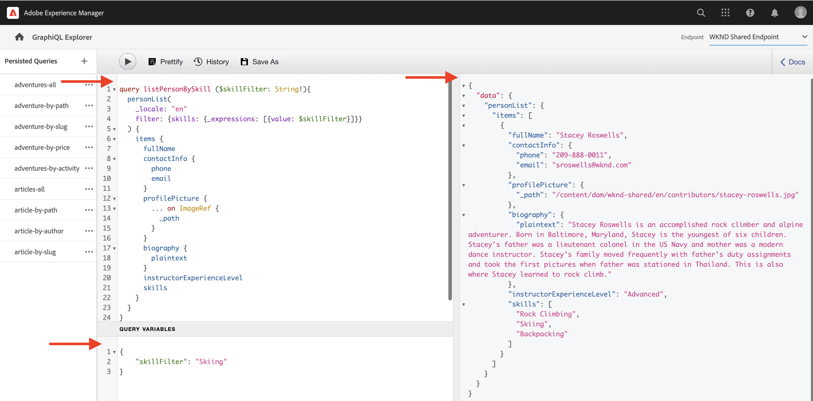

# Utforska AEM GraphQL API

Med GraphQL API i AEM kan du visa Content Fragment-data för program längre fram i kedjan. I den grundläggande självstudiekursen [om flera steg i GraphQL](../multi-step/explore-graphql-api.md) använde du GraphiQL Explorer för att testa och förfina GraphQL-frågorna.

I det här kapitlet använder du GraphiQL Explorer för att definiera mer avancerade frågor för att samla in data om de innehållsfragment som du skapade i det [föregående kapitlet](../advanced-graphql/author-content-fragments.md).

## Förutsättningar {#prerequisites}

Det här dokumentet är en del av en självstudiekurs i flera delar. Se till att föregående kapitel har fyllts i innan du fortsätter med det här kapitlet.

## Mål {#objectives}

I det här kapitlet får du lära dig att:

* Filtrera en lista med innehållsfragment med referenser som använder frågevariabler
* Filter för innehåll i en fragmentreferens
* Fråga efter textbundet innehåll och fragmentreferenser från ett textfält med flera rader
* Fråga med direktiv
* Fråga efter JSON-objektets innehållstyp

## Använda GraphiQL Explorer


Med verktyget [GraphiQL Explorer](https://experienceleague.adobe.com/docs/experience-manager-cloud-service/content/headless/graphql-api/graphiql-ide.html?lang=sv-SE) kan utvecklare skapa och testa frågor mot innehåll i den aktuella AEM-miljön. Med GraphiQL-verktyget kan användare även **spara**-frågor som ska användas av klientprogram i en produktionsinställning.

Utforska sedan kraften i AEM GraphQL API med den inbyggda GraphiQL Explorer.

1. På startskärmen i AEM går du till **Verktyg** > **Allmänt** > **GraphQL Query Editor**.

   

>[!IMPORTANT]
>
>I vissa versioner av AEM (6.X.X) måste GraphiQL Explorer-verktyget (även GraphiQL IDE) installeras manuellt. Följ [instruktionerna här](../how-to/install-graphiql-aem-6-5.md).

1. Kontrollera att slutpunkten är inställd på **WKND-delad slutpunkt** i det övre högra hörnet. Om du ändrar listrutan _Slutpunkt_ här visas de befintliga _beständiga frågorna_ i det övre vänstra hörnet.

   

Detta omfattar alla frågor till modeller som skapats i projektet **WKND Shared** .


## Filtrera en lista med innehållsfragment med frågevariabler

I den tidigare [flerstegssjälvstudiekursen för GraphQL](../multi-step/explore-graphql-api.md) definierade och använde du grundläggande beständiga frågor för att hämta information om innehållsfragment. Här utökar du kunskapen och filtrerar Content Fragments-data genom att skicka variabler till de beständiga frågorna.

När du utvecklar klientprogram behöver du vanligtvis filtrera innehållsfragment baserat på dynamiska argument. Med AEM GraphQL API kan du skicka dessa argument som variabler i en fråga för att undvika strängkonstruktion på klientsidan vid körning. Mer information om GraphQL-variabler finns i [GraphQL-dokumentationen](https://graphql.org/learn/queries/#variables).

I det här exemplet frågar du alla instruktörer som har en viss kompetens.

1. Klistra in följande fråga i den vänstra panelen i GraphiQL IDE:

   ```graphql
   query listPersonBySkill ($skillFilter: String!){
     personList(
       _locale: "en"
       filter: {skills: {_expressions: [{value: $skillFilter}]}}
     ) {
       items {
         fullName
         contactInfo {
           phone
           email
         }
         profilePicture {
           ... on ImageRef {
             _path
           }
         }
         biography {
           plaintext
         }
         instructorExperienceLevel
         skills
       }
     }
   }
   ```

   `listPersonBySkill`-frågan ovan accepterar en variabel (`skillFilter`) som är en obligatorisk `String`. Den här frågan utför en sökning mot alla personinnehållsfragment och filtrerar dem baserat på fältet `skills` och strängen som skickas i `skillFilter`.

   `listPersonBySkill` innehåller egenskapen `contactInfo`, som är en fragmentreferens till kontaktinformationsmodellen som definierats i föregående kapitel. Kontaktinformationsmodellen innehåller fälten `phone` och `email`. Minst ett av dessa fält i frågan måste finnas för att den ska fungera korrekt.

   ```graphql
   contactInfo {
           phone
           email
         }
   ```

1. Sedan definierar vi `skillFilter` och hämtar alla instruktörer som har kompetens för att skidåkning. Klistra in följande JSON-sträng på panelen Frågevariabler i GraphiQL IDE:

   ```json
   {
       "skillFilter": "Skiing"
   }
   ```

1. Kör frågan. Resultatet ska se ut ungefär så här:

   ```json
   {
     "data": {
       "personList": {
         "items": [
           {
             "fullName": "Stacey Roswells",
             "contactInfo": {
               "phone": "209-888-0011",
               "email": "sroswells@wknd.com"
             },
             "profilePicture": {
               "_path": "/content/dam/wknd-shared/en/contributors/stacey-roswells.jpg"
             },
             "biography": {
               "plaintext": "Stacey Roswells is an accomplished rock climber and alpine adventurer. Born in Baltimore, Maryland, Stacey is the youngest of six children. Stacey's father was a lieutenant colonel in the US Navy and mother was a modern dance instructor. Stacey's family moved frequently with father's duty assignments and took the first pictures when father was stationed in Thailand. This is also where Stacey learned to rock climb."
             },
             "instructorExperienceLevel": "Advanced",
             "skills": [
               "Rock Climbing",
               "Skiing",
               "Backpacking"
             ]
           }
         ]
       }
     }
   }
   ```

Tryck på knappen **Spela upp** på den översta menyn för att köra frågan. Du bör se resultatet av innehållsfragmenten från det föregående kapitlet:



## Filter för innehåll i en fragmentreferens

Med AEM GraphQL API kan du söka efter kapslade innehållsfragment. I det föregående kapitlet lade du till tre nya fragmentreferenser till ett Adventure Content Fragment: `location`, `instructorTeam` och `administrator`. Nu ska vi filtrera alla annonser för alla administratörer som har ett visst namn.

>[!CAUTION]
>
>Endast en modell får användas som referens för den här frågan för att den ska fungera korrekt.

1. Klistra in följande fråga i den vänstra panelen i GraphiQL IDE:

   ```graphql
   query getAdventureAdministratorDetailsByAdministratorName ($name: String!){
     adventureList(
     _locale: "en"
       filter: {administrator: {fullName: {_expressions: [{value: $name}]}}}
     ) {
       items {
         title
         administrator {
           fullName
           contactInfo {
             phone
             email
           }
           administratorDetails {
             json
           }
         }
       }
     }
   }
   ```

1. Klistra sedan in följande JSON-sträng på panelen Frågevariabler:

   ```json
   {
       "name": "Jacob Wester"
   }
   ```

   Frågan `getAdventureAdministratorDetailsByAdministratorName` filtrerar alla tillägg för `administrator` av `fullName` &quot;Jacob Wester&quot; och returnerar information från två kapslade innehållsfragment: Adventure och Instructor.

1. Kör frågan. Resultatet ska se ut ungefär så här:

   ```json
   {
     "data": {
       "adventureList": {
         "items": [
           {
             "title": "Yosemite Backpacking",
             "administrator": {
               "fullName": "Jacob Wester",
               "contactInfo": {
                 "phone": "209-888-0000",
                 "email": "jwester@wknd.com"
               },
               "administratorDetails": {
                 "json": [
                   {
                     "nodeType": "paragraph",
                     "content": [
                       {
                         "nodeType": "text",
                         "value": "Jacob Wester has been coordinating backpacking adventures for three years."
                       }
                     ]
                   }
                 ]
               }
             }
           }
         ]
       }
     }
   }
   ```

## Fråga efter textbundna referenser från ett textfält med flera rader {#query-rte-reference}

Med AEM GraphQL API kan du söka efter innehålls- och fragmentreferenser i textfält med flera rader. I föregående kapitel lade du till båda referenstyperna i fältet **Beskrivning** i Yosemite Team Content Fragment. Nu hämtar vi referenserna.

1. Klistra in följande fråga i den vänstra panelen i GraphiQL IDE:

   ```graphql
   query getTeamByAdventurePath ($fragmentPath: String!){
     adventureByPath (_path: $fragmentPath) {
       item {
         instructorTeam {
           _metadata {
             stringMetadata {
               name
               value
             }
         }
           teamFoundingDate
           description {
             plaintext
           }
         }
       }
       _references {
         ... on ImageRef {
           __typename
           _path
         }
         ... on LocationModel {
           __typename
           _path
           name
           address {
             streetAddress
             city
             zipCode
             country
           }
           contactInfo {
             phone
             email
           }
         }
       }
     }
   }
   ```

   Frågan `getTeamByAdventurePath` filtrerar alla annonser efter sökväg och returnerar data för fragmentreferensen `instructorTeam` för en specifik Adventure.

   `_references` är ett systemgenererat fält som används för att visa referenser, inklusive de som infogas i flerradiga textfält.

   `getTeamByAdventurePath`-frågan hämtar flera referenser. Först används det inbyggda `ImageRef`-objektet för att hämta `_path` och `__typename` för bilder som infogats som innehållsreferenser i textfältet med flera rader. Därefter används `LocationModel` för att hämta data från det platsinnehållsfragment som infogats i samma fält.

   Frågan innehåller även fältet `_metadata`. På så sätt kan du hämta namnet på teaminnehållsfragmentet och visa det senare i WKND-appen.

1. Klistra sedan in följande JSON-sträng på panelen Frågevariabler för att hämta Yosemite Backpackaging Adventure:

   ```json
   {
       "fragmentPath": "/content/dam/wknd-shared/en/adventures/yosemite-backpacking/yosemite-backpacking"
   }
   ```

1. Kör frågan. Resultatet ska se ut ungefär så här:

   ```json
   {
     "data": {
       "adventureByPath": {
         "item": {
           "instructorTeam": {
             "_metadata": {
               "stringMetadata": [
                 {
                   "name": "title",
                   "value": "Yosemite Team"
                 },
                 {
                   "name": "description",
                   "value": ""
                 }
               ]
             },
             "teamFoundingDate": "2016-05-24",
             "description": {
               "plaintext": "\n\nThe team of professional adventurers and hiking instructors working in Yosemite National Park.\n\nYosemite Valley Lodge"
             }
           }
         },
         "_references": [
           {
             "__typename": "LocationModel",
             "_path": "/content/dam/wknd-shared/en/adventures/locations/yosemite-valley-lodge/yosemite-valley-lodge",
             "name": "Yosemite Valley Lodge",
             "address": {
               "streetAddress": "9006 Yosemite Lodge Drive",
               "city": "Yosemite National Park",
               "zipCode": "95389",
               "country": "United States"
             },
             "contactInfo": {
               "phone": "209-992-0000",
               "email": "yosemitelodge@wknd.com"
             }
           },
           {
             "__typename": "ImageRef",
             "_path": "/content/dam/wknd-shared/en/adventures/teams/yosemite-team/team-yosemite-logo.png"
           }
         ]
       }
     }
   }
   ```

   Fältet `_references` visar både logotypbilden och Yosemite Valley Lodge Content Fragment som infogades i fältet **Beskrivning**.


## Fråga med direktiv

När du utvecklar klientprogram måste du ibland ändra strukturen för dina frågor på ett villkor. I det här fallet kan du med AEM GraphQL API använda GraphQL-direktiv för att ändra beteendet på dina frågor baserat på de angivna villkoren. Mer information om GraphQL-direktiv finns i [GraphQL-dokumentationen](https://graphql.org/learn/queries/#directives).

I det [föregående avsnittet](#query-rte-reference) fick du lära dig att fråga efter textbundna referenser i textfält med flera rader. Innehållet hämtades från fältet `description` i formatet `plaintext`. Låt oss sedan utöka frågan och använda ett direktiv för att hämta `description` villkorligt i formatet `json`.

1. Klistra in följande fråga i den vänstra panelen i GraphiQL IDE:

   ```graphql
   query getTeamByAdventurePath ($fragmentPath: String!, $includeJson: Boolean!){
     adventureByPath(_path: $fragmentPath) {
       item {
         instructorTeam {
           _metadata{
             stringMetadata{
               name
               value
             }
           }
           teamFoundingDate
           description {
             plaintext
             json @include(if: $includeJson)
           }
         }
       }
       _references {
         ... on ImageRef {
           __typename
           _path
         }
         ... on LocationModel {
           __typename
           _path
           name
           address {
             streetAddress
             city
             zipCode
             country
           }
           contactInfo {
             phone
             email
           }
         }
       }
     }
   }
   ```

   Frågan ovan accepterar ytterligare en variabel (`includeJson`) som är en obligatorisk `Boolean`, som också kallas frågans direktiv. Ett direktiv kan användas för att villkorligt inkludera data från fältet `description` i formatet `json` baserat på det booleska värde som skickas i `includeJson`.

1. Klistra sedan in följande JSON-sträng på panelen Frågevariabler:

   ```json
   {
     "fragmentPath": "/content/dam/wknd-shared/en/adventures/yosemite-backpacking/yosemite-backpacking",
     "includeJson": false
   }
   ```

1. Kör frågan. Du bör få samma resultat som i föregående avsnitt om [hur du frågar efter textbundna referenser i textfält med flera rader](#query-rte-reference).

1. Uppdatera direktivet `includeJson` till `true` och kör frågan igen. Resultatet ska se ut ungefär så här:

   ```json
   {
     "data": {
       "adventureByPath": {
         "item": {
           "instructorTeam": {
             "_metadata": {
               "stringMetadata": [
                 {
                   "name": "title",
                   "value": "Yosemite Team"
                 },
                 {
                   "name": "description",
                   "value": ""
                 }
               ]
             },
             "teamFoundingDate": "2016-05-24",
             "description": {
               "plaintext": "\n\nThe team of professional adventurers and hiking instructors working in Yosemite National Park.\n\nYosemite Valley Lodge",
               "json": [
                 {
                   "nodeType": "paragraph",
                   "content": [
                     {
                       "nodeType": "reference",
                       "data": {
                         "path": "/content/dam/wknd-shared/en/adventures/teams/yosemite-team/team-yosemite-logo.png",
                         "mimetype": "image/png"
                       }
                     }
                   ]
                 },
                 {
                   "nodeType": "paragraph",
                   "content": [
                     {
                       "nodeType": "text",
                       "value": "The team of professional adventurers and hiking instructors working in Yosemite National Park."
                     }
                   ]
                 },
                 {
                   "nodeType": "paragraph",
                   "content": [
                     {
                       "nodeType": "reference",
                       "data": {
                         "href": "/content/dam/wknd-shared/en/adventures/locations/yosemite-valley-lodge/yosemite-valley-lodge",
                         "type": "fragment"
                       },
                       "value": "Yosemite Valley Lodge"
                     }
                   ]
                 }
               ]
             }
           }
         },
         "_references": [
           {
             "__typename": "LocationModel",
             "_path": "/content/dam/wknd-shared/en/adventures/locations/yosemite-valley-lodge/yosemite-valley-lodge",
             "name": "Yosemite Valley Lodge",
             "address": {
               "streetAddress": "9006 Yosemite Lodge Drive",
               "city": "Yosemite National Park",
               "zipCode": "95389",
               "country": "United States"
             },
             "contactInfo": {
               "phone": "209-992-0000",
               "email": "yosemitelodge@wknd.com"
             }
           },
           {
             "__typename": "ImageRef",
             "_path": "/content/dam/wknd-shared/en/adventures/teams/yosemite-team/team-yosemite-logo.png"
           }
         ]
       }
     }
   }
   ```

## Fråga efter JSON-objektets innehållstyp

Kom ihåg att du i det föregående kapitlet om utveckling av innehållsfragment lade till ett JSON-objekt i fältet **Väder efter säsong**. Nu hämtar vi dessa data i Location Content Fragment.

1. Klistra in följande fråga i den vänstra panelen i GraphiQL IDE:

   ```graphql
   query getLocationDetailsByLocationPath ($fragmentPath: String!) {
     locationByPath(_path: $fragmentPath) {
       item {
         name
         description {
           json
         }
         contactInfo {
           phone
           email
         }
         locationImage {
           ... on ImageRef {
             _path
           }
         }
         weatherBySeason
         address {
           streetAddress
           city
           state
           zipCode
           country
         }
       }
     }
   }
   ```

1. Klistra sedan in följande JSON-sträng på panelen Frågevariabler:

   ```json
   {
     "fragmentPath": "/content/dam/wknd-shared/en/adventures/locations/yosemite-national-park/yosemite-national-park"
   }
   ```

1. Kör frågan. Resultatet ska se ut ungefär så här:

   ```json
   {
     "data": {
       "locationByPath": {
         "item": {
           "name": "Yosemite National Park",
           "description": {
             "json": [
               {
                 "nodeType": "paragraph",
                 "content": [
                   {
                     "nodeType": "text",
                     "value": "Yosemite National Park is in California's Sierra Nevada mountains. It's famous for its gorgeous waterfalls, giant sequoia trees, and iconic views of El Capitan and Half Dome cliffs."
                   }
                 ]
               },
               {
                 "nodeType": "paragraph",
                 "content": [
                   {
                     "nodeType": "text",
                     "value": "Hiking and camping are the best ways to experience Yosemite. Numerous trails provide endless opportunities for adventure and exploration."
                   }
                 ]
               }
             ]
           },
           "contactInfo": {
             "phone": "209-999-0000",
             "email": "yosemite@wknd.com"
           },
           "locationImage": {
             "_path": "/content/dam/wknd-shared/en/adventures/locations/yosemite-national-park/yosemite-national-park.jpeg"
           },
           "weatherBySeason": {
             "summer": "81 / 89°F",
             "fall": "56 / 83°F",
             "winter": "46 / 51°F",
             "spring": "57 / 71°F"
           },
           "address": {
             "streetAddress": "9010 Curry Village Drive",
             "city": "Yosemite Valley",
             "state": "CA",
             "zipCode": "95389",
             "country": "United States"
           }
         }
       }
     }
   }
   ```

   Fältet `weatherBySeason` innehåller det JSON-objekt som lagts till i föregående kapitel.

## Fråga om allt innehåll samtidigt

Hittills har flera frågor genomförts för att illustrera funktionerna i AEM GraphQL API.

Samma data kunde bara hämtas med en enda fråga och den här frågan används senare i klientprogrammet för att hämta ytterligare information som plats, teamnamn, teammedlemmar i ett äventyr:

```graphql
query getAdventureDetailsBySlug($slug: String!) {
  adventureList(filter: {slug: {_expressions: [{value: $slug}]}}) {
    items {
      _path
      title
      activity
      adventureType
      price
      tripLength
      groupSize
      difficulty
      primaryImage {
        ... on ImageRef {
          _path
          mimeType
          width
          height
        }
      }
      description {
        html
        json
      }
      itinerary {
        html
        json
      }
      location {
        _path
        name
        description {
          html
          json
        }
        contactInfo {
          phone
          email
        }
        locationImage {
          ... on ImageRef {
            _path
          }
        }
        weatherBySeason
        address {
          streetAddress
          city
          state
          zipCode
          country
        }
      }
      instructorTeam {
        _metadata {
          stringMetadata {
            name
            value
          }
        }
        teamFoundingDate
        description {
          json
        }
        teamMembers {
          fullName
          contactInfo {
            phone
            email
          }
          profilePicture {
            ... on ImageRef {
              _path
            }
          }
          instructorExperienceLevel
          skills
          biography {
            html
          }
        }
      }
      administrator {
        fullName
        contactInfo {
          phone
          email
        }
        biography {
          html
        }
      }
    }
    _references {
      ... on ImageRef {
        _path
        mimeType
      }
      ... on LocationModel {
        _path
        __typename
      }
    }
  }
}


# in Query Variables
{
  "slug": "yosemite-backpacking"
}
```

## Grattis!

Grattis! Du har nu testat avancerade frågor för att samla in data om de innehållsfragment som du skapade i föregående kapitel.

## Nästa steg

I [nästa kapitel](/help/headless-tutorial/graphql/advanced-graphql/graphql-persisted-queries.md) får du lära dig hur du behåller GraphQL-frågor och varför det är bäst att använda beständiga frågor i dina program.
