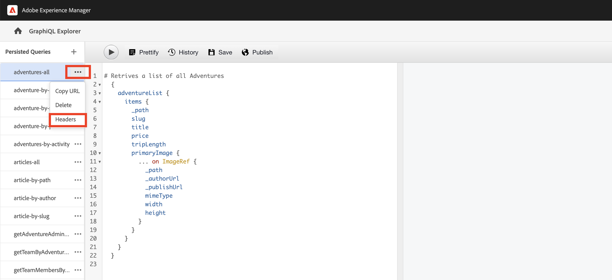

# Beständiga GraphQL-frågor

Beständiga frågor är frågor som lagras på Adobe Experience Manager-servern (AEM). Klienter kan skicka en HTTP GET-begäran med frågenamnet för att köra den. Fördelen med detta är tillgänglighet. GraphQL-frågor på klientsidan kan också köras med HTTP-POST-begäranden som inte kan cachas, men beständiga frågor kan cachas med HTTP-cacher eller CDN, vilket förbättrar prestandan. Med beständiga frågor kan du förenkla dina förfrågningar och förbättra säkerheten eftersom dina frågor är inkapslade på servern och AEM har full kontroll över dem. Det är **god praxis och mycket rekommenderad** om du vill använda beständiga frågor när du arbetar med AEM GraphQL API.

I det föregående kapitlet har du utforskat några avancerade GraphQL-frågor för att samla in data för WKND-appen. I det här kapitlet kvarstår frågorna som ska AEM och du får lära dig hur du använder cachekontroll på beständiga frågor.

## Förutsättningar {#prerequisites}

Det här dokumentet är en del av en självstudiekurs i flera delar. Se till att [föregående kapitel](explore-graphql-api.md) har slutförts innan du fortsätter med detta kapitel.

## Mål {#objectives}

Läs om hur du gör följande i det här kapitlet:

* Behåll GraphQL-frågor med parametrar
* Använd parametrar för cachekontroll med beständiga frågor

## Granska _GraphQL Beständiga frågor_ konfigurationsinställning

Låt oss granska det _GraphQL Beständiga frågor_ är aktiverade för WKND Site-projektet i din AEM.

1. Navigera till **verktyg** > **Allmänt** > **Konfigurationsläsaren**.

1. Välj **WKND delad** väljer **Egenskaper** i det övre navigeringsfältet för att öppna konfigurationsegenskaper. På sidan Konfigurationsegenskaper ser du att **GraphQL Beständiga frågor** behörighet är aktiverad.

   

## Bevara GraphQL-frågor med inbyggda GraphiQL Explorer-verktyg

I det här avsnittet ska vi behålla den GraphQL-fråga som senare används i klientprogrammet för att hämta och återge Adventure Content Fragment-data.

1. Ange följande fråga i GraphiQL Explorer:

   ```graphql
   query getAdventureDetailsBySlug($slug: String!) {
   adventureList(filter: {slug: {_expressions: [{value: $slug}]}}) {
       items {
       _path
       title
       activity
       adventureType
       price
       tripLength
       groupSize
       difficulty
       primaryImage {
           ... on ImageRef {
           _path
           mimeType
           width
           height
           }
       }
       description {
           html
           json
       }
       itinerary {
           html
           json
       }
       location {
           _path
           name
           description {
           html
           json
           }
           contactInfo {
           phone
           email
           }
           locationImage {
           ... on ImageRef {
               _path
           }
           }
           weatherBySeason
           address {
           streetAddress
           city
           state
           zipCode
           country
           }
       }
       instructorTeam {
           _metadata {
           stringMetadata {
               name
               value
           }
           }
           teamFoundingDate
           description {
           json
           }
           teamMembers {
           fullName
           contactInfo {
               phone
               email
           }
           profilePicture {
               ... on ImageRef {
               _path
               }
           }
           instructorExperienceLevel
           skills
           biography {
               html
           }
           }
       }
       administrator {
           fullName
           contactInfo {
           phone
           email
           }
           biography {
           html
           }
       }
       }
       _references {
       ... on ImageRef {
           _path
           mimeType
       }
       ... on LocationModel {
           _path
           __typename
       }
       }
   }
   }
   ```

   Kontrollera att frågan fungerar innan du sparar den.

1. Tryck sedan på Save As (Spara som) och ange `adventure-details-by-slug` som frågenamn.

   

## Utför beständig fråga med variabler genom att koda specialtecken

Låt oss förstå hur beständiga frågor med variabler körs av klientprogram genom att koda specialtecknen.

För att köra en beständig fråga gör klientprogrammet en GET-begäran med följande syntax:

```
GET <AEM_HOST>/graphql/execute.json/<Project-Config-Name>/<Persisted-Query-Name>
```

Så här kör du en beständig fråga _med en variabel_&#x200B;ändras syntaxen ovan till:

```
GET <AEM_HOST>/graphql/execute.json/<Project-Config-Name>/<Persisted-Query-Name>;variable1=value1;variable2=value2
```

Specialtecken som semikolon (;), likhetstecken (=), snedstreck (/) och blanksteg måste konverteras för att motsvarande UTF-8-kodning ska kunna användas.

Genom att köra `getAllAdventureDetailsBySlug` frågor från kommandoradsterminalen, vi granskar dessa koncept i praktiken.

1. Öppna GraphiQL Explorer och klicka på **ellipser** (...) bredvid den beständiga frågan `getAllAdventureDetailsBySlug`och sedan klicka **Kopiera URL**. Klistra in kopierad URL i en textruta ser ut så här:

   ```code
       http://<AEM_HOST>/graphql/execute.json/wknd-shared/getAllAdventureDetailsBySlug;slug=
   ```

1. Lägg till `yosemite-backpacking` som variabelvärde

   ```code
       http://<AEM_HOST>/graphql/execute.json/wknd-shared/getAllAdventureDetailsBySlug;slug=yosemite-backpacking
   ```

1. Koda specialtecken för semikolon (;) och likhetstecken (=)

   ```code
       http://<AEM_HOST>/graphql/execute.json/wknd-shared/getAllAdventureDetailsBySlug%3Bslug%3Dyosemite-backpacking
   ```

1. Öppna en kommandoradsterminal och använda [Rullning](https://curl.se/) köra frågan

   ```shell
   $ curl -X GET http://<AEM_HOST>/graphql/execute.json/wknd-shared/getAllAdventureDetailsBySlug%3Bslug%3Dyosemite-backpacking
   ```

>[!TIP]
>
>    Om du kör frågan ovan mot AEM författarmiljö måste du skicka inloggningsuppgifterna. Se [Åtkomsttoken för lokal utveckling](https://experienceleague.adobe.com/docs/experience-manager-learn/getting-started-with-aem-headless/authentication/local-development-access-token.html) för att demonstrera den och [Anropa AEM API](https://experienceleague.adobe.com/docs/experience-manager-cloud-service/content/implementing/developing/generating-access-tokens-for-server-side-apis.html#calling-the-aem-api) för dokumentationsinformation.

Granska även [Så här kör du en fråga som är sparad](https://experienceleague.adobe.com/docs/experience-manager-cloud-service/content/headless/graphql-api/persisted-queries.html#execute-persisted-query), [Använda frågevariabler](https://experienceleague.adobe.com/docs/experience-manager-cloud-service/content/headless/graphql-api/persisted-queries.html#query-variables)och [Kodning av fråge-URL för användning av ett program](https://experienceleague.adobe.com/docs/experience-manager-cloud-service/content/headless/graphql-api/persisted-queries.html#encoding-query-url) för att lära sig hur klientapplikationerna beständiga frågekörningen fungerar.

## Uppdatera parametrar för cachekontroll i beständiga frågor {#cache-control-all-adventures}

Med AEM GraphQL API kan du uppdatera standardparametrarna för cachekontroll till dina frågor för att förbättra prestanda. Standardvärdena för cachekontroll är:

* 60 sekunder är standardvärde (maxage=60) för klientens TTL (t.ex. en webbläsare)

* 7200 sekunder är standardvärdet (s-maxage=7200) för TTL för Dispatcher och CDN, som också kallas delade cacheminnen

Använd `adventures-all` fråga för att uppdatera parametrar för cachekontroll. Frågesvaret är stort och det är användbart att styra dess `age` i cachen. Den här beständiga frågan används senare för att uppdatera [klientprogram](/help/headless-tutorial/graphql/advanced-graphql/client-application-integration.md).

1. Öppna GraphiQL Explorer och klicka på **ellipser** (...) bredvid den beständiga frågan och klicka sedan på **Sidhuvuden** att öppna **Cachekonfiguration** modal.

   


1. I **Cachekonfiguration** modal, uppdatera `max-age` rubrikvärde till `600 `sekunder (10 min) och klicka sedan **Spara**

   


Granska [Cachelagra beständiga frågor](https://experienceleague.adobe.com/docs/experience-manager-cloud-service/content/headless/graphql-api/persisted-queries.html#caching-persisted-queries) om du vill ha mer information om standardparametrar för cachekontroll.


## Grattis!

Grattis! Du har nu lärt dig att behålla GraphQL-frågor med parametrar, uppdatera beständiga frågor och använda cachekontrollparametrar med beständiga frågor.

## Nästa steg

I [nästa kapitel](/help/headless-tutorial/graphql/advanced-graphql/client-application-integration.md)implementerar du förfrågningarna för beständiga frågor i WKND-appen.
