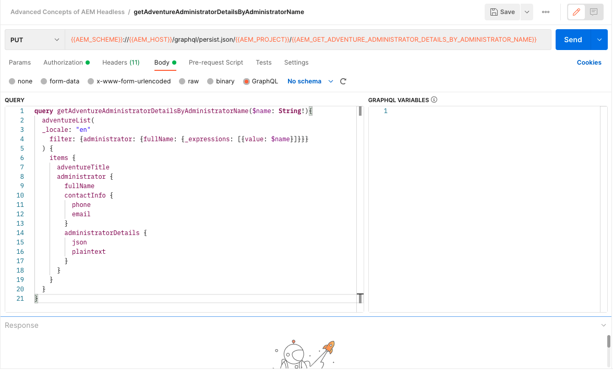
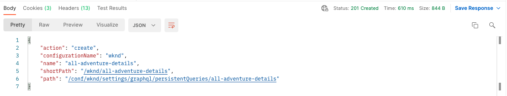

# Beständiga GraphQL-frågor

Beständiga frågor är frågor som lagras på Adobe Experience Manager-servern (AEM). Klienter kan skicka en HTTP GET-begäran med frågenamnet för att köra den. Fördelen med detta är tillgänglighet. GraphQL-frågor på klientsidan kan även köras med HTTP-POST-begäranden som inte kan cachas, men beständiga frågor kan cachas med HTTP-cacher eller CDN, vilket förbättrar prestandan. Med beständiga frågor kan du förenkla dina förfrågningar och förbättra säkerheten eftersom dina frågor är inkapslade på servern och AEM har full kontroll över dem. Det är god praxis och rekommenderas att använda beständiga frågor när du arbetar med AEM GraphQL API.

I föregående kapitel har du utforskat några avancerade GraphQL-frågor för att samla in data för WKND-appen. I det här kapitlet kommer du att behålla dessa frågor för att AEM, uppdatera dem och lära dig hur du använder cachekontroll för beständiga frågor.

## Förutsättningar {#prerequisites}

Det här dokumentet är en del av en självstudiekurs i flera delar. Se till att föregående kapitel har fyllts i innan du fortsätter med det här kapitlet.

Den här självstudiekursen använder [Postman](https://www.postman.com/) för att köra HTTP-begäranden. Se till att du är registrerad på tjänsten innan du startar det här kapitlet. Den här självstudien kräver även arbetslivskunskaper i Postman-appen, som hur du ställer in en samling, skapar variabler och gör förfrågningar. Se Postmans dokumentation om [byggbegäranden](https://learning.postman.com/docs/sending-requests/requests/) och [skicka din första förfrågan](https://learning.postman.com/docs/getting-started/sending-the-first-request/) om du vill ha mer information om hur du gör API-begäranden i appen.

I det här kapitlet sparas frågor som utforskats i det föregående kapitlet i AEM. Du kan hämta en textfil med dessa vanliga GraphQL-frågor [här](assets/graphql-persisted-queries/advanced-concepts-aem-headless-graphql-queries.txt) för enkel referens.

## Mål {#objectives}

Läs om hur du gör följande i det här kapitlet:

* Behåll GraphQL-frågor med parametrar
* Uppdatera beständiga frågor
* Använd parametrar för cachekontroll med beständiga frågor

## Översikt över beständiga frågor

Den här videon ger en översikt över hur du bevarar GraphQL-frågor, uppdaterar dem och använder cachekontroll.

>[!VIDEO](https://video.tv.adobe.com/v/340036/?quality=12&learn=on)

## Aktivera beständiga frågor

Kontrollera först att beständiga frågor är aktiverade för WKND-platsprojektet i din AEM.

1. Navigera till **verktyg** > **Allmänt** > **Konfigurationsläsaren**.

1. Välj **WKND-plats** väljer **Egenskaper** i det övre navigeringsfältet för att öppna konfigurationsegenskaper.

   

   På sidan Konfigurationsegenskaper ser du att **Beständiga GraphQL-frågor** behörighet är aktiverad.

   

## Importera Postman Collection

För att göra det enklare att följa självstudiekursen finns en Postman-samling. Eller kommandoradsverktyg som `curl` kan användas.

1. Hämta och installera [Postman](https://www.postman.com/)
1. Ladda ned [AdvancedConceptsofAEMHeadless.postman_collection.json](/help/headless-tutorial/graphql/advanced-graphql/assets/tutorial-files/AdvancedConceptsofAEMHeadless.postman_collection.json)
1. Öppna appen Postman
1. Välj **Fil** > **Importera** > **Överför fil** och välja `AdvancedConceptsofAEMHeadless.postman_collection.json` för att importera samlingen.

   

### Autentisering

Autentisering krävs för att skicka frågor mot en AEM författarinstans. Den här självstudiekursen baseras på den AEM as a Cloud Service miljön och använder Bearer-autentiseringen med en utvecklingstoken. Så här konfigurerar du autentisering för din Postman-samling:

1. Om du vill hämta en utvecklingstoken går du till din molnutvecklarkonsol och öppnar **Integreringar** och markera **Hämta lokal utvecklingstoken**.

   

1. I din Postman-samling går du till **Autentisering** och markera **Bearer Token** i **Typ** nedrullningsbar meny.

   

1. Ange utvecklingstoken i **Token** fält. Du kan skicka token via en variabel, vilket förklaras i nästa avsnitt.

   

### Variabler {#variables}

Du kan skicka värden som autentiseringstoken och URI-komponenter via variabler i din Postman-samling för att förenkla processen. I den här självstudiekursen skapar du variabler med följande steg:

1. Navigera till **Variabler** i din Postman-samling och skapa följande variabler:

   | Variabel | Värde |
   | --- | --- |
   | `AEM_SCHEME` | `https` |
   | `AEM_AUTH_TOKEN` | (Din utvecklingstoken) |
   | `AEM_HOST` | (Värdnamnet för AEM instans) |
   | `AEM_PROJECT` | `wknd` |

1. Du kan också lägga till variabler för varje beständig fråga som du vill skapa. Behåll följande frågor för den här självstudiekursen: `getAdventureAdministratorDetailsByAdministratorName`, `getTeamByAdventurePath`, `getLocationDetailsByLocationPath`, `getTeamMembersByAdventurePath`, `getLocationPathByAdventurePath`och `getTeamLocationByLocationPath`.

   Skapa följande variabler:

   * `AEM_GET_ADVENTURE_ADMINISTRATOR_DETAILS_BY_ADMINISTRATOR_NAME` : `adventure-administrator-details-by-administrator-name`
   * `AEM_GET_ADVENTURE_ADMINISTRATOR_DETAILS_BY_ADMINISTRATOR_NAME` : `adventure-administrator-details-by-administrator-name`
   * `AEM_GET_TEAM_LOCATION_BY_LOCATION_PATH` : `team-location-by-location-path`
   * `AEM_GET_TEAM_MEMBERS_BY_ADVENTURE_PATH` : `team-members-by-adventure-path`
   * `AEM_GET_LOCATION_DETAILS_BY_LOCATION_PATH` : `location-details-by-location-path`
   * `AEM_GET_LOCATION_PATH_BY_ADVENTURE_PATH` : `location-path-by-adventure-path`
   * `AEM_GET_TEAM_BY_ADVENTURE_PATH` : `team-by-adventure-path`

   När det är klart **Variabler** -fliken i din Postman-samling ska se ut ungefär så här:

   

## Behåll GraphQL-frågor med parametrar

I [AEM Headless- och GraphQL-videoserien](../video-series/graphql-persisted-queries.md)har du lärt dig att skapa beständiga GraphQL-frågor. I det här avsnittet ska vi behålla och köra en GraphQL-fråga med en parameter.

### Skapa en beständig fråga {#create-persisted-query}

I det här exemplet behåller vi `getAdventureAdministratorDetailsByAdministratorName` fråga som du skapade i föregående kapitel.

>[!NOTE]
>
>Metoden HTTP PUT används för att skapa en beständig fråga och metoden HTTP-POST används för att uppdatera den.

1. Lägg först till en ny begäran i din Postman-samling. Välj HTTP PUT-metoden för att skapa en beständig fråga och använd följande URI för begäran:

   ```plaintext
   {{AEM_SCHEME}}://{{AEM_HOST}}/graphql/persist.json/{{AEM_PROJECT}}/{{AEM_GET_ADVENTURE_ADMINISTRATOR_DETAILS_BY_ADMINISTRATOR_NAME}}
   ```

   Observera att URI:n använder `/graphql/persist.json` åtgärd.

1. Klistra in `getAdventureAdministratorDetailsByAdministratorName` GraphQL-fråga i begärandetexten. Observera att det är standardfrågan för GraphQL med en variabel `name` som kräver `String`.

   

1. Kör begäran. Du bör få följande svar:

   

   Du har skapat en beständig fråga med namnet `adventure-administrator-details-by-administrator-name`.

### Kör en beständig fråga

Låt oss köra den beständiga fråga som du har skapat.

1. Skapa en ny begäran om GET i din Postman-samling med följande URI för begäran:

   ```plaintext
   {{AEM_SCHEME}}://{{AEM_HOST}}/graphql/execute.json/{{AEM_PROJECT}}/{{AEM_GET_ADVENTURE_ADMINISTRATOR_DETAILS_BY_ADMINISTRATOR_NAME}}
   ```

   Observera att begärande-URI nu innehåller `execute.json` åtgärd.

   Om du kör den här begäran som den är genereras ett fel eftersom frågan kräver en variabel `name`. Du måste skicka den här variabeln som en parameter till URI-begäran.

   

1. Hämta sedan en administratör med namnet Jacob Wester. Parametrar för beständiga GraphQL-frågor måste separeras från tidigare URI-komponenter av `;` och kodas innan de skickas till begärande-URI. Kör följande kommando i webbläsarkonsolen:

   ```js
   encodeURIComponent(";name=Jacob Wester")
   ```

   

1. Kopiera resultatet från konsolen och klistra in det i slutet av URI-begäran i Postman. Du bör ha följande URI för begäran:

   ```plaintext
   {{AEM_SCHEME}}://{{AEM_HOST}}/graphql/execute.json/{{AEM_PROJECT}}/{{AEM_GET_ADVENTURE_ADMINISTRATOR_DETAILS_BY_ADMINISTRATOR_NAME}}%3Bname%3DJacob%20Wester
   ```

1. Kör begäran om GET. Du bör få följande svar:

   

Du har nu skapat och kört en beständig GraphQL-fråga med en parameter.

Du kan följa stegen ovan för att behålla resten av GraphQL-frågorna från [textfil](assets/graphql-persisted-queries/advanced-concepts-aem-headless-graphql-queries.txt) med de variabler du har skapat på [början av detta kapitel](#variables).

Den fullständiga [Postman-samling](/help/headless-tutorial/graphql/advanced-graphql/assets/tutorial-files/AdvancedConceptsofAEMHeadless.postman_collection.json) kan också hämtas och importeras.

## Uppdatera beständiga frågor

Medan beständiga frågor skapas med en PUT-begäran, måste du använda en POST-begäran för att uppdatera en befintlig beständig fråga. I den här självstudiekursen uppdaterar vi den beständiga frågan med namnet `adventure-administrator-details-by-administrator-name` som du skapade i [föregående avsnitt](#create-persisted-query).

1. Duplicera fliken som du använde för PUT-begäran i föregående avsnitt. Ändra HTTP-metoden till POST i kopian.

1. I GraphQL-frågan tar vi bort `plaintext` format från `administratorDetails` fält.

   

1. Kör begäran. Du bör få följande svar:

   

Du har nu uppdaterat `adventure-administrator-details-by-administrator-name` beständig fråga. Det är viktigt att alltid uppdatera GraphQL-frågor i AEM om ändringar görs.

## Skicka parametrar för cachekontroll i beständiga frågor {#cache-control-all-adventures}

Med AEM GraphQL API kan du lägga till cachekontrollparametrar i frågor för att förbättra prestanda.

Använd `getAllAdventureDetails` fråga som skapades i föregående kapitel. Frågesvaret är stort och det är användbart att styra dess `age` i cacheminnet.

Den här beständiga frågan används senare för att uppdatera [klientprogram](/help/headless-tutorial/graphql/advanced-graphql/client-application-integration.md).

1. Skapa en ny variabel i din Postman-samling:

   ```plaintext
   AEM_GET_ALL_AT_ONCE: all-adventure-details
   ```

1. Skapa en ny PUT-begäran om du vill behålla den här frågan.

1. I **Brödtext** välj **råformat** datatyp.

   

1. Om du vill använda cachekontroll i en fråga måste du kapsla in frågan i en JSON-struktur och lägga till parametrar för cachekontroll i slutet. Kopiera och klistra in följande fråga i texten för din begäran:

   ```json
   {
   "query": " query getAllAdventureDetails($fragmentPath: String!) { adventureByPath(_path: $fragmentPath){ item { _path adventureTitle adventureActivity adventureType adventurePrice adventureTripLength adventureGroupSize adventureDifficulty adventurePrice adventurePrimaryImage{ ...on ImageRef{ _path mimeType width height } } adventureDescription { html json } adventureItinerary { html json } location { _path name description { html json } contactInfo{ phone email } locationImage{ ...on ImageRef{ _path } } weatherBySeason address{ streetAddress city state zipCode country } } instructorTeam { _metadata{ stringMetadata{ name value } } teamFoundingDate description { json } teamMembers { fullName contactInfo { phone email } profilePicture{ ...on ImageRef { _path } } instructorExperienceLevel skills biography { html } } } administrator { fullName contactInfo { phone email } biography { html } } } _references { ...on ImageRef { _path mimeType } ...on LocationModel { _path __typename } } } }", 
   "cache-control": { "max-age": 300 }
   }
   ```

   >[!CAUTION]
   >
   >Den omslutna frågan får inte innehålla radbrytningar.

   Din förfrågan bör nu se ut så här:

   

1. Kör begäran. Du bör få svaret som anger att `all-adventure-details` beständig fråga har skapats.

   

## Grattis!

Grattis! Du har nu lärt dig att behålla GraphQL-frågor med parametrar, uppdatera beständiga frågor och använda cachekontrollparametrar med beständiga frågor.

## Nästa steg

I [nästa kapitel](/help/headless-tutorial/graphql/advanced-graphql/client-application-integration.md)implementerar du förfrågningarna för beständiga frågor i WKND-appen.

Det är valfritt för den här självstudiekursen, men se till att publicera allt innehåll i verkliga produktionssituationer. En recension av redigerings- och publiceringsmiljöer i AEM finns i [AEM Headless- och GraphQL-videoserien](../video-series/author-publish-architecture.md).