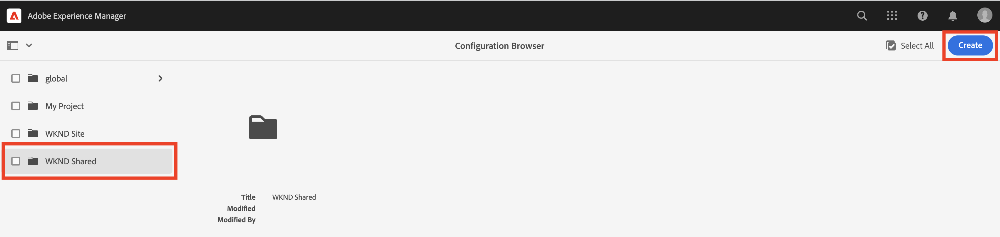
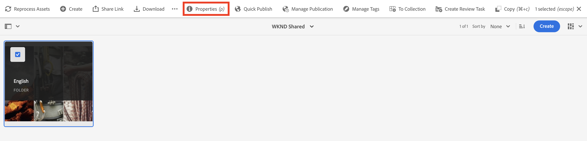

# Avancerade begrepp för AEM Headless

{{aem-headless-trials-promo}}

Den kompletta självstudiekursen fortsätter med [grundläggande självstudiekurs](../multi-step/overview.md) som täckte grunderna i Adobe Experience Manager (AEM) Headless och GraphQL. Den avancerade självstudiekursen visar ingående aspekter av att arbeta med modeller för innehållsfragment, innehållsfragment och de AEM GraphQL beständiga frågorna, inklusive användning av GraphQL beständiga frågor i ett klientprogram.

## Förutsättningar

Slutför [snabbinstallation för AEM as a Cloud Service](../quick-setup/cloud-service.md) för att konfigurera din AEM as a Cloud Service miljö.

Vi rekommenderar att du slutför föregående [grundläggande självstudiekurs](../multi-step/overview.md) och [videoserie](../video-series/modeling-basics.md) självstudiekurser innan du fortsätter med den här avancerade självstudiekursen. Även om du kan slutföra självstudiekursen i en lokal AEM omfattar den här självstudiekursen bara arbetsflödet för AEM as a Cloud Service.

>[!CAUTION]
>
>Om du inte har tillgång till AEM as a Cloud Service miljö kan du slutföra [AEM Headless-snabbinställning med lokal SDK](https://experienceleague.adobe.com/docs/experience-manager-learn/getting-started-with-aem-headless/graphql/quick-setup/local-sdk.html). Det är dock viktigt att notera att vissa användargränssnittssidor, som navigering för innehållsfragment, är olika.

## Mål

Den här självstudiekursen handlar om följande ämnen:

* Skapa modeller för innehållsfragment med valideringsregler och mer avancerade datatyper som platshållare för flikar, kapslade fragmentreferenser, JSON-objekt och datatyperna Datum och tid.
* Skapa innehållsfragment när du arbetar med kapslat innehåll och fragmentreferenser och konfigurera mappprinciper för styrning av innehållsfragmentutveckling.
* Utforska AEM GraphQL API-funktioner med GraphQL queries med variabler och direktiv.
* Behåll GraphQL-frågor med parametrar i AEM och lär dig hur du använder cachekontrollparametrar med beständiga frågor.
* Integrera begäran om beständiga frågor i exempelappen WKND GraphQL React med AEM Headless JavaScript SDK.

## Avancerade koncept AEM Headless-översikt

I följande video visas en översikt på hög nivå över de koncept som beskrivs i den här självstudiekursen. Självstudiekursen innehåller definition av modeller för innehållsfragment med mer avancerade datatyper, kapsling av innehållsfragment och beständiga GraphQL-frågor i AEM.

>[!VIDEO](https://video.tv.adobe.com/v/340035?quality=12&learn=on)

>[!CAUTION]
>
>I den här videon (kl. 2:25) omnämns hur du installerar frågeredigeraren GraphiQL via Package Manager för att utforska GraphQL-frågor. Men i nyare versioner av AEM som Cloud Service är det inbyggda **GraphiQL Explorer** tillhandahålls, vilket innebär att paketinstallation inte krävs. Se [Använda GraphiQL IDE](https://experienceleague.adobe.com/docs/experience-manager-cloud-service/content/headless/graphql-api/graphiql-ide.html) för mer information.

## Projektinställningar

WKND Site-projektet har alla konfigurationer som behövs, så du kan starta självstudiekursen direkt när du har slutfört [snabbinställningar](../quick-setup/cloud-service.md). I det här avsnittet beskrivs bara några viktiga steg som du kan använda när du skapar ett eget AEM Headless-projekt.

### Granska befintlig konfiguration

Det första steget till att starta ett nytt projekt i AEM är att skapa dess konfiguration, som en arbetsyta och att skapa GraphQL API-slutpunkter. Om du vill granska eller skapa en konfiguration går du till **verktyg** > **Allmänt** > **Konfigurationsläsaren**.

Observera att `WKND Shared` platskonfiguration har redan skapats för självstudiekursen. Om du vill skapa en konfiguration för ditt eget projekt väljer du **Skapa** i det övre högra hörnet och fyll i formuläret i det modala Create Configuration som visas.

### Granska GraphQL API-slutpunkter

Sedan måste du konfigurera API-slutpunkter att skicka GraphQL-frågor till. Om du vill granska befintliga slutpunkter eller skapa en går du till **verktyg** > **Allmänt** > **GraphQL**.

Observera att `WKND Shared Endpoint` har redan skapats. Om du vill skapa en slutpunkt för projektet väljer du **Skapa** i det övre högra hörnet och följ arbetsflödet.

>[!NOTE]
>
> När du har sparat slutpunkten visas ett modalt besök på säkerhetskonsolen där du kan justera skyddsinställningarna om du vill konfigurera åtkomst till slutpunkten. Själva säkerhetsbehörigheterna ligger dock utanför den här självstudiekursen. Mer information finns i [AEM](https://experienceleague.adobe.com/docs/experience-manager-65/administering/security/security.html).

### Granska WKND-innehållets struktur och språkets rotmapp

En väldefinierad innehållsstruktur är avgörande för att AEM headless-implementering ska lyckas. Det är användbart för skalbarhet, användbarhet och behörighetshantering av ditt innehåll.

En språkrotmapp är en mapp med en ISO-språkkod som namn, till exempel EN eller FR. Det AEM översättningshanteringssystemet använder dessa mappar för att definiera det primära språket för ditt innehåll och dina språk för översättning av innehåll.

Gå till **Navigering** > **Resurser** > **Filer**.

Navigera till **WKND delad** mapp. Lägg märke till mappen med titeln &quot;English&quot; och namnet &quot;EN&quot;. Den här mappen är språkrotmappen för WKND-platsprojektet.

Skapa en språkrotmapp i konfigurationen för ditt eget projekt. Se avsnittet om [skapa mappar](/help/headless-tutorial/graphql/advanced-graphql/author-content-fragments.md#create-folders) för mer information.

### Tilldela en konfiguration till den kapslade mappen

Slutligen måste du tilldela projektets konfiguration till rotmappen för språket. Med det här uppdraget kan du skapa innehållsfragment baserat på de modeller för innehållsfragment som definieras i projektets konfiguration.

Om du vill tilldela språkets rotmapp till konfigurationen markerar du mappen och väljer **Egenskaper** i det övre navigeringsfältet.

Navigera sedan till **Cloud Service** och väljer mappikonen i **Molnkonfiguration** fält.

I den modal som visas väljer du den tidigare skapade konfigurationen för att tilldela språkrotmappen till den.

### God praxis

Nedan följer de bästa sätten att skapa egna projekt i AEM:

* Mapphierarkin bör utformas med lokalisering och översättning i åtanke. Språkmappar ska med andra ord kapslas i konfigurationsmappar, vilket gör det enkelt att översätta innehåll i dessa konfigurationsmappar.
* Mapphierarkin bör hållas platt och okomplicerad. Undvik att flytta eller byta namn på mappar och fragment senare, särskilt efter publicering för direktanvändning, eftersom sökvägar ändras som kan påverka fragmentreferenser och GraphQL-frågor.

## Starter- och lösningspaket

Två AEM **paket** är tillgängliga och kan installeras via [Pakethanteraren](/help/headless-tutorial/graphql/advanced-graphql/author-content-fragments.md#sample-content)

* [Advanced-GraphQL-Tutorial-Starter-Package-1.1.zip](/help/headless-tutorial/graphql/advanced-graphql/assets/tutorial-files/Advanced-GraphQL-Tutorial-Starter-Package-1.1.zip) används senare i självstudiekursen och innehåller exempelbilder och mappar.
* [Advanced-GraphQL-Tutorial-Solution-Package-1.2.zip](/help/headless-tutorial/graphql/advanced-graphql/assets/tutorial-files/Advanced-GraphQL-Tutorial-Solution-Package-1.2.zip) innehåller den färdiga lösningen för kapitel 1-4 inklusive nya modeller för innehållsfragment, innehållsfragment och beständiga GraphQL-frågor. Användbar för dem som vill hoppa direkt in i [Integrering av klientprogram](/help/headless-tutorial/graphql/advanced-graphql/client-application-integration.md) kapitel.

The [React App - Advanced Tutorial - WKND Adventures](https://github.com/adobe/aem-guides-wknd-graphql/blob/main/advanced-tutorial/README.md) kan du granska och utforska exempelprogrammet. Det här exempelprogrammet hämtar innehållet från AEM genom att anropa de beständiga GraphQL-frågorna och återger det i en engagerande upplevelse.

## Komma igång

Så här kommer du igång med den här avancerade självstudiekursen:

1. Konfigurera en utvecklingsmiljö med [AEM as a Cloud Service](../quick-setup/cloud-service.md).
1. Starta självstudiekursens kapitel på [Skapa modeller för innehållsfragment](/help/headless-tutorial/graphql/advanced-graphql/create-content-fragment-models.md).
